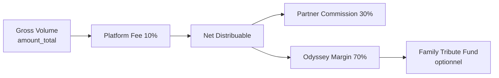
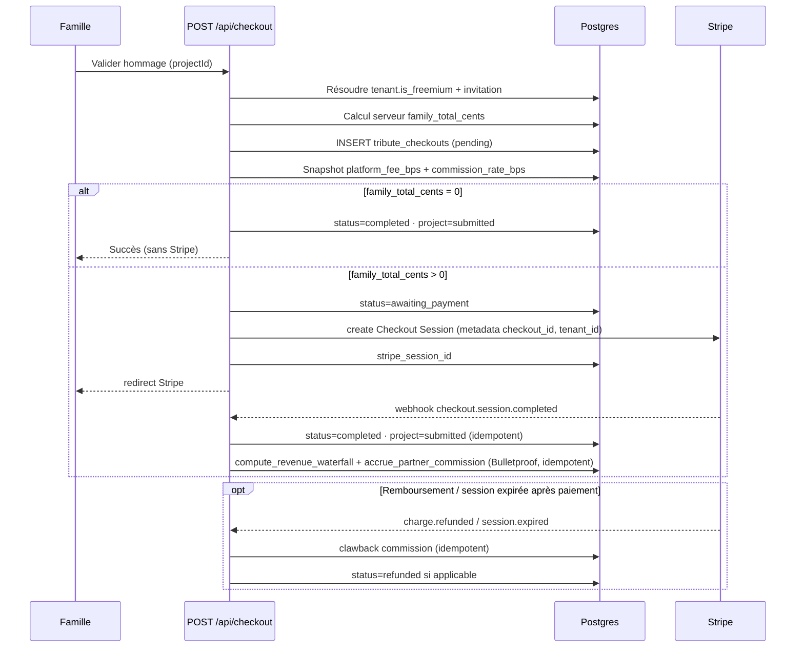

# Odyssey — Commerce B2B2C v2 (référence architecture)

**Last updated: July 2026 · Version: B2B2C v2 (Scrypta Killer) · Modèle Bulletproof**

Document canonique pour le modèle **funérarium → famille** (« gant blanc »), les trois modes de checkout, la saga `tribute_checkouts`, le **freemium partenaire**, et la **RevShare 30 %**.

Complète [`DELIVERABLES_AND_PACKAGES.md`](DELIVERABLES_AND_PACKAGES.md), [`WIZARD_ARCHITECTURE.md`](WIZARD_ARCHITECTURE.md) et [`TECHNICAL_ONBOARDING_ODYSSEY.md`](TECHNICAL_ONBOARDING_ODYSSEY.md).

**Prix catalogue (application)** : `src/lib/wizard/pricingConfig.ts` (cents runtime) · **contrat livrables** : [`DELIVERABLES_AND_PACKAGES.md`](DELIVERABLES_AND_PACKAGES.md) (`wizardDeliverables.ts`).  
**RevShare (détail ledger)** : [`PARTNER_REVSHARE.md`](PARTNER_REVSHARE.md).  
**Audit projet** : [`PROJECT_STATUS.md`](PROJECT_STATUS.md).

---

## Historique v1 → v2

| v1 (jetons + delta) | v2 (freemium + RevShare) |
|---------------------|--------------------------|
| Partenaire débité en **jetons** à l’invitation / checkout | Tenant **`is_freemium`** : **0 jeton** sur Souvenir offert |
| Famille paie le **delta** vs forfait offert (ex. +70 $) | Famille paie le **prix plein** du forfait upsell + extensions |
| Compensation = recrédit jetons | Échec Stripe = **clawback commission** (pas de jetons) |
| Un seul modèle B2B2C | **Coexistence** : freemium (gros clients) + legacy jetons (petits salons) |

Le schéma P4/P5.5 **reste valide** pour les tenants non-freemium et le mode `b2b_partner`.

---

## Agnosticité backend & multi-verticalité pilotée par le Tenant

> **Règle CEO (juin 2026) :** Odyssey n’est pas une application funéraire. Le back-end (Supabase, RPC, webhook, saga checkout) reste **strictement agnostique**. Le **modèle d’affaires** (freemium + RevShare vs jetons prépayés legacy) est **piloté par la configuration du locataire** (`tenants`), **jamais hardcodé globalement** dans le code applicatif.

### Séparation des axes

| Axe | Colonne / source | Rôle | Hardcodé globalement ? |
|-----|------------------|------|------------------------|
| **Vertical métier** | `tenants.vertical` | Catégorie produit (`human`, `pet`, `wedding`, `event`…) — branding, copy UI, limites manifeste | **Non** — par tenant |
| **Modèle commercial B2B2C** | `tenants.is_freemium` | `true` → freemium + RevShare · `false` → jetons P5.5 | **Non** — par tenant |
| **Platform Fee** | `tenants.settings.platform_fee_bps` + snapshot `tribute_checkouts.platform_fee_bps` | Default **1000** (10 %) si absent · figé au checkout T | **Non** — default ≠ override tenant |
| **Taux RevShare** | `tenants.settings.revshare_bps` + snapshot `tribute_checkouts.commission_rate_bps` | Default **3000** (30 % du **Net Distribuable**) · figé au checkout T | **Non** — default ≠ override tenant |
| **Canal checkout** | `tribute_checkouts.checkout_mode` + `projects.invitation_id` | `b2c` / `b2b_partner` / `b2b2c_family` | **Non** — résolu par contexte projet |

### Isolation garantie par T1 (P6)

La migration **`odyssey_p6_freemium_revshare.sql`** n’introduit **aucune** règle métier globale :

1. **`tenants.is_freemium`** (bool, default `false`) — chaque partenaire choisit son modèle :
   - **Gros acteur funéraire** (ex. Urgel Bourgie) → `is_freemium = true` · Souvenir 0 $ · RevShare sur upsell
   - **Petit salon, vétérinaire, autre vertical** → `is_freemium = false` · wallet jetons P5.5 inchangé
   - **Mariage / événement futur** → même schéma ; seul le vertical + le manifeste UI diffèrent

2. **`platform_fee_bps` + `commission_rate_bps`** — **jamais** des constantes uniques dans le webhook :
   - Lecture `COALESCE(tenants.settings->>'platform_fee_bps', '1000')` et `revshare_bps` au checkout
   - **Snapshot** sur `tribute_checkouts` pour audit et clawback
   - Accrual RPC idempotente **par `tenant_id`** — ledger commissions isolé du ledger jetons

3. **Coexistence sans fuite** :
   - `partner_token_wallets` / `partner_token_ledger` → **legacy jetons uniquement**
   - `partner_commission_balances` / `partner_commission_ledger` → **RevShare uniquement** (si `is_freemium = true` et paiement famille > 0)
   - Aucun tenant freemium ne déclenche un débit jetons ; aucun tenant legacy ne reçoit de commission RevShare (v1)

### Ce que le code ne doit jamais faire

- `if (vertical === 'human') { isFreemium = true }` — **interdit**
- Taux RevShare 30 % en dur sans lire le tenant — **interdit** (default 3000 acceptable en fallback config)
- Mélanger jetons et centimes dans le même ledger — **interdit**
- Inférer le modèle commercial depuis le rôle utilisateur ou le slug partenaire — **interdit**

**Référence implémentation Phase A :** `resolveCheckoutContext()` lit `tenant_id` → `is_freemium` + `platform_fee_bps` + `revshare_bps` ; branche saga et webhook en conséquence. Voir [`PARTNER_REVSHARE.md`](PARTNER_REVSHARE.md) et [`TECHNICAL_ONBOARDING_ODYSSEY.md`](TECHNICAL_ONBOARDING_ODYSSEY.md) §4.2.

---

## Matrice de nommage (Option A)

Noms **marketing** en UI · IDs **techniques** inchangés en SQL / `wizard_state` / checkout.

| Nom marketing (FR) | Nom marketing (EN) | `PackageId` (manifeste) | ID SQL / wizard (`granted_package`, `basePackage`) |
|--------------------|--------------------|-------------------------|-----------------------------------------------------|
| **Souvenir** | **Keepsake** | `SOUVENIR` | `essential` |
| **Héritage** | **Legacy** | `HERITAGE` | `signature` |
| **Éternité** | **Eternity** | `ETERNITE` | `heritage` |

Détail livrables : [`DELIVERABLES_AND_PACKAGES.md`](DELIVERABLES_AND_PACKAGES.md).

---

## État d'implémentation

| Couche | Statut | Détail |
|--------|--------|--------|
| **Base de données P4/P5.5** | **Terminée (legacy jetons)** | Wallets, ledger, invitations, `debit_partner_tokens_for_checkout()`, RBAC, overdraft |
| **Base de données P6 (v2)** | **À faire** | `tenants.is_freemium`, `partner_commission_*`, RPC accrual/clawback, migration `essential → 0 jeton` freemium |
| **Contrat manifeste (TS)** | **À mettre à jour** | Grille v2, limites photos/résolution — voir deliverables doc |
| **Routes & auth** | **Terminée** | Studio / Salon, gatekeeper R6 ✅ |
| **UI partenaire (Salon)** | **Partielle** | Invitations ✅ · RBAC ✅ · wallet legacy ✅ · UI commissions ⏳ |
| **API invitations** | **Partielle** | Flow ✅ · débit jetons P5.5 pour tenants **non-freemium** · skip débit freemium ⏳ |
| **Checkout saga v2** | **À faire** | Freemium 0 $, Stripe upsell, webhook + RevShare |
| **Checkout legacy jetons** | **À faire** | Branche `is_freemium = false` conserve saga v1 |
| **UI famille B2B2C** | **Partielle** | `/tribute/welcome` ✅ · prix plein upsell (plus delta) ⏳ |

---

## Matrice Doc vs Code vs DB

| Sujet | Doc (ce fichier) | DB | Code actuel |
|-------|------------------|-----|-------------|
| 3 modes checkout | ✅ v2 | ✅ `checkout_mode` | ⏳ 2 branches legacy |
| Flag `is_freemium` tenant | ✅ v2 | ⏳ P6 | ⏳ absent |
| Freemium Souvenir 0 $ | ✅ v2 | ⏳ P6 | ⏳ absent |
| Waterfall Bulletproof (10 % platform + 30 % Net Distribuable) | ✅ v2 | 🟡 P6 · **P6.1** cible | ⏳ absent |
| Legacy jetons P5.5 | ✅ coexistence | ✅ | ✅ invitations non-freemium |
| Saga v2 (sans débit wallet) | ✅ | ⏳ statuts enrichis | ⏳ absent |
| Prix 0 / 149 / 299 (canal partenaire) | ✅ | N/A (app) | ⏳ `pricingConfig` v1 (79/149/299) |

---

## Grille tarifaire v2

Tous les montants en **centimes USD entiers** (`14900` = 149,00 $).

### Canal partenaire freemium (`tenants.is_freemium = true`)

Ex. **Urgel Bourgie** — acquisition pure, pas de débit wallet sur Souvenir.

| Forfait (marketing) | `id` | Coût partenaire | Famille (upsell) | RevShare si payant |
|---------------------|------|-----------------|------------------|-------------------|
| **Souvenir** | `essential` | **0 jeton · 0 $** | **0 $** (inclus) | — |
| **Héritage** | `signature` | **0 jeton** | **149 $** (14 900¢) | **30 %** du **Net Distribuable** → **40,23 $** |
| **Éternité** | `heritage` | **0 jeton** | **299 $** (29 900¢) | **30 %** du **Net Distribuable** → **80,73 $** |

**Extensions à la carte** (famille) : ajoutées au panier Stripe · **commissionnables** (incluses dans le Gross Volume · RevShare sur le **Net Distribuable** total).

### B2C direct (sans invitation partenaire)

| Règle | Détail |
|-------|--------|
| **Pas de gratuit** | La gratuité Souvenir est **exclusive** au canal partenaire freemium |
| **Prix plein** | Famille paie le **catalogue complet** : forfait sélectionné + extensions |
| **Entrée catalogue B2C** | **Héritage 149 $** · **Éternité 299 $** · **Légendaire 499 $** (Gants Blancs, B2C exclusif) — Souvenir **non proposé** |
| **RevShare** | **Aucune** — pas de `tenant_id` partenaire sur le checkout |
| **Stripe** | Toujours requis si `total_cents > 0` |

### Legacy jetons (`tenants.is_freemium = false`)

Petits salons — modèle P4/P5.5 **inchangé**.

| Forfait | Jetons partenaire (gros) | Coût gros (40 $/jeton) |
|---------|--------------------------|-------------------------|
| **Souvenir** | 1 | 40 $ |
| **Héritage** | 2 | 80 $ |
| **Éternité** | 4 | 160 $ |

Wholesale : `PARTNER_TOKEN_COST_CENTS = 4000` (40,00 $ / jeton).

**Invitations legacy** : débit jetons à la création (`create_partner_invitation_with_debit`) · overdraft P5.5 · HTTP 402 si dépassement.

**Checkout legacy B2B2C** : famille paie le **delta** vs forfait offert + extensions · saga v1 (débit wallet puis Stripe) — voir [§ Saga legacy (jetons)](#saga-legacy-jetons-v1).

---

## Flag tenant `is_freemium`

| Source | Rôle |
|--------|------|
| **`tenants.is_freemium`** (bool, default `false`) | Active le canal acquisition freemium pour ce funérarium |
| **Alternative acceptée** | `tenants.settings.is_freemium` (jsonb) en attendant migration P6 |

**Résolution serveur (ordre)** :

1. Lire `is_freemium` sur le `tenant_id` du projet / invitation
2. Si `true` → branche **B2B2C v2** (pas de débit jetons sur Souvenir, RevShare)
3. Si `false` → branche **legacy jetons** (P5.5)

**Ne jamais** inférer freemium depuis le rôle utilisateur ou `resolveUserIsPartner()` seul.

---

## Les 3 modes de checkout (`checkout_mode`)

| Mode | Contexte | Stripe | Wallet jetons | RevShare |
|------|----------|--------|---------------|----------|
| **`b2c`** | Famille sans invitation | Oui — total catalogue | Non | Non |
| **`b2b_partner`** | Conseiller funérarium (parcours salon) | Non | Oui — `tokens(selected_package)` | Non |
| **`b2b2c_family`** | Famille invitée par partenaire | Si `family_total_cents > 0` | **Freemium : non** · **Legacy : oui** (`granted_package`) | **Oui** si paiement famille > 0 |

### Règle freemium B2B2C (officielle v2)

> **Sur un tenant `is_freemium = true`, le partenaire n’est jamais débité en jetons pour une invitation Souvenir (`granted_package = essential`).**  
> **La famille paie le prix plein du forfait upsell (149 $ ou 299 $) et les extensions à la carte via Stripe.**  
> **Odyssey déduit 10 % de Platform Fee sur le brut Stripe, puis reverse 30 % du Net Distribuable restant au partenaire via le ledger commissions.**

Exemple : partenaire freemium offre **Souvenir** → famille choisit **Héritage** → partenaire : **0 jeton** ; famille : **149 $** (Gross) ; Platform Fee : **14,90 $** ; Net Distribuable : **134,10 $** ; commission partenaire : **40,23 $** (30 % × 134,10 $).

### Règle legacy B2B2C (officielle v1 — coexistence)

> **Sur un tenant `is_freemium = false`, le partenaire est débité en jetons selon `granted_package` (P5.5).**  
> **La famille paie le delta upsell + extensions via Stripe.**

Exemple legacy : partenaire offre **Souvenir** (1 jeton) → famille choisit **Héritage** → partenaire : **1 jeton** ; famille : delta catalogue (selon `pricingConfig` legacy) + extensions.

---

## Calcul serveur `family_total_cents` (v2 freemium)

**Fonction cible :** `computeB2B2CFamilyPricing()` — **à implémenter**.

| Entrée | Source serveur |
|--------|----------------|
| `is_freemium` | `tenants.is_freemium` |
| `granted_package` | `partner_invitations.granted_package` |
| `selected_package` | `projects.wizard_state.basePackage` (coercé) |
| Extensions | `wizard_state.extensions` (liste blanche) |

**Formule freemium (`is_freemium = true`)** :

```text
package_cents = packageCents(selected_package)   // 0 si essential, 14900, 29900
extensions_cents = sum(extensionCents(enabled_extensions))
family_total_cents = package_cents + extensions_cents
```

- Si `selected_package = essential` et `granted_package = essential` → **`family_total_cents = 0`** (+ extensions payantes éventuelles)
- **Jamais** de delta `selected − granted` en freemium v2
- **Jamais** faire confiance au client pour les montants

**Formule legacy (`is_freemium = false`)** :

```text
family_total_cents = max(0, packageCents(selected) − packageCents(granted)) + extensions_cents
```

---

## Affichage famille (« gant blanc ») — UX v2 freemium

La famille ne voit **jamais** « jeton », « commission », ni « RevShare ».

| Forfait affiché | Si Souvenir offert (freemium) |
|-----------------|-------------------------------|
| Souvenir | **Inclus** (0 $) |
| Héritage | **149 $** |
| Éternité | **299 $** |
| Extensions | Prix catalogue à la carte |

---

## Tables existantes (P5) + extensions P6 (cible)

### `tenants` — extension P6

| Colonne | Rôle |
|---------|------|
| `is_freemium` | `true` = canal acquisition Souvenir gratuit (ex. Urgel Bourgie) |

### `partner_invitations`

| Colonne | Rôle |
|---------|------|
| `tenant_id` | Funérarium partenaire |
| `granted_package` | Forfait offert (`essential` \| `signature` \| `heritage`) |
| `status` | `pending` \| `accepted` \| `expired` \| `revoked` |
| `project_id` | Projet wizard lié |
| `accepted_user_id` | Compte auth famille |

**Comportement invitation v2 freemium** : pas d’appel `create_partner_invitation_with_debit` si `is_freemium = true` et `granted_package = essential`.

### `projects.invitation_id`

FK nullable — ancre serveur du parcours B2B2C. Présence → `checkout_mode = b2b2c_family`.

### `tribute_checkouts`

| Colonne | Rôle |
|---------|------|
| `checkout_mode` | `b2c` \| `b2b_partner` \| `b2b2c_family` |
| `granted_package` | Obligatoire si `b2b2c_family` |
| `selected_package` | Forfait choisi à la validation |
| `partner_tokens_debited` | Jetons débités (legacy uniquement ; `0` en freemium) |
| `family_total_cents` | Montant Stripe famille (= **Gross Volume** snapshot serveur) |
| `gross_payment_cents` | **P6.1** — brut confirmé webhook (= `amount_total` Stripe) |
| `platform_fee_bps` | **P6.1** — taux figé au checkout T (default 1000 = 10 %) |
| `platform_fee_cents` | **P6.1** — `floor(gross × platform_fee_bps / 10000)` |
| `net_distributable_cents` | **P6.1** — `gross − platform_fee` — **assiette RevShare** |
| `commission_cents` | Commission partenaire calculée (30 % du Net Distribuable) |
| `commission_rate_bps` | Taux RevShare figé au moment T (3000 = 30 %) |
| `commission_status` | `none` \| `accrued` \| `clawed_back` \| `paid` |
| `status` | Machine à états (ci-dessous) |
| `idempotency_key` | Anti double-clic |
| `stripe_session_id` | Session Checkout Stripe |
| `stripe_payment_intent_id` | Réconciliation webhook |

### `partner_commission_balances` (P6 — nouvelle)

| Colonne | Rôle |
|---------|------|
| `tenant_id` | PK — partenaire bénéficiaire |
| `accrued_cents` | Total commissions confirmées (webhooks) |
| `paid_cents` | Total versé au partenaire |
| `pending_cents` | En attente (disputes, clearing) |

### `partner_commission_ledger` (P6 — nouvelle, append-only)

| Colonne | Rôle |
|---------|------|
| `tenant_id` | Partenaire |
| `tribute_checkout_id` | Ancre métier |
| `project_id` | Hommage |
| `invitation_id` | Canal acquisition |
| `reason` | `commission_accrual` \| `commission_clawback` \| `payout` \| `adjustment` |
| `delta_cents` | + accrual · − clawback / payout |
| `gross_payment_cents` | **Gross Volume** (= `amount_total` Stripe) |
| `platform_fee_bps` | **P6.1** — snapshot (ex. 1000) |
| `platform_fee_cents` | **P6.1** — déduction plateforme |
| `net_distributable_cents` | **P6.1** — assiette RevShare |
| `commission_rate_bps` | ex. 3000 (30 % du Net Distribuable) |
| `commission_cents` | Montant commission |
| `stripe_event_id` | **Idempotence webhook** (UNIQUE) |
| `stripe_payment_intent_id` | Réconciliation |
| `status` | `confirmed` \| `pending` \| `reversed` |

**Index critiques P6** :

```sql
UNIQUE (tribute_checkout_id) WHERE reason = 'commission_accrual'
UNIQUE (stripe_event_id) WHERE stripe_event_id IS NOT NULL
```

Détail opérationnel : [`PARTNER_REVSHARE.md`](PARTNER_REVSHARE.md).

---

## Modèle Bulletproof — Waterfall revenus (juillet 2026)

> **Décision CEO / finance :** le RevShare partenaire s’applique sur le **Net Distribuable**, pas sur le brut Stripe. Odyssey déduit d’abord une **Platform & Processing Fee** de 10 % pour couvrir les coûts incompressibles (Stripe, infra, processing IA).

### Définitions (terminologie figée)

| Terme | Définition | Source |
|-------|------------|--------|
| **Gross Volume** | Montant total payé par la famille | `checkout.session.amount_total` |
| **Platform Fee** | Réserve plateforme Odyssey (10 % du brut) | Contractuel — **≠** net comptable Stripe (`balance_transaction.net`) |
| **Net Distribuable** | Montant partageable après Platform Fee | `Gross − Platform Fee` — **assiette RevShare** |
| **Partner Commission** | RevShare B2B2C (30 % du Net Distribuable) | `partner_commission_ledger` |
| **Odyssey Margin** | Reste après commission partenaire | `Net Distribuable − Partner Commission` (≈ 63 % du brut) |
| **Family Tribute Fund** | Allocation famille depuis la marge Odyssey | Ledger séparé — **n’impacte jamais** la commission partenaire |

### Waterfall (ordre des opérations)

```text
1. gross_payment_cents        = session.amount_total
2. platform_fee_cents         = floor(gross × platform_fee_bps / 10000)     — default 1000
3. net_distributable_cents    = gross − platform_fee
4. commission_cents           = floor(net_distributable × revshare_bps / 10000) — default 3000
5. odyssey_margin_cents       = net_distributable − commission_cents
6. family_fund_cents (opt.)   ⊆ odyssey_margin — RPC séparée, Phase 2+
```



### Table d’impact catalogue (default 10 % + 30 %)

| Scénario | Gross | Platform Fee | **Net Distribuable** | Commission | Odyssey Margin |
|----------|-------|--------------|----------------------|------------|----------------|
| Héritage seul | 14 900¢ | 1 490¢ | **13 410¢** | **4 023¢** | 9 387¢ |
| Éternité seul | 29 900¢ | 2 990¢ | **26 910¢** | **8 073¢** | 18 837¢ |
| Héritage + Retouche IA | 19 800¢ | 1 980¢ | **17 820¢** | **5 346¢** | 12 474¢ |

**QA détaillée :** [`QA_P6_COMMISSION_WATERFALL.md`](QA_P6_COMMISSION_WATERFALL.md).

### Règles d’implémentation

| Règle | Détail |
|-------|--------|
| Snapshot au checkout T | `platform_fee_bps` + `commission_rate_bps` figés sur `tribute_checkouts` |
| Accrual | **Webhook uniquement** — jamais au POST |
| Arrondi | `floor` à chaque étape (centimes entiers) |
| Config tenant | `tenants.settings.platform_fee_bps` · `revshare_bps` — defaults 1000 / 3000 |
| B2C direct | Pas de commission partenaire — waterfall interne Odyssey optionnel |
| Family Fund | Alimenté depuis **Odyssey Margin** — jamais depuis la poche partenaire |

### Ce que le Net Distribuable n’est pas

| ❌ Confusion | ✅ Réalité Bulletproof |
|-------------|------------------------|
| Net Stripe après frais carte | **Non** — on utilise le brut `amount_total` puis fee contractuelle 10 % |
| Montant après déduction commission | **Non** — le Net Distribuable est **avant** RevShare partenaire |
| Base variable par transaction Stripe | **Non** — fee en bps snapshot, calcul déterministe |

**Spec SQL cible :** `compute_revenue_waterfall()` — voir [`PARTNER_REVSHARE.md`](PARTNER_REVSHARE.md) § Annexe.

---

## RevShare 30 % — règles officielles (modèle Bulletproof)

| Décision CEO | Valeur |
|--------------|--------|
| **Platform Fee default** | 10 % (`platform_fee_bps = 1000`) |
| **Taux RevShare default** | 30 % du **Net Distribuable** (`commission_rate_bps = 3000`) |
| **Gross Volume** | `checkout.session.amount_total` (forfait + extensions) |
| **Assiette commission** | **Net Distribuable** (= Gross − Platform Fee) |
| **Moment d’accrual** | **Webhook `checkout.session.completed` uniquement** |
| **Arrondi** | Centimes entiers · `floor` à chaque étape du waterfall |
| **Taux par tenant** | Override `platform_fee_bps` / `revshare_bps` via `tenants.settings` |
| **Payout Phase 1** | Manuel admin |
| **Clawback** | Proportionnel à l’accrual snapshot — voir [`PARTNER_REVSHARE.md`](PARTNER_REVSHARE.md) |

**Formule :**

```text
platform_fee_cents      = floor(gross_payment_cents × platform_fee_bps / 10000)
net_distributable_cents = gross_payment_cents − platform_fee_cents
commission_cents        = floor(net_distributable_cents × commission_rate_bps / 10000)
```

Exemple Héritage seul : brut 14 900¢ → fee 1 490¢ → **Net Distribuable 13 410¢** → commission **4 023¢** (40,23 $).

Exemple Héritage + Retouche IA (49 $) : brut 19 800¢ → fee 1 980¢ → net 17 820¢ → commission **5 346¢** (53,46 $).

---

## Pattern Saga v2 — freemium `b2b2c_family`

**Principe :** pas de débit wallet · finalisation synchrone si 0 $ · Stripe si payant · **commission au webhook**.

### Statuts

| Status | Signification |
|--------|----------------|
| `pending` | Checkout créé |
| `awaiting_payment` | `family_total_cents > 0` — session Stripe ouverte |
| `completed` | Projet validé (0 $ synchrone ou webhook OK) |
| `failed` | Erreur métier |
| `refunded` | Remboursement Stripe confirmé (P6) |

**Statuts legacy v1** (`partner_debited`, `compensated`) : conservés pour tenants **`is_freemium = false`** uniquement.

### Diagramme de séquence v2 (freemium)



### Ordre des opérations v2 (freemium)

1. ✅ Validation permissions (owner famille, invitation `accepted`)
2. ✅ Calcul serveur `family_total_cents` (forfait plein + extensions)
3. ✅ `INSERT tribute_checkouts` (`pending`, `idempotency_key`)
4. ✅ Si `family_total_cents = 0` → `completed` + `project.submitted` **sans Stripe**
5. ✅ Sinon → Stripe Session **après** INSERT · `awaiting_payment`
6. ✅ Webhook → `completed` + accrual commission
7. ❌ **Jamais** accrue commission au POST
8. ❌ **Jamais** `project.submitted` avant webhook si Stripe requis

---

## Saga legacy (jetons v1)

**Applicable si** `is_freemium = false` **ou** `checkout_mode = b2b_partner`.

**Principe :** ledger jetons **d’abord** (si requis), Stripe **ensuite**, compensation jetons si échec.

### Statuts v1

| Status | Signification |
|--------|----------------|
| `pending` | Checkout créé |
| `partner_debited` | Jetons débités (`debit_partner_tokens_for_checkout`) |
| `awaiting_payment` | Session Stripe ouverte |
| `completed` | Projet validé |
| `compensated` | Jetons recrédités après échec Stripe |

### Ordre v1 (inchangé P5.5)

1. `INSERT tribute_checkouts` (`pending`)
2. `debit_partner_tokens_for_checkout(checkout_id)` — skip si `invitation_debit` déjà présent (P5.5)
3. Stripe si `family_total_cents > 0`
4. Webhook → `completed`
5. Échec post-débit → compensation jetons → `compensated`

**Pas de RevShare** sur la branche legacy jetons (sauf décision produit future).

---

## Idempotence & edge cases

| Cas | Comportement |
|-----|--------------|
| **Double-clic POST** | `idempotency_key` unique · retourner checkout + URL Stripe existante si `awaiting_payment` |
| **Double webhook** | UNIQUE `stripe_event_id` · no-op si déjà `completed` / commission accrue |
| **Échec Stripe après INSERT** | Checkout `awaiting_payment` sans session → retry idempotent recréation session |
| **Remboursement partiel** | Clawback au prorata du montant remboursé |
| **B2C direct** | Pas de commission · pas de `tenant_id` partenaire sur le ledger |
| **Extensions seules** | Si Souvenir + extension payante → Stripe pour extension · waterfall sur **Gross total** session |

---

## Résolution `checkout_mode` (serveur)

```text
projects.invitation_id IS NOT NULL  →  b2b2c_family
user is partner + funerarium path    →  b2b_partner
sinon                                →  b2c
```

Puis branche interne :

```text
b2b2c_family + tenant.is_freemium     →  saga v2
b2b2c_family + NOT tenant.is_freemium →  saga v1 (jetons)
```

---

## Rôles et RLS (résumé)

| Acteur | Voit wallets jetons | Voit commissions | Voit invitations |
|--------|---------------------|------------------|------------------|
| `partner_admin` | Oui | Oui (P6) | Oui |
| `partner` (Directeur) | Non (P5.5) | Non (cible : admin only) | Oui |
| Famille invitée | Non | Non | Sa invitation |
| Famille B2C | Non | Non | N/A |

Écritures checkout / commission : **`service_role`** (API Next.js).

---

## Fichiers SQL liés

| Fichier | Rôle |
|---------|------|
| [`sql/odyssey_p4_partner_token_wallets.sql`](sql/odyssey_p4_partner_token_wallets.sql) | Wallets + ledger jetons (legacy) |
| [`sql/odyssey_p5_b2b2c_core.sql`](sql/odyssey_p5_b2b2c_core.sql) | Invitations + checkouts + RPC débit |
| [`sql/odyssey_p5_5_partner_rbac_overdraft.sql`](sql/odyssey_p5_5_partner_rbac_overdraft.sql) | RBAC + débit invitation legacy |
| [`sql/odyssey_p6_freemium_revshare.sql`](sql/odyssey_p6_freemium_revshare.sql) | P6 — `is_freemium`, commission ledger, RPC accrue (base brut — **à migrer P6.1**) |
| [`sql/odyssey_p6_1_bulletproof_waterfall.sql`](sql/odyssey_p6_1_bulletproof_waterfall.sql) | **P6.1 cible** — waterfall Net Distribuable, `compute_revenue_waterfall()` |
| [`sql/README.md`](sql/README.md) | Ordre d’exécution P0→P6 |

---

## Quand modifier ce document

Toute évolution de : freemium, RevShare, Platform Fee, **Net Distribuable**, `checkout_mode`, saga, prix catalogue, coexistence legacy → mettre à jour **ce fichier**, [`DELIVERABLES_AND_PACKAGES.md`](DELIVERABLES_AND_PACKAGES.md), [`WIZARD_ARCHITECTURE.md`](WIZARD_ARCHITECTURE.md), [`PARTNER_REVSHARE.md`](PARTNER_REVSHARE.md), [`QA_P6_COMMISSION_WATERFALL.md`](QA_P6_COMMISSION_WATERFALL.md), [`TECHNICAL_ONBOARDING_ODYSSEY.md`](TECHNICAL_ONBOARDING_ODYSSEY.md) §4.7 / §5 / §10, et [`sql/README.md`](sql/README.md).
