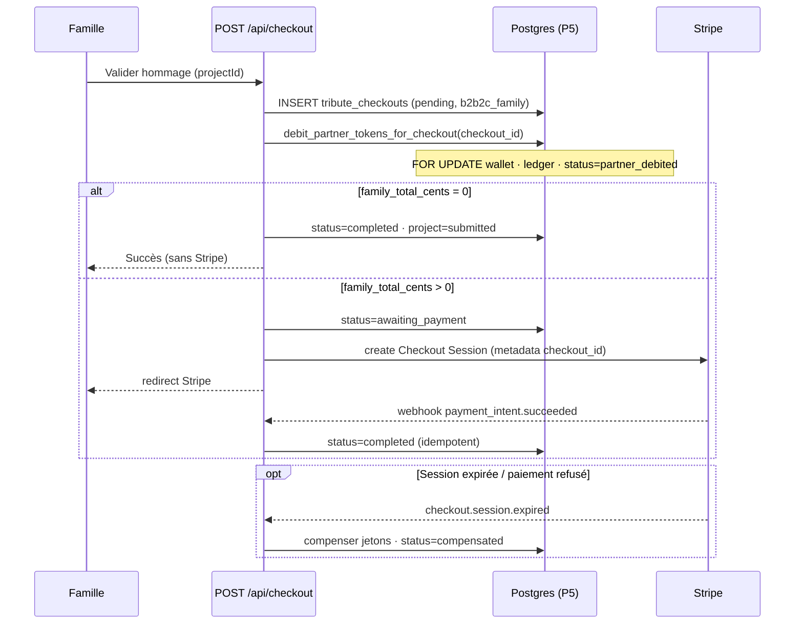

# Odyssey — Commerce B2B2C (référence architecture)

**Last updated: June 2026**

Document canonique pour le modèle **funérarium → famille** (« gant blanc »), les trois modes de checkout, et la saga `tribute_checkouts`. Complète [`WIZARD_ARCHITECTURE.md`](WIZARD_ARCHITECTURE.md) et [`TECHNICAL_ONBOARDING_ODYSSEY.md`](TECHNICAL_ONBOARDING_ODYSSEY.md).

**Prix catalogue (application)** : `src/lib/wizard/pricingConfig.ts` (cents runtime) · **contrat livrables** : [`DELIVERABLES_AND_PACKAGES.md`](DELIVERABLES_AND_PACKAGES.md) (`wizardDeliverables.ts`).  
**Audit projet + plan 2 semaines (EN)** : [`PROJECT_STATUS.md`](PROJECT_STATUS.md).

---

## Matrice de nommage (Option A)

Noms **marketing** en UI · IDs **techniques** inchangés en SQL / `wizard_state` / checkout legacy.

| Nom marketing (FR) | Nom marketing (EN) | `PackageId` (manifeste) | ID SQL / wizard (`granted_package`, `basePackage`) |
|--------------------|--------------------|-------------------------|-----------------------------------------------------|
| **Souvenir** | **Keepsake** | `SOUVENIR` | `essential` |
| **Héritage** | **Legacy** | `HERITAGE` | `signature` |
| **Éternité** | **Eternity** | `ETERNITE` | `heritage` |

Détail livrables et double tarification : [`DELIVERABLES_AND_PACKAGES.md`](DELIVERABLES_AND_PACKAGES.md).

---

## État d'implémentation

| Couche | Statut | Détail |
|--------|--------|--------|
| **Base de données** | **Terminée** | P4 wallets/ledger · P4.1 RLS rôles · **P5** invitations + checkouts + `debit_partner_tokens_for_checkout()` · **P5.1** index unique invitation `pending` · **P5.5** RBAC overdraft + débit invitation (SQL) |
| **Contrat manifeste (TS)** | **Terminée** | `wizardDeliverables.ts` + `wizardDeliverables.utils.ts` |
| **Routes & auth** | **Terminée** | Studio `/[lang]/studio` · Salon `/[lang]/salon` · connexions séparées · redirects legacy — voir [`ROUTES_AND_AUTH.md`](ROUTES_AND_AUTH.md) |
| **UI partenaire (Salon)** | **Partielle** | Invitation + branding ✅ · RBAC UI ✅ (`PartnerContext.capabilities`, bloc jetons masqué pour Directeur) · solde admin mock `42` jusqu’à `GET /api/partner/wallet` — voir [`PROJECT_STATUS.md`](PROJECT_STATUS.md) |
| **Branding Salon connexion** | **MVP** | Lien `?partenaire=<slug>` + `tenants.settings.brand_*` — upload self-service Phase 2 |
| **API invitations & magic link** | **Partielle** | Flow ✅ · débit P5.5 RPC sur `main` (`create_partner_invitation_with_debit`, HTTP 402 si overdraft) |
| **Checkout 3 modes** | **À faire** | `checkout_mode` (`b2c` / `b2b_partner` / `b2b2c_family`), RPC P5, `computeB2B2CFamilyPricing()` |
| **UI famille B2B2C** | **Partielle** | `/tribute/welcome` + wizard seed invitation · `StickyPriceBar` delta $ (pas de mot « jeton ») — à finaliser |
| **i18n forfaits** | **Terminée** | `packages.names` FR/EN (Souvenir/Keepsake, etc.) — IDs SQL inchangés |

---

## Matrice Doc vs Code vs DB

| Sujet | Doc (ce fichier) | DB (P5) | Code actuel |
|-------|------------------|---------|-------------|
| 3 modes checkout | ✅ | ✅ `checkout_mode` | ⏳ 2 branches (`isPartner` / Stripe) |
| Débit = `granted_package` | ✅ | ✅ fonction SQL | ⏳ `packagePartnerTokens(selected)` en TS |
| Invitations | ✅ | ✅ `partner_invitations` | ✅ API + accept + `projects.invitation_id` |
| Saga + compensation | ✅ | ✅ statuts `tribute_checkouts` | ⏳ absent |
| Prix 79 / 149 / 299 | ✅ | N/A (app) | ✅ `pricingConfig.ts` |

---

## Matrice forfaits et jetons (vérité validée)

Tous les montants publics sont en **centimes USD entiers** dans `pricingConfig.ts` (`7900` = 79,00 $). Noms marketing : voir [matrice de nommage](#matrice-de-nommage-option-a) ci-dessus.

| Forfait (marketing FR) | `id` technique | Prix détail (famille / B2C) | Jetons partenaire (gros) | Coût gros (40 $/jeton) |
|------------------------|----------------|----------------------------|--------------------------|-------------------------|
| **Souvenir** | `essential` | **79 $** (7 900¢) | **1** | 40 $ |
| **Héritage** | `signature` | **149 $** (14 900¢) | **2** | 80 $ |
| **Éternité** | `heritage` | **299 $** (29 900¢) | **4** | 160 $ |

Wholesale : `PARTNER_TOKEN_COST_CENTS = 4000` (40,00 $ / jeton).

**Bundle économique Éternité (`heritage`)** : vs Héritage (`signature`) + Licence Premium + USB + Coffre → économie affichée **67 $** — voir [`WIZARD_ARCHITECTURE.md`](WIZARD_ARCHITECTURE.md). Libellés famille : i18n marketing via `packages.names` / `tributeWizard.basePackage*`.

---

## Les 3 modes de checkout (`checkout_mode`)

| Mode | Qui paie quoi | Stripe | Jetons partenaire |
|------|---------------|--------|------------------|
| **`b2c`** | Famille paie le **total catalogue** (forfait + extensions) | Oui — montant complet | Non |
| **`b2b_partner`** | Le **conseiller partenaire** paie en jetons (parcours funérarium) | Non | Oui — `tokens(selected_package)` |
| **`b2b2c_family`** | Partenaire paie l’**acquisition** (forfait offert) ; famille paie le **delta** upsell | Oui — `family_total_cents` uniquement | Oui — **`tokens(granted_package)`** uniquement |

### Règle de débit B2B2C (officielle)

> **Le partenaire est débité du nombre de jetons correspondant au forfait qu’il a offert (`granted_package` sur `partner_invitations`).**  
> **Tout upsell de forfait ou d’extensions payé par la famille passe par Stripe (`family_total_cents`) et ne coûte aucun jeton supplémentaire au partenaire.**

Exemple : partenaire offre **Souvenir** (`essential`, 1 jeton) → famille choisit **Héritage** (`signature`) → partenaire : **1 jeton** ; famille : **70 $** (149 − 79) via Stripe.

Mapping SQL (miroir `pricingConfig`) : `partner_tokens_for_granted_package()`.

---

## Affichage famille (« gant blanc ») — cible UX

La famille ne voit **jamais** le mot « jeton ». Prix **relatifs** au forfait offert (`granted_package`) :

| Forfait affiché (marketing) | Si `granted_package = essential` (Souvenir, 79 $ offert) |
|-----------------------------|----------------------------------------------------------|
| Souvenir | **0 $** (inclus) |
| Héritage | **+70 $** |
| Éternité | **+220 $** (299 − 79) |

Formule : `family_delta_cents = max(0, packageCents(selected) − packageCents(granted))` (+ extensions éventuelles).

**Implémentation :** fonction dédiée `computeB2B2CFamilyPricing()` — **à créer** côté TypeScript ; ne pas réutiliser `computeWizardCart()` tel quel.

---

## Tables (P5)

### `partner_invitations`

| Colonne | Rôle |
|---------|------|
| `tenant_id` | Funérarium partenaire |
| `invited_email` | Famille invitée |
| `granted_package` | Forfait **offert** (`essential` \| `signature` \| `heritage`) |
| `status` | `pending` \| `accepted` \| `expired` \| `revoked` |
| `project_id` | Projet wizard lié (après acceptation) |
| `accepted_user_id` | Compte auth famille |
| `magic_link_token_hash` | Token one-time (hash uniquement) |

### `projects.invitation_id`

FK nullable vers `partner_invitations` — ancre serveur du parcours B2B2C.

### `tribute_checkouts`

| Colonne | Rôle |
|---------|------|
| `checkout_mode` | `b2c` \| `b2b_partner` \| `b2b2c_family` |
| `granted_package` | Obligatoire si `b2b2c_family` |
| `selected_package` | Forfait choisi à la validation |
| `partner_tokens_debited` | Jetons réellement débités |
| `family_total_cents` | Montant Stripe famille (0 si pas d’upsell) |
| `status` | Machine à états (ci-dessous) |
| `idempotency_key` | Anti double-clic |

---

## Pattern Saga — `tribute_checkouts`

**Principe :** ledger partenaire **d’abord**, Stripe **ensuite**, **compensation** si paiement famille échoue ou expire.

### Statuts

| Status | Signification |
|--------|----------------|
| `pending` | Checkout créé, pas encore de débit |
| `partner_debited` | Jetons débités (`debit_partner_tokens_for_checkout`) |
| `awaiting_payment` | `family_total_cents > 0` — session Stripe ouverte |
| `completed` | Projet validé (0 $ famille ou webhook Stripe OK) |
| `failed` | Erreur métier |
| `compensated` | Jetons recrédités après échec Stripe (à implémenter API) |

### Diagramme de séquence

### Ordre des opérations (à respecter dans l’API)

1. ❌ Stripe puis jetons — risque famille payée sans débit partenaire cohérent.  
2. ✅ `debit_partner_tokens_for_checkout()` puis Stripe si `family_total_cents > 0`.  
3. ✅ Compensation si Stripe abandonne après `partner_debited`.

---

## Rôles et RLS (résumé)

| Acteur | `tenant_members.role` | Voit wallets/ledger | Voit invitations |
|--------|----------------------|---------------------|------------------|
| Conseiller partenaire | `partner`, `partner_admin` | Oui (son tenant) | Oui (son tenant) |
| Famille invitée | `family_guest` (cible) ou `member` | Non | Sa invitation / son projet |
| Famille B2C direct | `member` sur `humans` | Non | N/A |

P4.1 : SELECT wallets/ledger **uniquement** pour `partner` / `partner_admin`.

Écritures wallet / checkout : **`service_role`** (API Next.js).

---

## Fichiers SQL liés

| Fichier | Rôle |
|---------|------|
| [`sql/odyssey_p4_partner_token_wallets.sql`](sql/odyssey_p4_partner_token_wallets.sql) | Wallets + ledger |
| [`sql/odyssey_p4_1_security_fixes.sql`](sql/odyssey_p4_1_security_fixes.sql) | RLS rôles |
| [`sql/odyssey_p5_b2b2c_core.sql`](sql/odyssey_p5_b2b2c_core.sql) | Invitations + checkouts + RPC débit |
| [`sql/odyssey_p4_partner_token_qa_seed.sql`](sql/odyssey_p4_partner_token_qa_seed.sql) | Seed QA (non prod) |
| [`sql/README.md`](sql/README.md) | Ordre d’exécution P0→P5 |

---

## Quand modifier ce document

Toute évolution de : invitations, `checkout_mode`, règle `granted_package`, saga, compensation, ou prix catalogue → mettre à jour **ce fichier**, [`WIZARD_ARCHITECTURE.md`](WIZARD_ARCHITECTURE.md) § checkout, [`TECHNICAL_ONBOARDING_ODYSSEY.md`](TECHNICAL_ONBOARDING_ODYSSEY.md) §4.7 / §5 / §10, et [`sql/README.md`](sql/README.md).
