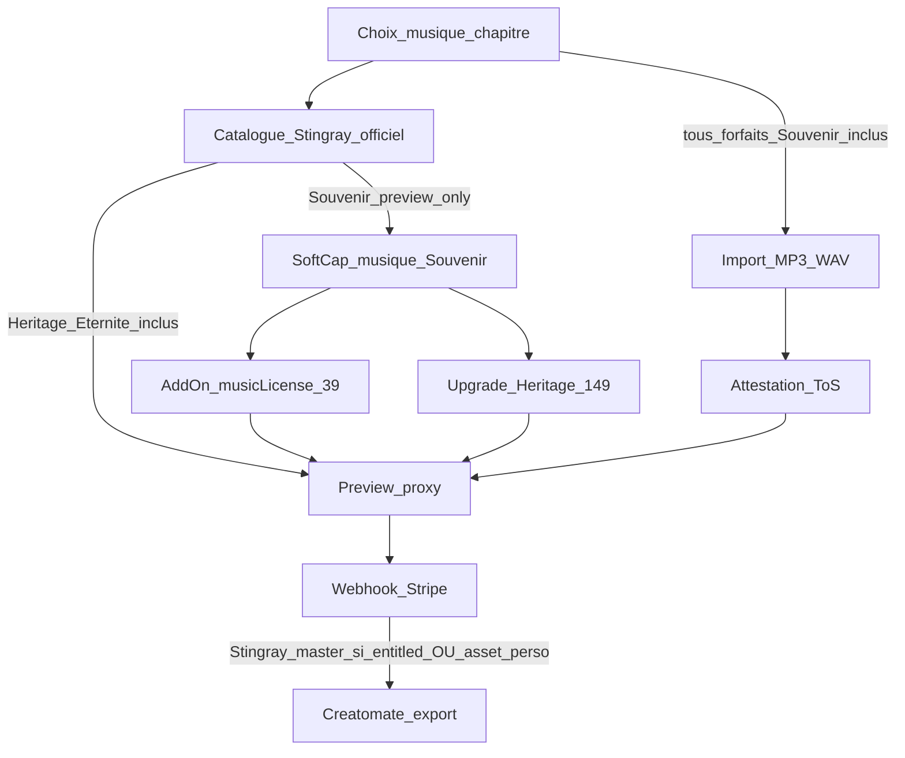

# Odyssey — Pivot Freemium V1 (canon CEO)

**Dernière révision : juillet 2026 · Statut : vision figée · Phases 0–4 ✅ · Phase 5 Creatomate/add-ons ⏳ · Phase 6 QA ⏳**

Document canonique du **pivot produit majeur** : purge totale des jetons, freemium B2B2C + RevShare only, Soft Cap (Expansion Narrative), grille forfaits 4K, musique à deux voies + add-on Licence Stingray, add-ons Quiet Luxury.

**Onboarding :** [`TECHNICAL_ONBOARDING_V1.md`](TECHNICAL_ONBOARDING_V1.md) · **Porte repo :** [`../README.md`](../README.md).

**Docs filles alignées (Phase 0) :**
[`DELIVERABLES_AND_PACKAGES.md`](DELIVERABLES_AND_PACKAGES.md) · [`B2B2C_COMMERCE.md`](B2B2C_COMMERCE.md) · [`PARTNER_REVSHARE.md`](PARTNER_REVSHARE.md) · [`WIZARD_ARCHITECTURE.md`](WIZARD_ARCHITECTURE.md) · [`STINGRAY_MUSIC_INTEGRATION.md`](STINGRAY_MUSIC_INTEGRATION.md) · [`SANCTUARY_TOKEN_NFC.md`](SANCTUARY_TOKEN_NFC.md) · [`SANCTUARY_STRATEGY.md`](SANCTUARY_STRATEGY.md).

**Specs liées :** [`NARRATIVE_SOFT_CAP.md`](NARRATIVE_SOFT_CAP.md) · [`MUSIC_RIGHTS_ATTESTATION.md`](MUSIC_RIGHTS_ATTESTATION.md).

> SKU musique à la carte : **`musicLicense` (39 $)** — successeur de `extendedLicense` (migration TS Phase 1).

> **⚠️ Extension canon — Cascade V-Final (rév. 22 juillet 2026) :** le **B2C direct** pivote —
> entrée en **brouillon gratuit**, paywall **strict à l'export** (min Héritage **179 $**),
> pouvant être financé par la **Boucle Virale / Fonds Commémoratif**. Grille Quiet Luxury accessible :
> Héritage **179 $** · Éternité **349 $** · Légendaire **499 $**. Empreintes Sanctuaire :
> Voix **69 $** · Vidéo **119 $** · Coproduction **129 $** · Bougie **15 $** · Mécène **150–1000 $**.
> Canon dédié : [`IMPLEMENTATION_CASCADE_VFINAL.md`](IMPLEMENTATION_CASCADE_VFINAL.md).

---

## 1. Conditions non négociables

1. **Never trust the client** pour 4K / Creatomate / Stingray master / IA full.
2. **Entitlements payés** = snapshot serveur post-webhook Stripe — pas le `wizard_state` navigateur.
3. **Purge jetons totale** — solde partenaire = uniquement `partner_commission_*`.
4. **Musique à deux voies** — catalogue Stingray officiel (zéro copyright Odyssey) + soupape MP3/WAV (responsabilité famille via ToS).
5. **Stingray licencié = 100 % payant** *(décision juillet 2026)*. Le gratuit **n'inclut aucune** piste licenciée dans l'export : seulement (a) **preview** (hook Soft Cap, non exporté) et (b) **MP3 perso via ToS**. Soft Cap : **Licence 39 $** ou **upgrade Héritage 179 $**.
6. **Sanctuaire / Boucle Virale** — médias invités **hors** Soft Cap 50 ; voix/vidéo V1 « soumis à la famille » ; `viral_loop_enabled` off jusqu'à fin Phase 3a ; surplus fonds = **produit** (pas de cash-out).

---

## 2. Grille forfaits (figée)

| Forfait | ID | Prix | Médias | Export | Musique | Inclus |
|---------|-----|------|--------|--------|---------|--------|
| **Souvenir** | `essential` | 0 $ | 50 | 1080p | **Preview Stingray** (aperçu, non exporté) + **MP3 perso (ToS)** — aucune piste licenciée incluse | Cadeau salon |
| **Héritage** | `signature` | **179 $** | 125 | **4K** | **Catalogue Stingray officiel inclus** + soupape MP3/WAV | Chef-d’œuvre numérique |
| **Éternité** | `heritage` | **349 $** | 175 | 4K | Idem Héritage (officiel inclus) | + IA complète + Coffre 50 ans |

**Légendaire 499 $** : B2C-only ancre Quiet Luxury (conservé jusqu’à décision contraire).

> Grille **Quiet Luxury accessible** (Phase 0 — 22/07/2026). Source runtime : `pricingConfig.ts`.

### Add-ons Quiet Luxury (grille V1 officielle)

| Add-on | Prix | ID technique | Notes |
|--------|------|--------------|-------|
| **Jeton du Sanctuaire** (NFC/QR) | 79 $ | `sanctuaryToken` | Remplace `collectorUsb` — stock global, association dynamique |
| **Voix de l’Histoire** | 39 $ | `storyVoice` | Narration IA biographie — **distinct** de la licence musique |
| **Licence Musique Premium Stingray** | 39 $ | `musicLicense` | Upsell **Souvenir** : débloque catalogue officiel **sans** forcer Héritage. Inclus (gratuit) dès Héritage/Éternité → ne pas facturer si `intended >= signature` |
| **Livre de Mémoire** | 149 $ | `memoryBook` | PDF → Print-on-Demand (Gelato) |
| Restauration IA | 49 $ | `aiRetouch` | À la carte si pas Éternité |
| Coffre-fort 50 ans | 99 $ | `digitalVault` | À la carte si pas Éternité |

**Obsolète V1 :** wholesale jetons 40 $ · `partner_token_*`.  
**Migration TS :** `extendedLicense` → `musicLicense` (même rôle catalogue ; ne pas confondre avec `storyVoice`).

---

## 3. Soft Cap — Expansion Narrative

État wizard scindé :

| Champ | Rôle |
|-------|------|
| `grantedPackage` | Cadeau salon (ex. `essential`) — immuable côté client |
| `intendedPackage` | Forfait construit (Soft Cap médias / upgrade Héritage) — mutable sans CB |
| `extensions.musicLicense` | Add-on panier virtuel — accès catalogue officiel **sans** monter `intended` |

### Déclencheurs

| Déclencheur | Comportement |
|-------------|--------------|
| ≥ 50 médias | Soft Cap → `intendedPackage = signature` (toile Héritage) — **filet** étape Médias |
| **Post Composition Magique** | Soft Cap **principal** — copy chef-d’œuvre déjà vécu (« N souvenirs tissés… ») → Héritage |
| Piste catalogue **officiel** depuis Souvenir | **Ne pas bloquer** la sélection. Soft Cap à **deux options** (voir ci-dessous) |

### Soft Cap musique (Souvenir) — choix dual

La famille a déjà « vécu » la piste. L’UI propose :

1. **Licence Musique Premium Stingray — 39 $**  
   - Garde `intendedPackage = essential` (Souvenir 0 $ + quotas 50 / 1080p).  
   - Active `extensions.musicLicense = true` (panier virtuel).  
   - Débloque catalogue officiel + export licence pour ces pistes.

2. **Upgrader vers Héritage — 179 $**  
   - `intendedPackage = signature`.  
   - Débloque musique officielle **incluse** + 4K + 125 médias.  
   - **Ne pas** ajouter `musicLicense` en line item (déjà inclus dans le forfait).

Détail UX / amputation : [`NARRATIVE_SOFT_CAP.md`](NARRATIVE_SOFT_CAP.md).

---

## 4. Musique (règle canonique)

### Catalogue Officiel

- Orchestral / cinématique **Stingray**, licence plateforme — **zéro risque copyright** Odyssey / Athos / salon.
- **Inclus sans frais** dans Héritage et Éternité.
- Souvenir : **aperçu (preview) uniquement** — aucune piste licenciée n'est incluse ni exportée. Le catalogue officiel se débloque via Soft Cap (Licence 39 $ **ou** Héritage). *Stingray licencié = 100 % payant (décision juillet 2026).*

### Entitlement (contrat code Phase 1)

```text
resolveMusicEntitlement(intendedPackage, extensions, paidEntitlements):
  officialCatalog =
       intendedPackage >= signature
    OR extensions.musicLicense === true
    OR paidEntitlements.musicLicense === true
```

- Preview : autoriser l’écoute Soft Cap même avant paiement (proxy).  
- Export Creatomate master Stingray : uniquement si **payé** (`paid` package ≥ signature **ou** `paid.musicLicense`).

### Soupape émotionnelle

Import **MP3 / WAV** : **disponible sur tous les forfaits, Souvenir inclus** *(décision juillet 2026 — seule source musicale du gratuit puisque Stingray licencié est 100 % payant)*. Protection : **attestation de droits ToS** exigée à l'upload puis revérifiée au checkout/export (`assertCheckoutMusicRights` / `assertExportAllowed`), indépendante du forfait. ToS : [`MUSIC_RIGHTS_ATTESTATION.md`](MUSIC_RIGHTS_ATTESTATION.md).



---

## 5. Sécurité & COGS (résumé CTO)

| Risque | Mitigation |
|--------|------------|
| Bypass 4K / render client | Worker lit `paid_entitlements` webhook-only |
| Master Stingray sans payer Licence ni Héritage | Worker : `officialCatalog` **payé** requis ; preview ≠ master |
| `musicLicense` forgé dans wizard_state | Checkout recalcule ; entitlements = webhook only |
| Double facturation Licence + Héritage | Si `intended >= signature`, strip `musicLicense` du cart |
| Spam preview / IA | Proxy basse rés, caps regen |
| NFC double-claim | RPC atomique + secret + post-paiement |
| Upload sans ToS | Gate serveur checkout + worker |

---

## 6. Purge jetons → Ledger commissions

**Validé.** Ledger `partner_commission_*` seul. Commissionnable : forfaits upsell **et** add-ons (dont `musicLicense` 39 $) via waterfall Bulletproof.

---

## 7. Plan d’exécution chirurgical

### Phase 0 — Docs filles (alignement) — ✅ FAIT

1. ✅ DELIVERABLES réécrit (grille 4K, add-ons, Soft Cap, `musicLicense`).
2. ✅ B2B2C / PARTNER_REVSHARE : freemium only + Soft Cap ; jetons DEPRECATED.
3. ✅ WIZARD_ARCHITECTURE : cible `granted` / `intended` / Soft Cap.
4. ✅ STINGRAY : catalogue officiel + Soft Cap dual + entitlement.
5. ✅ `SANCTUARY_TOKEN_NFC.md` + sql/README banner purge Phase 2.

### Phase 1 — Manifeste TS — ✅ FAIT

6. ✅ `pricingConfig` : `musicLicense` + `storyVoice` + `sanctuaryToken` + `memoryBook` ; Héritage `musicCatalog: premium` ; jetons = 0.
7. ✅ `wizardDeliverables` : Héritage **4K** ; tokens 0.
8. ✅ `wizardState` : `grantedPackage` + `intendedPackage` + attestation stub ; `basePackage` = miroir intended.
9. ✅ Helpers : `resolveMusicEntitlement` · `canUploadPersonalAudio` · `computeWizardCartWithGrant` · strip Licence si ≥ Héritage.
10. ✅ Alias `extendedLicense` / `collectorUsb` pour UI legacy.

### Phase 2 — SQL — ✅ repo · ✅ appliqué Supabase

11. ✅ `docs/sql/odyssey_p8_freemium_v1_token_purge.sql` — invitation sans débit · Soft Cap quota · entitlements · NFC · DROP wallets.
12. ✅ API invitations + checkout partenaire sans débit · wallet → snapshot commissions.

### Phase 3 — APIs — ✅ FAIT

14. ✅ Checkout Soft Cap : `computeWizardCartWithGrant` · metadata granted/intended/music_license · amputation 422.
15. ✅ Webhook → `project_paid_entitlements` (B2B2C + B2C) ; freemium_free écrit aussi les entitlements.
16. ⏳ Salon UI commissions (wallet renvoie déjà les soldes commissions).

### Phase 4 — Soft Cap UX + musique

15. ✅ Soft Cap médias → Héritage (filet étape 3 + post Composition Magique).
16. ✅ Soft Cap musique Souvenir → **modale 2 choix** (Licence 39 $ | Héritage 149 $) ; piste non bloquée.
17. ✅ Import MP3 + ToS (Héritage+) — UI Étape 4 + gate checkout.
18. ✅ Étape 8 : panier Soft Cap (`resolveWizardDisplayCart`) ; CTA rester à 0 $ ; surface amputation 422.

### Phase 5 — Export & add-ons — ✅ FAIT (stub Creatomate)

19. ✅ Gate export : `assertExportAllowed` + `POST /api/projects/[id]/export` + table P9 `project_export_jobs` (provider `creatomate_stub`).
20. ✅ Checkout : attestation MP3/WAV obligatoire si `source=upload`.
21. ✅ Webhook / freemium_free : `enqueueQuietLuxuryFulfillment` (NFC · Voix · Livre → `wizard_state.quietLuxuryFulfillment`).
22. ✅ UI add-ons : `storyVoice` · `sanctuaryToken` (NFC) · `memoryBook` · labels i18n.
23. ⏳ Worker Creatomate réel + claim NFC claim / Gelato / TTS = follow-ups (hors stub).

### Phase 6 — QA & cutover

24. QA : Soft Cap dual musique ; pas de double facturation ; bypass master ; RevShare sur 39 $ ; DROP jetons.

**Ordre d’or :** Docs filles → Manifeste TS (`musicLicense` + `storyVoice`) → SQL → Purge APIs jetons → Soft Cap UI → Worker → Add-ons.

---

## 8. Maintenance

Mettre à jour ce fichier quand la grille, les SKUs (`musicLicense` / `storyVoice`), la règle Soft Cap musique ou l’ordre de purge changent.

---

*Vision CEO figée — juillet 2026 (rév. **grille 179/349/499** · Sanctuaire empreintes · gratuit sans Stingray licencié). Phases 0–5 livrées (Creatomate = stub) ; Phase 3a Sanctuaire UI ⏳. Onboarding : [`TECHNICAL_ONBOARDING_V1.md`](TECHNICAL_ONBOARDING_V1.md).*  
*Appliquer SQL P9 sur Supabase : [`sql/odyssey_p9_project_export_jobs.sql`](sql/odyssey_p9_project_export_jobs.sql).*
