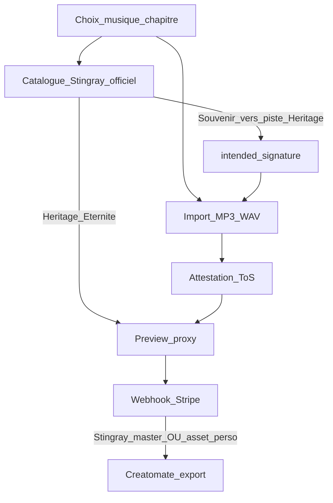

# Odyssey — Pivot Freemium V1 (canon CEO)

**Dernière révision : juillet 2026 · Statut : vision figée — implémentation code non démarrée**

Document canonique du **pivot produit majeur** : purge totale des jetons, freemium B2B2C + RevShare only, Soft Cap (Expansion Narrative), grille forfaits 4K, musique à deux voies, add-ons Quiet Luxury.

**Complète** (et supersède partiellement jusqu’à réécriture) :
[`DELIVERABLES_AND_PACKAGES.md`](DELIVERABLES_AND_PACKAGES.md) · [`B2B2C_COMMERCE.md`](B2B2C_COMMERCE.md) · [`PARTNER_REVSHARE.md`](PARTNER_REVSHARE.md) · [`WIZARD_ARCHITECTURE.md`](WIZARD_ARCHITECTURE.md) · [`SANCTUARY_STRATEGY.md`](SANCTUARY_STRATEGY.md) · [`STINGRAY_MUSIC_INTEGRATION.md`](STINGRAY_MUSIC_INTEGRATION.md).

**Specs liées :** [`NARRATIVE_SOFT_CAP.md`](NARRATIVE_SOFT_CAP.md) · [`MUSIC_RIGHTS_ATTESTATION.md`](MUSIC_RIGHTS_ATTESTATION.md).

> **Règle de priorité :** en cas de conflit avec une doc plus ancienne (jetons 40 $, Héritage 1080p, `extendedLicense`), **ce fichier prime** jusqu’à alignement des docs filles.

---

## 1. Conditions non négociables

1. **Never trust the client** pour 4K / Creatomate / Stingray master / IA full.
2. **Entitlements payés** = snapshot serveur post-webhook Stripe — pas le `wizard_state` navigateur.
3. **Purge jetons totale** — solde partenaire = uniquement `partner_commission_*`.
4. **Musique à deux voies** — catalogue Stingray officiel (zéro copyright Odyssey) + soupape MP3/WAV (responsabilité famille via ToS).

---

## 2. Grille forfaits (figée)

| Forfait | ID | Prix | Médias | Export | Musique | Inclus |
|---------|-----|------|--------|--------|---------|--------|
| **Souvenir** | `essential` | 0 $ | 50 | 1080p | Stingray **standard** (sous-ensemble) | Cadeau salon |
| **Héritage** | `signature` | 149 $ | 125 | **4K** | **Catalogue Stingray officiel** + soupape MP3/WAV | Chef-d’œuvre numérique |
| **Éternité** | `heritage` | 299 $ | 175 | 4K | Idem Héritage | + IA complète + Coffre 50 ans |

**Légendaire 499 $** : B2C-only ancre Quiet Luxury (conservé jusqu’à décision contraire).

### Add-ons Quiet Luxury

| Add-on | Prix | ID technique | Notes |
|--------|------|--------------|-------|
| **Jeton du Sanctuaire** (NFC/QR) | 79 $ | `sanctuaryToken` | Remplace `collectorUsb` — stock global, association dynamique |
| **Voix de l’Histoire** | 39 $ | `storyVoice` | Narration IA biographie — **remplace** l’ancien SKU `extendedLicense` |
| **Livre de Mémoire** | 149 $ | `memoryBook` | PDF → Print-on-Demand (Gelato) |
| Restauration IA | 49 $ | `aiRetouch` | À la carte si pas Éternité |
| Coffre-fort 50 ans | 99 $ | `digitalVault` | À la carte si pas Éternité |

**Obsolète V1 :** wholesale jetons 40 $ · `partner_token_*` · upsell musique `extendedLicense`.

---

## 3. Soft Cap — Expansion Narrative

État wizard scindé :

| Champ | Rôle |
|-------|------|
| `grantedPackage` | Cadeau salon (ex. `essential`) — immuable côté client |
| `intendedPackage` | Forfait construit (Soft Cap) — mutable sans CB |

- ≥ 50 médias **ou** sélection piste catalogue officiel → `intendedPackage = signature`.
- Checkout : payer Héritage/Éternité **ou** amputer (médias + musique) pour rester Souvenir 0 $.
- Détail : [`NARRATIVE_SOFT_CAP.md`](NARRATIVE_SOFT_CAP.md).

---

## 4. Musique (règle canonique)

### Catalogue Officiel (inclus)

Catalogue orchestral / cinématique **Stingray**, licence plateforme — **aucun risque copyright** Odyssey / Athos / salon. Inclus dès Héritage / Éternité. Souvenir = sous-ensemble standard uniquement.

### Soupape émotionnelle

Import **MP3 / WAV** personnel (ex. Aznavour). **Masqué sur Souvenir** ; visible dès Héritage (ou après Soft Cap). Creatomate mixe la piste sans licence sync Odyssey.

### Sécurité juridique

Attestation ToS avant upload ; checkout / export bloqués sans attestation. Publication réseaux = responsabilité famille. Détail : [`MUSIC_RIGHTS_ATTESTATION.md`](MUSIC_RIGHTS_ATTESTATION.md).

---

## 5. Sécurité & COGS (résumé CTO)

| Risque | Mitigation |
|--------|------------|
| Bypass 4K / render client | Worker lit `paid_entitlements` webhook-only ; jamais Creatomate depuis le front |
| Spam preview / IA | Proxy basse rés, caps regen, IA full post-paiement |
| Stripe abandon / double session | Snapshot immuable `tribute_checkouts` ; nouvelle Session si `intended` change |
| NFC double-claim | RPC atomique + secret haute entropie + post-paiement |
| Upload sans ToS | Gate serveur checkout + worker |
| Fuite master Stingray | Preview stream seulement ; master URI serveur post-pay |

---

## 6. Purge jetons → Ledger commissions

**Validé.** Remplacer wallets / débits invitation / UI 40 $ par `partner_commission_balances` + accruals webhook Bulletproof (10 % platform → 30 % Net Distribuable).

Gap actuel à fermer : UI « 0 jeton » mais RPC `create_partner_invitation_with_debit` débite encore.

---

## 7. Plan d’exécution chirurgical

### Phase 0 — Docs filles (alignement)

Réécrire DELIVERABLES, B2B2C, PARTNER_REVSHARE, WIZARD_ARCHITECTURE, STINGRAY ; cross-liens PROJECT_STATUS / README.

### Phase 1 — Manifeste TS

`wizardDeliverables` / `pricingConfig` / `wizardState` (`granted`+`intended`+attestation) / cart ; purger `tokens` / `extendedLicense`.

### Phase 2 — SQL

RPC invitation sans débit · quotas sur `intended` · `project_paid_entitlements` · `sanctuary_tokens` · **DROP** `partner_token_*`.

### Phase 3 — APIs

Checkout sans jetons · webhook → entitlements → accrue → enqueue export · Salon = commissions.

### Phase 4 — Soft Cap UX + musique

Soft Cap médias/Stingray · import MP3 + ToS · amputation étape 8.

### Phase 5 — Export & add-ons

Creatomate post-webhook (audio dual-path) · NFC · Voix · Livre.

### Phase 6 — QA & cutover

Bypass, COGS, ToS, RevShare, DROP jetons staging→prod.

**Ordre d’or :** Docs filles → Manifeste TS → SQL → Purge APIs → Soft Cap UI → Worker → Add-ons.

---

## 8. Maintenance

Mettre à jour ce fichier quand la grille, les SKUs, la règle musique ou l’ordre de purge changent. Les docs filles doivent ensuite être alignées (Phase 0).

---

*Vision CEO figée — juillet 2026. Implémentation code = phases 1–6 après alignement docs filles.*
