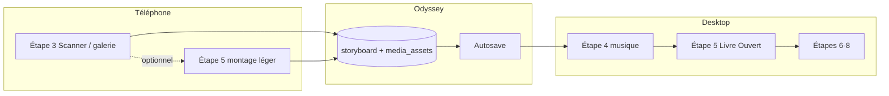

# Stratégie mobile — Wizard Odyssey

**Dernière révision : juillet 2026**

Document canonique pour l’ergonomie mobile du wizard hommage (8 étapes). Croise l’audit code juillet 2026, les bonnes pratiques [Forbes Tech Council (sept. 2023)](https://www.forbes.com/councils/forbestechcouncil/2023/09/05/20-expert-tips-for-building-an-ergonomic-user-friendly-mobile-app/) et [Ferpection (mai 2022)](https://blog.ferpection.com/en/the-ergonomics-of-a-mobile-application-best-practices).

**Documents liés :**
- [`WIZARD_ARCHITECTURE.md`](WIZARD_ARCHITECTURE.md) — architecture wizard
- [`STORYBOARD_STEP5_LIVRE_OUVERT.md`](STORYBOARD_STEP5_LIVRE_OUVERT.md) — Étape 5 desktop / Livre Ouvert
- [`SCANNER_COMPANION.md`](SCANNER_COMPANION.md) — ingestion mobile QR
- [`QA_S5_MONTAGE_STEP.md`](QA_S5_MONTAGE_STEP.md) — régression manuelle Étape 5

---

## 1. Décision produit — une app, trois postures

### Ce que nous ne faisons pas

| Approche | Verdict |
|----------|---------|
| Deux apps ou deux routes (`/wizard` vs `/wizard-mobile`) | ❌ Dette double, rupture autosave |
| Wizard desktop identique compressé sur 375px | ❌ Viole la loi de Jakob + thumb zone (Ferpection) |
| Oublier le Scanner au profit du montage mobile lourd | ❌ Ignore l’action utilisateur réelle sur téléphone |

### Ce que nous faisons

**Un seul wizard Next.js**, **trois postures d’interaction** selon le device et l’étape :

| Posture | Device cible | Métaphore | Étapes concernées |
|---------|--------------|-----------|-------------------|
| **Capture** | Téléphone | « Je dépose mes souvenirs » | **3** (Scanner + galerie) |
| **Composition légère** | Téléphone | « Je place quelques photos simplement » | **5** (dock + tap + magie) |
| **Composition complète** | Desktop / tablette ≥ 1024px | « Je vois mon film entier » | **5** (Livre Ouvert + DnD) |
| **Formulaire / checkout** | Tous | Parcours linéaire | 1–2, 4, 6–8 |

**Cross-device (Forbes #16 + Ferpection « actions utilisateur ») :** le téléphone sert surtout à **capturer** ; le desktop à **composer et payer**. L’**autosave** + `project_id` unique assure la continuité sans synchronisation manuelle.



---

## 2. Diagnostic — wizard actuel sur mobile

### Score par étape (juillet 2026)

| Étape | Instinctif téléphone | Note |
|-------|----------------------|------|
| 1 — Identité | 🟢 | Champs larges, avatar OK |
| 2 — Sources | 🟢 | Cartes tapables |
| 3 — Upload | 🟡 | Dropzone → picker OK ; grille dense ; suppressions hover-only ; **Scanner non branché** |
| 4 — Chapitres / musique | 🟡 | Onglets serrés ; boutons ~36px ; delete au hover |
| 5 — Livre Ouvert | 🔴 | Banque au-dessus des chapitres ; grille 3 col. ; DnD desktop ; hover-only |
| 6 — Extensions | 🟢 | 1 colonne, footer 52px |
| 7–8 — Preview / Checkout | 🟢 | CTA 56–60px |

### Étape 5 — frictions critiques

1. **Banque entière** empilée avant les chapitres → scroll excessif (anti cut-off Ferpection)
2. **Grille 3 colonnes** sur ~375px → vignettes et cibles < 44px
3. **Contrôles hover-only** (sélection, retirer, labels FilmMap)
4. **DnD** : `PointerSensor` seul ; banque = drag sur toute la tuile
5. **Triple sticky** : header global + StickyPriceBar + FilmMap
6. **Multi-select Shift+clic** inaccessible au touch

### Patterns déjà positifs

- Footer navigation `min-h-[52px]` (thumb zone Ferpection)
- `useFinePointer` + poignée drag sur `MontageMediaCard`
- `ChapterRefinementDrawer` : bottom sheet mobile / modal `md+`
- `StoryboardOpenBookLayout` : `lg:grid-cols-[280px_1fr]` desktop, stack mobile
- Composition Magique = default fort (Ferpection : valeurs par défaut, peu de friction)
- Dark mode natif (Forbes #18)

---

## 3. Synthèse Forbes × Ferpection → règles Odyssey

### Forbes — 20 tips (regroupés)

| Thème | Tips | Règle Odyssey |
|-------|------|---------------|
| Clarté | #1, #8 | Réduire sticky empilés ; MVP par écran mobile |
| Gestes & pouce | #2, #6, #7 | Tap-to-assign ; TouchSensor ; CTAs bas |
| Layout | #9, #19 | Shell mobile dédié Étape 5 ; tester paysage 50+ |
| Standards | #4, #5, #15 | ≥ 44px ; fin du hover-only |
| Cross-device | #16 | **Scanner P1** + autosave |
| Perf | #17 | Thumbs WebP, batch magic |

### Ferpection — piliers

| Pilier | Règle Odyssey |
|--------|---------------|
| **Actions utilisateur d’abord** | Téléphone = capture (Scanner), pas montage NLE |
| **Onboarding sans friction** | Gate magie/manuel ✅ ; limiter étapes sur mobile |
| **Thumb zone** | Actions primaires en bas ; FilmMap compacte en haut |
| **Cut-off design** | Dock banque 40 % max + aperçu chapitre dessous |
| **Loi de Jakob** | Patterns connus : galerie, QR, bottom sheet, tap — pas DnD desktop |
| **CTAs clairs** | Microcopy actionnelle (pas « Cliquez ici ») — S5-L |
| **Émotion / microcopy** | Ton Gant Blanc, prénom défunt dans header |
| **Tester** | M6 : tests utilisateurs avant gros refactor |
| **Micro-interactions** (UX Pilot #6) | Feedback fonctionnel, court, désactivable — pas de gamification |

### Micro-animations — règles Odyssey

> **Whisper par défaut, Ceremony une fois.** La Composition Magique reste l’exception rituelle ; le reste du wizard mobile confirme sans distraire.

Aligné [`DESIGN_SYSTEM.md`](DESIGN_SYSTEM.md) §7 et [`STORYBOARD_STEP5_LIVRE_OUVERT.md`](STORYBOARD_STEP5_LIVRE_OUVERT.md) §10.4 (matière & toucher).

| Niveau | Token | Durée | Usage mobile |
|--------|-------|-------|--------------|
| **Whisper** | `DURATION_WHISPER` | 180 ms | Tap média, ring sélection, toggle dock |
| **Breath** | `DURATION_BREATH` | 320 ms | Ouverture bottom sheet, focus chapitre (S5-K) |
| **Ritual** | `DURATION_RITUAL` | 480 ms | Drawer « Gérer », transitions overlay |
| **Ceremony** | batch CSS `.magic-*` | 2–4 s | **Composition Magique uniquement** |

**Courbe :** `EASE_OUT_LUXE` — `cubic-bezier(0.16, 1, 0.3, 1)` (`src/lib/motion/easing.ts`).

| Contexte | Micro-animation cible | Remplace |
|----------|----------------------|----------|
| Tap tuile banque | Scale 0.98 + ring ambre 150 ms | Hover lift desktop |
| Média « prêt à placer » | Pulse discret bordure teal | Surbrillance hover |
| Assign réussi | Flash teal 200 ms puis fade | — |
| Dock banque ouvert/fermé | Sheet slide + scrim 320 ms | Scroll banque entière |
| Autosave OK | Toast slide bas, 2 s max | — |
| Scanner : photo reçue | Thumb pop-in + check | Loader spinner long |

**Interdits mobile hommage :** bounce type réseau social, confettis, parallax, streaks/gamification, animations qui **bloquent** l’action suivante, haptics systématiques (web peu fiable — P3 optionnel sur succès scan uniquement).

**Accessibilité :** toute micro-animation respecte `prefers-reduced-motion: reduce` (instantané ou opacité seule — même règle que magic PR-3).

**Perf / éthique (UX Pilot #8) :** pas d’animation décorative en boucle ; pas de `will-change` permanent ; privilégier CSS transform/opacity sur le GPU.

### Principe Cowboy (exemple Ferpection)

UI **contextuelle** — une fonction principale mise en avant selon l’état :

| Contexte | Fonction mise en avant |
|----------|------------------------|
| Étape 3 mobile, peu de médias | **Scanner / ajouter des photos** |
| Étape 5 mobile, banque pleine | **Composition Magique** ou **tap-to-assign** |
| Étape 5 desktop | **Livre Ouvert** complet |
| Storyboard vierge | **Composition Magique** (livré PR-3) |

---

## 4. Architecture technique cible

### Breakpoints

Tailwind par défaut : `lg` = **1024px** = seuil Livre Ouvert côte à côte (déjà en place).

| Viewport | Shell Étape 5 |
|----------|---------------|
| `< lg` | `StoryboardMontageMobileShell` (à créer) |
| `≥ lg` | `StoryboardOpenBookLayout` (actuel, inchangé) |

### Fichiers cibles (futur)

```
src/components/tribute/storyboard/
├── StoryboardOpenBookLayout.tsx      # desktop ≥ lg (existant)
├── StoryboardMontageMobileShell.tsx  # mobile < lg (nouveau)
├── MediaBankDock.tsx                 # dock bas mobile (nouveau ou réactiver MediaBankPanel)
└── ... (composants partagés)

src/hooks/
├── useFinePointer.ts                 # existant
└── useWizardViewport.ts              # lg + safe-area iOS (nouveau)
```

**Règle :** domaine **unique** (`storyboardMedia`, `storyboardDnd`, `storyboardMagicTimeline`) ; seuls les **shells UI** divergent.

### Étape 5 mobile — wireframe cible

```
┌─────────────────────────────┐
│ FilmMap compact (labels ON) │  min 44px tap par segment
├─────────────────────────────┤
│ Chapitre actif              │  focus / expanded (S5-K)
│ Grille 2 col.               │  pas 3
│ (scroll interne)            │
├─────────────────────────────┤
│ ▲ Dock banque (max ~40%)    │  cut-off : chapitre visible au-dessus
│ [N médias] [Sélectionner]   │
│ [✨ Composition Magique]     │  thumb zone
└─────────────────────────────┘
```

### Interactions mobile Étape 5

| Geste desktop | Équivalent mobile (Jakob) |
|---------------|---------------------------|
| Drag banque → chapitre | **Tap média** → surbrillance → **tap chapitre** = assigner |
| Shift+clic multi-select | Bouton **« Sélectionner »** dans dock banque |
| Drag poignée carte | Poignée 44px ou long-press (TouchSensor) |
| Hover FilmMap labels | Labels **toujours visibles** |

---

## 5. Scanner Compagnon — pilier mobile (P1)

Le Scanner n’est pas un « nice-to-have » : c’est la **réponse produit** aux articles Forbes (#16) et Ferpection (action utilisateur).

| Rôle | Détail |
|------|--------|
| **Problème résolu** | Upload papier / galerie sans friction étape 3 |
| **Réduction charge Étape 5** | Moins de médias à placer manuellement depuis la banque |
| **Cross-device** | QR wizard desktop → session mobile → sync temps réel → continuation desktop |
| **Spec technique** | [`SCANNER_COMPANION.md`](SCANNER_COMPANION.md) |
| **État code** | Tables P6 stub ✅ · MVP app ⏳ |

### Parcours cible Scanner × Wizard

1. Famille ouvre wizard (desktop ou mobile)
2. **Étape 3** : panneau QR « Continuer sur votre téléphone »
3. Mobile : scan / galerie / papier → `media_assets` + storyboard `unassignedIds`
4. Desktop : grille se met à jour (realtime ou poll) ; famille passe étapes 4–5

---

## 6. Plan d’exécution M0–M6

### Vue d’ensemble

| Phase | Contenu | Priorité | Effort |
|-------|---------|----------|--------|
| **M0** | Fondations tactiles transversales | P0 | Faible |
| **M0.5** | Micro-animations fonctionnelles (tap, dock, autosave) | P1 | Faible |
| **M1** | Header / footer unifié mobile | P2 | Moyen |
| **M2** | Scanner Phase A (étape 3) | **P1** | Élevé |
| **M3** | Shell mobile Étape 5 (dock + cut-off + 2 col.) | P0 | Moyen |
| **M4** | Tap-to-assign + mode sélection | P1 | Moyen |
| **M5** | Microcopy narrative (S5-L) | P2 | Faible |
| **M6** | Tests utilisateurs (5–8 sessions) | **P1** | Moyen |

### M0 — Fondations tactiles (transversal wizard)

| ID | Tâche | Fichiers typiques |
|----|-------|-------------------|
| M0-A | `min-h-11` (44px) sur boutons et icônes d’action | `ChapterActionCluster`, `ChapterMusicPanel`, `WizardPhaseProgress`, etc. |
| M0-B | Fin **hover-only** : sélection, supprimer, FilmMap labels | `BankDraggableMediaTile`, `MontageMediaCard`, `StoryboardFilmMap` |
| M0-C | `touch-manipulation` sur CTAs wizard | `TributeWizard`, footers |
| M0-D | `TouchSensor` + `PointerSensor` dans `DndContext` | `StoryboardMontageStep` |
| M0-E | `useFinePointer` sur `BankDraggableMediaTile` | aligné `MontageMediaCard` |
| M0-F | Mode sélection mobile (bouton, remplace Shift+clic) | `MediaBankColumn` |

### M0.5 — Micro-animations (après M0, avec M3)

| ID | Tâche | Fichiers typiques |
|----|-------|-------------------|
| M0.5-A | Tap feedback tuile banque (scale + ring, `DURATION_WHISPER`) | `BankDraggableMediaTile`, `globals.css` |
| M0.5-B | État « prêt à placer » + flash assign réussi | shell mobile Étape 5, `storyboardMedia` |
| M0.5-C | Transition `MediaBankDock` open/close (`DURATION_BREATH`) | `MediaBankDock` (M3-B) |
| M0.5-D | Toast autosave discret (footer zone, pas modal) | `TributeWizard`, pattern existant |
| M0.5-E | `prefers-reduced-motion` sur toutes les classes `.mobile-micro-*` | `globals.css` |
| M0.5-F | Scanner : thumb pop-in post-upload (M2, optionnel) | route `/scan/` |

**Règle :** livrer M0.5 **avec** M3 (dock) — les micro remplacent le hover desktop ; inutiles tant que le shell mobile n’existe pas.

### M1 — Navigation globale mobile

| ID | Tâche |
|----|-------|
| M1-A | Header sticky compact (1 ligne mobile) |
| M1-B | `WizardPhaseProgress` : barre + étape courante ; phases en scroll horizontal si besoin |
| M1-C | Fusionner `StickyPriceBar` dans footer fixe mobile (une seule barre bas) |
| M1-D | `PackageDossierPanel` : bottom sheet `< md` (comme `ChapterRefinementDrawer`) |

### M2 — Scanner Phase A

| ID | Tâche |
|----|-------|
| M2-A | QR + session `scan_sessions` sur étape 3 |
| M2-B | Route mobile `/[lang]/scan/` — upload galerie |
| M2-C | Sync médias vers projet wizard (realtime ou poll) |
| M2-D | Copy rassurante + états loading (Ferpection onboarding) |

Voir [`SCANNER_COMPANION.md`](SCANNER_COMPANION.md) pour le détail technique.

### M3 — Étape 5 mobile shell

| ID | Tâche |
|----|-------|
| M3-A | `StoryboardMontageMobileShell` + `useWizardViewport` |
| M3-B | **MediaBankDock** bas (réutiliser pattern `MediaBankPanel` / bottom sheet) |
| M3-C | Grille chapitre `grid-cols-2` sur mobile (remplace 3) |
| M3-D | FilmMap compacte, labels toujours visibles, segments ≥ 44px |
| M3-E | Cut-off : dock max ~40 % hauteur, premier chapitre visible |
| M3-F | Désactiver triple sticky pendant scroll Étape 5 |

### M4 — Montage tap-first

| ID | Tâche |
|----|-------|
| M4-A | Tap média banque → état « sélectionné pour placement » |
| M4-B | Tap zone chapitre → assignation batch |
| M4-C | Composition Magique CTA proéminent dans dock (déjà partiellement livré) |

### M5 — Microcopy (S5-L)

| ID | Tâche |
|----|-------|
| M5-A | Namespace i18n dédié `storyboardMontage.*` |
| M5-B | Purger clés legacy « acte » / « timeline » visibles |
| M5-C | Messages courts mobile : « Touchez pour placer » |

### M6 — Tests utilisateurs

| ID | Tâche |
|----|-------|
| M6-A | 5–8 sessions : famille, 50+, iPhone + Android milieu de gamme |
| M6-B | Scénarios : upload mobile, étape 5 actuelle, gate magie |
| M6-C | Mesurer abandon par étape (analytics) |
| M6-D | Itérer M3/M4 selon findings **avant** refactor massif |

**Recommandation Ferpection :** lancer M6 tôt sur l’**Étape 5 actuelle** en parallèle de M0, pour valider dock vs tap avant implémentation M3.

---

## 7. Ordre d’exécution recommandé

```
1. M6 (sessions pilotes) ────────────────┐ parallèle
2. M0 (quick wins tactiles) ─────────────┤
3. M3 + M0.5 (shell mobile + micro tap/dock) ┤ séquentiel après M0
4. M2 (Scanner Phase A) ─────────────────┤ parallèle possible avec M3
5. M4 (tap-to-assign) ───────────────────┘
6. M1 (header/footer)
7. M5 (microcopy)
```

### Critères de succès

| Métrique | Cible |
|----------|-------|
| Cibles tactiles | 100 % actions ≥ 44px mobile |
| Étape 5 mobile — temps placement 10 photos | < 2 min sans DnD |
| Abandon étape 3 mobile | Baisse post-Scanner |
| Tests utilisateurs | ≥ 4/5 « facile » sur placement photos téléphone |
| Desktop Étape 5 | Aucune régression Livre Ouvert |

---

## 8. Ce que nous ne faisons pas (rappel)

1. Deux codebases wizard
2. Forcer DnD precision sur vignettes 24px
3. Livre Ouvert `280px | 1fr` sur téléphone
4. Reporter le Scanner après le polish montage
5. Réinventer la navigation (menus exotiques) — loi de Jakob
6. Gamifier le parcours (streaks, célébrations type Duolingo)
7. UI prédictive / agentique qui réorganise le wizard selon le comportement

---

## 9. Annexe — tendances marché 2026 (UX Pilot)

Source : [9 Mobile App Design Trends for 2026](https://uxpilot.ai/blogs/mobile-app-design-trends) (oct. 2025). **Filtrage Odyssey** — pas une roadmap produit.

| # | Tendance UX Pilot | Verdict Odyssey | Action |
|---|-------------------|-----------------|--------|
| 1 | IA prédictive / UI qui se réorganise | ❌ Plus tard / non | Postures fixes (Capture / léger / Livre Ouvert) ; pas de modules qui bougent seuls |
| 2 | Zero-UI / conversationnel | ❌ Hors scope MVP | Wizard formulaire + visuel ; ton Gant Blanc écrit, pas assistant vocal |
| 3 | Agentic UX (agit pour l’utilisateur) | 🟡 Partiel | **Composition Magique** = agent de montage **explicite**, avec override manuel et transparence |
| 4 | AR / spatial / 3D | ❌ Non | Valeur produit = montage hommage, pas essayage AR |
| 5 | Glassmorphism / profondeur | 🟡 Déjà | Scrim blur Composition Magique ; usage limité + contrast + `prefers-reduced-motion` |
| 6 | **Micro-interactions** | ✅ **Oui** | **M0.5** — feedback tap, dock, autosave ; voir §3 |
| 7 | UI adaptive contextuelle | 🟡 Partiel | Breakpoint `lg` + shell mobile ; pas météo/heure ; Cowboy par **état** storyboard |
| 8 | Durable / éthique / inclusif | ✅ Oui | Dark mode, reduced motion, thumbs WebP, charge cognitive basse |
| 9 | Passkeys / biométrie | 🟡 Hors wizard | Auth studio/salon — pas bloquant montage mobile |

**Synthèse article :** utile comme **checklist anti-mode** et pour **valider micro-interactions (#6)** ; ignorer la hype IA/agentique (#1–3) pour le wizard hommage.

---

## 10. Références externes

| Source | URL | Usage |
|--------|-----|-------|
| Forbes Tech Council | [20 Expert Tips…](https://www.forbes.com/councils/forbestechcouncil/2023/09/05/20-expert-tips-for-building-an-ergonomic-user-friendly-mobile-app/) | Gestes, adaptive layout, cross-device, perf |
| Ferpection | [Best Practices Ergonomics](https://blog.ferpection.com/en/the-ergonomics-of-a-mobile-application-best-practices) | Thumb zone, cut-off, Jakob, microcopy, tests |
| Luke W (cité Ferpection) | Designing for Large Screen Phones | Thumb reach zones |
| UX Pilot | [9 trends mobile 2026](https://uxpilot.ai/blogs/mobile-app-design-trends) | Micro-interactions, filtrage tendances §9 |

---

## 11. Maintenance doc

Mettre à jour ce fichier quand :
- Un ticket M0–M6 est livré ou repriorisé
- Le Scanner Phase A est branché à l’étape 3
- `StoryboardMontageMobileShell` est créé
- Des tests utilisateurs M6 produisent de nouvelles décisions

Cross-références obligatoires : [`PROJECT_STATUS.md`](PROJECT_STATUS.md) §10, [`STORYBOARD_REFACTOR.md`](STORYBOARD_REFACTOR.md) (tickets S5-J/K/L mobile).

---

*Document vivant — stratégie mobile wizard Odyssey.*
