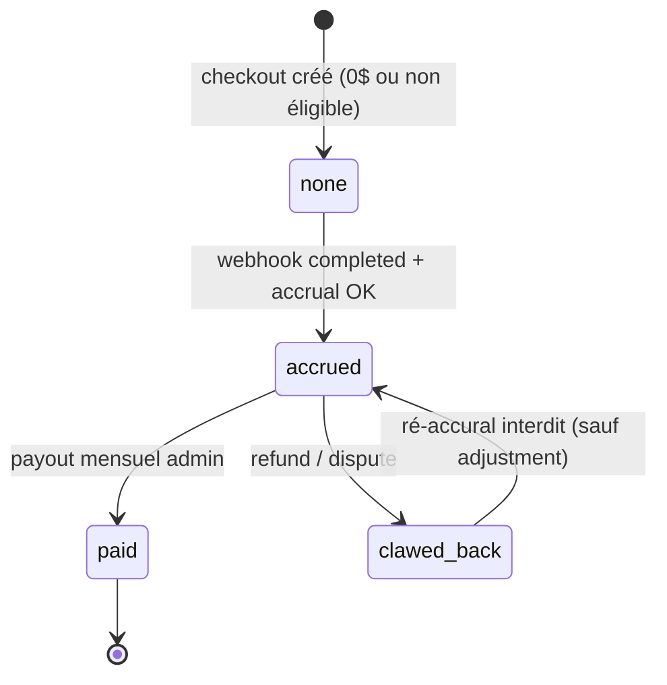
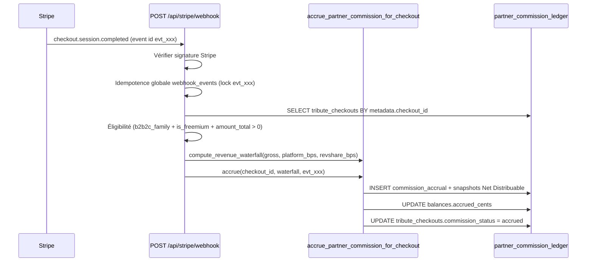

# Odyssey — RevShare partenaire (Partner Commission)

**Last updated: July 2026 · Version: Freemium V1 · Modèle Bulletproof**

> **V1 Pivot :** le ledger `partner_commission_*` est le **seul** solde partenaire. Wallets jetons = **DROP P8 ✅**. Canon : [`FREEMIUM_V1_PIVOT.md`](FREEMIUM_V1_PIVOT.md).

Document canonique pour la **commission partenaire 30 % du Net Distribuable** sur les paiements famille, le ledger, l’idempotence webhook Stripe, le clawback, et le **payout manuel mensuel**.

Complète [`B2B2C_COMMERCE.md`](B2B2C_COMMERCE.md) · schéma P6 : [`sql/odyssey_p6_freemium_revshare.sql`](sql/odyssey_p6_freemium_revshare.sql) · P6.1 : [`sql/odyssey_p6_1_bulletproof_waterfall.sql`](sql/odyssey_p6_1_bulletproof_waterfall.sql).

---

## Périmètre

| Contexte | RevShare |
|----------|----------|
| **B2B2C freemium** · famille paie via Stripe (forfait **et/ou** add-ons dont `musicLicense`) | **Oui** — 30 % du **Net Distribuable** |
| **B2C direct** (sans invitation partenaire) | **Non** |
| ~~B2B2C legacy jetons~~ | **Non** — modèle purged V1 |
| ~~B2B partner débit jetons~~ | **Non** — modèle purged V1 |

**Modèle Bulletproof (figé juillet 2026) :**

1. **Gross Volume** = `checkout.session.amount_total` (forfait + extensions, ex. Héritage 149 $ **ou** Souvenir 0 $ + `musicLicense` 39 $)
2. **Platform Fee** = 10 % du brut (`platform_fee_bps = 1000`)
3. **Net Distribuable** = Gross − Platform Fee
4. **Partner Commission** = 30 % du Net Distribuable (`commission_rate_bps = 3000`)

> **Important :** le **Net Distribuable** est une assiette **contractuelle Odyssey**. Ce n’est **pas** le net comptable Stripe.

**Taux default :** Platform Fee **10 %** · RevShare **30 % du Net Distribuable**. Override : `tenants.settings.platform_fee_bps` · `revshare_bps`.

---

## Modèle de données (P6)

### Solde partenaire (V1)

```text
partner_commission_balances + partner_commission_ledger  → SEUL ledger partenaire (V1)
partner_token_wallets + partner_token_ledger             → **DROP P8 ✅** (ne plus utiliser)
```

**Ne jamais** mélanger jetons et centimes. Après purge : seules les tables commission existent.

---

### `partner_commission_balances`

Solde agrégé par tenant — **1 ligne par partenaire**.

| Colonne | Type | Rôle |
|---------|------|------|
| `tenant_id` | uuid PK | FK → `tenants.id` |
| `accrued_cents` | integer ≥ 0 | Total commissions **confirmées** (somme ledger `commission_accrual` confirmées) |
| `paid_cents` | integer ≥ 0 | Total **versé** au partenaire (somme ledger `payout`) |
| `pending_cents` | integer ≥ 0 | Montant en attente (disputes, clearing, accruals `pending`) |
| `updated_at` | timestamptz | Dernière mutation |

**Solde payable (UI admin)** :

```text
payable_cents = accrued_cents - paid_cents - pending_cents_clawed
```

*(Affiner en implémentation : `pending_cents` peut inclure accruals non encore `confirmed`.)*

---

### `partner_commission_ledger`

Journal **append-only** — source de vérité audit.

| Colonne | Type | Rôle |
|---------|------|------|
| `id` | uuid PK | |
| `tenant_id` | uuid NOT NULL | Partenaire bénéficiaire |
| `tribute_checkout_id` | uuid | FK → `tribute_checkouts.id` |
| `project_id` | uuid | Hommage |
| `invitation_id` | uuid | Canal acquisition (nullable) |
| `reason` | text | Voir [§ Raisons ledger](#raisons-ledger) |
| `delta_cents` | integer | **+** accrual · **−** clawback / payout |
| `gross_payment_cents` | integer | **Gross Volume** (= `amount_total` Stripe) |
| `platform_fee_bps` | integer | **P6.1** — snapshot (ex. 1000) |
| `platform_fee_cents` | integer | **P6.1** — `floor(gross × platform_fee_bps / 10000)` |
| `net_distributable_cents` | integer | **P6.1** — assiette RevShare |
| `commission_rate_bps` | integer | Taux figé — 30 % du **Net Distribuable** (ex. 3000) |
| `commission_cents` | integer | Montant absolu commission (≥ 0) |
| `stripe_event_id` | text | **Idempotence webhook** |
| `stripe_payment_intent_id` | text | Réconciliation Stripe |
| `stripe_charge_id` | text | Remboursements / disputes |
| `status` | text | `pending` \| `confirmed` \| `reversed` |
| `actor_user_id` | uuid | Payout manuel admin (nullable) |
| `notes` | text | Référence virement, ticket ops |
| `metadata` | jsonb | Détail line items, forfait, extensions |
| `created_at` | timestamptz | |

#### Raisons ledger

| `reason` | `delta_cents` | Déclencheur |
|----------|---------------|-------------|
| `commission_accrual` | **+** | Webhook `checkout.session.completed` (forfait famille) |
| `commission_clawback` | **−** | `charge.refunded`, dispute lost, session expirée post-paiement |
| `guest_commission_accrual` | **+** | **(Cascade V-Final)** Webhook `guest_support` → `accrue_guest_micro_checkout` — 30 % du Net d'une contribution invité (uniquement si tenant `is_freemium`) |
| `guest_commission_clawback` | **−** | **(Cascade V-Final)** Remboursement invité post-paiement |
| `payout` | **−** | Versement manuel admin Odyssey |
| `adjustment` | ± | Correction ops (super admin, ticket tracé) |

> **⚠️ Cascade V-Final (21 juillet 2026) :** les micro-transactions invités
> (`guest_micro_checkouts`) **alimentent désormais** ce ledger via
> `guest_commission_accrual` (canon [`IMPLEMENTATION_CASCADE_VFINAL.md`](IMPLEMENTATION_CASCADE_VFINAL.md),
> migrations P10/P10.1). C'est l'inversion documentée dans
> [`VISION_PHASE_2.md`](VISION_PHASE_2.md) §2.2.

---

### Index & contraintes critiques

```sql
-- Une seule accrual par checkout
CREATE UNIQUE INDEX idx_commission_ledger_unique_accrual
  ON public.partner_commission_ledger (tribute_checkout_id)
  WHERE reason = 'commission_accrual';

-- Idempotence webhook Stripe
CREATE UNIQUE INDEX idx_commission_ledger_stripe_event
  ON public.partner_commission_ledger (stripe_event_id)
  WHERE stripe_event_id IS NOT NULL;

CREATE INDEX idx_commission_ledger_tenant_created
  ON public.partner_commission_ledger (tenant_id, created_at DESC);
```

---

### Enrichissements `tribute_checkouts` (P6 + P6.1)

| Colonne | Rôle |
|---------|------|
| `gross_payment_cents` | **P6.1** — Gross Volume confirmé webhook |
| `platform_fee_bps` | Snapshot Platform Fee (default 1000) |
| `platform_fee_cents` | Montant Platform Fee calculé |
| `net_distributable_cents` | **Net Distribuable** — assiette commission |
| `commission_cents` | Snapshot commission partenaire |
| `commission_rate_bps` | Taux RevShare appliqué (30 % du Net) |
| `commission_status` | `none` \| `accrued` \| `clawed_back` \| `paid` |

---

## Formule de calcul — Waterfall Bulletproof

```text
platform_fee_cents      = floor(gross_payment_cents × platform_fee_bps / 10000)
net_distributable_cents = gross_payment_cents − platform_fee_cents
commission_cents        = floor(net_distributable_cents × commission_rate_bps / 10000)
odyssey_margin_cents    = net_distributable_cents − commission_cents
```

| Exemple | Gross Volume | Platform Fee | **Net Distribuable** | Taux | Commission |
|---------|--------------|--------------|----------------------|------|------------|
| Upsell Héritage seul | 14 900¢ (149 $) | 1 490¢ | **13 410¢** | 30 % | **4 023¢** (40,23 $) |
| Upsell Éternité seul | 29 900¢ (299 $) | 2 990¢ | **26 910¢** | 30 % | **8 073¢** (80,73 $) |
| Héritage + Retouche IA (49 $) | 19 800¢ | 1 980¢ | **17 820¢** | 30 % | **5 346¢** (53,46 $) |

**Règles :**

- `gross_payment_cents` = **`session.amount_total`** Stripe (centimes, devise session)
- Inclut **forfait + extensions** dans la même Checkout Session
- **Pas** de commission sur checkout `family_total_cents = 0` (Souvenir gratuit)
- **Pas** de commission B2C direct (`checkout_mode = b2c` ou absence `tenant_id` partenaire éligible)
- Arrondi **floor** à **chaque étape** du waterfall (centimes entiers)
- **Fonds Commémoratif (Cascade V-Final)** : le **crédit** famille = `Net Distribuable × fund_conversion_bps` (défaut 100 %), **porté par la marge Odyssey** — il **ne réduit jamais** la commission cash d'Athos. En revanche, la contribution invité elle-même **génère** une commission Athos (`guest_commission_accrual`, 30 % du Net) si le tenant est `is_freemium`. Détail : [`IMPLEMENTATION_CASCADE_VFINAL.md`](IMPLEMENTATION_CASCADE_VFINAL.md).
  - *(Ancienne règle « Family Tribute Fund n'impacte jamais `commission_cents` » : abandonnée — le fonds et la commission puisent tous deux dans le Net Distribuable.)*

---

## Machine à états — commission

Deux niveaux : **checkout** (`tribute_checkouts.commission_status`) et **ligne ledger** (`partner_commission_ledger.status`).

### `tribute_checkouts.commission_status`



| Statut | Signification |
|--------|---------------|
| `none` | Pas de commission (gratuit, B2C, legacy jetons) |
| `accrued` | Commission confirmée en ledger |
| `clawed_back` | Clawback appliqué (total ou partiel) |
| `paid` | Incluse dans un payout mensuel |

### `partner_commission_ledger.status`

| Statut | Usage |
|--------|-------|
| `pending` | Accrual en attente clearing (dispute ou traitement async) — **Phase 2** |
| `confirmed` | Ligne définitive, compte dans `accrued_cents` |
| `reversed` | Ligne annulée par clawback ou correction |

**Phase 1 (MVP) :** accrual directement `confirmed` sur `checkout.session.completed`.

---

## Accrual — webhook `checkout.session.completed`

### Principe

> **La commission n’est jamais créée au POST `/api/checkout`.**  
> Uniquement après confirmation Stripe via webhook.

### Séquence



### Idempotence (3 niveaux)

| Niveau | Mécanisme |
|--------|-----------|
| **1. Webhook global** | Table `webhook_events` — lock `stripe_event_id` (pattern existant catalog sync) |
| **2. Ledger** | UNIQUE `stripe_event_id` sur `partner_commission_ledger` |
| **3. Métier** | UNIQUE `tribute_checkout_id` WHERE `reason = commission_accrual` |

**Comportement double webhook :**

1. Premier `evt_123` → accrual créée · HTTP 200
2. Second `evt_123` → no-op · HTTP 200 (Stripe ne retente pas indéfiniment)

**Comportement retry après accrual existante :**

- Si `commission_accrual` déjà présente pour `checkout_id` → retourner `{ ok: true, already_accrued: true }`

### Métadonnées Stripe requises (Checkout Session)

```json
{
  "checkout_id": "uuid",
  "project_id": "uuid",
  "tenant_id": "uuid",
  "checkout_mode": "b2b2c_family"
}
```

### RPC cible (P6.1)

```sql
-- Single source of truth — voir § Annexe
compute_revenue_waterfall(
  p_gross_payment_cents integer,
  p_platform_fee_bps integer DEFAULT 1000,
  p_commission_rate_bps integer DEFAULT 3000
) RETURNS jsonb

accrue_partner_commission_for_checkout(
  p_checkout_id uuid,
  p_gross_payment_cents integer,
  p_stripe_event_id text,
  p_stripe_payment_intent_id text DEFAULT NULL,
  p_platform_fee_bps integer DEFAULT NULL,
  p_commission_rate_bps integer DEFAULT NULL
) RETURNS jsonb
```

**Exécutable par :** `service_role` uniquement. La RPC accrue appelle `compute_revenue_waterfall` en interne.

---

## Clawback — remboursements & disputes

### Événements Stripe déclencheurs

| Événement | Action |
|-----------|--------|
| `charge.refunded` | Clawback **au prorata** du montant remboursé |
| `charge.dispute.created` | Passer accrual en `pending` ou clawback provisionnel (Phase 2) |
| `charge.dispute.closed` (lost) | Clawback définitif |
| `checkout.session.expired` | **Pas** de clawback si jamais payé · clawback si remboursement post-paiement uniquement |

### Formule clawback partiel (proportionnelle à l’accrual)

```text
clawback_cents = floor(commission_cents_snapshot × refunded_cents / gross_payment_cents_snapshot)
```

Exemple : S1 Héritage — commission 4 023¢ sur brut 14 900¢ — remboursement 50 % (7 450¢) → clawback `floor(4023 × 7450 / 14900)` = **2 011¢** (20,11 $).

> **Pourquoi proportionnel ?** Préserve la cohérence du waterfall Bulletproof sur remboursements partiels, indépendamment des arrondis `floor` intermédiaires.

### RPC cible

```sql
clawback_partner_commission(
  p_checkout_id uuid,
  p_clawback_cents integer,
  p_stripe_event_id text,
  p_reason text DEFAULT 'refund'
) RETURNS jsonb
```

**Effets :**

1. `INSERT partner_commission_ledger` (`reason = commission_clawback`, `delta_cents` négatif)
2. `UPDATE partner_commission_balances` (`accrued_cents -= clawback`)
3. `UPDATE tribute_checkouts.commission_status = clawed_back` (si clawback total)

**Idempotence :** UNIQUE `(stripe_event_id)` pour chaque clawback event.

---

## Payout manuel mensuel (Phase 1)

Odyssey **ne verse pas** automatiquement via Stripe Connect en Phase 1. Processus ops **mensuel** par administrateurs Odyssey.

### Calendrier

| Étape | Quand |
|-------|-------|
| Accrual continu | À chaque webhook `completed` |
| Cut-off mensuel | Dernier jour ouvré du mois · 23:59 UTC |
| Revue admin | J+1 à J+3 |
| Virement partenaire | J+5 (virement bancaire / chèque — hors scope technique) |
| Enregistrement payout | Admin enregistre le versement dans le ledger |

### RPC payout

```sql
record_partner_commission_payout(
  p_tenant_id uuid,
  p_amount_cents integer,
  p_actor_user_id uuid,
  p_notes text DEFAULT NULL
) RETURNS jsonb
```

**Effets :**

1. Vérifier `amount_cents <= payable_cents`
2. `INSERT partner_commission_ledger` (`reason = payout`, `delta_cents = -amount`)
3. `UPDATE partner_commission_balances.paid_cents += amount`
4. Marquer checkouts concernés `commission_status = paid` *(stratégie : FIFO par `completed_at` ou lien explicite dans `metadata`)*

### RBAC UI (cible)

| Rôle | Accès |
|------|-------|
| `partner_admin` | Lecture solde + historique ledger (son tenant) |
| `partner` (Directeur) | **Aucun** accès commissions (aligné P5.5 wallet) |
| Super Admin Odyssey | Payout + adjustments |

---

## Requêtes SQL de vérification (QA)

### Solde tenant

```sql
SELECT tenant_id, accrued_cents, paid_cents, pending_cents,
       accrued_cents - paid_cents AS payable_cents
FROM partner_commission_balances
WHERE tenant_id = :tenant_id;
```

### Dernières lignes ledger

```sql
SELECT created_at, reason, delta_cents, gross_payment_cents,
       net_distributable_cents, commission_cents, stripe_event_id, status
FROM partner_commission_ledger
WHERE tenant_id = :tenant_id
ORDER BY created_at DESC
LIMIT 20;
```

### Cohérence checkout ↔ commission

```sql
SELECT tc.id, tc.family_total_cents, tc.commission_cents, tc.commission_status,
       l.commission_cents AS ledger_commission, l.stripe_event_id
FROM tribute_checkouts tc
LEFT JOIN partner_commission_ledger l
  ON l.tribute_checkout_id = tc.id AND l.reason = 'commission_accrual'
WHERE tc.project_id = :project_id;
```

---

## Anti-patterns interdits

| ❌ Interdit | ✅ Correct |
|-----------|-----------|
| Accrue commission au POST checkout | Webhook `completed` uniquement |
| Utiliser `balance_transaction.net` Stripe comme assiette | **Net Distribuable** contractuel (= Gross − Platform Fee Odyssey) |
| Confondre Net Distribuable et Net Stripe | Deux concepts distincts — voir [`B2B2C_COMMERCE.md`](B2B2C_COMMERCE.md) |
| Commission sur le brut (modèle pré-Bulletproof) | 30 % du **Net Distribuable** uniquement |
| Double accrual même checkout | UNIQUE `tribute_checkout_id` + idempotence event |
| Commission sur B2C direct | Vérifier `checkout_mode` + `invitation_id` + `is_freemium` |
| Family Fund depuis poche partenaire | RPC séparée sur `odyssey_margin_cents` |
| Payout sans ligne ledger | Toujours `INSERT payout` + `actor_user_id` |
| Mélanger jetons et centimes | Ledgers séparés |

---

## État d'implémentation

| Composant | Statut |
|-----------|--------|
| Doc canonique Bulletproof (ce fichier) | ✅ juillet 2026 |
| Migration SQL P6 (base brut) | ✅ appliquée |
| Migration SQL **P6.1** waterfall | ✅ appliquée |
| `compute_revenue_waterfall()` | ✅ P6.1 |
| RPC accrue / clawback / payout | ✅ P6.1 (accrue/clawback) · payout ⏳ |
| Webhook handler `checkout.session.completed` | ✅ (b2b2c_family + b2c + **guest_support** V-Final) |
| RPC `accrue_guest_micro_checkout` (contribution invité) | ✅ P10.1 |
| Webhook handler `charge.refunded` | ⏳ |
| UI Salon commissions waterfall (`partner_admin`) | ⏳ |
| Payout admin Odyssey | ⏳ |
| QA checklist | ✅ [`QA_P6_COMMISSION_WATERFALL.md`](QA_P6_COMMISSION_WATERFALL.md) |
| Stripe Connect auto-payout | 🔮 Phase 2 |

---

## Documents liés

| Document | Rôle |
|----------|------|
| [`B2B2C_COMMERCE.md`](B2B2C_COMMERCE.md) | Saga v2, éligibilité RevShare |
| [`DELIVERABLES_AND_PACKAGES.md`](DELIVERABLES_AND_PACKAGES.md) | Grille forfaits, extensions commissionnables |
| [`sql/README.md`](sql/README.md) | Ordre migrations P6 → **P6.1** |
| [`QA_P6_COMMISSION_WATERFALL.md`](QA_P6_COMMISSION_WATERFALL.md) | 5 scénarios QA chiffrés |
| [`QA_P6_COMMISSION_WATERFALL.md`](QA_P6_COMMISSION_WATERFALL.md) | QA waterfall |
| [`_archive/QA_P5_5_PARTNER_SALON.md`](_archive/QA_P5_5_PARTNER_SALON.md) | **HIST** wallet jetons — ne plus exécuter |

---

## Annexe — Spec pseudo-SQL `compute_revenue_waterfall`

**Single source of truth** pour accrual, clawback, tests QA et preview admin. À implémenter en P6.1.

```sql
CREATE OR REPLACE FUNCTION public.compute_revenue_waterfall(
  p_gross_payment_cents integer,
  p_platform_fee_bps integer DEFAULT 1000,
  p_commission_rate_bps integer DEFAULT 3000
)
RETURNS jsonb
LANGUAGE plpgsql
IMMUTABLE
AS $$
DECLARE
  v_platform_fee_cents      integer;
  v_net_distributable_cents integer;
  v_commission_cents        integer;
  v_odyssey_margin_cents    integer;
BEGIN
  IF p_gross_payment_cents IS NULL OR p_gross_payment_cents < 0 THEN
    RAISE EXCEPTION 'invalid_gross_payment_cents';
  END IF;

  v_platform_fee_cents := floor(
    p_gross_payment_cents::numeric * COALESCE(p_platform_fee_bps, 1000) / 10000
  )::integer;

  v_net_distributable_cents := p_gross_payment_cents - v_platform_fee_cents;

  v_commission_cents := floor(
    v_net_distributable_cents::numeric * COALESCE(p_commission_rate_bps, 3000) / 10000
  )::integer;

  v_odyssey_margin_cents := v_net_distributable_cents - v_commission_cents;

  RETURN jsonb_build_object(
    'gross_payment_cents', p_gross_payment_cents,
    'platform_fee_bps', COALESCE(p_platform_fee_bps, 1000),
    'platform_fee_cents', v_platform_fee_cents,
    'net_distributable_cents', v_net_distributable_cents,
    'commission_rate_bps', COALESCE(p_commission_rate_bps, 3000),
    'commission_cents', v_commission_cents,
    'odyssey_margin_cents', v_odyssey_margin_cents
  );
END;
$$;
```

**Exemples attendus :**

```sql
-- Héritage seul
SELECT compute_revenue_waterfall(14900, 1000, 3000);
-- → net_distributable_cents: 13410, commission_cents: 4023, platform_fee_cents: 1490

-- Éternité seul
SELECT compute_revenue_waterfall(29900, 1000, 3000);
-- → net_distributable_cents: 26910, commission_cents: 8073

-- Héritage + Retouche IA
SELECT compute_revenue_waterfall(19800, 1000, 3000);
-- → net_distributable_cents: 17820, commission_cents: 5346
```

**Clawback helper (pseudo) :**

```sql
-- p_commission_cents et p_gross from accrual snapshot
clawback_cents := floor(
  p_commission_cents::numeric * p_refunded_cents / NULLIF(p_gross_payment_cents, 0)
)::integer;
```

---

## Quand modifier ce document

Toute évolution de : Platform Fee, taux RevShare, **Net Distribuable**, statuts commission, clawback, payout, ou schéma ledger → mettre à jour **ce fichier**, [`B2B2C_COMMERCE.md`](B2B2C_COMMERCE.md), [`QA_P6_COMMISSION_WATERFALL.md`](QA_P6_COMMISSION_WATERFALL.md), et [`sql/odyssey_p6_1_bulletproof_waterfall.sql`](sql/odyssey_p6_1_bulletproof_waterfall.sql).
