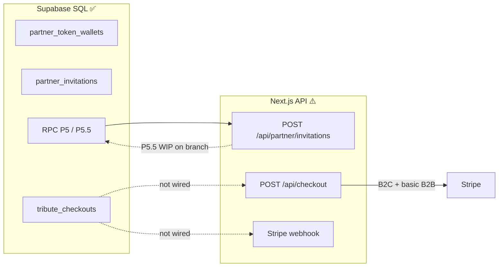

# Odyssey Frontend — Project Status

**Last revised: June 2026**

Living snapshot: **audit**, **recommended consolidations**, and **2-week action plan**.  
For stable onboarding and architecture deep dives, see [`TECHNICAL_ONBOARDING_ODYSSEY.md`](TECHNICAL_ONBOARDING_ODYSSEY.md) and the specialized docs listed in [`CONVENTIONS.md`](CONVENTIONS.md).

**Update this file** after major milestones (P5.5 in prod, checkout B2B2C, wallet UI, etc.) or at monthly team checkpoints.

---

## 1. Executive summary

| Dimension | Status | Notes |
|-----------|--------|-------|
| **Family Studio (B2C wizard)** | 🟢 Mature | 8 steps, autosave, media, music, Stripe checkout |
| **Partner Salon (UI)** | 🟢 Solid MVP | Co-branding, invitations, cyan skin, magic link |
| **B2B2C commerce (app layer)** | 🟡 Partial | SQL P0–P5.5 ready; checkout saga / webhook / real wallet lagging |
| **RBAC & tokens (P5.5)** | 🟡 In progress | SQL applied in Supabase; TS Phase 2 **not yet on `main`** |
| **Automated tests & CI** | 🔴 None | No test framework, no `.github/` workflows |
| **Documentation** | 🟢 Strong | Rich; some docs ahead/behind code (see §4) |
| **Security** | 🟡 Adequate with gaps | RLS solid; Salon UI role gate missing |

**Overall: 7/10** — demonstrable B2C and pilot Salon; **not production-ready for scaled B2B2C** until the transaction loop (checkout + webhook + wallet) matches the SQL schema.

---

## 2. Maturity by product surface

| Surface | Status | Detail |
|---------|--------|--------|
| Marketing / landing | 🟢 | Hero, process, pricing, FR/EN i18n |
| Studio login + 8-step wizard | 🟢 | Core product path |
| Media upload / Storage | 🟢 | Client upload + signed URLs + admin delete |
| Licensed music (Stingray) | 🟢 | Live MAPI + auto-mock without credentials |
| B2C checkout (Stripe) | 🟢 | Checkout Session |
| B2B token checkout | 🟡 | Works via legacy TS debit; not P5 saga RPC |
| Salon UI + invitations | 🟢 | `InvitationComposer`, branding, design system |
| Salon wallet / billing UI | 🔴 | Mock balance `42`; RBAC not in Context |
| B2B2C family delta pricing | 🔴 | `b2b2c_family` not in API |
| Invitation → family wizard | 🟢 | Magic link + `/tribute/welcome` |
| Video render pipeline | 🔴 | Documented only (Creatomate target) |
| Multi-vertical (e.g. pets) | 🟡 | `tenants.vertical` in DB; UI not forked |
| `app-backend/` FastAPI | ⚪ | `/health` stub; out of Next.js scope |

---

## 3. Database vs application layer

The **SQL schema is ahead of the Next.js commerce code**. This is the main structural risk.



| Capability | SQL | App code |
|------------|-----|----------|
| Token debit at invitation (P5.5) | ✅ | 🟡 Coded; not committed to `main` |
| `tribute_checkouts` saga | ✅ | ❌ |
| Checkout mode `b2b2c_family` | ✅ | ❌ |
| Webhook → order / checkout completed | Partial catalog sync | ❌ payment completion |
| Real Salon wallet balance | ✅ | ❌ mock `42` |
| RBAC Admin vs Director (UI) | ✅ RLS | ❌ not in `PartnerContext` |
| Video render after payment | — | ❌ |

Reference: [`B2B2C_COMMERCE.md`](B2B2C_COMMERCE.md) (commerce rules), [`sql/README.md`](sql/README.md) (migration order).

---

## 4. Recent work (Salon + P5.5)

### Shipped on `main` (June 2026)

- Studio / Salon route split, dual login, partner co-branding (P5.2–P5.4)
- Salon invitation UI: cyan skin (`salonTierCardSkin.ts`), structured features, logo fallback
- `POST /api/partner/invitations` (direct INSERT — superseded locally by P5.5 RPC)
- Docs: `DESIGN_SYSTEM.md`, `ROUTES_AND_AUTH.md`

### Done in Supabase + local WIP (not on `main` at last audit)

| Artifact | Role |
|----------|------|
| `docs/sql/odyssey_p5_5_partner_rbac_overdraft.sql` | Overdraft limit (default 20 tokens), ledger `actor_user_id` / `invitation_id`, RLS admin-only wallet/ledger, RPC `create_partner_invitation_with_debit`, `credit_partner_tokens_manual`, checkout anti double-debit |
| `src/lib/partner/partnerCapabilities.ts` | `partner` vs `partner_admin` capabilities |
| `src/lib/partner/createPartnerInvitationWithDebit.ts` | service_role wrapper for P5.5 RPC |
| `app/api/partner/invitations/route.ts` | Uses RPC + capability check; maps `overdraft_limit_exceeded` → HTTP 402 |

**Business rules (P5.5):**

- Debit at **invitation creation** (`granted_package` → 1/2/4 tokens)
- Limited overdraft: `balance >= -credit_limit_tokens` (default 20)
- `partner` (Director): can invite; never sees balance/ledger/billing
- `partner_admin` (Admin): balance, ledger, manual top-up (Stripe Payment Links + ops for MVP)
- Checkout `b2b2c_family` skips wallet debit if `invitation_debit` already in ledger

---

## 5. API routes (13 + auth callback)

| Route | Maturity | Notes |
|-------|----------|-------|
| `/api/projects/draft`, autosave, media, avatar | 🟢 Production | Ownership checks |
| `/api/music/search`, preview, stream | 🟢 Production | Stingray + mock fallback |
| `/api/checkout` | 🟡 Partial | B2C Stripe + B2B TS debit; no `tribute_checkouts`, no `b2b2c_family` |
| `/api/partner/invitations` | 🟡 | Depends on P5.5 RPC + committed TS |
| `/api/partner/tenants` | 🟢 | RPC P5.4 or join fallback |
| `/api/stripe/webhook` | 🟡 | Robust idempotence; **catalog sync only** — no `checkout.session.completed` → orders |
| `/auth/callback` | 🟢 | PKCE, sanitized `?next=` |

---

## 6. Technical debt (prioritized)

### 🔴 High — address before partner scale

1. **Three token debit paths** — RPC P5.5 invitation + RPC P5 checkout + `partnerCheckout.ts` (manual UPDATE, no overdraft, inconsistent ledger). Consolidate to RPC wrappers; deprecate TS debit.
2. **Checkout without saga** — `POST /api/checkout` does not use `tribute_checkouts` or `debit_partner_tokens_for_checkout()`.
3. **Incomplete Stripe webhook** — no post-payment project/checkout completion loop.
4. **Zero automated tests** — no Jest/Vitest/Playwright; no CI.

### 🟡 Medium

5. **Salon layout** — any authenticated user can open `/salon` UI; APIs enforce partner role, UI does not.
6. **Partner roles duplicated** — `partnerCapabilities.ts`, `resolvePartnerTenant.ts`, `fetchPartnerTenantsForUser.ts`, `resolvePartnerAccess.ts`.
7. **Capabilities not in Context** — `GET /api/partner/tenants` omits `role` / `capabilities`; UI will sprawl with hard-coded role checks.
8. **Uncommitted P5.5 + Phase 2** — production Vercel may not match local Supabase.

### 🟢 Low — quick cleanup

9. Dead code: `PartnerWalletSection.tsx` (unused), stub pages `auth/`, `watch/`, `backups/`.
10. Duplication: `resolveSiteOrigin()` ×3 vs `lib/siteUrl.ts`; local `PACKAGE_ID_MAP` vs wizard helpers.
11. Contact form without backend.
12. No `.env.example` (env vars documented only in onboarding §6).

---

## 7. Recommended consolidations (anti-spaghetti)

Do **before** heavy Salon billing UI — ~½–1 day, surgical refactors only.

| Step | Action | Why |
|------|--------|-----|
| 1 | `src/lib/partner/partnerRoles.ts` — single source for `partner` / `partner_admin` | Roles defined in 4 files today |
| 2 | `resolvePartnerMembership(supabase, userId, tenantId)` → `{ role, capabilities }` | Replaces stacked asserts in every API route |
| 3 | Enrich `GET /api/partner/tenants` + `PartnerContext` | UI reads `capabilities.canRecharge`, not raw roles |
| 4 | `src/lib/partner/partnerWallet.ts` — RPC wrappers only | One module for debit/credit; deprecate `partnerCheckout.ts` |
| 5 | Remove mock `42`, wire admin wallet when API exists | `PartnerSalonPageIntro` |
| 6 | `partnerRpcErrors.ts` — map RPC error → HTTP status | Keeps routes thin as wallet/ledger APIs grow |

**Do not merge** branding + wallet + invitations into mega-files. **Do not** move invitation debit back to TS UPDATE — keep P5.5 RPC as source of truth.

---

## 8. Security notes

**Strengths:** RLS P0–P5; wallet writes via `service_role`; `requireProjectOwner()` on project routes; webhook signature + lock token; public branding RPC without service role; auth callback sanitizes redirects.

**Gaps:**

| Risk | Severity | Detail |
|------|----------|--------|
| Salon without partner role gate | Medium | UI open to any auth user |
| Non-atomic B2B checkout debit (TS) | Medium | Race vs SQL `FOR UPDATE` RPC |
| Checkout without saga | High (business) | Stripe payment not tied to `tribute_checkouts` |
| P5.5 not deployed everywhere | Ops | API returns `503 schema_not_ready` if RPC missing |
| Music APIs public | Low | Acceptable with edge rate limits |

Server-only secrets: `SUPABASE_SERVICE_ROLE_KEY`, `STRIPE_SECRET_KEY`, `STRIPE_WEBHOOK_SECRET`, `STINGRAY_*`.

---

## 9. Documentation alignment

| Doc | Gap |
|-----|-----|
| `TECHNICAL_ONBOARDING` §10b | Stops at P5; missing P5.1–P5.5 |
| `B2B2C_COMMERCE` § implementation | Says Salon UI “done”; wallet/billing still mock |
| `sql/README.md` | P5.5 added in migration table (this revision) |
| This file | Point-in-time audit; onboarding stays timeless |

---

## 10. Two-week action plan

Effort estimates: **1 senior dev**, focused scope. Adjust if multiple contributors.

### Week 1 — Close P5.5 loop + RBAC foundation

| # | Task | Effort | Done when |
|---|------|--------|-----------|
| 1.1 | Commit + deploy P5.5 SQL reference + Phase 2 TS (`partnerCapabilities`, RPC invitation route) | 0.5 d | `main` deployed; invitation creates ledger row with `invitation_debit` |
| 1.2 | `partnerRoles.ts` + `resolvePartnerMembership()` | 0.5 d | Single import for roles; invitations API uses membership helper |
| 1.3 | Extend `GET /api/partner/tenants` with `role` + `capabilities` per tenant | 0.5 d | JSON validated; `PartnerContext` exposes active tenant capabilities |
| 1.4 | Salon layout: redirect non-partner users away from `/salon` | 0.25 d | Family account cannot load partner dashboard |
| 1.5 | Remove wallet mock from `PartnerSalonPageIntro` for Directors; hide block entirely | 0.25 d | Directors see no balance/recharge; Admins see placeholder or real API next week |
| 1.6 | Manual QA checklist: branded login, invite Souvenir/Héritage/Éternité, overdraft at limit (402), admin seed credit via SQL/RPC | 0.5 d | Documented pass/fail in PR or issue |

**Week 1 exit criteria:** Invitation debits wallet atomically in prod; RBAC capabilities available client-side; no mock balance shown to Directors.

### Week 2 — Wallet admin + commerce bridge start

| # | Task | Effort | Done when |
|---|------|--------|-----------|
| 2.1 | `GET /api/partner/wallet` (admin only, `canViewBalance`) | 0.5 d | Admin sees real balance for active tenant |
| 2.2 | `/salon/facturation` page shell (admin only) + link in header | 1 d | `canRecharge` / `canViewLedger` gated; Payment Link CTA (Option A+) |
| 2.3 | `partnerWallet.ts` + mark `partnerCheckout.ts` `@deprecated` | 0.5 d | New code paths use RPC only |
| 2.4 | Spike: `POST /api/checkout` inserts `tribute_checkouts` row + calls `debit_partner_tokens_for_checkout` for one mode | 1 d | One happy-path E2E documented (even if family Stripe still stub) |
| 2.5 | Smoke tests: invitation RPC parse, capabilities map, autosave PATCH (minimal Vitest or script) | 1 d | `npm test` or documented script in CI-ready form |
| 2.6 | Update `B2B2C_COMMERCE.md` + onboarding §10b pointer only | 0.25 d | Doc matches wallet + P5.5 state |

**Week 2 exit criteria:** Admin sees real wallet; facturation route exists; first step toward checkout saga; minimal regression guard.

### Explicitly deferred (after 2 weeks)

- Stripe Billing subscriptions (retainer)
- Automated Stripe top-up webhooks
- Full `b2b2c_family` family delta UI (`computeB2B2CFamilyPricing`)
- Video render pipeline
- Full test suite + GitHub Actions

---

## 11. SQL migration reference (P5.5)

Execute after P5.1–P5.4:

```
docs/sql/odyssey_p5_5_partner_rbac_overdraft.sql
```

See [`sql/README.md`](sql/README.md) for full P0–P5.5 order.

---

## 12. Related documents

| Topic | Document |
|-------|----------|
| Commerce rules & saga | [`B2B2C_COMMERCE.md`](B2B2C_COMMERCE.md) |
| Routes & Salon auth | [`ROUTES_AND_AUTH.md`](ROUTES_AND_AUTH.md) |
| Packages & tokens | [`DELIVERABLES_AND_PACKAGES.md`](DELIVERABLES_AND_PACKAGES.md) |
| Wizard | [`WIZARD_ARCHITECTURE.md`](WIZARD_ARCHITECTURE.md) |
| Onboarding hub | [`TECHNICAL_ONBOARDING_ODYSSEY.md`](TECHNICAL_ONBOARDING_ODYSSEY.md) |
| SQL order | [`sql/README.md`](sql/README.md) |
