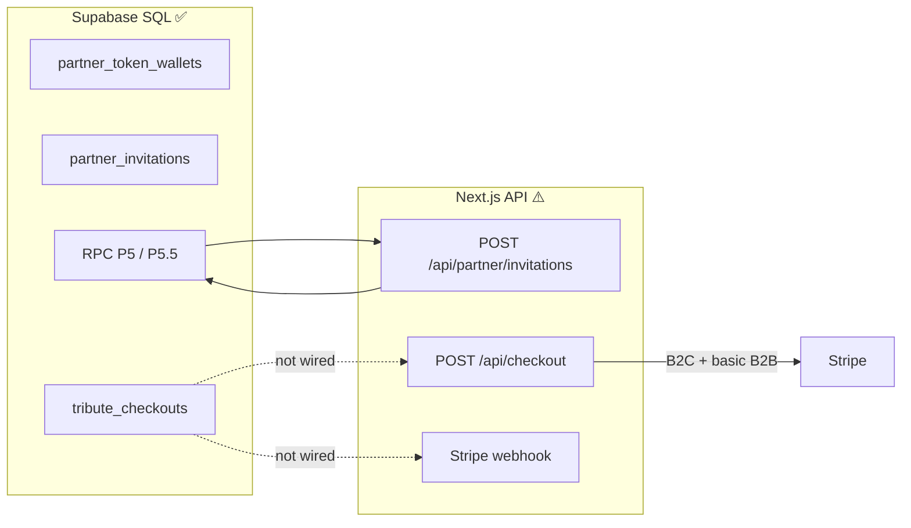

# Odyssey Frontend — Project Status

**Last revised: June 2026**

Living snapshot: **audit**, **recommended consolidations**, and **2-week action plan**.  
For stable onboarding and architecture deep dives, see [`TECHNICAL_ONBOARDING_ODYSSEY.md`](TECHNICAL_ONBOARDING_ODYSSEY.md) and the specialized docs listed in [`CONVENTIONS.md`](CONVENTIONS.md).

**Update this file** after major milestones (P5.5 in prod, checkout B2B2C, wallet UI, etc.) or at monthly team checkpoints.

---

## 1. Executive summary

| Dimension | Status | Notes |
|-----------|--------|-------|
| **Family Studio (B2C wizard)** | 🟢 Mature | 8 steps, autosave, media, music, Stripe checkout |
| **Partner Salon (UI)** | 🟢 Solid MVP | Co-branding, invitations, cyan skin, magic link |
| **B2B2C commerce (app layer)** | 🟡 Partial | SQL P0–P5.5 ready; wallet API + salon gate + facturation shell ✅ ; checkout saga / webhook / Stripe Payment Link ⏳ |
| **RBAC & tokens (P5.5)** | 🟢 Shipped | SQL + TS Phase 2 on `main`; Salon UI Phase 3 (`canViewBalance` gate) deployed |
| **Automated tests & CI** | 🔴 None | No test framework, no `.github/` workflows |
| **Documentation** | 🟢 Strong | Rich; some docs ahead/behind code (see §4) |
| **Security** | 🟡 Adequate with gaps | RLS solid; salon layout gate ✅; checkout saga still open |

**Overall: 7/10** — demonstrable B2C and pilot Salon; **not production-ready for scaled B2B2C** until the transaction loop (checkout + webhook + wallet) matches the SQL schema.

---

## 2. Maturity by product surface

| Surface | Status | Detail |
|---------|--------|--------|
| Marketing / landing | 🟢 | Hero, process, pricing, FR/EN i18n |
| Studio login + 8-step wizard | 🟢 | Core product path ; login = signature **Halo-Éclipse** |
| Connexion UX (Studio + Salon) | 🟢 | Halo-Éclipse, `OdysseyConnexionMark`, i18n toggle, CTA cyan — [`DESIGN_SYSTEM.md` §4.1](DESIGN_SYSTEM.md#41-signature-halo-éclipse-connexion-studio--salon) |
| Media upload / Storage | 🟢 | Client upload + signed URLs + **WebP thumbs** + session cache egress (`39460bd`) — voir §4.1 |
| Licensed music (Stingray) | 🟢 | Live MAPI + auto-mock without credentials |
| B2C checkout (Stripe) | 🟢 | Checkout Session |
| B2B token checkout | 🟡 | Works via legacy TS debit; not P5 saga RPC |
| Salon UI + invitations | 🟢 | `InvitationComposer`, branding, design system |
| Salon wallet / billing UI | 🟡 | Admin : solde réel + page `/salon/facturation` (shell ✅) ; Stripe Payment Link + ledger UI ⏳ |
| B2B2C family delta pricing | 🔴 | `b2b2c_family` not in API |
| Invitation → family wizard | 🟢 | Magic link + `/tribute/welcome` |
| Video render pipeline | 🔴 | Documented only (Creatomate target) |
| Multi-vertical (e.g. pets) | 🟡 | `tenants.vertical` in DB; UI not forked |
| `app-backend/` FastAPI | ⚪ | `/health` stub; out of Next.js scope |

---

## 3. Database vs application layer

The **SQL schema is ahead of the Next.js commerce code**. This is the main structural risk.



| Capability | SQL | App code |
|------------|-----|----------|
| Token debit at invitation (P5.5) | ✅ | ✅ RPC via `POST /api/partner/invitations` |
| `tribute_checkouts` saga | ✅ | ❌ |
| Checkout mode `b2b2c_family` | ✅ | ❌ |
| Webhook → order / checkout completed | Partial catalog sync | ❌ payment completion |
| Real Salon wallet balance | ✅ | ✅ `GET /api/partner/wallet` (admin, `canViewBalance`) ; UI `PartnerSalonPageIntro` |
| RBAC Admin vs Director (UI) | ✅ RLS | ✅ `PartnerContext.capabilities`; wallet block hidden for Director |
| Video render after payment | — | ❌ |

Reference: [`B2B2C_COMMERCE.md`](B2B2C_COMMERCE.md) (commerce rules), [`sql/README.md`](sql/README.md) (migration order).

---

## 4. Recent work (Salon + P5.5)

### Shipped on `main` (June 2026)

- Studio / Salon route split, dual login, partner co-branding (P5.2–P5.4)
- Salon invitation UI: cyan skin (`salonTierCardSkin.ts`), structured features, logo fallback
- Docs: `DESIGN_SYSTEM.md`, `ROUTES_AND_AUTH.md`
- **P5.5 Phase 1 (Salon gate + wallet API):** `resolveSalonLayoutAccess` in salon layout — non-partner → redirect `/studio` ; `GET /api/partner/wallet` ; solde réel dans `PartnerContext` (`f5a375a`)
- **Branding connexion persist:** slug `?partenaire=` via URL + cookie + localStorage ; hotfix RSC cookie (`3475421`, `7433457`)
- **Salon header:** déconnexion → connexion salon avec slug ; toggle FR/EN (`fb5dff7`, `c653542`)
- **Connexion — signature Halo-Éclipse (juin 2026):** vidéo `eclipse_login.mp4` (corona constante) + halos CSS d’état (violet / cyan / vert / magenta) ; `OdysseyConnexionMark` (Montserrat blanc lumineux) ; CTA cyan respirant ; séquence cinéma Actes I–V — voir [`DESIGN_SYSTEM.md` §4.1](DESIGN_SYSTEM.md#41-signature-halo-éclipse-connexion-studio--salon)
- **P5.5 Phase 2 (RBAC foundation):** `partnerRoles.ts`, `partnerCapabilities.ts`, `resolvePartnerMembership.ts`, `createPartnerInvitationWithDebit.ts`; `GET /api/partner/tenants` returns `role` + `capabilities`; `PartnerContext` exposes active tenant capabilities; invitation route uses P5.5 RPC + maps `overdraft_limit_exceeded` → HTTP 402
- **P5.5 Phase 3 (Salon UI):** `PartnerSalonPageIntro` gates wallet/recharge on `capabilities.canViewBalance` (Directors see no balance); removed dead `PartnerWalletSection.tsx`
- **Storage egress (wizard médias):** thumbs WebP + cache session + `cacheControl` long sur nouveaux uploads — §4.1 (`39460bd`)
- **Salon facturation (shell):** `/salon/facturation` admin-only (`canRecharge`) — solde, découvert, nav header, CTA recharge si `NEXT_PUBLIC_PARTNER_TOKEN_RECHARGE_URL` ; sinon message ops / crédit manuel RPC

### SQL reference (apply in Supabase before prod API)

| Artifact | Role |
|----------|------|
| `docs/sql/odyssey_p5_5_partner_rbac_overdraft.sql` | Overdraft limit (default 20 tokens), ledger `actor_user_id` / `invitation_id`, RLS admin-only wallet/ledger, RPC `create_partner_invitation_with_debit`, `credit_partner_tokens_manual`, checkout anti double-debit |

**Business rules (P5.5):**

- Debit at **invitation creation** (`granted_package` → 1/2/4 tokens)
- Limited overdraft: `balance >= -credit_limit_tokens` (default 20)
- `partner` (Director): can invite; never sees balance/ledger/billing
- `partner_admin` (Admin): balance, ledger, manual top-up (Stripe Payment Links + ops for MVP)
- Checkout `b2b2c_family` skips wallet debit if `invitation_debit` already in ledger

### 4.1 Supabase Storage egress (juin 2026)

**Contexte :** pic ~5,5 Go egress (plan Free 5 Go) lors de sessions dev/QA wizard (juin 3–4) — médias en pleine résolution re-téléchargés à chaque étape ; cached egress quasi nul.

**Shippé sur `main` (`39460bd`) — sans transformations Supabase (plan Free) :**

| Mesure | Détail |
|--------|--------|
| Thumbs WebP ~400px | Générés **côté client** à l’upload ; path `photo.jpg` → `photo-thumb.webp` (pas de colonne DB) |
| Grilles / queue | `previewUrl` = thumb ; modal directeur = `fullPreviewUrl` (original) |
| Cache session | `fetchProjectMediaCached` — 50 min ; invalidation après upload/delete |
| `cacheControl` | **1 an** sur **nouveaux** uploads uniquement (`storageEgressPolicy.ts`) |
| Legacy sans thumb | `StoragePreviewImage` : fallback automatique sur l’original (rien de cassé) |

**Fichiers clés :** `src/lib/media/storageEgressPolicy.ts`, `thumbnailPath.ts`, `generateImageThumbnail.ts`, `projectMediaCache.ts`, `hydrateMediaSignedUrls.server.ts`, `StoragePreviewImage.tsx`.

**Décision équipe — ne pas faire maintenant (revisité après surveillance dashboard) :**

| Option | Priorité | Verdict |
|--------|----------|---------|
| **Transformations Supabase** (`/render/image/…`) | — | **Ne pas faire** — hors scope Free / redondant avec nos thumbs |
| **Script backfill thumbs** (médias historiques) | 5/10 | Optionnel ; dry-run + 1 projet QA d’abord ; pic egress **pendant** le script |
| **Mettre à jour `cacheControl` objets existants** | 3/10 | **Non recommandé** — re-upload souvent requis → pic egress/ingress ; ROI faible vs nouveaux uploads déjà couverts |
| **Logos partenaire → `/public` ou CDN** | 2/10 | Gain faible ; plus tard si multi-partenaires |

**Prochaine étape egress :** surveiller **Usage → Storage egress** Supabase **2 semaines** post-deploy. Si courbe stable → rien de plus. Si pic sur **vieux** projets → backfill thumbs avant tout script `cacheControl` legacy.

---

## 5. API routes (13 + auth callback)

| Route | Maturity | Notes |
|-------|----------|-------|
| `/api/projects/draft`, autosave, media, avatar | 🟢 Production | Ownership checks |
| `/api/music/search`, preview, stream | 🟢 Production | Stingray + mock fallback |
| `/api/checkout` | 🟡 Partial | B2C Stripe + B2B TS debit; no `tribute_checkouts`, no `b2b2c_family` |
| `/api/partner/invitations` | 🟢 | P5.5 RPC debit + `canInvite`; `402` on overdraft limit |
| `/api/partner/tenants` | 🟢 | RPC P5.4 or join fallback; `role` + `capabilities` per tenant |
| `/api/partner/wallet` | 🟢 | Admin-only snapshot (`canViewBalance`); balance + credit limit |
| `/[lang]/salon/facturation` | 🟡 Shell | Admin UI ; Payment Link env optional ; ledger list ⏳ |
| `/api/stripe/webhook` | 🟡 | Robust idempotence; **catalog sync only** — no `checkout.session.completed` → orders |
| `/auth/callback` | 🟢 | PKCE, sanitized `?next=` |

---

## 6. Technical debt (prioritized)

### 🔴 High — address before partner scale

1. **Three token debit paths** — RPC P5.5 invitation + RPC P5 checkout + `partnerCheckout.ts` (manual UPDATE, no overdraft, inconsistent ledger). Consolidate to RPC wrappers; deprecate TS debit.
2. **Checkout without saga** — `POST /api/checkout` does not use `tribute_checkouts` or `debit_partner_tokens_for_checkout()`.
3. **Incomplete Stripe webhook** — no post-payment project/checkout completion loop.
4. **Zero automated tests** — no Jest/Vitest/Playwright; no CI.

### 🟡 Medium

5. ~~**Salon layout** — any authenticated user can open `/salon` UI~~ → **✅ gate** (`resolveSalonLayoutAccess`, redirect studio if no partner role).
6. **Partner roles duplicated** — `resolvePartnerTenant.ts` still used in places; prefer `resolvePartnerMembership()` everywhere.
7. **Supabase vs Vercel drift** — ensure P5.5 SQL applied in every env; API returns `503 schema_not_ready` if RPC missing.

### 🟢 Low — quick cleanup

8. Dead code: stub pages `auth/`, `watch/`.
9. Duplication: `resolveSiteOrigin()` ×3 vs `lib/siteUrl.ts`; local `PACKAGE_ID_MAP` vs wizard helpers.
10. Contact form without backend.
11. No `.env.example` (env vars documented only in onboarding §6).

---

## 7. Recommended consolidations (anti-spaghetti)

Steps 1–3 and Director wallet hide (Phase 3) are **done**. Remaining before heavy billing UI:

| Step | Action | Status |
|------|--------|--------|
| 1 | `partnerRoles.ts` — single source for roles | ✅ |
| 2 | `resolvePartnerMembership()` → `{ role, capabilities }` | ✅ |
| 3 | `GET /api/partner/tenants` + `PartnerContext` capabilities | ✅ |
| 4 | `partnerWallet.ts` — RPC wrappers only | ⏳ deprecate `partnerCheckout.ts` |
| 5 | Real admin balance via `GET /api/partner/wallet` (replace mock `42`) | ✅ `f5a375a` |
| 6 | `partnerRpcErrors.ts` — map RPC error → HTTP status | ⏳ partial (`partnerApiErrors.ts`) |

**Do not merge** branding + wallet + invitations into mega-files. **Do not** move invitation debit back to TS UPDATE — keep P5.5 RPC as source of truth.

---

## 8. Security notes

**Strengths:** RLS P0–P5; wallet writes via `service_role`; `requireProjectOwner()` on project routes; webhook signature + lock token; public branding RPC without service role; auth callback sanitizes redirects.

**Gaps:**

| Risk | Severity | Detail |
|------|----------|--------|
| ~~Salon without partner role gate~~ | — | ✅ Layout gate redirects non-partners to `/studio` |
| Non-atomic B2B checkout debit (TS) | Medium | Race vs SQL `FOR UPDATE` RPC |
| Checkout without saga | High (business) | Stripe payment not tied to `tribute_checkouts` |
| P5.5 not deployed everywhere | Ops | API returns `503 schema_not_ready` if RPC missing |
| Music APIs public | Low | Acceptable with edge rate limits |

Server-only secrets: `SUPABASE_SERVICE_ROLE_KEY`, `STRIPE_SECRET_KEY`, `STRIPE_WEBHOOK_SECRET`, `STINGRAY_*`.

---

## 9. Documentation alignment

| Doc | Gap |
|-----|-----|
| `TECHNICAL_ONBOARDING` §10b | Stops at P5; P5.1–P5.5 pointer only — defer full rewrite |
| `B2B2C_COMMERCE` § implementation | Synced June 2026 (RBAC UI ✅; wallet API ✅; facturation shell ✅; Payment Link ⏳) |
| `sql/README.md` | P5.5 in migration table |
| This file | Point-in-time audit; onboarding stays timeless |

---

## 10. Two-week action plan

Effort estimates: **1 senior dev**, focused scope. Adjust if multiple contributors.

### Week 1 — Close P5.5 loop + RBAC foundation

| # | Task | Effort | Status |
|---|------|--------|--------|
| 1.1 | Commit + deploy P5.5 SQL reference + Phase 2 TS | 0.5 d | ✅ `main` (`94e035d`); invitation RPC + ledger `invitation_debit` |
| 1.2 | `partnerRoles.ts` + `resolvePartnerMembership()` | 0.5 d | ✅ |
| 1.3 | Extend `GET /api/partner/tenants` with `role` + `capabilities` | 0.5 d | ✅ `PartnerContext` exposes capabilities |
| 1.4 | Salon layout: redirect non-partner users away from `/salon` | 0.25 d | ✅ `f5a375a` |
| 1.5 | Hide wallet block for Directors (`canViewBalance`) | 0.25 d | ✅ Phase 3 (`1acd375`) |
| 1.6 | Manual QA checklist: branded login, invite, overdraft (402), admin credit | 0.5 d | ⏳ doc prêt — [`QA_P5_5_PARTNER_SALON.md`](QA_P5_5_PARTNER_SALON.md) ; exécution en cours |

**Week 1 exit criteria:** ✅ invitation RPC on `main`; ✅ capabilities client-side; ✅ Directors see no balance; ✅ salon layout gate; ✅ wallet API. **Remaining:** full QA doc (1.6), Supabase P5.5 in all envs.

### Week 2 — Wallet admin + commerce bridge start

| # | Task | Effort | Done when |
|---|------|--------|-----------|
| 2.1 | `GET /api/partner/wallet` (admin only, `canViewBalance`) | 0.5 d | ✅ Admin sees real balance (`f5a375a`) |
| 2.2 | `/salon/facturation` page shell (admin only) + link in header | 1 d | ✅ Shell (`canRecharge` gate, wallet snapshot) ; ⏳ `NEXT_PUBLIC_PARTNER_TOKEN_RECHARGE_URL` + ledger UI |
| 2.3 | `partnerWallet.ts` + mark `partnerCheckout.ts` `@deprecated` | 0.5 d | New code paths use RPC only |
| 2.4 | Spike: `POST /api/checkout` inserts `tribute_checkouts` row + calls `debit_partner_tokens_for_checkout` for one mode | 1 d | One happy-path E2E documented (even if family Stripe still stub) |
| 2.5 | Smoke tests: invitation RPC parse, capabilities map, autosave PATCH (minimal Vitest or script) | 1 d | `npm test` or documented script in CI-ready form |
| 2.6 | Update `B2B2C_COMMERCE.md` + onboarding §10b pointer only | 0.25 d | Doc matches wallet + P5.5 state |

**Week 2 exit criteria:** ✅ Admin sees real wallet; ✅ facturation route (shell). **Remaining:** Stripe Payment Link env, ledger UI, checkout saga spike, minimal regression guard.

### Explicitly deferred (after 2 weeks)

- Stripe Billing subscriptions (retainer)
- Automated Stripe top-up webhooks
- Full `b2b2c_family` family delta UI (`computeB2B2CFamilyPricing`)
- Video render pipeline
- Full test suite + GitHub Actions
- **Storage legacy :** backfill thumbs historiques ; update `cacheControl` objets existants — voir §4.1 (surveiller dashboard 2 sem. d’abord)

---

## 11. SQL migration reference (P5.5)

Execute after P5.1–P5.4:

```
docs/sql/odyssey_p5_5_partner_rbac_overdraft.sql
```

See [`sql/README.md`](sql/README.md) for full P0–P5.5 order.

---

## 12. Guide lecture rapide (revue partenaire / Jon)

**Ordre recommandé ce soir :**

1. **[`PROJECT_STATUS.md`](PROJECT_STATUS.md)** (ce fichier) — où on en est, dette, plan 2 semaines.
2. **[`DESIGN_SYSTEM.md` §4.1](DESIGN_SYSTEM.md#41-signature-halo-éclipse-connexion-studio--salon)** — signature visuelle connexion **Halo-Éclipse**.
3. **[`ROUTES_AND_AUTH.md`](ROUTES_AND_AUTH.md)** — URLs studio/salon, branding `?partenaire=`, checklist QA connexion.
3b. **[`QA_P5_5_PARTNER_SALON.md`](QA_P5_5_PARTNER_SALON.md)** — checklist QA partenaire (invitation, 402, solde) — **avant checkout saga**.
4. **[`B2B2C_COMMERCE.md`](B2B2C_COMMERCE.md)** — modèle commerce 3 modes ; ce qui reste (saga checkout, `b2b2c_family`).
5. **[`TECHNICAL_ONBOARDING_ODYSSEY.md`](TECHNICAL_ONBOARDING_ODYSSEY.md)** — hub technique complet (§4 auth, §10 roadmap).

**Démo prod / QA :** tenant `partner-qa-demo` (Urgel Bourgie) · compte partenaire QA · base Vercel `odyssey-web-eta.vercel.app`.

**Ce qui est shippé récemment (juin 2026, `main`) :** RBAC P5.5 (Directeur vs Admin) · gate `/salon` · wallet API réel · invitations + débit RPC · co-branding connexion · signature Halo-Éclipse · toggle FR/EN · déconnexion salon.

**Ce qui n’est pas encore prod-ready :** saga `tribute_checkouts` · webhook paiement complet · Stripe Payment Link recharge · ledger UI · tests automatisés · dépréciation `partnerCheckout.ts`.

---

## 13. Related documents

| Topic | Document |
|-------|----------|
| Commerce rules & saga | [`B2B2C_COMMERCE.md`](B2B2C_COMMERCE.md) |
| Routes & Salon auth | [`ROUTES_AND_AUTH.md`](ROUTES_AND_AUTH.md) |
| Packages & tokens | [`DELIVERABLES_AND_PACKAGES.md`](DELIVERABLES_AND_PACKAGES.md) |
| Wizard | [`WIZARD_ARCHITECTURE.md`](WIZARD_ARCHITECTURE.md) |
| Onboarding hub | [`TECHNICAL_ONBOARDING_ODYSSEY.md`](TECHNICAL_ONBOARDING_ODYSSEY.md) |
| SQL order | [`sql/README.md`](sql/README.md) |
