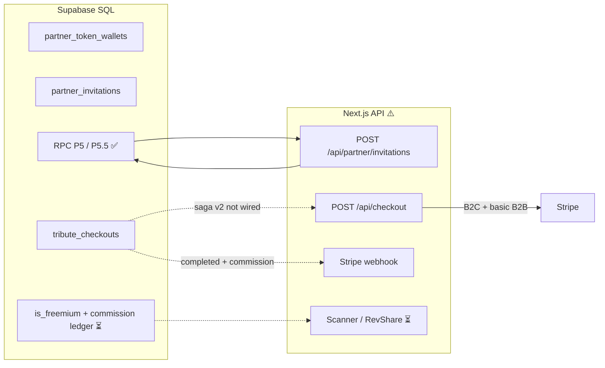

# Odyssey Frontend — Project Status

**Last revised: 9 juillet 2026 · Freemium V1 Phases 0–5 ✅ · next = Phase 6 QA + worker Creatomate réel / rails UX mobile**

Living snapshot: **où on en est**, dette acceptée, **prochain sprint**.  
Onboarding : [`TECHNICAL_ONBOARDING_V1.md`](TECHNICAL_ONBOARDING_V1.md) · Canon : [`FREEMIUM_V1_PIVOT.md`](FREEMIUM_V1_PIVOT.md) · Hiérarchie : [`CONVENTIONS.md`](CONVENTIONS.md).

**Update this file** after chaque phase Freemium / milestone UX (mobile, S5-J) ou checkpoint mensuel.

---

## 1. Executive summary

| Dimension | Status | Notes |
|-----------|--------|-------|
| **Family Studio (wizard)** | 🟢 Mature | 8 étapes, autosave, Stingray, **Livre Ouvert + Composition Magique**, Soft Cap UX, checkout Soft Cap |
| **Partner Salon** | 🟢 Prod | RBAC, invitations, gate R6 — QA P5.5 historique ✅ ; solde = **commissions** (jetons purgés P8) |
| **Freemium V1 commerce** | 🟢 Phases 0–5 | Canon + Soft Cap + entitlements + **gate export stub** + MP3/ToS + add-ons Quiet Luxury — [`FREEMIUM_V1_PIVOT.md`](FREEMIUM_V1_PIVOT.md) |
| **RevShare Bulletproof** | 🟡 Partiel | Spec + SQL P6/P8 ✅ · accrual webhook à durcir / UI Salon commissions ⏳ |
| **Export vidéo (Creatomate)** | 🟡 Stub | Gate `project_paid_entitlements` + P9 jobs ✅ · **worker réel** ⏳ |
| **UX mobile / ergonomie** | 🟡 Plan vivant | Canon [`MOBILE_WIZARD_STRATEGY.md`](MOBILE_WIZARD_STRATEGY.md) M0–M6 · **pas annulé** par Freemium |
| **Étape 5 polish** | 🟡 | PR-1/2/3 ✅ · **S5-J/K/L** ⏳ (audio, focus, copy) |
| **Scanner Compagnon** | 🟡 | Spec + stubs P6 ✅ · MVP app ⏳ (rail M2) |
| **Docs hub** | 🟢 | README + [`TECHNICAL_ONBOARDING_V1.md`](TECHNICAL_ONBOARDING_V1.md) · anciennes docs filles encore en drift |
| **Tests & CI** | 🔴 | Aucun framework / `.github/` workflows |
| **Security** | 🟡 | RLS + gate Salon ✅ · export never-trust via entitlements (stub) |

**Overall ~8.8/10 commerce wizard** — Soft Cap + gate export stub ; **prochain levier = Phase 6 QA + worker Creatomate**.  
**Rails parallèles (toujours au plan) :** mobile M0–M6 · S5-J/K/L · S7–S10 storyboard · Scanner · Phase 6 QA Soft Cap.

---

## 2. Maturity by product surface

| Surface | Status | Detail |
|---------|--------|--------|
| Marketing / landing | 🟢 | Hero, process, pricing, FR/EN i18n |
| Studio login + 8-step wizard | 🟢 | Core product path ; Étape 5 = **Livre Ouvert** (DnD + Composition Magique) |
| Connexion UX (Studio + Salon) | 🟢 | Halo-Éclipse, `OdysseyConnexionMark`, i18n toggle, CTA cyan — [`DESIGN_SYSTEM.md` §4.1](DESIGN_SYSTEM.md#41-signature-halo-éclipse-connexion-studio--salon) |
| **Étape 5 — Livre Ouvert** | 🟡 | Layout + DnD + magie ✅ · audio/focus/copy sensoriel ⏳ — [`STORYBOARD_STEP5_LIVRE_OUVERT.md`](STORYBOARD_STEP5_LIVRE_OUVERT.md) |
| Media upload / Storage | 🟢 | Client upload + signed URLs + **WebP thumbs** + session cache egress (`39460bd`) — voir §4.1 |
| Licensed music (Stingray) | 🟢 | Live MAPI + auto-mock without credentials |
| B2C checkout (Stripe) | 🟢 | Checkout Session |
| B2B token checkout | 🟡 | Works via legacy TS debit; not P5 saga RPC |
| Salon UI + invitations | 🟢 | `InvitationComposer`, branding, design system |
| Salon wallet / billing UI | 🟡 | Admin : solde réel + page `/salon/facturation` (shell ✅) ; Stripe Payment Link + ledger UI ⏳ |
| B2B2C family pricing v2 | 🟡 | Freemium 0 $ + upsell plein + RevShare — doc ✅ · types/storyboard V2 ✅ · checkout ⏳ |
| Scanner Compagnon (Killer App) | 🟡 | Spec [`SCANNER_COMPANION.md`](SCANNER_COMPANION.md) ✅ · tables stub P6 ✅ · MVP app ⏳ |
| Partner commission ledger (P6) | 🟡 | Spec Bulletproof [`PARTNER_REVSHARE.md`](PARTNER_REVSHARE.md) ✅ · P6 SQL ✅ (brut) · **P6.1** waterfall ⏳ · webhook/app ⏳ |
| Invitation → family wizard | 🟢 | Magic link + `/tribute/welcome` |
| Video render pipeline | 🔴 | Documented only (Creatomate target) |
| Multi-vertical (e.g. pets) | 🟡 | `tenants.vertical` in DB; UI not forked |
| `app-backend/` FastAPI | ⚪ | `/health` stub; out of Next.js scope |

---

## 3. Database vs application layer

> **Post-P8 :** `partner_token_*` **DROP**. Schéma courant = commissions + Soft Cap quota + entitlements — [`sql/README.md`](sql/README.md).  
> Les diagrammes historiques ci-dessous (wallets) sont **obsolètes** ; ne pas les traiter comme vérité.

The **SQL P6 + P8** is the Freemium V1 baseline. App Soft Cap checkout / entitlements = Phases 3–4 ✅. Remaining gaps = Creatomate (Phase 5) + UI commissions Salon.



| Capability | SQL | App code |
|------------|-----|----------|
| Token debit at invitation (P5.5, legacy tenants) | ✅ | ✅ RPC via `POST /api/partner/invitations` |
| QA P5.5 Salon (RBAC, wallet, gate R6) | ✅ | ✅ **Validée prod** |
| `tribute_checkouts` saga **v1** (jetons) | ✅ | ❌ spike **annulé** |
| `tribute_checkouts` saga **v2** (freemium + RevShare) | ✅ P6 schema | ❌ app + webhook en cours |
| `tenants.is_freemium` | ✅ P6 | 🟡 Partner UI ✅ ; checkout family saga ⏳ |
| `partner_commission_ledger` + accrual webhook | ✅ P6 schema | ❌ webhook |
| Checkout mode `b2b2c_family` | ✅ column | ❌ |
| Webhook → checkout completed + commission | — | ❌ (catalog sync only) |
| Scanner Compagnon sessions | ✅ P6 stub | ❌ app |
| Real Salon wallet balance | ✅ | ✅ |
| RBAC Admin vs Director (UI) | ✅ RLS | ✅ |
| Video render after payment | — | ❌ |

Reference: [`B2B2C_COMMERCE.md`](B2B2C_COMMERCE.md) v2 · [`PARTNER_REVSHARE.md`](PARTNER_REVSHARE.md) · [`SCANNER_COMPANION.md`](SCANNER_COMPANION.md) · [`sql/README.md`](sql/README.md).

### Pivot stratégique — Saga Checkout (juin 2026)

| Décision | Détail |
|----------|--------|
| **Spike `tribute_checkouts` v1** | **Annulé** — modèle jetons + delta famille remplacé pour les gros clients |
| **B2B2C v2 (Scrypta Killer)** | **Freemium** Souvenir 0 $ · **Bulletproof** RevShare (10 % platform + 30 % **Net Distribuable**) · **Scanner Compagnon IA** |
| **Legacy jetons** | ~~P4/P5.5~~ → **PURGED P8** |
| **Exécution en cours** | P6 SQL ✅ · Phase 0 freemium UI ✅ · Storyboard S1–S4/S6/S6bis ✅ · **S5 partiel PR-1/2/3** ✅ · S5-J/K/L + S7–S10 à suivre |

Doc canon v2 : [`B2B2C_COMMERCE.md`](B2B2C_COMMERCE.md) · [`DELIVERABLES_AND_PACKAGES.md`](DELIVERABLES_AND_PACKAGES.md).

---

## 4. Recent work (Salon + P5.5)

### Shipped on `main` (June–July 2026)

- Studio / Salon route split, dual login, partner co-branding (P5.2–P5.4)
- Salon invitation UI: cyan skin (`salonTierCardSkin.ts`), structured features, logo fallback
- Docs: `DESIGN_SYSTEM.md`, `ROUTES_AND_AUTH.md`
- **P5.5 Phase 1 (Salon gate + wallet API):** `resolveSalonLayoutAccess` in salon layout — non-partner → redirect `/studio` ; `GET /api/partner/wallet` ; solde réel dans `PartnerContext` (`f5a375a`)
- **Branding connexion persist:** slug `?partenaire=` via URL + cookie + localStorage ; hotfix RSC cookie (`3475421`, `7433457`)
- **Salon header:** déconnexion → connexion salon avec slug ; toggle FR/EN (`fb5dff7`, `c653542`)
- **Connexion — signature Halo-Éclipse (juin 2026):** vidéo `eclipse_login.mp4` (corona constante) + halos CSS d’état (violet / cyan / vert / magenta) ; `OdysseyConnexionMark` (Montserrat blanc lumineux) ; CTA cyan respirant ; séquence cinéma Actes I–V — voir [`DESIGN_SYSTEM.md` §4.1](DESIGN_SYSTEM.md#41-signature-halo-éclipse-connexion-studio--salon)
- **P5.5 Phase 2 (RBAC foundation):** `partnerRoles.ts`, `partnerCapabilities.ts`, `resolvePartnerMembership.ts`, `createPartnerInvitationWithDebit.ts`; `GET /api/partner/tenants` returns `role` + `capabilities`; `PartnerContext` exposes active tenant capabilities; invitation route uses P5.5 RPC + maps `overdraft_limit_exceeded` → HTTP 402
- **P5.5 Phase 3 (Salon UI):** `PartnerSalonPageIntro` gates wallet/recharge on `capabilities.canViewBalance` (Directors see no balance); removed dead `PartnerWalletSection.tsx`
- **Storage egress (wizard médias):** thumbs WebP + cache session + `cacheControl` long sur nouveaux uploads — §4.1 (`39460bd`)
- **QA P5.5 — terminée prod ✅** : RBAC §2 · solde §3 · gate R6 · checklist [`QA_P5_5_PARTNER_SALON.md`](QA_P5_5_PARTNER_SALON.md)
- **Documentation B2B2C v2** : `B2B2C_COMMERCE.md`, `DELIVERABLES_AND_PACKAGES.md`, `PARTNER_REVSHARE.md` (Bulletproof), `QA_P6_COMMISSION_WATERFALL.md`, `SCANNER_COMPANION.md`
- **P6 SQL appliqué (juillet 2026)** : `is_freemium`, `partner_commission_*`, `scan_sessions`, stubs Phase 2, package `legendary`
- **T2 manifeste TS démarré** : `pricingConfig.ts`, `wizardDeliverables.ts`, `wizardDeliverables.utils.ts` — consommateurs TS/UI restants à migrer
- **Phase 0 B2B2C livrée** : propagation `is_freemium` → invitations ; Souvenir = **Gratuit / 0 $** (plus de « 0 jeton »)
- **Freemium Phases 1–4 ✅** : manifeste Soft Cap · P8 · checkout entitlements · Soft Cap UX
- **Storyboard refactor S1/S2 livrés** : `wizardState.ts` + `/api/projects/[id]/autosave` persistent désormais `storyboard` V2 avec bridge runtime legacy pour préserver l’UI actuelle
- **Storyboard refactor S3 livré** : quota `maxMediaItems` package-aware à l'étape Upload (`TributeWizard.tsx` + `MediaDropzoneAdapter.tsx`, avertissement UI) **et** garde-fou serveur infalsifiable — trigger Postgres `enforce_media_asset_quota()` (`docs/sql/odyssey_p7_media_quota_guard.sql`), car l'upload écrit directement du navigateur vers Supabase sans route API intermédiaire
- **Storyboard refactor S4 livré** : moteur de pacing temporel (`storyboardPacing.ts`) — marges intro/outro 10s, coût vidéo fixe 10s, `mood` préparé pour un pacing dynamique futur, estimation de durée totale pour le résumé narratif
- **Inversion Étape 4 ↔ Étape 5** : le Wizard affiche désormais le choix musical **avant** le montage (la capacité média d'un chapitre dépend de la durée de la chanson) — décision documentée dans [`STORYBOARD_REFACTOR.md`](STORYBOARD_REFACTOR.md)
- **Storyboard refactor S6 livré** : nouvelle Étape 4 « Chapitres musicaux » (`StoryboardChaptersStep.tsx`) — chapitres dynamiques pré-générés selon le volume média, bandeau éducatif, détection + acquittement obligatoire des doublons de chanson, validation structurelle bloquante (`[minSongsRequired, maxSongs]`)
- **Storyboard refactor S6bis livré — refonte de l'en-tête global du Wizard** : sélecteur de forfait **« Le Dossier »** (off-canvas, `PackageDossierPanel.tsx`) remplace le dropdown et les cartes `WizardBasePackagePicker` (supprimé) ; stepper 8 cercles remplacé par `WizardPhaseProgress` (3 phases Déposer/Composer/Recevoir) ; ancrage produit `DEFAULT_B2C_BASE_PACKAGE = "heritage"` (Éternité, 299 $) ; badge « Économisez 67 $ » ; lexique « photos » → « médias »
- **Opération Clean Slate (juillet 2026)** : neutralisation de l'Étape 5 (`SoundSignatureStep` supprimé → placeholder temporaire) ; extraction `useWizardStoryboard` ; triage `montage/*` ; résolution EMFILE dev (`ulimit -n 65536`)
- **S5 PR-1 — Livre Ouvert squelette (`fdeb7da`)** : layout 280px\|1fr, `StoryboardFilmMap`, banque persistante, chapitres empilés, grilles read-only
- **S5 PR-2 — Interactivité (`cc5f668`)** : DnD `dnd-kit`, multi-select, auto-fill / vider / gérer ; correctifs QA drop target, sélection fantôme, FilmMap
- **S5 PR-3 — Composition Magique (`41235e8`)** : onboarding gate, timeline batch chapitre, overlay scrim + capsule, perf P0/P1
- **Documentation Étape 5** : [`STORYBOARD_STEP5_LIVRE_OUVERT.md`](STORYBOARD_STEP5_LIVRE_OUVERT.md), [`QA_S5_MONTAGE_STEP.md`](QA_S5_MONTAGE_STEP.md), mise à jour piliers storyboard

### Pourquoi ces décisions (résumé produit/technique)

| Décision | Pourquoi |
|----------|----------|
| **Le Dossier** (off-canvas vs dropdown) | Réduire la charge cognitive (stepper 8 cercles → 3 phases) et éviter l'effet « e-commerce cheap » ; le forfait doit être consultable à tout moment sans polluer le corps des étapes |
| **Ancrage Éternité par défaut** (`DEFAULT_B2C_BASE_PACKAGE = "heritage"`) | Ancrage psychologique sur le vrai milieu de gamme B2C (149/299/499 $) + meilleur rapport qualité-prix ; le client ne clique plus de carte à l'Étape 1 depuis la suppression du picker |
| **Inversion Étape 4 ↔ 5** | La capacité média d'un chapitre dépend de `durationSec` — le choix musical doit précéder l'assignation média |
| **Clean Slate Étape 5** | `SoundSignatureStep` affichait une UI fonctionnelle mais dont les saisies étaient **silencieusement ignorées** par `coerceWizardState()` — bug UX trompeur, pas une simple dette technique |
| **`useWizardStoryboard`** | Isoler le domaine chapitres de `TributeWizard` (god component ~1780 lignes) avant d'intégrer `dnd-kit` ; le hook reste pur (pas d'autosave) |
| **EMFILE / `ulimit`** | Next.js Watchpack échouait silencieusement → routes 404 en dev ; fix : relancer `npm run dev` avec `ulimit -n 65536` dans le terminal actif |

### SQL reference (apply in Supabase before prod API)

| Artifact | Role |
|----------|------|
| `docs/sql/odyssey_p5_5_partner_rbac_overdraft.sql` | Overdraft limit (default 20 tokens), ledger `actor_user_id` / `invitation_id`, RLS admin-only wallet/ledger, RPC `create_partner_invitation_with_debit`, `credit_partner_tokens_manual`, checkout anti double-debit |

**Business rules (P5.5):**

- Debit at **invitation creation** (`granted_package` → 1/2/4 tokens)
- Limited overdraft: `balance >= -credit_limit_tokens` (default 20)
- `partner` (Director): can invite; never sees balance/ledger/billing
- `partner_admin` (Admin): balance, ledger, manual top-up (Stripe Payment Links + ops for MVP)
- Checkout `b2b2c_family` skips wallet debit if `invitation_debit` already in ledger

### 4.1 Supabase Storage egress (juin 2026)

**Contexte :** pic ~5,5 Go egress (plan Free 5 Go) lors de sessions dev/QA wizard (juin 3–4) — médias en pleine résolution re-téléchargés à chaque étape ; cached egress quasi nul.

**Shippé sur `main` (`39460bd`) — sans transformations Supabase (plan Free) :**

| Mesure | Détail |
|--------|--------|
| Thumbs WebP ~400px | Générés **côté client** à l’upload ; path `photo.jpg` → `photo-thumb.webp` (pas de colonne DB) |
| Grilles / queue | `previewUrl` = thumb ; modal directeur = `fullPreviewUrl` (original) |
| Cache session | `fetchProjectMediaCached` — 50 min ; invalidation après upload/delete |
| `cacheControl` | **1 an** sur **nouveaux** uploads uniquement (`storageEgressPolicy.ts`) |
| Legacy sans thumb | `StoragePreviewImage` : fallback automatique sur l’original (rien de cassé) |

**Fichiers clés :** `src/lib/media/storageEgressPolicy.ts`, `thumbnailPath.ts`, `generateImageThumbnail.ts`, `projectMediaCache.ts`, `hydrateMediaSignedUrls.server.ts`, `StoragePreviewImage.tsx`.

**Décision équipe — ne pas faire maintenant (revisité après surveillance dashboard) :**

| Option | Priorité | Verdict |
|--------|----------|---------|
| **Transformations Supabase** (`/render/image/…`) | — | **Ne pas faire** — hors scope Free / redondant avec nos thumbs |
| **Script backfill thumbs** (médias historiques) | 5/10 | Optionnel ; dry-run + 1 projet QA d’abord ; pic egress **pendant** le script |
| **Mettre à jour `cacheControl` objets existants** | 3/10 | **Non recommandé** — re-upload souvent requis → pic egress/ingress ; ROI faible vs nouveaux uploads déjà couverts |
| **Logos partenaire → `/public` ou CDN** | 2/10 | Gain faible ; plus tard si multi-partenaires |

**Prochaine étape egress :** surveiller **Usage → Storage egress** Supabase **2 semaines** post-deploy. Si courbe stable → rien de plus. Si pic sur **vieux** projets → backfill thumbs avant tout script `cacheControl` legacy.

---

## 5. API routes (13 + auth callback)

| Route | Maturity | Notes |
|-------|----------|-------|
| `/api/projects/draft`, autosave, media, avatar | 🟢 Production | Ownership checks |
| `/api/music/search`, preview, stream | 🟢 Production | Stingray + mock fallback |
| `/api/checkout` | 🟡 Partial | B2C Stripe + B2B TS debit; no `tribute_checkouts`, no `b2b2c_family` |
| `/api/partner/invitations` | 🟢 | P5.5 RPC debit + `canInvite`; `402` on overdraft limit |
| `/api/partner/tenants` | 🟢 | RPC P5.4 or join fallback; `role` + `capabilities` per tenant |
| `/api/partner/wallet` | 🟢 | Admin-only snapshot (`canViewBalance`); balance + credit limit |
| `/[lang]/salon/facturation` | 🟡 Shell | Admin UI ; Payment Link env optional ; ledger list ⏳ |
| `/api/stripe/webhook` | 🟡 | Robust idempotence; **catalog sync only** — no `checkout.session.completed` → orders |
| `/auth/callback` | 🟢 | PKCE, sanitized `?next=` |

---

## 6. Technical debt (prioritized)

### 🔴 High — next sprint

1. **Bugs UX résiduels Étape 5** — liste QA utilisateur post-PR-3 ; checklist [`QA_S5_MONTAGE_STEP.md`](QA_S5_MONTAGE_STEP.md)
2. **S5-J/K/L** — dimensions sensorielles (audio chapitre, focus organique, copy narrative)
3. **Saga checkout v2** — freemium 0 $ path · Stripe upsell · `tribute_checkouts`
4. **Stripe webhook** — `checkout.session.completed` → completed + waterfall accrual Bulletproof (idempotent)
5. **Scanner Compagnon Phase A** — QR session + mobile upload + realtime sync
6. **Zero automated tests** — no Jest/Vitest/Playwright; no CI (priorité : `storyboardMagicTimeline.ts`)

### 🟡 Medium — Wizard (post-S5 partiel)

- **`TributeWizard.tsx` encore dense** (~1800 lignes) — `useWizardStoryboard` extrait ✅ ; découpage identité/forfait possible
- **Pont legacy `actTracks`** — Preview/Checkout (`S8`/`S9`/`S10`) ; ne pas supprimer avant migration preview
- **`montageHelpers.ts` / `montageActTheme.ts`** — encore utilisés par `PreviewStep` et `teaserHelpers` ; migration lors de `S8`
- **Fichiers orphelins Étape 5** — `MontageTimeline.tsx`, `MontageChapterTabs.tsx`, ancien tiroir banque — cleanup S10
- **Tests unitaires magic timeline** — domaine pur, 0 couverture

### 🔴 High — legacy (before partner scale on jetons path)

6. **Three token debit paths** — consolidate legacy tenants to RPC; deprecate `partnerCheckout.ts` TS debit.
7. **Incomplete Stripe webhook** — extends to item 3 above for v2.

### 🟡 Medium

5. ~~**Salon layout** — any authenticated user can open `/salon` UI~~ → **✅ gate** (`resolveSalonLayoutAccess`, redirect studio if no partner role).
6. **Partner roles duplicated** — `resolvePartnerTenant.ts` still used in places; prefer `resolvePartnerMembership()` everywhere.
7. **Supabase vs Vercel drift** — ensure P5.5 SQL applied in every env; API returns `503 schema_not_ready` if RPC missing.

### 🟢 Low — quick cleanup

8. Dead code: stub pages `auth/`, `watch/`.
9. Duplication: `resolveSiteOrigin()` ×3 vs `lib/siteUrl.ts`; local `PACKAGE_ID_MAP` vs wizard helpers.
10. Contact form without backend.
11. No `.env.example` (env vars documented only in onboarding §6).

---

## 7. Recommended consolidations (anti-spaghetti)

Steps 1–3 and Director wallet hide (Phase 3) are **done**. Remaining before heavy billing UI:

| Step | Action | Status |
|------|--------|--------|
| 1 | `partnerRoles.ts` — single source for roles | ✅ |
| 2 | `resolvePartnerMembership()` → `{ role, capabilities }` | ✅ |
| 3 | `GET /api/partner/tenants` + `PartnerContext` capabilities | ✅ |
| 4 | `partnerWallet.ts` — RPC wrappers only | ⏳ deprecate `partnerCheckout.ts` |
| 5 | Real admin balance via `GET /api/partner/wallet` (replace mock `42`) | ✅ `f5a375a` |
| 6 | `partnerRpcErrors.ts` — map RPC error → HTTP status | ⏳ partial (`partnerApiErrors.ts`) |

**Do not merge** branding + wallet + invitations into mega-files. **Do not** move invitation debit back to TS UPDATE — keep P5.5 RPC as source of truth.

---

## 8. Security notes

**Strengths:** RLS P0–P5; wallet writes via `service_role`; `requireProjectOwner()` on project routes; webhook signature + lock token; public branding RPC without service role; auth callback sanitizes redirects.

**Gaps:**

| Risk | Severity | Detail |
|------|----------|--------|
| ~~Salon without partner role gate~~ | — | ✅ Layout gate redirects non-partners to `/studio` |
| Non-atomic B2B checkout debit (TS) | Medium | Race vs SQL `FOR UPDATE` RPC |
| Checkout without saga | High (business) | Stripe payment not tied to `tribute_checkouts` |
| P5.5 not deployed everywhere | Ops | API returns `503 schema_not_ready` if RPC missing |
| Music APIs public | Low | Acceptable with edge rate limits |

Server-only secrets: `SUPABASE_SERVICE_ROLE_KEY`, `STRIPE_SECRET_KEY`, `STRIPE_WEBHOOK_SECRET`, `STINGRAY_*`.

---

## 9. Documentation alignment

| Doc | Gap |
|-----|-----|
| `B2B2C_COMMERCE.md` | ✅ **v2 Bulletproof** (waterfall 10 % + 30 % Net Distribuable, saga v2) |
| `SANCTUARY_STRATEGY.md` | ✅ Positionnement Sanctuaire · catalogue monétisation V1 |
| `FREEMIUM_V1_PIVOT.md` | ✅ Canon · Phases **0–5 ✅** · Phase 6 remaining · onboarding V1 |
| `TECHNICAL_ONBOARDING_V1.md` | ✅ Hub Freemium V1 (remplace hub pré-purge archivé) |
| `NARRATIVE_SOFT_CAP.md` / `MUSIC_RIGHTS_ATTESTATION.md` | ✅ Spec Soft Cap + attestation MP3 |
| `MOBILE_WIZARD_STRATEGY.md` | ✅ Plan M0–M6 vivant (rail UX parallèle) |
| `DELIVERABLES_AND_PACKAGES.md` | ✅ Grille V1 · matrice phases à jour |
| `PARTNER_REVSHARE.md` | ✅ Bulletproof · jetons DEPRECATED |
| `B2B2C_COMMERCE.md` | 🟡 Drift jetons / états ⏳ — croiser FREEMIUM |
| `WIZARD_ARCHITECTURE.md` / `STINGRAY` / `sql/README` | 🟡 Drift possible — croiser FREEMIUM + onboarding V1 |
| `STORYBOARD_STEP5_LIVRE_OUVERT.md` | ✅ Canon Étape 5 |
| `QA_P5_5` (archive) | 📦 [`_archive/QA_P5_5_PARTNER_SALON.md`](_archive/QA_P5_5_PARTNER_SALON.md) — ne plus exécuter |

---

## 10. Next sprint — Freemium V1 Phase 6 + rails UX

**Canon :** [`FREEMIUM_V1_PIVOT.md`](FREEMIUM_V1_PIVOT.md) · Onboarding : [`TECHNICAL_ONBOARDING_V1.md`](TECHNICAL_ONBOARDING_V1.md).

**Jetons partenaire = purgés (P8).** Ne plus planifier débit wallet / wholesale 40 $ / coexistence `is_freemium=false`.

**Action ops :** appliquer [`sql/odyssey_p9_project_export_jobs.sql`](sql/odyssey_p9_project_export_jobs.sql) sur Supabase si pas encore fait.

### Freemium V1 — snapshot exécution (juillet 2026)

| Phase | Contenu | Statut |
|-------|---------|--------|
| 0 | Docs filles + canon | ✅ |
| 1 | Manifeste TS (`musicLicense`, granted/intended, Héritage 4K) | ✅ |
| 2 | SQL P8 (purge jetons, Soft Cap quota, entitlements) — **appliqué Supabase** | ✅ |
| 3 | Checkout Soft Cap + webhook `project_paid_entitlements` + `freemium_free` | ✅ |
| 4 | Soft Cap UX (filet 50, post-Composition Magique, musique dual, stay 0 $) | ✅ |
| **5** | Gate export stub + MP3/ToS + add-ons Quiet Luxury · SQL P9 | ✅ **FAIT** |
| **6** | QA Soft Cap dual · pas de double facturation · RevShare sur 39 $ · worker Creatomate | ⏳ **NEXT** |

### Priorité A — Phase 6 (QA) + follow-ups export

| # | Task | Done when |
|---|------|-----------|
| 6.1 | QA Soft Cap dual musique · pas de double facturation Licence+Héritage · RevShare 39 $ | Checklist verte |
| 5.x | Worker Creatomate réel (consomme `project_export_jobs`) | Master / 4K gated |
| 5.y | Fulfillment ops : NFC claim · TTS Voix · Gelato Livre | Pipelines hors stub |
| 5.4 | Salon UI commissions (soldes `partner_commission_*`) | Admin voit ledger |

**Exit critère commerce :** tenant freemium invite → famille Soft Cap → paie Héritage **ou** Licence 39 $ **ou** reste 0 $ (amputation) → entitlements corrects → rendu gated.

### Priorité B — rails UX (toujours au plan, parallèles)

Ces chantiers **n’ont pas été annulés** par Freemium. Les enchaîner en parallèle ou juste après 5.1 selon capacité.

| Rail | Doc | Focus |
|------|-----|--------|
| **Mobile M0→M6** | [`MOBILE_WIZARD_STRATEGY.md`](MOBILE_WIZARD_STRATEGY.md) | Capture téléphone · shell Étape 5 · tap-to-assign · Scanner M2 · tests M6 |
| **S5-J/K/L** | [`STORYBOARD_STEP5_LIVRE_OUVERT.md`](STORYBOARD_STEP5_LIVRE_OUVERT.md) §10 | Audio montage, focus organique, copy narrative |
| **S7–S10** | [`STORYBOARD_REFACTOR.md`](STORYBOARD_REFACTOR.md) | Pacing UI · Preview/Checkout storyboard · purge `actTracks` / `montage` |
| **Scanner** | [`SCANNER_COMPANION.md`](SCANNER_COMPANION.md) | MVP QR → upload mobile (Phase A) |

### Backlog storyboard déjà livré (réf. historique)

| # | Task | Statut |
|---|------|--------|
| S1–S4, S6, S6bis, Clean Slate | storyboard V2, quotas, pacing, chapitres, Dossier | ✅ |
| S5-A…I | Livre Ouvert + DnD + Composition Magique | ✅ |
| Soft Cap Phase 4 | Médias + magie + musique dual | ✅ |
| S5-J/K/L | Dimensions sensorielles | ⏳ |
| S7 | Validation storyboard (chansons ✅ · pacing UI ⏳) | 🟡 |
| S8–S10 | Preview/Checkout storyboard · purge legacy | ⏳ |

**Dette acceptée :** Preview/Checkout lisent encore le pont legacy `actTracks` / `montage` jusqu’à S8/S9.

### Explicitement différé

- Stripe Connect auto-payout
- Scanner Phase B (crop papier + Avant/Après IA)
- Légendaire Gants Blancs ops (boîte physique)
- Suite de tests + GitHub Actions
- Verticales pets UI forked

### Ordre recommandé (prochaines sessions)

1. **Phase 6** QA Soft Cap + RevShare 39 $
2. Worker Creatomate réel (consomme P9 `project_export_jobs`)
3. En parallèle si bande passante : **M0** mobile quick wins **ou** **S5-J** audio
4. Fulfillment ops NFC / Voix / Livre + Salon commissions
5. M3–M4 shell mobile · Scanner M2 · S8–S10

---

## 11. SQL migration reference (P5.5)

Execute after P5.1–P5.4:

```
docs/sql/odyssey_p5_5_partner_rbac_overdraft.sql
```

See [`sql/README.md`](sql/README.md) for full P0–P5.5 order.

---

## 12. Guide lecture rapide (revue partenaire / Jon)

**Ordre recommandé :**

1. **[`FREEMIUM_V1_PIVOT.md`](FREEMIUM_V1_PIVOT.md)** — canon + phases.
2. **[`PROJECT_STATUS.md`](PROJECT_STATUS.md)** (ce fichier) §1 + §10 — où on en est / next.
3. **[`TECHNICAL_ONBOARDING_V1.md`](TECHNICAL_ONBOARDING_V1.md)** — hub technique.
4. **[`NARRATIVE_SOFT_CAP.md`](NARRATIVE_SOFT_CAP.md)** · Soft Cap.
5. **[`STORYBOARD_STEP5_LIVRE_OUVERT.md`](STORYBOARD_STEP5_LIVRE_OUVERT.md)** · **[`MOBILE_WIZARD_STRATEGY.md`](MOBILE_WIZARD_STRATEGY.md)** — UX Étape 5 / mobile.
6. **[`PARTNER_REVSHARE.md`](PARTNER_REVSHARE.md)** · RevShare.
7. **[`ROUTES_AND_AUTH.md`](ROUTES_AND_AUTH.md)** · **[`DESIGN_SYSTEM.md` §4.1](DESIGN_SYSTEM.md#41-signature-halo-éclipse-connexion-studio--salon)** — auth / Halo-Éclipse.

**Démo prod / QA :** tenant `partner-qa-demo` (Urgel Bourgie) · compte partenaire QA · Vercel `odyssey-web-eta.vercel.app`.

**Shippé récemment (juillet 2026) :** Freemium Phases 0–5 · Soft Cap UI · gate export stub + MP3/ToS · P8 purge jetons · README + onboarding V1 · Livre Ouvert PR-1/2/3.

**Grand chantier immédiat :** **Phase 6 QA** + worker Creatomate réel. Rails parallèles : mobile M0–M6 · S5-J/K/L · Scanner.

**Pas encore prod-ready :** rendu vidéo réel · UI commissions Salon complète · Scanner MVP · tests auto.

---

## 13. Related documents

| Topic | Document |
|-------|----------|
| Commerce rules & saga v2 | [`B2B2C_COMMERCE.md`](B2B2C_COMMERCE.md) |
| Stratégie Sanctuaire / monétisation émotionnelle | [`SANCTUARY_STRATEGY.md`](SANCTUARY_STRATEGY.md) |
| Pivot Freemium V1 (CEO) | [`FREEMIUM_V1_PIVOT.md`](FREEMIUM_V1_PIVOT.md) · Soft Cap [`NARRATIVE_SOFT_CAP.md`](NARRATIVE_SOFT_CAP.md) |
| RevShare & commission ledger (Bulletproof) | [`PARTNER_REVSHARE.md`](PARTNER_REVSHARE.md) · QA [`QA_P6_COMMISSION_WATERFALL.md`](QA_P6_COMMISSION_WATERFALL.md) |
| Scanner Compagnon (Killer App) | [`SCANNER_COMPANION.md`](SCANNER_COMPANION.md) |
| Routes & Salon auth | [`ROUTES_AND_AUTH.md`](ROUTES_AND_AUTH.md) |
| Packages & tokens | [`DELIVERABLES_AND_PACKAGES.md`](DELIVERABLES_AND_PACKAGES.md) |
| Wizard | [`WIZARD_ARCHITECTURE.md`](WIZARD_ARCHITECTURE.md) |
| Onboarding hub | [`TECHNICAL_ONBOARDING_V1.md`](TECHNICAL_ONBOARDING_V1.md) |
| SQL order | [`sql/README.md`](sql/README.md) |
