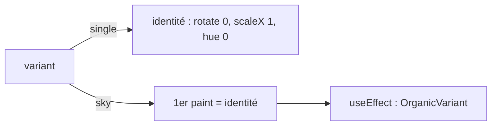

# Lueur — un composant, deux contextes

**Type :** craft · **Vérité pour :** atome Lueur carte vs ciel. Pas le SKU `guest_candle` 19 $ (catalogue).  
**Dernière MAJ :** 17 août 2026 · **Carte :** [`README.md`](README.md)

**Changelog** (max 5)
- 24 août 2026 — lien ciel économique Lueurs.
- 17 août 2026 — plan Cursor rangé ici (était hors repo). Code actuel = WebGL, plus MP4.

Ciel / étoiles-mémoire : [`SANCTUARY_SKY.md`](SANCTUARY_SKY.md) · layers : [`SANCTUARY_SKY_CRAFT.md`](SANCTUARY_SKY_CRAFT.md).  
SKU invité Lueur 19 $ : [`MONETIZATION_CATALOG.md`](MONETIZATION_CATALOG.md) §A.3.  
Ciel économique (couleurs, 2 grilles) : [`SANCTUARY_SKY_LUEURS.md`](SANCTUARY_SKY_LUEURS.md).

---

## Contrat

**Un composant** : [`SanctuaryLueurOrb.tsx`](../src/components/contribute/SanctuaryLueurOrb.tsx).  
**Deux contextes** via `variant` :

| `variant` | Usage | Random |
|-----------|--------|--------|
| `"single"` (défaut) | Carte UI, rituel settle, landing | **Off** — hero déterministe |
| `"sky"` | Ciel Famille, N instances | **On** — client-only après mount (si réactivé) |

**Branchements :**

- Carte / panel / settle → `<SanctuaryLueurOrb variant="single" />` — [`SanctuaryLueurPanel.tsx`](../src/components/contribute/SanctuaryLueurPanel.tsx), [`SanctuaryLanding.tsx`](../src/components/contribute/SanctuaryLanding.tsx).
- Ciel Famille → `variant="sky"` × N. Implémentation ciel actuelle = [`SanctuaryUniverse.tsx`](../src/components/contribute/SanctuaryUniverse.tsx) / `LueurNode` ; l’ancien canvas sky est dans `_archive/`.

---

## Hydratation (règle figée)

- Jamais de `Math.random()` dans le render ni dans `useState(() => …)` si ça touche HTML/CSS.
- `single` : markup déterministe (SSR = client).
- `sky` : premier paint = identité → `useEffect` tire ensuite. Sinon mismatch d’hydratation.

---

## Implémentation actuelle (août 2026)

**Atome WebGL** : `LueurNode` dans un `Canvas` R3F, gate `ClientWebGLGate`, fallback blob teal.  
Commentaire code : *plus de vidéo MP4*.

| Size | Rôle visuel `LueurNode` |
|------|-------------------------|
| `card` (défaut) | `premium` |
| `ritual` | `hero` |

`variant` reste sur le type (contrat deux contextes). Le roll organique MP4 n’est plus dans l’orb produit.

**Deprecated :** `LUEUR_VIDEO_SRC = "/lueur.mp4"` — asset encore dans [`public/lueur.mp4`](../public/lueur.mp4). Ne plus brancher un `<video mix-blend-mode: screen>` comme vérité produit.

---

## Historique court (ne pas réappliquer)

1. Blobs CSS + blur → layout cassé.
2. Plan *Lueur vidéo Ciel* : un MP4 fond noir + `screen`, `single` vs `sky`, random post-mount.
3. Remplacé par l’atome WebGL (aligné `test-ciel` / `LueurNode`).

Le plan Cursor (`lueur_vidéo_ciel_*.plan.md`) n’est **pas** la source de vérité. Ce fichier l’est.
