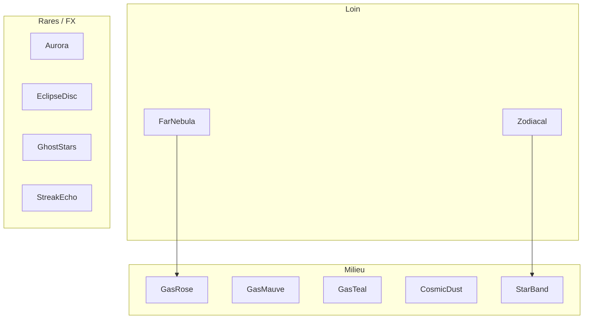

# Ciel screensaver + intro Éclipse

**Type :** craft · **Vérité pour :** plan phasé screensaver (profondeur → WTF → intro → veille).  
**Dernière MAJ :** 17 août 2026 · **Carte :** [`README.md`](README.md)

**Changelog** (max 5)
- 17 août 2026 — plan Cursor rangé ici. Phases 1–3 livrées ; intro Sanctuaire OFF ; veille ⏳.

Vision : [`SANCTUARY_SKY.md`](SANCTUARY_SKY.md) · stack : [`SANCTUARY_SKY_CRAFT.md`](SANCTUARY_SKY_CRAFT.md) · knobs : [`SANCTUARY_SKY_THEME.md`](SANCTUARY_SKY_THEME.md) §3b.  
Marque Éclipse (chantier **séparé**, livré) : [`ODYSSEY_ECLIPSE_LOGO.md`](ODYSSEY_ECLIPSE_LOGO.md).  
≠ **Éclipse Résonnante** constellation (E′ dans la craft bible).

---

## Objectif

*« WTF I WANT THIS AS A SCREENSAVER »* — digne, léger GPU.  
**Screensaver** ici = comportement d’idle (pas un screensaver OS) : ciel plus lent + UI fade en immersif.

Preview : `/fr/contribute/test-ciel` · lab éclipse `/fr/contribute/test-eclipse`.

---

## Principes perf (non négociables)

- Un layer = un mesh léger (plane 1×1 ou ≤32 points), `fog: false`, `depthWrite: false`, pas de post-process lourd.
- Budget desktop : +4 planes max + 1 petit Points + idle déjà là.
- **`reduced`** : skip far nebula, ghost stars, aurora, eclipse rare, streak echo.
- **`mobile`** : garder far nebula + zodiacal + intro ; skip aurora + ghost stars + eclipse rare idle.
- Tout knobbable dans `skyTheme.ts` — pas de magie hors thème.

---

## Décisions figées

- **Intro Éclipse** : immersif seulement, **1× / session** (`sessionStorage`), skip si `prefers-reduced-motion` / `reduced`. Knobs `scene.intro` — **`enabled: false`** jusqu’à rebranchement (forme validée sur `test-eclipse`).
- **Sky Eclipse ≠ vidéo login** : pas `eclipse_login.mp4` dans le WebGL. Disque + corona procédurale qui *rhime* avec Halo-Éclipse.
- **Ambition marque** : validée **hors** ce plan — `OdysseyEclipseMark` + play A–B KEEP. L’intro ciel **ne remplace pas** la marque. Ne pas recoller la vidéo dans le ciel.
- **Veille** : après `scene.idle.veilleDelaySec` sans interaction → chrome fade + idle ×1,3 ; n’importe quelle activité → rythme normal. **Pas encore branché.**

---

## Phases (état)

| Phase | Contenu | Statut |
|-------|---------|--------|
| **1** Profondeur | `NebulaGasFar` + `GhostStars` | ✅ skip `reduced` ; Ghost aussi skip `mobile` |
| **2** Lumière solaire | `ZodiacalLight` | ✅ 1 plane, skip `reduced` |
| **3** Moments WTF | `AuroraVeil` + `StreakEcho` | ✅ aurore idle ; **EclipseDisc** = labs + intro J1 (hors fond ambiant) |
| **4** Intro Éclipse | `SkyIntroEclipse` ~2,5–3,5 s, 1×/session, skippable | ⏸ `scene.intro` OFF |
| **5** Veille | UI fade + idle plus lent | ⏳ plus tard |

**Un phase à la fois**, go explicite, valider sur `test-ciel`.

### Intro (quand on rebranche)

1. Fond quasi éteint  
2. Disque sombre + corona  
3. Ouverture → gaz + bande  
4. Hand-off idle  

Pas de wordmark ODYSSEY sur le Sanctuaire (le ciel *est* la marque). Skip : Esc, clic, non-desktop, reduced, déjà vu.

Même `EclipseDisc` : modes `intro` | `craft` (labs) — **plus** de pulse idle `rare` sur le ciel Sanctuaire.

---

## Risques

- Trop d’alpha blending → fill-rate mobile → skips tier stricts.
- Intro trop longue → toujours skippable, courte.
- Ne pas nommer ça « Éclipse Résonnante » — ici = **Sky Eclipse** / `EclipseDisc`.

Le plan Cursor `screensaver_sky_layers_*.plan.md` n’est **pas** la source. Ce fichier l’est.
