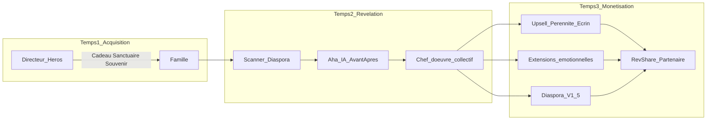

# Odyssey — Stratégie Sanctuaire

**Dernière révision : juillet 2026**

Document canonique de **positionnement produit / vente émotionnelle** et de **monétisation V1**. Complète le commerce technique ([`B2B2C_COMMERCE.md`](B2B2C_COMMERCE.md), [`PARTNER_REVSHARE.md`](PARTNER_REVSHARE.md), [`DELIVERABLES_AND_PACKAGES.md`](DELIVERABLES_AND_PACKAGES.md)) sans les remplacer.

**Documents liés :**
- [`FREEMIUM_V1_PIVOT.md`](FREEMIUM_V1_PIVOT.md) — **pivot CEO V1** (grille, Soft Cap, musique, purge jetons) — **prime** sur ce fichier si conflit
- [`NARRATIVE_SOFT_CAP.md`](NARRATIVE_SOFT_CAP.md) · [`MUSIC_RIGHTS_ATTESTATION.md`](MUSIC_RIGHTS_ATTESTATION.md)
- [`VISION_PHASE_2.md`](VISION_PHASE_2.md) — Family Fund, diaspora, CPL
- [`SCANNER_COMPANION.md`](SCANNER_COMPANION.md) — hook Scanner
- [`MOBILE_WIZARD_STRATEGY.md`](MOBILE_WIZARD_STRATEGY.md) — postures mobile

---

## 1. Positionnement

Le produit n’est plus « créateur de montage vidéo ».  
Le produit est : **Odyssey — Le Sanctuaire de vos souvenirs.**

| Rôle | Émotion | Ce qu’Odyssey devient pour eux |
|------|---------|--------------------------------|
| **Directeur** (Héros bienfaiteur) | Pouvoir d’offrir | Atout de réputation — **pas** un centre de coût |
| **Famille organisatrice** (Archiviste) | Guérison collective + peur de la perte | Sanctuaire où préserver = acte d’amour |
| **Famille B2C** | Urgence + excellence | Rituel Quiet Luxury — zéro cadeau d’entrée |

**Promesse unique :**

> *« Nous allons prendre soin de l’histoire. Vous n’avez qu’à commencer. »*

### Standard à redéfinir

| Ancien (industrie / SaaS) | Nouveau (Sanctuaire) |
|---------------------------|----------------------|
| Jetons / licences = coût | **Zéro friction** d’entrée partenaire |
| Upsell features | **Élévation émotionnelle** (pérennité) |
| Dashboard admin | **Geste de soin** (invitation = offrande) |
| Checkout froid | **Rituel** — peu de choix, défauts forts |
| RevShare opaque | Bulletproof pour le partenaire — **invisible** pour la famille |

---

## 2. Machine à 3 temps (flows × monétisation)

Les flows émotionnels et le catalogue SKU forment **une seule machine** :

| Temps | Émotion | Qui agit | Monétisation |
|-------|---------|----------|--------------|
| **1. Acquisition** | Soulagement / pouvoir d’offrir | Directeur | Rien (CAC Odyssey) |
| **2. Révélation** | Nostalgie / Aha IA | Famille + diaspora | Désir (pas encore panier) |
| **3. Pérennité** | Peur de la perte / amour | Organisateur (+ invités V1.5) | Écrin + extensions + objets |

**Règle d’or :** chaque SKU s’accroche à un **moment émotionnel** — jamais à un écran « boutique ».

---

## 3. Les trois flows

### 3.1 B2B — Directeur (Héros)

**Pitch oral (arrangement funéraire) :**

> *« Pour vous accompagner, notre salon a préparé un espace privé en ligne pour votre famille — un Sanctuaire. C’est notre cadeau. Vous et vos proches pourrez y déposer vos souvenirs ; nous nous occupons de tisser votre histoire. »*

**Geste produit :** un clic — *Générer une invitation Souvenir*. Zéro CB, zéro jeton.

**Pitch commercial partenaire (une phrase) :**

> *« Vous offrez la base gratuitement — vous brillez. Ensuite le système élève la famille avec élégance. Sur chaque Restauration, Jeton Sanctuaire, Coffre-fort ou Écrin, vous touchez 30 % du Net. Votre outil ne vous coûte plus : il vous rapporte. Sans vente sous pression. »*

### 3.2 B2B2C — Famille invitée (Archiviste)

1. Entrée **sans portefeuille** — cadeau du salon  
2. **Scanner** — diaspora, photos papier jaunies  
3. **Aha IA** — avant/après ; le visage redevient net  
4. **Upsell pérennité** — pas « 4K / 198 $ », mais :

> *« Vous avez rassemblé des souvenirs inestimables. Ne les laissez pas disparaître. Avec l’Écrin Éternité, nous restaurons chaque photo, protégeons ce film 50 ans pour vos petits-enfants, et nous vous envoyons le Jeton du Sanctuaire (NFC) pour rouvrir l’histoire. »*

Paiement = acte d’amour. Partenaire → RevShare Bulletproof (30 % du **Net Distribuable**) sans vendre.

### 3.3 B2C — Client direct (Excellence)

> **⚠️ PIVOT CEO — Cascade V-Final (21 juillet 2026) :** la règle « **zéro gratuit à l'entrée** »
> est **abandonnée** pour le B2C. Voir [`IMPLEMENTATION_CASCADE_VFINAL.md`](IMPLEMENTATION_CASCADE_VFINAL.md),
> qui **prime**.

- **Brouillon gratuit** (sans carte) : le client construit et voit une **preview basse résolution /
  filigranée**. L'attachement émotionnel se crée avant le prix.
- **Paywall strict à l'export** : minimum **Héritage 149 $** ; ancre haute **Légendaire 499 $**.
- **Boucle Virale (Fonds Commémoratif)** : les proches achètent des **Support Packs**, dont le Net
  Distribuable devient un **crédit** qui fait fondre le paywall famille (jusqu'à **0 $**).
- Landing = **résultats** (avant/après IA, templates, Stingray).
- Message : *« Laissez notre moteur magique tisser votre histoire. Vous n’avez qu’à déposer vos émotions. »*

---

## 4. Échelle des forfaits (présence, pas features)

| Niveau | Emotion vendue | Qui paie (cible) |
|--------|----------------|------------------|
| **Souvenir** | La porte ouverte | Cadeau partenaire (0 $) |
| **Héritage** | Le récit digne | Famille 149 $ **ou** Gant Blanc (avance commissions) |
| **Éternité** | La mémoire restaurée | Famille 299 $ **ou** Gant Blanc |
| **Légendaire** | Le rituel absolu | **B2C only** 499 $ — hors catalogue partenaire V1 |

> **V-Final :** en B2C comme en B2B2C, l'entrée se fait en **brouillon gratuit** ; le paywall arrive
> à l'export et peut être financé par le **Fonds Commémoratif** (contributions des proches). Détail :
> [`IMPLEMENTATION_CASCADE_VFINAL.md`](IMPLEMENTATION_CASCADE_VFINAL.md).

IDs techniques : `essential` / `signature` / `heritage` / `legendary` — voir [`DELIVERABLES_AND_PACKAGES.md`](DELIVERABLES_AND_PACKAGES.md).

---

## 5. Catalogue monétisation

### V1 (tranché — juillet 2026 · aligné [`FREEMIUM_V1_PIVOT.md`](FREEMIUM_V1_PIVOT.md))

| Rang | SKU | Prix | ID technique | Moment d’accroche |
|------|-----|------|--------------|-------------------|
| 1 | **Restauration IA** | **49 $** | `aiRetouch` | Scanner / avant-après |
| 2 | **Licence Musique Premium Stingray** | **39 $** | `musicLicense` | Soft Cap musique Souvenir (alt. à Héritage) |
| 3 | **Voix de l’Histoire** | **39 $** | `storyVoice` | Checkout / biographie |
| 4 | **Jeton du Sanctuaire** (NFC) | **79 $** | `sanctuaryToken` | Checkout pérennité (remplace USB) |
| 5 | **Coffre-fort multigénérationnel** | **99 $** | `digitalVault` | Checkout / peur de l’oubli |
| 6 | **Livre de Mémoire** | **149 $** | `memoryBook` | Checkout / V1.5 ops si besoin |
| Cœur | **Écrin Héritage / Éternité** | **149 $ / 299 $** | `signature` / `heritage` | Soft Cap médias / Preview → checkout |

### V1.5 (après launch Sanctuaire)

| SKU | Pourquoi plus tard |
|-----|--------------------|
| Livre Mémoire 149 $+ | Ops print art book |
| Social Cut 19 $ | Moins central au funéraire |
| Monétisation diaspora (Tribute Fund, HD 15 $, livre invité) | Portail invité + micro-checkout — [`VISION_PHASE_2.md`](VISION_PHASE_2.md) |

---

## 6. Mapping émotion → écran → offre

| Moment | Écran / expérience | Offre |
|--------|--------------------|-------|
| Arrangement salon | Composer invitation | Souvenir = cadeau Sanctuaire |
| Email / SMS famille | Landing invitation | Aucune vente |
| Upload / Scanner | Grille + avant/après IA | Modale Restauration IA 49 $ |
| Composition Magique | Livre Ouvert | Désir forfait (pas de prix froid) |
| Preview / Checkout | « Pérennité » | Écrin + NFC + Coffre-fort |
| Post-cérémonie (V1.5) | Portail invités | Livre, HD, Tribute Fund |

---

## 7. Alignement économique / technique

| Élément | Référence |
|---------|-----------|
| Freemium Souvenir 0 $ | [`B2B2C_COMMERCE.md`](B2B2C_COMMERCE.md) |
| RevShare Bulletproof | Platform 10 % → Net Distribuable → 30 % — [`PARTNER_REVSHARE.md`](PARTNER_REVSHARE.md) |
| Saga checkout + webhook | `POST /api/checkout` · `checkout.session.completed` |
| Extensions V1 déjà en catalogue | `pricingConfig.ts` — **relanguage** émotionnel, pas nouveaux SKUs |
| Gant Blanc Premium (avance commissions) | Couche optionnelle **après** freemium Souvenir solidifié |
| Family Fund / diaspora | Stubs P6 + [`VISION_PHASE_2.md`](VISION_PHASE_2.md) |

---

## 8. Prochaines étapes (stratégie → produit)

1. **Atelier microcopy** FR/EN des 4 moments : pitch directeur, invitation Sanctuaire, Aha IA, checkout Pérennité  
2. Structure prix Stripe exacte alignée V1  
3. Exécution produit : composer Salon, modale IA, copy checkout — sans rouvrir le positionnement  

---

## 9. Maintenance

Mettre à jour ce fichier quand :
- Le catalogue V1 / V1.5 change  
- Le langage des rôles Héros / Archiviste est figé en i18n  
- Le Gant Blanc (avance commissions) est une couche optionnelle post-freemium  

Cross-références : [`PROJECT_STATUS.md`](PROJECT_STATUS.md), [`B2B2C_COMMERCE.md`](B2B2C_COMMERCE.md), [`CONVENTIONS.md`](CONVENTIONS.md).

---

*Document vivant — stratégie Sanctuaire Odyssey.*
