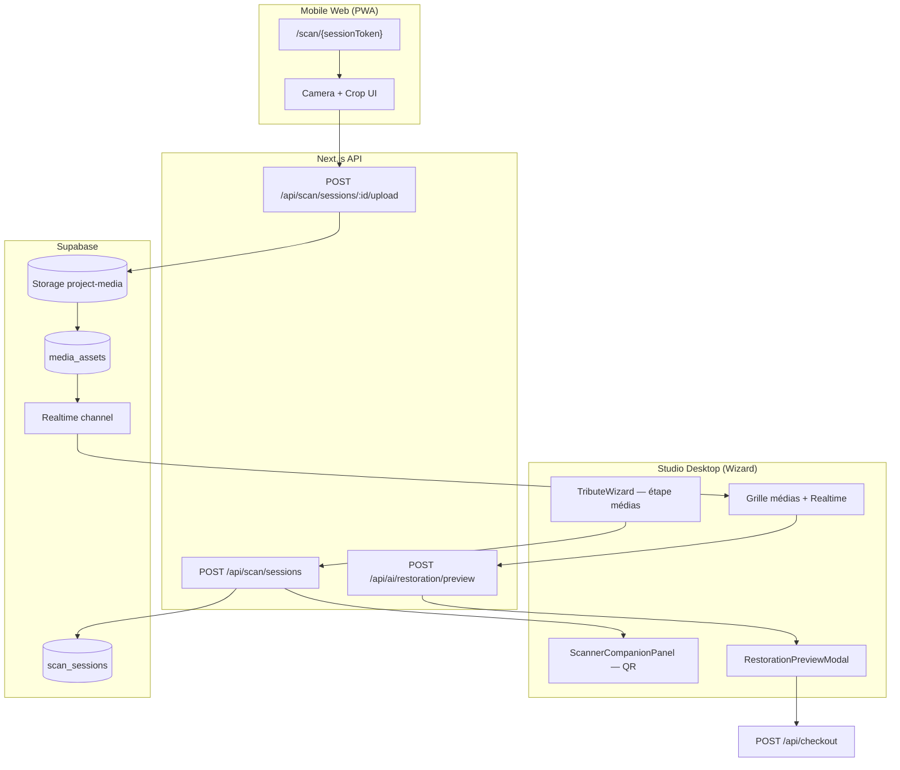

# Odyssey — Scanner Compagnon (Killer App)

**Last updated: July 2026 · Version: B2B2C v2**

Document canonique pour le **Scanner Compagnon Web** : ingestion mobile de photos papier via QR Code, restauration IA en temps réel, et pont de conversion vers les forfaits **Éternité (299 $)** et **Légendaire / Gants Blancs (499 $)**.

Complète [`DELIVERABLES_AND_PACKAGES.md`](DELIVERABLES_AND_PACKAGES.md) · [`B2B2C_COMMERCE.md`](B2B2C_COMMERCE.md) · [`WIZARD_ARCHITECTURE.md`](WIZARD_ARCHITECTURE.md).

---

## Vision produit

Le Scanner Compagnon est la **Killer App** qui différencie Odyssey des outils obsolètes (ex. Scrypta) :

- Le conseiller ou la famille travaille sur **desktop** dans le wizard Studio.
- Les **vieilles photos papier** sont numérisées via le **téléphone** (sans app native).
- **Phase 1 (juin 2026) — Scanner async :** les **invités** contribuent aussi **avant / après la cérémonie** et **à distance** (diaspora) — voir [`VISION_PHASE_2.md`](VISION_PHASE_2.md) §2.1.
- L’**IA de restauration** produit un aperçu **Avant/Après** immédiat — preuve de valeur tangible.
- L’upsell vers **Éternité** ou **Légendaire** devient **émotionnellement évident**.

> **Important — séparation des tokens :** le **QR live wizard** utilise `scan_sessions` (session courte), tandis que la contribution async invités / diaspora visée par la vision produit passera par `project_access_tokens` (liens longue durée) — tous deux déjà stubés dans `odyssey_p6_freemium_revshare.sql`.

```text
Desktop Wizard  ←—— temps réel ——→  Mobile Scanner (PWA web)
       ↓                                    ↓
  Grille médias projet              Détection papier + recadrage
       ↓                                    ↓
  Avant/Après IA (upsell gate)      Upload Supabase Storage
       ↓
  Checkout Éternité 299 $  ou  Légendaire 499 $
```

---

## Périmètre & activation par forfait

| Forfait | Scanner QR | Restauration IA complète | Pont upsell |
|---------|------------|--------------------------|-------------|
| **Souvenir** (B2B2C offert) | **Démo limitée** (1–2 previews floutées) | Non | Vers Éternité / Légendaire |
| **Héritage** | Démo limitée | Non | Vers Éternité / Légendaire |
| **Éternité** | **Complet** | **Oui** | — (tier cible) |
| **Légendaire** (B2C) | **Complet** | **Oui** | — (tier ancre) |

> En **B2C direct Quiet Luxury**, le Scanner est le **levier de conversion** vers Éternité (choix privilégié) ou Légendaire (ancre suprême).

---

## Flux UX (famille / conseiller)

### Acte 1 — Desktop : génération QR

| Étape | Surface | Comportement |
|-------|---------|--------------|
| 1 | Wizard **étape médias** (desktop) | Bandeau « Numérisez vos albums avec votre téléphone » |
| 2 | Composant `ScannerCompanionPanel` | Affiche **QR Code** + code session court (fallback saisie manuelle) |
| 3 | Instructions | « Scannez avec l’appareil photo · aucune installation requise » |
| 4 | État live | Indicateur « Téléphone connecté » dès ouverture session mobile |

### Acte 2 — Mobile : session web légère

| Étape | Surface | Comportement |
|-------|---------|--------------|
| 1 | Scan QR | Ouvre URL `https://{site}/[lang]/scan/{sessionToken}` |
| 2 | **PWA web** (pas d’app store) | Plein écran · accès caméra (`getUserMedia`) |
| 3 | Capture | Photo du tirage papier · overlay guide recadrage |
| 4 | **Détection document** | Recadrage auto perspective (papier / polaroid / album) |
| 5 | Confirmation | Aperçu recadré · bouton « Envoyer au hommage » |
| 6 | Feedback | « Photo ajoutée ✓ » · propose capture suivante |

### Acte 3 — Desktop : sync temps réel

| Étape | Surface | Comportement |
|-------|---------|--------------|
| 1 | Grille médias wizard | Nouvelle vignette apparaît **sans refresh** (WebSocket ou polling court) |
| 2 | Badge | « Via Scanner » sur la vignette |
| 3 | Pipeline | Proxy généré · job restauration IA enqueued |

### Acte 4 — Avant/Après IA (upsell)

| Étape | Surface | Comportement |
|-------|---------|--------------|
| 1 | `RestorationPreviewModal` | Slider **Avant / Après** sur la photo scanner |
| 2 | Gate freemium | Preview **complète** si Éternité/Légendaire · **floutée / watermark** sinon |
| 3 | CTA | « Débloquer la restauration IA — **Éternité 299 $** » · lien secondaire **Légendaire 499 $** (Gants Blancs) |
| 4 | Checkout | Pré-sélection `basePackage = heritage` ou `legendary` · scroll étape checkout |

### Acte 5 — Légendaire Gants Blancs (B2C)

Si l’utilisateur choisit **Légendaire** :

- Message : « Nous vous envoyons une **boîte pré-affranchie** pour vos albums restants »
- Workflow ops post-checkout (hors Scanner) — voir [`DELIVERABLES_AND_PACKAGES.md`](DELIVERABLES_AND_PACKAGES.md) § Légendaire

---

## Architecture technique

### Vue d’ensemble



---

### Tables (P6 stub / cible Scanner)

#### `scan_sessions`

| Colonne | Rôle |
|---------|------|
| `id` | uuid PK |
| `project_id` | FK → hommage |
| `token_hash` | Hash du token URL (jamais en clair en DB) |
| `created_by_user_id` | Owner desktop |
| `project_access_token_id` | Lien éventuel vers token async plus long |
| `status` | `active` \| `expired` \| `revoked` \| `completed` |
| `expires_at` | TTL QR live par défaut **2 h** |
| `upload_count` | Compteur uploads session |

**Index :** UNIQUE `(token_hash)` · INDEX `(project_id, status)`.

#### `media_assets` (existant — extension)

| Colonne | Rôle |
|---------|------|
| `source` | `'local'` \| `'scanner_companion'` |
| `scan_session_id` | FK nullable |
| `restoration_status` | `none` \| `pending` \| `completed` \| `failed` |
| `restoration_preview_path` | Storage path preview IA |

---

### Routes API (cible)

| Route | Auth | Rôle |
|-------|------|------|
| `POST /api/scan/sessions` | Owner projet | Crée session · retourne QR payload (token signé court) |
| `GET /api/scan/sessions/:token/validate` | Token session | Valide TTL · retourne `projectId` minimal |
| `POST /api/scan/sessions/:token/upload` | Token session | Multipart image recadrée → Storage + `media_assets` |
| `POST /api/ai/restoration/preview` | Owner projet | Job IA preview · retourne signed URLs avant/après |
| `GET /api/scan/sessions/:id/events` | Owner projet | SSE ou long-poll nouveaux médias *(alternative Realtime)* |

**Sécurité session mobile :**

- Token **opaque** 128-bit · TTL QR live **2 h** · **1 projet** par session
- Contribution async invités : via `project_access_tokens` longue durée (stub P6, logique métier séparée)
- Rate limit upload : max **30 photos / session / heure**
- Validation MIME : `image/jpeg`, `image/png`, `image/webp` uniquement
- Taille max : **12 Mo** par photo (mobile)

---

### Routes UI (cible)

| Route | Rôle |
|-------|------|
| `/[lang]/studio/...` wizard | `ScannerCompanionPanel` intégré étape médias |
| `/[lang]/scan/[token]` | **Mobile PWA** — capture + crop + upload |
| `/[lang]/scan/[token]/done` | Confirmation · « Retournez à votre ordinateur » |

**PWA mobile :** `manifest.json` minimal · icône Odyssey · `display: standalone` · pas de publication App Store Phase 1.

---

### Détection & recadrage papier

| Couche | Technologie cible | Fallback |
|--------|-------------------|----------|
| **Client mobile** | Canvas + lib recadrage (ex. OpenCV.js léger ou algorithme 4 coins) | Crop manuel drag handles |
| **Serveur** | Validation dimensions · re-save WebP proxy | Reject si < 800 px côté court |

**Pipeline image :**

```text
Capture caméra
  → Recadrage perspective (client)
  → Upload JPEG/WebP
  → Storage: projects/{id}/media/{uuid}-original.jpg
  → Thumb WebP (policy egress existante)
  → Proxy 1080p (pipeline standard)
  → Queue restauration IA (si tier Éternité/Légendaire ou preview upsell)
```

Alignement egress : [`PROJECT_STATUS.md`](PROJECT_STATUS.md) §4.1 (thumbs WebP, cache session).

---

### Restauration IA — Avant/Après

| Mode | Comportement |
|------|--------------|
| **Preview upsell** (Souvenir / Héritage) | Job IA **basse résolution** · watermark « Odyssey » · flou partiel après 3 s |
| **Complet** (Éternité / Légendaire) | Job IA **pleine résolution** · slider Avant/Après sans restriction |
| **Stockage** | `restoration_preview_path` + option `restoration_final_path` post-achat |

**Composant UI :** `RestorationPreviewModal.tsx`

- Props : `mediaId`, `beforeUrl`, `afterUrl`, `canFullPreview`, `upsellPackages`
- CTA primaire : **Éternité 299 $** (`heritage`)
- CTA secondaire : **Légendaire 499 $** (`legendary`) — copy Gants Blancs

---

### Sync temps réel desktop ← mobile

**Option A (recommandée Phase 1) :** Supabase **Realtime** sur `media_assets` INSERT filtré par `project_id`.

**Option B :** Polling `GET /api/projects/:id/media` toutes les 3 s tant que session active.

**Option C :** SSE via `/api/scan/sessions/:id/events`.

Le desktop **ne doit pas** require un refresh manuel après upload mobile.

---

## Pont checkout (conversion)

### Règles métier

| Origine | Package pré-sélectionné | Montant |
|---------|-------------------------|---------|
| CTA « Éternité » depuis Scanner | `heritage` | 29 900¢ (299 $) + extensions |
| CTA « Légendaire » depuis Scanner | `legendary` | 49 900¢ (499 $) + extensions |
| Canal B2B2C freemium (invitation) | `heritage` ou `signature` | Prix upsell partenaire — voir [`B2B2C_COMMERCE.md`](B2B2C_COMMERCE.md) |
| B2C direct Quiet Luxury | `heritage` recommandé · `legendary` ancre | Pas de Souvenir |

**Tracking conversion (metadata) :**

```json
{
  "conversion_source": "scanner_companion",
  "scan_session_id": "uuid",
  "media_id": "uuid"
}
```

Stocké sur `tribute_checkouts.metadata` et Stripe Session metadata pour analytics.

---

## Limites & quotas (alignement forfait)

| Forfait | Uploads Scanner | Chansons max | Restauration IA |
|---------|-----------------|--------------|-----------------|
| Souvenir | Compte dans **50 médias max** | **2** | Preview upsell only |
| Héritage | Compte dans **125 médias max** | **4** | Preview upsell only |
| Éternité | Compte dans **175 médias max** | **5** | Complet |
| Légendaire | Compte dans **250 médias max** | **7** | Complet |

Gate serveur : `POST /api/scan/sessions/:token/upload` vérifie `count(media_assets) < maxMediaItems` du tier effectif.

**Règle de pacing (manifest product):**

```text
recommendedMediaCapacity = floor(durationSec / targetSecondsPerMedia)
```

Exemple avec `targetSecondsPerMedia = 6` :

- chanson 120 s -> ~20 médias recommandés
- chanson 180 s -> ~30 médias recommandés
- chanson 240 s -> ~40 médias recommandés

Le Scanner n’enforce pas cette règle lui-même ; il alimente simplement le volume de médias. Le Wizard Storyboard et la validation pacing calculeront ensuite la cohérence `médias ↔ chansons` à partir de la **durée réelle** de chaque piste (`durationSec`) et de la cible temporelle (`targetSecondsPerMedia`).

---

## Sécurité & confidentialité

| Risque | Mitigation |
|--------|------------|
| Token session leak | TTL court · hash en DB · révocation à la fermeture wizard |
| Upload non autorisé | Token lié à **1 seul** `project_id` |
| Caméra refusée | Fallback « Import depuis galerie » mobile |
| Données sensibles (décès) | RLS `media_assets` · Storage policies existantes |
| ABUSE / spam uploads | Rate limit IP + session |

---

## Dépendances produit existantes

| Composant | Statut | Lien |
|-----------|--------|------|
| Upload médias wizard | ✅ | `app/api/projects/...` |
| Thumbs WebP egress | ✅ | `StoragePreviewImage`, policy egress |
| Wizard étape médias | ✅ | `TributeWizard` step 4 |
| Restauration IA pipeline | ⏳ | Backend job TBD |
| Checkout saga v2 | ⏳ | [`B2B2C_COMMERCE.md`](B2B2C_COMMERCE.md) |
| Forfait `legendary` | ⏳ | [`DELIVERABLES_AND_PACKAGES.md`](DELIVERABLES_AND_PACKAGES.md) |

---

## Plan d’implémentation (phases)

### Phase A — MVP Scanner (1 semaine)

- [ ] `POST /api/scan/sessions` + table `scan_sessions`
- [ ] Page mobile `/scan/[token]` · caméra + upload simple (sans crop IA)
- [ ] QR panel desktop · Realtime ou polling médias
- [ ] `source = scanner_companion` sur `media_assets`

### Phase B — Killer App (2 semaines)

- [ ] Recadrage papier client
- [ ] Preview restauration IA + `RestorationPreviewModal`
- [ ] Gate upsell · CTA Éternité / Légendaire
- [ ] Metadata conversion checkout

### Phase C — Polish

- [ ] PWA manifest mobile
- [ ] Heartbeat « téléphone connecté »
- [ ] Quotas photos par tier
- [ ] Analytics funnel Scanner → checkout

---

## Fichiers code (cartographie cible)

| Fichier | Action |
|---------|--------|
| `src/components/scanner/ScannerCompanionPanel.tsx` | **Créer** — QR + état session |
| `src/components/scanner/RestorationPreviewModal.tsx` | **Créer** — Avant/Après + upsell |
| `app/[lang]/scan/[token]/page.tsx` | **Créer** — mobile PWA |
| `app/api/scan/sessions/route.ts` | **Créer** |
| `app/api/scan/sessions/[token]/upload/route.ts` | **Créer** |
| `app/api/ai/restoration/preview/route.ts` | **Créer** |
| `src/lib/scanner/scanSessionToken.ts` | **Créer** — sign / hash |

> **Cascade V-Final (✅ livré) :** le volet **contribution invité async** (Support Packs → Fonds
> Commémoratif) est déjà câblé, distinct du Scanner QR : tokens opaques
> `src/lib/contribute/contributeToken.ts` + `accessToken.ts`, routes `GET/POST /api/contribute/[token]`
> et `POST /api/projects/[id]/contribute-link` (voir [`ROUTES_AND_AUTH.md`](ROUTES_AND_AUTH.md) §
> Boucle Virale). Le Scanner QR (upload photo mobile) reste à construire (MVP ci-dessous).
| `docs/sql/odyssey_p6_freemium_revshare.sql` | **Déjà créé** — `scan_sessions` en Partie B |

---

## Documents liés

| Document | Rôle |
|----------|------|
| [`DELIVERABLES_AND_PACKAGES.md`](DELIVERABLES_AND_PACKAGES.md) | Forfaits, Légendaire Gants Blancs |
| [`B2B2C_COMMERCE.md`](B2B2C_COMMERCE.md) | Checkout, pricing upsell |
| [`PARTNER_REVSHARE.md`](PARTNER_REVSHARE.md) | Commission sur upsell partenaire |
| [`WIZARD_ARCHITECTURE.md`](WIZARD_ARCHITECTURE.md) | Étape médias wizard |

---

## Quand modifier ce document

Toute évolution du flux QR, mobile PWA, IA preview, upsell, ou schéma `scan_sessions` → mettre à jour **ce fichier**, [`DELIVERABLES_AND_PACKAGES.md`](DELIVERABLES_AND_PACKAGES.md), et [`WIZARD_ARCHITECTURE.md`](WIZARD_ARCHITECTURE.md).
