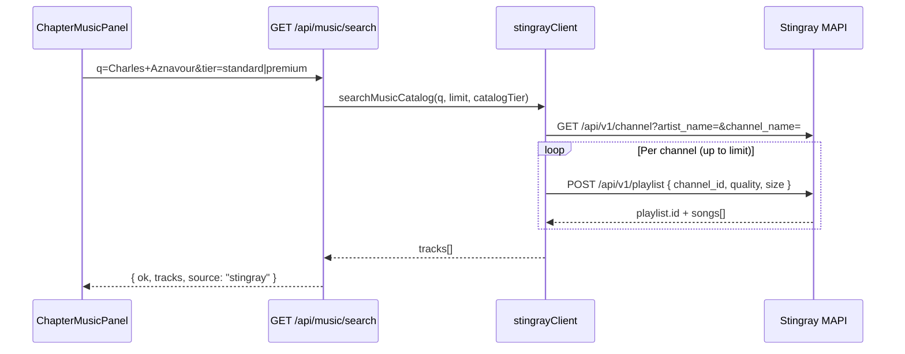

# Stingray Music Integration (MAPI)

**Last code review: July 2026 · Freemium V1 Pivot**

> **Produit V1 :** [`FREEMIUM_V1_PIVOT.md`](FREEMIUM_V1_PIVOT.md) · Soft Cap musique [`NARRATIVE_SOFT_CAP.md`](NARRATIVE_SOFT_CAP.md) · ToS MP3 [`MUSIC_RIGHTS_ATTESTATION.md`](MUSIC_RIGHTS_ATTESTATION.md).

Odyssey uses the **Stingray Music API** (MAPI) for licensed search and preview in wizard **step 4** (`ChapterMusicPanel` inside `StoryboardChaptersStep`). Stingray disables CORS on their origin — all MAPI calls run **server-side**; the browser only hits our Next.js routes.

Parent reference: [`TECHNICAL_ONBOARDING_V1.md`](TECHNICAL_ONBOARDING_V1.md) § Musique / chemins code.

---

## Why a proxy

| Constraint | Our approach |
|----------|--------------|
| MAPI has CORS disabled | Browser cannot call `music-service.stingray.com` directly |
| API key must not leak | `STINGRAY_CLIENT_ID` / bearer token only on server |
| Preview URLs expire / need auth | `GET /api/music/preview` streams audio after server auth |

---

## Environment variables

| Variable | Required | Notes |
|----------|----------|-------|
| `STINGRAY_CLIENT_ID` | Production | Sent as `x-client-id` |
| `STINGRAY_BEARER_TOKEN` | Optional | `Authorization: Bearer …` (alias `STINGRAY_API_TOKEN`) |
| `STINGRAY_API_BASE_URL` | No | Default `https://music-service.stingray.com` |
| `STINGRAY_DEVICE_ID` | No | Header `X-Device-Id` (default `odyssey-wizard`) |
| `STINGRAY_LANGUAGE` | No | Header `X-Language` (default `fr`) |
| `STINGRAY_MODE=mock` | Dev / offline tunnel | Local catalog search (real titles & covers); preview audio = single cinematic MP3 via `/api/music/preview` |
| `STINGRAY_USE_MOCK=true` | Deprecated | Treated as `STINGRAY_MODE=mock` |

**Résilience (staging / dev):**
- If `STINGRAY_CLIENT_ID` is missing → `resolveStingrayMode()` returns **`mock`** (server log: equivalent `STINGRAY_USE_MOCK=true`).
- `shouldUseStingrayMock()` = explicit mock **or** missing credentials.
- Search uses `stingrayCatalog.ts` (real titles/covers); preview streams one cinematic MP3.
- UI badge **Preview** on step 4 music panels. No 503 unless `STINGRAY_MODE=live` is forced without credentials.

---

## Code layout

| Path | Role |
|------|------|
| `src/lib/music/stingrayConfig.ts` | Env, `shouldUseStingrayMock()`, auto-mock if no `STINGRAY_CLIENT_ID` |
| `src/lib/music/stingrayClient.ts` | Search + playlist + stream fetch (`server-only`) |
| `src/lib/music/stingrayTrackId.ts` | Composite `trackId` encode/decode + preview URL builder |
| `src/lib/wizard/stingrayCatalog.ts` | Types, mock catalog (dev fallback only) |
| `app/api/music/search/route.ts` | `GET ?q=&limit=&tier=standard\|premium` |
| `src/lib/wizard/pricingConfig.ts` | `resolveMusicCatalogTier()`, package `musicCatalog` |
| `app/api/music/preview/route.ts` | `GET ?trackId=` → audio stream |
| `app/api/music/stream/route.ts` | `GET ?trackId=` → JSON `{ streamUrl }` (proxy path) |
| `src/components/tribute/storyboard/ChapterMusicPanel.tsx` | Search UI + `HTMLAudioElement` on `previewUrl` (step 4, per chapter) |

---

## Search flow (server)



1. Search channels by artist name and channel name (two queries, merged by id).
2. For each channel, create a playlist (`POST /api/v1/playlist`, max 10 songs).
3. Filter songs by query tokens (title / artist / album).
4. Map each song to our API payload.

With `STINGRAY_MODE=mock` **or without API credentials**, search uses `stingrayCatalog.ts` (`source: "mock"`). UI shows badge **Preview** on step 4 music panels.

If credentials are missing and mock is disabled via `STINGRAY_MODE=live` explicitly → **503** with message: *“Music service temporarily unavailable…”*

---

## Catalog — Freemium V1 (standard vs officiel)

Deux voies commerciales Stingray + soupape MP3 :

| Accès | Qui | SKU / forfait |
|-------|-----|---------------|
| **standard** (sous-ensemble) | Souvenir sans Soft Cap musique | `essential` |
| **officiel** (orchestral / cinématique, zéro copyright Odyssey) | Héritage / Éternité **inclus** · **ou** Souvenir + add-on | `intended >= signature` **OU** `musicLicense` (39 $) |
| **upload** MP3/WAV | Héritage+ uniquement | ToS user — pas Stingray |

> **Soft Cap Souvenir :** sélection d’une piste **officielle** non bloquée → choix **Licence `musicLicense` 39 $** (reste Souvenir) **ou** upgrade **Héritage 149 $**.  
> Migration TS : `extendedLicense` → **`musicLicense`** ; helper cible `resolveMusicEntitlement` (alias possible de `resolveMusicCatalogTier`).

### Resolution (contrat Phase 1)

```typescript
// pricingConfig.ts — cible
resolveMusicEntitlement(intendedPackage, extensions): "standard" | "official"
// official si intended >= signature OR extensions.musicLicense
```

| `intendedPackage` | `extensions.musicLicense` | Effective |
|-------------------|---------------------------|-----------|
| `essential` | false | **standard** |
| `essential` | true | **official** |
| `signature` / `heritage` / `legendary` | — | **official** (inclus — strip line item Licence) |

`TributeWizard` passe le tier à `StoryboardChaptersStep` / `ChapterMusicPanel`.

### Search API

```http
GET /api/music/search?q=Aznavour&limit=12&tier=standard
GET /api/music/search?q=Adele&limit=12&tier=premium
```

- Query param `tier`: mappe `standard` \| `premium` (API actuelle) ↔ produit `standard` \| `official`.
- **Mock :** filtre `musicTier` sur `STINGRAY_CATALOG_TRACKS`.
- **Live MAPI :** roadmap filtrage catalogue officiel.

### Step 4 UX (`ChapterMusicPanel`) — cible Phase 4

- Bannière standard : Soft Cap dual (Licence 39 $ \| Héritage 149 $) — pas de paywall brutal.
- Bannière official : catalogue débloqué (forfait ou Licence).
- Import MP3 : masqué Souvenir ; visible Héritage+ + attestation ToS.
- `durationSec` pour pacing (`storyboardPacing.ts`).

### Checkout / export

- Entitlement dérivé de `intended` + `musicLicense` (pas de champ tier séparé).
- **Master Stingray Creatomate** : uniquement si **payé** (`paid` package ≥ signature **ou** `paid.musicLicense`) — jamais depuis le front.
- Metadata Stripe : `trackId` chapitres pour licensing downstream.

Voir [`WIZARD_ARCHITECTURE.md`](WIZARD_ARCHITECTURE.md) · [`DELIVERABLES_AND_PACKAGES.md`](DELIVERABLES_AND_PACKAGES.md).

---

## API response shape (Odyssey)

Each track returned to the client:

```typescript
{
  id: string;           // composite trackId (see below)
  title: string;
  artist: string;
  duration: string;     // may be empty from MAPI
  coverUrl: string;
  previewUrl: string;   // same-origin proxy URL
  streamUrl: string;    // alias of previewUrl
  playbackUrl: string;  // alias of previewUrl
}
```

Mapping implementation: `mapSongToTrack()` in `stingrayClient.ts`.

---

## Composite `trackId`

Stingray playback requires **both** playlist UUID and song id. We persist a single string for Stripe and autosave:

```
sr:{playlistId}:{songId}
```

| Function | File |
|----------|------|
| `encodeStingrayTrackId(playlistId, songId)` | `stingrayTrackId.ts` |
| `parseStingrayTrackId(trackId)` | `stingrayTrackId.ts` |
| Prefix constant | `STINGRAY_TRACK_PREFIX = "sr:"` |

**Example:** `sr:550e8400-e29b-41d4-a716-446655440000:SONG123`

In `mock` mode, any catalog `trackId` (e.g. `stingray-aznavour-la-mamma`) is proxied to the **cinematic ambiance** MP3 (`stingray-cinematic-01` / SoundHelix Song 4).

---

## Preview playback

### Browser (step 4 — `ChapterMusicPanel`)

`ChapterMusicPanel` sets:

```typescript
audio.pause();
audio.currentTime = 0;
audio.src = track.previewUrl;  // e.g. /api/music/preview?trackId=sr:...
audio.load();
await audio.play();
```

On load/play failure → button shows **“Playback unavailable”** (i18n `soundPreviewUnavailable`); track id added to a local unavailable set.

### Preview route

`GET /api/music/preview?trackId=…`

1. Parse `sr:playlist:song` → `fetchStingrayTrackStream(playlistId, songId)`
2. Server calls `GET /api/v1/playlist/{playlist_id}/track/{track_id}` on MAPI with auth headers
3. Response body (audio/mpeg) is streamed back to the browser with cache headers

### Cinematic teaser (step 7)

`CinematicTeaser` uses persisted `track.previewUrl` or rebuilds via `buildMusicPreviewProxyUrl(track.trackId)`.

---

## Persistence and checkout

**Autosave** (`musicalAmbiance.tracks.acteN`):

```json
{
  "title": "La Mamma",
  "artist": "Charles Aznavour",
  "trackId": "sr:uuid:songId",
  "coverUrl": "https://…",
  "previewUrl": "/api/music/preview?trackId=sr%3A…"
}
```

**Stripe** (`app/api/checkout/route.ts`):

```typescript
metadata: {
  act_tracks: JSON.stringify(wizardState.musicalAmbiance?.tracks ?? {}),
  // …extensions, project_id, etc.
}
```

Downstream render jobs must use **`trackId`** (composite) to re-resolve licensed audio with Stingray.

---

## Error handling

| Case | HTTP | UX |
|------|------|-----|
| Missing `STINGRAY_CLIENT_ID` | 200, `source: "mock"` | Local catalog + Preview badge |
| `STINGRAY_MODE=live` without credentials | 503 from `/api/music/search` | Service unavailable |
| MAPI upstream error (live mode) | 502 | Banner + server log |
| Preview 404/502 | `/api/music/preview` | “Playback unavailable” |
| Empty search | 200, `tracks: []` | “No tracks found” |

---

## MAPI headers (every server request)

```
x-client-id: <STINGRAY_CLIENT_ID>
X-Language: fr | en
X-Device-Id: odyssey-wizard
Authorization: Bearer <token>   # if configured
```

Official docs: [music-service.stingray.com/swagger-ui.html](https://music-service.stingray.com/swagger-ui.html) (OpenAPI at `/v3/api-docs`).

---

## Testing locally

1. **Offline / staging:** omit `STINGRAY_CLIENT_ID` (auto mock) or set `STINGRAY_MODE=mock` / `STINGRAY_USE_MOCK=true`.
2. **Production:** add `STINGRAY_CLIENT_ID` (+ optional bearer) to `.env.local` / Vercel.
3. `npm run dev`
4. Wizard step 5 — search e.g. `Aznavour`
5. DevTools → `/api/music/search` → 200 `{ source: "mock" }`; `/api/music/preview` → `audio/mpeg`

```bash
curl -s "http://localhost:3000/api/music/search?q=test&limit=3&tier=standard" | jq .
curl -s "http://localhost:3000/api/music/search?q=test&limit=3&tier=premium" | jq .
curl -sI "http://localhost:3000/api/music/preview?trackId=sr:YOUR_PLAYLIST:YOUR_SONG"
```

---

## Partner token model & B2B2C v2 freemium (wizard checkout)

Pricing is **not** part of Stingray; see [`WIZARD_ARCHITECTURE.md`](WIZARD_ARCHITECTURE.md), [`B2B2C_COMMERCE.md`](B2B2C_COMMERCE.md) v2, and `src/lib/wizard/pricingConfig.ts`.

### B2C direct (Quiet Luxury)

- Amounts in cents via Stripe: **Héritage 149 $** · **Éternité 299 $** · **Légendaire 499 $**.
- **Stingray** (Standard/Premium tiers) is included in the paid package value proposition — monetized through **family upsell**, not partner tokens.

### B2B2C freemium (`tenants.is_freemium = true`)

- Partner offers **Souvenir at 0 $ / 0 jetons** — acquisition lead-magnet.
- Family upsell (Héritage / Éternité) pays **full price** via Stripe.
- **Stingray** on Souvenir/Héritage is part of the **free or paid family experience**; partner RevShare (30 % gross Stripe) is on upsell + extensions — see [`PARTNER_REVSHARE.md`](PARTNER_REVSHARE.md).
- Partner **never** sees token debit for freemium Souvenir invitations.

### B2B legacy jetons (`is_freemium = false`)

- Partners debit **tokens** (1 / 2 / 4 per package); wholesale **4000¢ per token** (`PARTNER_TOKEN_COST_CENTS`).
- Coexists with freemium v2 — see [`QA_P5_5_PARTNER_SALON.md`](QA_P5_5_PARTNER_SALON.md) (✅ terminée prod).

**Catalog tiers (unchanged):** Souvenir / Héritage → **Standard** Stingray search · Éternité / Licence Premium → **Premium**.

---

## When you change this integration

Update this file and onboarding §4.7, §6, §10 per team rule §13.
