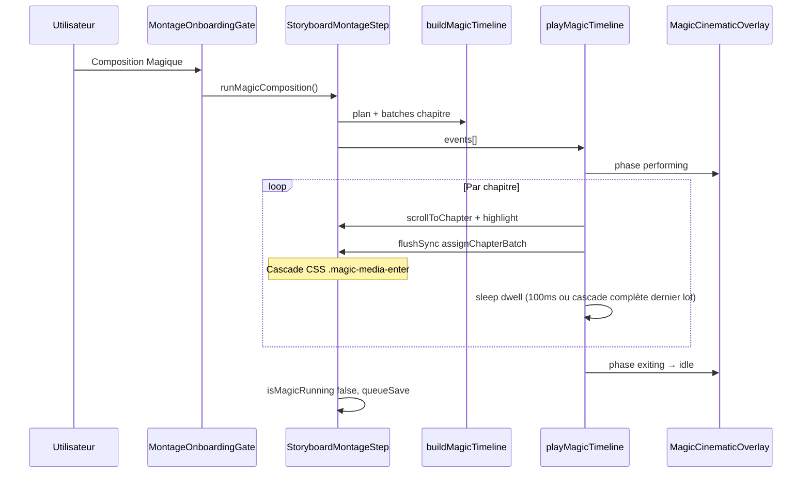

# Étape 5 — Le Livre Ouvert (Table de Montage)

**Dernière révision : juillet 2026 · PR-1/2/3 livrés sur `main` (`fdeb7da` → `41235e8`)**

Document canonique de l'Étape 5 du wizard hommage. Complète [`STORYBOARD_REFACTOR.md`](STORYBOARD_REFACTOR.md) (ticket S5) et [`WIZARD_ARCHITECTURE.md`](WIZARD_ARCHITECTURE.md) (§ Step 5).

**Checklist QA manuelle :** [`QA_S5_MONTAGE_STEP.md`](QA_S5_MONTAGE_STEP.md)  
**Tokens visuels Composition Magique :** [`DESIGN_SYSTEM.md` §4.2](DESIGN_SYSTEM.md#42-composition-magique--étape-5)

---

## 1. Vision produit

### Paradigme « Le Livre Ouvert »

L'ancienne Étape 5 (onglets + timeline horizontale + banque en tiroir) reposait sur des métaphores de monteur vidéo. Le pivot produit (juillet 2026) impose :

- **Tout visible** — tous les chapitres empilés sur un seul scroll ; la mini-carte `StoryboardFilmMap` donne l'aperçu global.
- **Test « enfant de 5 ans »** — l'utilisateur voit son film entier, pas une abstraction temporelle.
- **Deux entrées** — **Composition Magique** (automation forte) ou **Je compose moi-même** (contrôle manuel).
- **Quiet Luxury / Gant Blanc** — retenue visuelle, vocabulaire humain, pas de jargon SaaS.

### Relation avec l'Étape 4

L'ordre **Musique (4) → Montage (5)** est fixe : la capacité recommandée d'un chapitre dépend de `durationSec` (choisie à l'Étape 4). Voir décision dans [`STORYBOARD_REFACTOR.md`](STORYBOARD_REFACTOR.md).

### Historique — Clean Slate → Livre Ouvert

| Phase | État |
|-------|------|
| Pre-Clean Slate | `SoundSignatureStep` — UI trompeuse (saisies ignorées par `coerceWizardState()`) |
| Clean Slate | Placeholder honnête dans `StoryboardMontageStep` |
| PR-1 (`fdeb7da`) | Squelette Livre Ouvert read-only |
| PR-2 (`cc5f668`) | DnD, multi-select, actions chapitre |
| PR-3 (`41235e8`) | Onboarding gate + Composition Magique cinématographique |

---

## 2. Livraisons par PR

### PR-1 — Squelette Livre Ouvert (`fdeb7da`)

| Ticket | Contenu |
|--------|---------|
| S5-A | Layout `StoryboardOpenBookLayout` — grille **280px \| 1fr** (desktop), stack vertical (mobile) |
| S5-B | `StoryboardFilmMap` sticky + scroll vers chapitre ; chapitres empilés (`StoryboardChapterStack`) |
| S5-C | Banque persistante `MediaBankColumn`, grilles `ChapterCanvasGrid` + ghost slots, données réelles branchées |

**Hors périmètre PR-1 :** DnD, autosave actions, audio.

### PR-2 — Interactivité (`cc5f668`)

| Ticket | Contenu |
|--------|---------|
| S5-D | Domaine : `storyboardAutoFill.ts`, `storyboardMedia.ts`, `storyboardDnd.ts` |
| S5-E | DnD global `dnd-kit` — banque ↔ chapitres, réordonnancement intra-chapitre et inter-chapitres |
| S5-F | Actions : Remplissage automatique, Vider, tiroir **Gérer** (`ChapterRefinementDrawer`) |

**Correctifs QA intégrés (même PR, post-review) :**

- Drop target multi-select → chapitre survolé (plus de redirection systématique vers Chapitre 2)
- Feedback couleur au dragover (thème chapitre + overlay teinté)
- Sélection multi intra-chapitre + drag vers autre chapitre / banque
- Réordonnancement des chapitres (poignée header)
- État sélection « fantôme » post-drag banque
- FilmMap — affichage surplus / design

### PR-3 — Composition Magique (`41235e8`)

| Ticket | Contenu |
|--------|---------|
| S5-G | `MontageOnboardingGate` — choix magie / manuel sur storyboard vierge |
| S5-H | Partition `storyboardMagicTimeline.ts` + lecteur `magicTimelinePlayer.ts` |
| S5-I | Overlay `MagicCinematicOverlay` — scrim profondeur Option B + capsule « Bouton Noir » |
| P0/P1 | Nettoyage domaine mort, perf React/GPU, cohérence copy `message` |

---

## 3. Architecture composants

```
StoryboardMontageStep.tsx          ← orchestrateur (DnDContext, magic, fetch médias)
├── StoryboardOpenBookLayout
│   ├── MediaBankColumn            ← banque « Médias non assignés »
│   ├── StoryboardFilmMap          ← mini-carte sticky (nav chapitres)
│   └── StoryboardChapterStack
│       └── StoryboardChapterBlock × N
│           ├── ChapterNarrativeHeader   (titre éditable inline)
│           ├── ChapterActionCluster     (auto-fill, vider, gérer)
│           └── ChapterCanvasGrid
│               └── MontageMediaCard × M  (DnD + magic CSS entrance)
├── MontageOnboardingGate          ← gate si storyboard vierge
├── MagicCinematicOverlay          ← scrim + capsule (phases performing/exiting)
├── ChapterRefinementDrawer        ← surplus, réordonnancement fin
└── MontageDirectorModal           ← édition focal / preview plein écran
```

### Fichiers `src/components/tribute/storyboard/`

| Fichier | Rôle | Statut |
|---------|------|--------|
| `StoryboardOpenBookLayout.tsx` | Grille desktop / stack mobile | ✅ actif |
| `StoryboardFilmMap.tsx` | Barres de remplissage par chapitre | ✅ actif |
| `StoryboardChapterStack.tsx` | Liste empilée des chapitres | ✅ actif |
| `StoryboardChapterBlock.tsx` | Article chapitre (drop zone, highlight magic) | ✅ actif |
| `ChapterNarrativeHeader.tsx` | Titre + métadonnées chanson | ✅ actif |
| `ChapterCanvasGrid.tsx` | Grille 6 col. / 3 col. mobile | ✅ actif |
| `CanvasGhostSlot.tsx` | Emplacements vides capacité | ✅ actif |
| `ChapterActionCluster.tsx` | Boutons d'action chapitre | ✅ actif |
| `MediaBankColumn.tsx` | Colonne banque + CTA Composition Magique | ✅ actif |
| `BankDraggableMediaTile.tsx` | Tuile banque draggable | ✅ actif |
| `MontageOnboardingGate.tsx` | Onboarding magie / manuel | ✅ actif |
| `MagicCinematicOverlay.tsx` | Overlay cinématographique | ✅ actif |
| `ChapterRefinementDrawer.tsx` | Tiroir Gérer (surplus, tri) | ✅ actif |
| `ChapterMusicPanel.tsx` | Panneau musique (Étape 4) | ✅ (hors Étape 5) |
| `MontageTimeline.tsx` | Timeline horizontale pré-pivot | ⚠️ orphelin — candidat suppression S10 |
| `MontageChapterTabs.tsx` | Onglets pré-pivot | ⚠️ types/copy seulement — candidat suppression |
| `MediaBankPanel.tsx` / `MediaBankTrigger.tsx` | Ancien tiroir banque | ⚠️ legacy — candidat suppression |
| `MediaInstantTile.tsx` | Tuile read-only PR-1 | ⚠️ remplacée par `BankDraggableMediaTile` en PR-2 |

### Fichiers domaine `src/lib/wizard/`

| Fichier | Rôle |
|---------|------|
| `storyboardMedia.ts` | Assignation, désassignation, réordonnancement médias |
| `storyboardAutoFill.ts` | `autoFillChapter`, `clearChapterMedia`, `isStoryboardMontageVirgin` |
| `storyboardDnd.ts` | IDs droppables, collision detection (`storyboardCollisionDetection`) |
| `storyboardMagicTimeline.ts` | Partition magique — shuffle, batches, constantes timing |
| `magicTimelinePlayer.ts` | Lecteur async — scroll, `flushSync`, phases overlay |
| `storyboardPacing.ts` | Capacité recommandée par chapitre (utilisée par magic + UI) |
| `storyboardHelpers.ts` | `setChapterLabel`, validation, `findChapterForMedia` |
| `chapterTheme.ts` | Palette couleur par index chapitre |

### Fichiers partagés `montage/`

| Fichier | Rôle Étape 5 |
|---------|--------------|
| `MontageMediaCard.tsx` | Carte DnD ; branche `magicEntrance` → CSS pur (pas Framer) |
| `MontageDirectorModal.tsx` | Modal directeur (focal, navigation) |
| `MontageFocalReticle.tsx` | Sélecteur point focal |

---

## 4. Flux Composition Magique



### Algorithme d'assignation

1. **Shuffle** Fisher-Yates des `unassignedIds`
2. **Round-robin** sur chapitres en respectant les capacités restantes (`storyboardPacing`)
3. **Regroupement** en lots par chapitre (`groupAssignmentsIntoChapterBatches`)
4. **Timeline** : pour chaque lot → `scrollToChapter` puis `assignChapterBatch`

### Phases overlay

| Phase | UI |
|-------|-----|
| `idle` | Pas d'overlay |
| `performing` | Scrim profondeur + capsule message |
| `exiting` | Fade-out 300 ms |

### Autosave pendant la magie

`TributeWizard` expose `onMagicPerformingChange` → `magicPerformingRef`. Tant que `performing === true`, `persistStoryboardRef` **ne déclenche pas** `queueSave`. Un `queueSave("immediate")` est appelé à la fin via `onMagicSequenceComplete`.

---

## 5. Design verrouillé — Composition Magique

> **Validation DP juillet 2026 — ne pas modifier sans accord produit.**

### Capsule « Bouton Noir » (3 couches CSS)

| Couche | Classe | Rôle |
|--------|--------|------|
| 1 | `.magic-capsule-enter` | Fade-in + translateY (300 ms) |
| 2 | `.magic-capsule-frame` | `bg-white/[0.06]`, bordure `--salon-cyan`, breathe 1,6 s |
| 3 | `.magic-capsule-text` | Halo opacity + text-shadow synchronisé |
| Spotlight | `.magic-capsule-spotlight` | `bg-black/60`, padding négatif — standard Design Guide |

### Scrim profondeur — Option B

| Couche | Classe | Rôle |
|--------|--------|------|
| Conteneur | `.magic-depth-scrim` | `z-[72]`, `contain: strict`, fade 280 ms |
| Vignette | `.magic-depth-scrim__vignette` | `radial-gradient` elliptique |
| Blur périphérique | `.magic-depth-scrim__blur` | `backdrop-filter: blur(5px)` + `mask-image` radial |

Capsule au-dessus : `z-[76]`.

Détail tokens : [`DESIGN_SYSTEM.md` §4.2](DESIGN_SYSTEM.md#42-composition-magique--étape-5).

---

## 6. Constantes timing (source de vérité)

**Règle maintenance :** toute modification de durée doit synchroniser **TypeScript** (`storyboardMagicTimeline.ts`) et **CSS** (`app/globals.css` classes `.magic-*`). L'overlay injecte certaines durées via `style.animationDuration` inline.

| Constante TS | Valeur | CSS associé |
|--------------|--------|-------------|
| `MAGIC_MEDIA_STAGGER_STEP_MS` | 45 ms | `--magic-stagger-step` |
| `MAGIC_MEDIA_ENTRANCE_MS` | 160 ms | `@keyframes magic-media-enter` |
| `MAGIC_OVERLAY_EXIT_MS` | 300 ms | `.is-exiting` transition |
| `MAGIC_CAPSULE_ENTER_MS` | 300 ms | `.magic-capsule-enter` |
| `MAGIC_CAPSULE_BREATHE_MS` | 1600 ms | `.magic-capsule-frame`, `.magic-capsule-text` |
| `MAGIC_DEPTH_SCRIM_ENTER_MS` | 280 ms | `.magic-depth-scrim` |
| `MAGIC_BATCH_INTER_CHAPTER_MS` | 100 ms | Dwell player entre chapitres |
| `MAGIC_SCROLL_MARGIN_TOP_PX` | 132 | `scrollMarginTop` chapitres (FilmMap sticky) |

**Budget perf cible :** cascade complète ~20 photos en **< 3 s** (batch par chapitre, pas 1 `flushSync`/photo).

---

## 7. Performance & React

| Mécanisme | Détail |
|-----------|--------|
| Batch chapitre | 1 `flushSync` + 1 `onStoryboardChange` par chapitre (pas par photo) |
| Cascade CSS | Stagger via `--magic-stagger-index` ; Framer bypass en mode `magicEntrance` |
| `React.memo` | `MagicCinematicOverlay`, `StoryboardFilmMap` |
| Refs entrée | `magicEntranceMediaIdsRef`, `magicEntranceStaggerRef` — pas de setState par vignette |
| Fin de séquence | `flushSync` groupe `isMagicRunning` + clear highlight |
| GPU | `will-change` retiré post-animation (`.magic-media-enter-done`) ; `backdrop-filter` off en `prefers-reduced-motion` |
| Callback stable | `onMagicComposition={handleChooseMagic}` |

**Goulet connu :** chaque lot re-rend l'arbre `StoryboardMontageStep` complet (DnD + toutes grilles). Acceptable (~2 passes/chapitre). Optimisations P2 optionnelles : memo `MontageMediaCard` / `StoryboardChapterBlock`.

---

## 8. Copy & i18n (v1 pragmatique)

Namespace principal : `dictionaries/fr.json` / `en.json` — clés `montage*`, `mediaBank*`.

| Clé | Usage UI |
|-----|----------|
| `stepMontageTitle` / `stepMontageDescription` | En-tête Étape 5 |
| `montageOnboardingMagic` / `Manual` | Gate onboarding |
| `montageMagicMessage` | Texte capsule Composition Magique |
| `mediaBankColumnTitle` | « Médias non assignés » |
| `mediaBankMagicComposition` | Bouton banque |
| `montageMagicToast` | Toast fin de séquence (si branché) |

**Dette copy :** certaines clés legacy (`montageActSparkLabel`, `montageUnassignedHint` « acte ») subsistent pour Preview / compat — passe linguistique narrative prévue (S5-L).

---

## 9. Code legacy & dette

| Élément | Action recommandée |
|---------|-------------------|
| `MontageTimeline.tsx` | Supprimer quand confirmé 0 import (ticket S10 ou cleanup dédié) |
| `MontageChapterTabs.tsx` | Idem |
| `MediaBankPanel.tsx`, `MediaBankTrigger.tsx` | Idem (ancien tiroir) |
| Duplication timing TS/CSS | Documenter ; envisager variables CSS `--magic-*` centralisées |
| `TributeWizard.tsx` ~1800 lignes | Découpage futur (identité, forfait) |
| Tests unitaires | `storyboardMagicTimeline.ts` — 0 test aujourd'hui |
| Pont `actTracks` Preview/Checkout | S8/S9/S10 — ne pas toucher |

---

## 10. Annexe — 4 dimensions sensorielles (spec A24)

Spec produit validée en session design. **État d'implémentation juillet 2026.**

### 10.1 Immersion sonore (S5-J) — ⏳ non implémenté

**Intention :** pendant le montage, l'utilisateur *ressent* la chanson du chapitre — pas un player SaaS.

| Élément spec | Cible |
|--------------|-------|
| Waveform fantôme | Fine ligne de progression derrière le titre chapitre |
| Play minimaliste | Bouton discret — preview Stingray (`/api/music/preview`) |
| Règle | Un seul flux audio à la fois ; pause au changement de chapitre |

**Fichiers probables :** `ChapterNarrativeHeader.tsx`, réutilisation logique `ChapterMusicPanel` / `HTMLAudioElement`.

### 10.2 Mode Focus organique (S5-K) — ⏳ non implémenté

**Intention :** quand l'utilisateur travaille un chapitre, le reste de l'écran s'efface (dim ~40 % + blur 2px).

| Élément spec | Cible |
|--------------|-------|
| Déclencheur | Hover prolongé ou clic dans la grille chapitre |
| Sortie | Scroll vers autre chapitre ou clic extérieur |
| Motion | `DURATION_BREATH` 320 ms, `EASE_OUT_LUXE` |
| Exclusion | Désactivé pendant Composition Magique (`isMagicRunning`) |

**Fichiers probables :** `StoryboardChapterBlock.tsx`, état `focusChapterId` dans `StoryboardMontageStep`.

### 10.3 Vocabulaire narratif (S5-L) — 🟡 partiel

**Intention :** parler de mémoire, pas de logiciel.

| Fait | Reste |
|------|-------|
| « Médias non assignés », « Composition Magique », « Gérer » | Namespace i18n dédié `storyboardMontage.*` |
| Copy Étape 5 mise à jour | Purger références « acte » / « timeline » dans clés legacy |
| | Passe FR/EN éditoriale Gant Blanc |

### 10.4 Matière & toucher — 🟡 partiel

**Intention :** chaque instant a du poids (hover lift, sélection chaleureuse).

| Livré (PR-1/2) | Reste |
|----------------|-------|
| Hover lift vignettes, ring sélection ambre/teal | Micro-interactions header chapitre |
| Highlight dragover coloré par thème | Grain / texture subtile (optionnel) |
| Ghost slots capacité | Micro-animations mobile tap/dock — [`MOBILE_WIZARD_STRATEGY.md`](MOBILE_WIZARD_STRATEGY.md) §3 **M0.5** ; haptics P3 optionnel |

### Tokens motion (spec — référence)

| Token | Valeur | Usage prévu |
|-------|--------|-------------|
| `EASE_OUT_LUXE` | `[0.16, 1, 0.3, 1]` | Déjà dans `src/lib/motion/easing.ts` |
| `DURATION_WHISPER` | 180 ms | Hover vignettes |
| `DURATION_BREATH` | 320 ms | Focus organique |
| `DURATION_RITUAL` | 480 ms | Transitions overlay |
| `DURATION_CEREMONY` | 1200 ms | Référence historique ; remplacé par batch CSS en PR-3 |

---

## 11. Prochaines étapes (roadmap)

### Priorité immédiate (produit)

1. **Bugs UX résiduels** — liste QA utilisateur post-PR-3
2. **Régression manuelle** — [`QA_S5_MONTAGE_STEP.md`](QA_S5_MONTAGE_STEP.md)

### Court terme — S5 suite

| Ticket | Contenu | Effort estimé |
|--------|---------|---------------|
| **S5-J** | Audio chapitre pendant montage | 0,5–1 j |
| **S5-K** | Mode Focus organique | 0,5–1 j |
| **S5-L** | Copy narrative + polish matière | 0,5 j |
| **Tests** | Unitaires `storyboardMagicTimeline.ts` | 0,5 j |
| **Cleanup** | Suppression fichiers orphelins `storyboard/` | 0,25 j |

### Moyen terme — storyboard global

| Ticket | Contenu |
|--------|---------|
| **S7** | Validation pacing visible Étape 5 (warnings par chapitre) |
| **S8** | Preview / teaser alignés chapitres dynamiques |
| **S9** | Checkout metadata `storyboard` canonique |
| **S10** | Purge `actTracks`, `montageHelpers`, composants legacy |

### Parallèle — commerce & infra

- Saga checkout v2 freemium
- Webhook RevShare 30 %
- Scanner Compagnon Phase A
- CI / tests automatisés (Jest/Vitest + Playwright)

---

## 12. Garde-fous

- Ne pas modifier la capsule / scrim sans validation DP.
- Garder le pont legacy Preview/Checkout jusqu'à S9 stabilisé.
- `tsc --noEmit` après chaque ticket.
- Tester 4 packages : `essential` (freemium), `signature`, `heritage`, `legendary`.
- Toute modif magic CSS ou constantes timing → mettre à jour ce document + `DESIGN_SYSTEM.md` §4.2.

---

*Document vivant — mettre à jour après chaque PR Étape 5 ou milestone S7–S10.*
