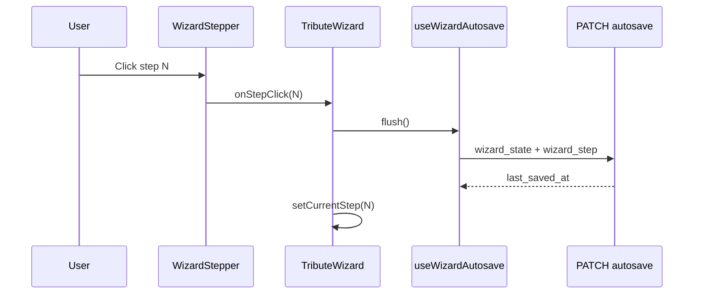
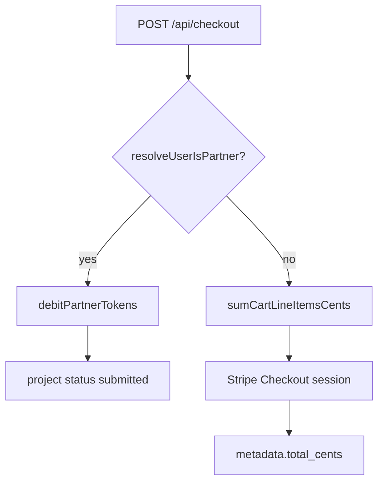

# Tribute Wizard — Architecture

**Last code review: June 2026**

This document describes the 8-step tribute wizard: navigation, state, autosave, and how montage acts map to soundtrack selection. Parent overview: [`TECHNICAL_ONBOARDING_ODYSSEY.md`](TECHNICAL_ONBOARDING_ODYSSEY.md) §4.7.

---

## Orchestrator

| File | Role |
|------|------|
| `src/components/tribute/TributeWizard.tsx` | Step routing, validation gates, autosave wiring, checkout handoff |
| `src/components/tribute/WizardStepper.tsx` | Visual stepper; click → `onStepClick` |
| `src/components/StickyPriceBar.tsx` | Sticky B2C total / B2B token cost (all steps) |
| `src/components/tribute/WizardBasePackagePicker.tsx` | Formula selection (steps 1–2) |
| `src/hooks/useWizardAutosave.ts` | Debounced + immediate PATCH to `/api/projects/[id]/autosave` |
| `src/components/tribute/AutosaveIndicator.tsx` | “Saving / Saved / Error” UX |
| `src/lib/wizard/pricingConfig.ts` | **Source of truth** — `WIZARD_PRICING` (cents + tokens) |
| `src/lib/wizard/wizardPricing.ts` | Cart math (`computeWizardCart`, integer cents only) |
| `src/lib/wizard/wizardState.ts` | `WizardStateV1` type + coercion/migration from legacy payloads |
| `src/lib/partner/partnerCheckout.ts` | B2B token debit (`partner_token_wallets`) |
| `src/lib/partner/resolvePartnerAccess.ts` | Partner role detection (`tenant_members`) |
| `app/api/projects/[id]/autosave/route.ts` | GET/PATCH with Zod schemas |
| `app/api/checkout/route.ts` | B2C Stripe or B2B token checkout |

`TOTAL_STEPS = 8` in `TributeWizard.tsx`.

---

## Step-by-step flow

| Step | Label (i18n key) | Main UI | Server / DB |
|------|------------------|---------|-------------|
| 1 | `stepperEssentials` | Name, dates, avatar, **formula** | `essentials`, `basePackage`; draft via `POST /api/projects/draft` |
| 2 | `stepperSources` | Social source + URL, formula (compact) | `socialSources`, `basePackage` |
| 3 | `stepperVault` | Dropzone + upload queue | `media_assets` rows; reload `GET /api/projects/[id]/media` |
| 4 | `stepperMontage` | Three-act timeline, focal points | `montage` |
| 5 | `stepperSound` | Stingray search (tier **standard** / **premium**), listen, choose per act | `musicalAmbiance.tracks` |
| 6 | `stepperExtensions` | Upsell cards + Heritage Pack; **bundle rules** when `basePackage=heritage` | `extensions` |
| 7 | `stepperPreview` | Copy + `CinematicTeaser` | Reads montage + tracks (no extra JSON section) |
| 8 | `stepperCheckout` | Cart recap + pay CTA | `POST /api/checkout` |

---

## Navigation and autosave



- **Back** button (top-left, steps 2+): same `flush()` then decrement step.
- Text fields use `queueSave("text")` — 800ms debounce.
- Step changes and explicit actions use `queueSave("immediate")` or `flush()`.

---

## `wizard_state` v1 shape

```typescript
// src/lib/wizard/wizardState.ts — simplified
{
  version: 1,
  isPartner?: true,                    // B2B UI flag (checkout uses tenant role)
  basePackage?: "essential" | "signature" | "heritage",
  pricing?: {
    basePackage: "signature",
    baseCents: 14900,                  // integers only
    optionsCents: 4900,
    totalCents: 19800,
    partnerTokenCost?: 2               // B2B only
  },
  essentials?: { firstName, lastName, birthDate, deathDate, avatarPath },
  socialSources?: { selected, url },
  montage?: {
    acts: { spark: string[], epic: string[], legacy: string[] },
    unassignedIds?: string[],
    excludedIds: string[],
    focalPoints: Record<mediaId, { x, y }>
  },
  extensions?: {
    aiRetouch?, extendedLicense?, collectorUsb?,
    digitalVault?, heritagePack?
  },
  musicalAmbiance?: {
    tracks?: {
      acte1?: { title, artist, trackId, coverUrl, previewUrl? },
      acte2?: { ... },
      acte3?: { ... }
    },
    catalogProvider?: "stingray" | "mock"
  }
}
```

**Legacy package id:** `prestige` is coerced to `signature` on read (`pricingConfig.ts`).

**Legacy (read-only migration, do not write on new saves):**
- `musicalAmbiance.mood`, `trackOrder`, `selectedTrack`, `catalogTrackId`
- Old `upsell` / `copyrightOption` → migrated to `extensions` via `wizardExtensions.ts`

---

## Montage ↔ music act mapping

Narrative montage uses English act IDs; licensed music uses French persist keys aligned with product copy.

| Montage (`montage.acts`) | Music (`musicalAmbiance.tracks`) | Product act |
|--------------------------|----------------------------------|-------------|
| `spark` | `acte1` | Spark |
| `epic` | `acte2` | Epic |
| `legacy` | `acte3` | Legacy |

`CinematicTeaser` and `teaserHelpers.ts` resolve slides per montage act and play the matching `acteN` track.

---

## Step 4 — Montage

- **Component:** `MontageStep.tsx`, `MontageDirectorModal.tsx`, `MontageMediaCard.tsx`
- **Helpers:** `montageHelpers.ts`, `montageDirector.ts`
- User assigns each uploaded `media_assets.id` to spark/epic/legacy, sets focal point (0–1), or excludes media.
- Validation before leaving step 4: at least one included photo in the timeline (see `TributeWizard` montage gate).

---

## Step 5 — Sound signature

- **Component:** `SoundSignatureStep.tsx`
- **API:** `GET /api/music/search?q=…` (see [`STINGRAY_MUSIC_INTEGRATION.md`](STINGRAY_MUSIC_INTEGRATION.md))
- UI: three act tabs (cover or “To choose”), debounced search, Listen / Choose per row.
- **No** mood-based catalog as primary UX (removed).

---

## Step 7 — Cinematic preview

| File | Role |
|------|------|
| `PreviewStep.tsx` | Marketing copy, CTA to checkout, link to edit earlier steps |
| `CinematicTeaser.tsx` | Photo crossfade per slide + audio from selected act track |
| `teaserHelpers.ts` | Slide list, duration estimate, act grouping |

Audio `src` uses `track.previewUrl` (typically `/api/music/preview?trackId=…`).

---

## Pricing — hybrid B2C / B2B (`pricingConfig.ts`)

**Rule:** all money is stored and computed as **integer USD cents** (no float dollars in cart math).

```typescript
// src/lib/wizard/pricingConfig.ts
export const PARTNER_TOKEN_COST_CENTS = 4000; // 40.00 USD per token (wholesale)

export const WIZARD_PRICING = {
  packages: {
    ESSENTIEL:  { id: "essential", priceCents: 7900,  tokens: 1 },   // 79.00 $
    SIGNATURE:  { id: "signature", priceCents: 14900, tokens: 2 },   // 149.00 $
    HERITAGE:   { id: "heritage",  priceCents: 29900, tokens: 4, musicCatalog: "premium" },
  },
  extensions: {
    RETOUCHE_IA:       { id: "aiRetouch",       priceCents: 4900 },
    LICENCE_PREMIUM:   { id: "extendedLicense", priceCents: 3900 },  // Option Licence Premium
    USB:               { id: "collectorUsb",    priceCents: 7900 },
    COFFRE_FORT:       { id: "digitalVault",    priceCents: 9900 },
    PACK_HERITAGE:     { id: "heritagePack",    priceCents: 14900 },
  },
};
```

| Helper | Role |
|--------|------|
| `packageCents(id)` | Base package cents |
| `packagePartnerTokens(id)` | B2B token debit for package |
| `extensionCents(id)` | Extension line cents |
| `computeWizardCart()` | `totalCents = baseCents + optionsCents` (integers); skips extensions bundled in Heritage |
| `sumCartLineItemsCents()` | Checkout verification (sum of line items) |
| `calculatePartnerMargin(packageId, tokens?)` | `priceCents − PARTNER_TOKEN_COST_CENTS × tokens` |
| `heritageBundleAlaCarteCents()` | Signature + Licence Premium + USB + Coffre (à la carte reference) |
| `calculateBundleSavings("heritage")` | `max(0, alaCarte − heritage.priceCents)` → **6700¢ (67 $)** |
| `bundleSavingsDollarsLabel(cents)` | Integer dollars for UI badges (`67`) |
| `isExtensionBundledInBasePackage()` | Heritage includes licence + USB + vault (no extra charge) |
| `resolveMusicCatalogTier()` | `standard` vs `premium` from package + extensions |

Display-only: `StickyPriceBar` converts `totalCents / 100` for B2C label `Total : {amount} $` (cart reflects bundle rules via `computeWizardCart`).

---

## Economic bundle — Heritage package (marketing + cart)

**Goal:** make the **Heritage** formula irresistible by showing savings vs buying Signature plus the main physical/digital options separately, while keeping **Signature** customers able to upsell via **Option Licence Premium** (39 $).

### Savings calculation

```text
à_la_carte = packageCents("signature")
           + extensionCents("extendedLicense")   // 39 $
           + extensionCents("collectorUsb")      // 79 $
           + extensionCents("digitalVault")      // 99 $
           = 14900 + 3900 + 7900 + 9900 = 36600¢ (366 $)

heritage     = packageCents("heritage") = 29900¢ (299 $)

savings      = calculateBundleSavings("heritage") = 6700¢ → UI: « Économisez 67 $ »
```

Implemented in `heritageBundleAlaCarteCents()` and `calculateBundleSavings()` (`pricingConfig.ts`). AI Retouch is **not** part of this comparison (remains an optional upsell on Heritage).

### UI — `WizardBasePackagePicker`

- On the **Heritage** card (B2C only, `hidePrices=false`): promo line from i18n `basePackageHeritageBundlePromo` — e.g. **« Le choix complet (Économisez 67 $) »**.
- Uses `bundleSavingsDollarsLabel(calculateBundleSavings("heritage"))` — no float math in the label.

### UI — step 6 extensions (`MontageExtensionsStep`)

When `basePackage === "heritage"`:

| Behaviour | Detail |
|-----------|--------|
| **Hide** Heritage Pack upsell | Pack targets Signature/Essentiel customers; redundant on Heritage formula |
| **Badge « Déjà inclus »** | `extendedLicense`, `collectorUsb`, `digitalVault` — cards disabled, price hidden |
| **Still purchasable** | `aiRetouch` (optional) |

Cart: `computeWizardCart()` does not add line items for bundled extension ids when base is Heritage (`isExtensionBundledInBasePackage`).

### Upsell path (Signature / Essentiel)

- Step 5: info banner if catalog tier is **standard** — prompts adding **Licence Premium** at step 6.
- Step 6: toggling `extendedLicense` unlocks **premium** catalog on step 5 (re-search with `tier=premium`).

See [`STINGRAY_MUSIC_INTEGRATION.md`](STINGRAY_MUSIC_INTEGRATION.md) for catalog tiers.

---

## Music catalog tiers (Standard vs Premium)

| Access | Packages / options | Search API |
|--------|-------------------|------------|
| **Standard** | Essentiel, Signature (default) | `GET /api/music/search?tier=standard` |
| **Premium** | Heritage (included), or **Option Licence Premium** (`extendedLicense`), or Heritage Pack | `GET /api/music/search?tier=premium` |

Resolution: `resolveMusicCatalogTier(basePackage, extensions)` in `pricingConfig.ts`; wired in `TributeWizard` → `SoundSignatureStep` (`catalogTier` prop).

Mock catalog (`stingrayCatalog.ts`): each track has `musicTier: "standard" | "premium"`; premium filter returns the full library, standard filter excludes premium-tier tracks.

---

## Step 8 — Checkout

- **Component:** `CheckoutStep.tsx` (B2C recap + pay / B2B token confirm)
- **API:** `app/api/checkout/route.ts`



### B2C (family)

- User **without** partner role on `tenant_members`.
- `StickyPriceBar`: **Total : {amount} $** (`amount = totalCents ÷ 100` at render time).
- `POST /api/checkout` → Stripe `line_items` with `unit_amount` in cents; metadata `total_cents`, `base_cents`, `options_cents`, `extensions`, `act_tracks`.

### B2B (funeral partner)

- `resolveUserIsPartner()` — roles `partner`, `partner_admin`, or `admin` on `tenant_members`.
- `StickyPriceBar`: **Cost: {tokens} token(s)** — **no `$` symbol** in partner UI.
- `POST /api/checkout` → `debitPartnerTokens()` on `partner_token_wallets` (migration P4); **no Stripe**.
- v1 debits **package tokens only** (extensions token pricing = roadmap).

| `basePackage` | `priceCents` (B2C list) | Tokens debited | Example margin* |
|---------------|-------------------------|----------------|-----------------|
| `essential` | 7900 (79 $) | 1 | 3900¢ (39 $) |
| `signature` | 14900 (149 $) | 2 | 6900¢ (69 $) |
| `heritage` | 29900 (299 $) | 4 | 13900¢ (139 $) |

\* `calculatePartnerMargin(packageId)` — partner sets their own retail price to families.

### UI pricing

| Component | Location | Role |
|-----------|----------|------|
| `StickyPriceBar` | Sticky under stepper, every step | Live **total** (B2C $) or **tokens** (B2B); reflects `computeWizardCart` including Heritage bundle rules |
| `WizardBasePackagePicker` | Steps 1–2 (`hidePrices` when partner) | Formula cards + **Heritage savings badge** (67 $) |
| `WizardCartSummary` | Steps 5–6 (B2C only) | Line recap |
| `SoundSignatureStep` | Step 5 | Catalog tier banner (Standard vs Premium upsell) |
| `MontageExtensionsStep` | Step 6 | Extensions + « Déjà inclus » when Heritage |

---

## Database

| Migration | Purpose |
|-----------|---------|
| `docs/sql/odyssey_p3_wizard_autosave.sql` | `wizard_state`, `wizard_step`, `last_saved_at` |
| `docs/sql/odyssey_p4_partner_token_wallets.sql` | B2B token balance + ledger |

| Column / table | Type | Purpose |
|----------------|------|---------|
| `projects.wizard_state` | jsonb | UI snapshot (includes `pricing`, `basePackage`) |
| `projects.wizard_step` | smallint | 1..10 (CHECK) |
| `projects.last_saved_at` | timestamptz | Server save time |
| `partner_token_wallets` | table | Per-tenant token balance (B2B) |
| `partner_token_ledger` | table | Debit/credit audit trail |

Index: `(user_id, status, last_saved_at DESC)` on `projects` for “resume latest draft” on dashboard.

---

## i18n

Copy lives in `dictionaries/fr.json` and `dictionaries/en.json` under `tributeWizard.*` (step titles, stepper labels, sound/extensions/preview/checkout strings).

---

## When you change this flow

Update this file and [`TECHNICAL_ONBOARDING_ODYSSEY.md`](TECHNICAL_ONBOARDING_ODYSSEY.md) §4.7 + §10 per team rule §13.
