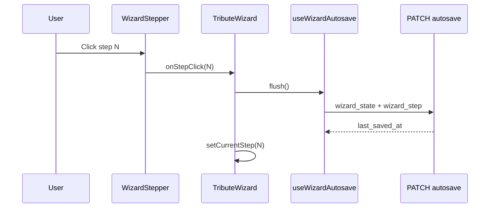
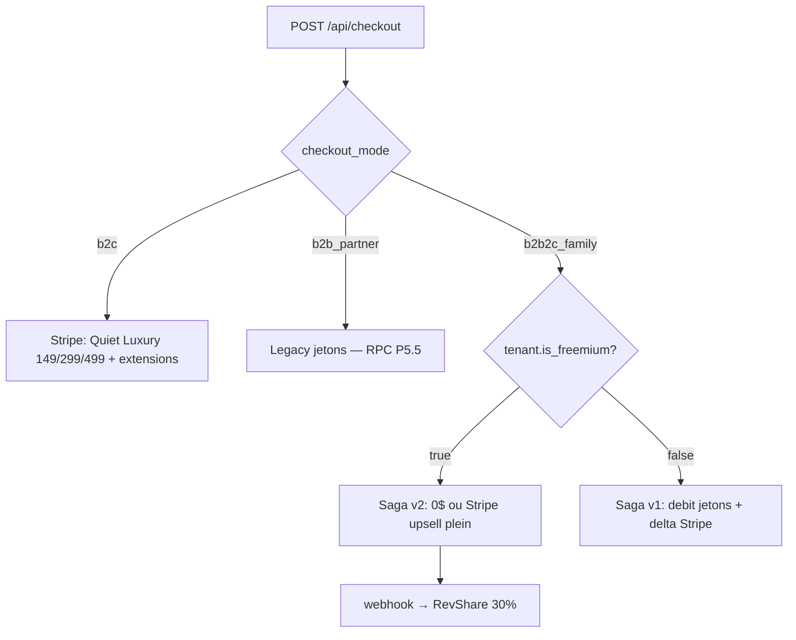

# Tribute Wizard — Architecture

**Last code review: July 2026 · B2B2C v2 + Storyboard foundations**

This document describes the 8-step tribute wizard: navigation, state, autosave, **song-based storyboard foundations**, pricing v2 (freemium B2B2C vs Quiet Luxury B2C), and checkout. Parent overview: [`TECHNICAL_ONBOARDING_ODYSSEY.md`](TECHNICAL_ONBOARDING_ODYSSEY.md) §4.7.

---

## Orchestrator

| File | Role |
|------|------|
| `src/components/tribute/TributeWizard.tsx` | Step routing, validation gates, autosave wiring, checkout handoff |
| `src/components/tribute/WizardStepper.tsx` | Visual stepper; click → `onStepClick` |
| `src/components/StickyPriceBar.tsx` | Sticky B2C total / B2B token cost (all steps) |
| `src/components/tribute/WizardBasePackagePicker.tsx` | Formula selection (steps 1–2) |
| `src/hooks/useWizardAutosave.ts` | Debounced + immediate PATCH to `/api/projects/[id]/autosave` |
| `src/components/tribute/AutosaveIndicator.tsx` | “Saving / Saved / Error” UX |
| `src/lib/wizard/wizardDeliverables.ts` | **Deliverables manifest** — `PACKAGE_MANIFEST`, lists by channel, limits, rendering, pacing |
| `src/lib/wizard/wizardDeliverables.utils.ts` | Présentation partenaire (cartes invitation, copy dérivée du manifeste) |
| `src/lib/wizard/pricingConfig.ts` | **Checkout cents** — `WIZARD_PRICING`, extensions, bundle 67 $ (aligné manifeste via `assertManifestPricingAlignedWithLegacyConfig`) |
| `src/lib/wizard/wizardPricing.ts` | Cart math (`computeWizardCart`, integer cents only) |
| `src/lib/wizard/wizardState.ts` | Canonical `storyboard` V2 + coercion/migration from legacy payloads + runtime bridge vers l'UI actuelle |
| `src/lib/partner/partnerCheckout.ts` | B2B token debit (`partner_token_wallets`) |
| `src/lib/partner/resolvePartnerAccess.ts` | Partner role detection (`tenant_members`) |
| `app/api/projects/[id]/autosave/route.ts` | GET/PATCH with Zod schemas |
| `app/api/checkout/route.ts` | Checkout (**cible** 3 modes — voir [`B2B2C_COMMERCE.md`](B2B2C_COMMERCE.md)) |
| `app/[lang]/(salon)/salon/` | Console partenaire Salon (header, portefeuille, `InvitationComposer` sur manifeste) — auth via layout |
| `src/components/scanner/ScannerCompanionPanel.tsx` | **Cible P6** — QR Scanner Compagnon (étape médias) — [`SCANNER_COMPANION.md`](SCANNER_COMPANION.md) |

`TOTAL_STEPS = 8` in `TributeWizard.tsx`.

---

## Deliverables manifest

The tribute wizard is **no longer a static 8-step product definition** in documentation alone: package capabilities (Salon vs Social, MP3 vs Stingray, token vs dollar display) are driven by [`src/lib/wizard/wizardDeliverables.ts`](../src/lib/wizard/wizardDeliverables.ts) (`PACKAGE_MANIFEST`).

**Canonical product doc:** [`DELIVERABLES_AND_PACKAGES.md`](DELIVERABLES_AND_PACKAGES.md) — marketing names Souvenir / Héritage / Éternité / Légendaire ↔ technical IDs `essential` / `signature` / `heritage` / `legendary` (P6).

### Pricing v2 — dédoublement canal (doc canon · code ⏳)

| Canal | Forfaits visibles | Règle |
|-------|-------------------|-------|
| **B2B2C freemium** (invitation partenaire) | **Souvenir** (0 $ offert) + upsell **Héritage 149 $** · **Éternité 299 $** | Lead-magnet · pas de Légendaire |
| **B2C direct** (Quiet Luxury) | **Héritage 149 $** · **Éternité 299 $** · **Légendaire 499 $** (Gants Blancs) | Pas de Souvenir · effet de leurre |
| **B2B legacy jetons** (`is_freemium = false`) | Souvenir / Héritage / Éternité en **jetons** | Coexistence P5.5 |

Voir [`B2B2C_COMMERCE.md`](B2B2C_COMMERCE.md) v2.

### Dynamic UI (target — foundations S1/S2 shipped)

| Rule (manifest) | Wizard behaviour |
|---------------|------------------|
| `storyboard.chapters[].song.source === 'stingray'` | Step 5 — selection Stingray par chapitre (**fondations S1/S2 prêtes ; UI S6 pending**) |
| `storyboard.chapters[].song.source === 'upload'` | Step 5 — MP3 personnel par chapitre + gatekeeper juridique (**not implemented**) |
| `social.enabled === true` | Additional Social step — Safe Music only, 9:16 preview (**not implemented**) |
| `social.enabled === false` | Hide Social step (e.g. **Souvenir** / `SOUVENIR`) |
| `limits.maxMediaItems` | Gate upload volume by package (**S3 pending**) |
| `limits.maxSongs` + `pacing.targetSecondsPerMedia` | Validate chapter capacity from real song duration (**S4 pending**) |
| `resolveTransactionMode()` | `StickyPriceBar` / pickers: **tokens** (partner) vs **dollars** (family) |

**Today:** `InvitationComposer` (Salon `/[lang]/salon`) reads the manifest + `packages.names` from dictionaries; `TributeWizard` uses `WizardBasePackagePicker` with **marketing labels** while persisting technical IDs (`essential` / `signature` / `heritage` / `legendary`). The canonical persisted model is now `storyboard`, but steps 4–7 still render through a temporary legacy bridge until the Storyboard UI refactor ships.

### Major architecture change — from 3 acts to song-based storyboard

The previous model coupled montage and music around **3 fixed acts**:

- `spark`
- `epic`
- `legacy`

This created a structural deadlock:

- the product contract allows **2 / 4 / 5 / 7 songs** depending on package
- the UI could only expose **3 music slots**
- pacing validation could never be enforced cleanly for higher tiers

The new canonical model solves this by moving to a **song-based storyboard**:

- `wizard_state.storyboard.chapters[]` becomes the source of truth
- each chapter owns an ordered list of `mediaIds`
- each chapter can own a `song`
- each song carries its real `durationSec`
- pacing can now be evaluated **per chapter**, not against an abstract 3-act shell

**Why this is better**

- natural sync between narration and music
- no hard-coded limit of 3 chapters
- direct path to MP3 uploads and Stingray chapters in the same model
- future pacing logic can use `durationSec / targetSecondsPerMedia`

**Current transition state**

- `storyboard` is now persisted as the canonical V2 shape
- `wizardState.ts` rebuilds temporary `montage` + `musicalAmbiance` legacy views at runtime
- steps 4–7 still render through this bridge until `S5–S8`

### i18n (marketing names)

| Technical ID | FR | EN | Dictionary keys |
|--------------|----|----|-----------------|
| `essential` | Souvenir | Keepsake | `packages.names.essential`, `tributeWizard.basePackageEssential` |
| `signature` | Héritage | Legacy | `packages.names.signature`, `tributeWizard.basePackageSignature` |
| `heritage` | Éternité | Eternity | `packages.names.heritage`, `tributeWizard.basePackageHeritage` |
| `legendary` | Légendaire | Legendary | `packages.names.legendary` *(P6 — B2C only)* |

See [`DELIVERABLES_AND_PACKAGES.md`](DELIVERABLES_AND_PACKAGES.md) and `src/lib/wizard/packageI18n.ts`.

### Pricing split

| Concern | Source |
|---------|--------|
| Deliverables, jetons, public $, Salon/Social flags | `wizardDeliverables.ts` |
| Cart line items, extension cents, Stripe totals | `pricingConfig.ts` + `wizardPricing.ts` |
| Drift guard | `assertManifestPricingAlignedWithLegacyConfig()` in `wizardDeliverables.ts` |

Do not duplicate package prices in UI strings — use `formatPackagePriceForMode(packageId, mode, locale)` after resolving `manifestPackageFromLegacy(basePackage)`.

---

## Step-by-step flow

| Step | Label (i18n key) | Main UI | Server / DB |
|------|------------------|---------|-------------|
| 1 | `stepperEssentials` | Name, dates, avatar, **formula** | `essentials`, `basePackage`; draft via `POST /api/projects/draft` |
| 2 | `stepperSources` | Social source + URL, formula (compact) | `socialSources`, `basePackage` |
| 3 | `stepperVault` | Dropzone + upload queue + **Scanner Compagnon QR** (cible) | `media_assets` rows; reload `GET /api/projects/[id]/media` · voir [`SCANNER_COMPANION.md`](SCANNER_COMPANION.md) |
| 4 | `stepperMontage` | Legacy 3-column timeline UI (temporary) backed by canonical storyboard | `storyboard` (projected to `montage` bridge) |
| 5 | `stepperSound` | Legacy 3-track Stingray UI (temporary) backed by canonical storyboard | `storyboard` (projected to `musicalAmbiance` bridge) |
| 6 | `stepperExtensions` | Upsell cards + Heritage Pack; **bundle rules** when `basePackage=heritage` | `extensions` |
| 7 | `stepperPreview` | Copy + `CinematicTeaser` | Reads canonical `storyboard` through the temporary legacy preview bridge |
| 8 | `stepperCheckout` | Cart recap + pay CTA | `POST /api/checkout` |

---

## Navigation and autosave



- **Back** button (top-left, steps 2+): same `flush()` then decrement step.
- Text fields use `queueSave("text")` — 800ms debounce.
- Step changes and explicit actions use `queueSave("immediate")` or `flush()`.

---

## `wizard_state` v2 shape

```typescript
// src/lib/wizard/wizardState.ts — simplified
{
  version: 2,
  isPartner?: true,                    // B2B UI flag (checkout uses tenant role)
  basePackage?: "essential" | "signature" | "heritage" | "legendary",  // legendary = B2C P6
  pricing?: {
    basePackage: "signature",
    baseCents: 14900,                  // integers only
    optionsCents: 4900,
    totalCents: 19800,
    partnerTokenCost?: 2               // B2B only
  },
  essentials?: { firstName, lastName, birthDate, deathDate, avatarPath },
  socialSources?: { selected, url },
  storyboard?: {
    chapters: Array<{
      id: string,
      mediaIds: string[],
      song?: (
        | { source: "stingray", trackId, title, artist, coverUrl?, durationSec? }
        | { source: "upload", storagePath, title, fileName?, mimeType?, artist?, durationSec? }
      )
    }>,
    unassignedIds?: string[],
    excludedIds: string[],
    focalPoints: Record<mediaId, { x, y }>
  },
  extensions?: {
    aiRetouch?, extendedLicense?, collectorUsb?,
    digitalVault?, heritagePack?
  }
}
```

**Runtime bridge during transition:** `coerceWizardState()` still reconstructs temporary `montage` and `musicalAmbiance` views from `storyboard` so the existing UI keeps working while Storyboard UI tickets ship.

**Legacy package id:** `prestige` is coerced to `signature` on read (`pricingConfig.ts`).

**Legacy accepted in read / migration only (do not write on new saves):**
- `musicalAmbiance.mood`, `trackOrder`, `selectedTrack`, `catalogTrackId`
- Old `upsell` / `copyrightOption` → migrated to `extensions` via `wizardExtensions.ts`
- `montage.acts.spark|epic|legacy`
- `musicalAmbiance.tracks.acte1|acte2|acte3`

---

## Storyboard transition bridge

To preserve backward compatibility while the UI still renders 3 legacy slots, the first three storyboard chapters are projected as follows:

| Canonical storyboard chapter | Legacy montage bridge | Legacy music bridge |
|------------------------------|-----------------------|---------------------|
| `chapters[0]` | `spark` | `acte1` |
| `chapters[1]` | `epic` | `acte2` |
| `chapters[2]` | `legacy` | `acte3` |

Additional chapters beyond index 2 are temporarily projected into `unassignedIds` on the runtime montage bridge so the old UI does not silently lose media.

---

## Step 4 — Montage

- **Component:** `MontageStep.tsx`, `MontageDirectorModal.tsx`, `MontageMediaCard.tsx`
- **Helpers:** `montageHelpers.ts`, `montageDirector.ts`
- **Current UI:** user assigns each uploaded `media_assets.id` to `spark/epic/legacy`, sets focal point (0–1), or excludes media.
- **Canonical state:** those assignments are now persisted under `storyboard.chapters[]` and projected back to the legacy 3-column UI at runtime.
- Validation before leaving step 4: at least one included photo in the timeline (see `TributeWizard` montage gate).

---

## Step 5 — Sound signature

- **Component:** `SoundSignatureStep.tsx`
- **API:** `GET /api/music/search?q=…` (see [`STINGRAY_MUSIC_INTEGRATION.md`](STINGRAY_MUSIC_INTEGRATION.md))
- **Current UI:** three legacy act tabs (cover or “To choose”), debounced search, Listen / Choose per row.
- **Canonical state:** selected music is now persisted under `storyboard.chapters[].song` and projected back to `acte1/acte2/acte3` during the transition.
- **No** mood-based catalog as primary UX (removed).

---

## Step 7 — Cinematic preview

| File | Role |
|------|------|
| `PreviewStep.tsx` | Marketing copy, CTA to checkout, link to edit earlier steps |
| `CinematicTeaser.tsx` | Photo crossfade per slide + audio from selected track |
| `teaserHelpers.ts` | Slide list, duration estimate, temporary bridge grouping |

Audio `src` uses `track.previewUrl` (typically `/api/music/preview?trackId=…`). Until `S8`, preview still consumes the legacy bridge rebuilt from `storyboard`.

---

## Pricing — hybrid B2C / B2B / B2B2C v2

**Rule:** all money is stored and computed as **integer USD cents** (no float dollars in cart math).

**Source of truth (target v2):** [`DELIVERABLES_AND_PACKAGES.md`](DELIVERABLES_AND_PACKAGES.md) · [`B2B2C_COMMERCE.md`](B2B2C_COMMERCE.md).

### Grille cible v2 (cents)

| Technical ID | Marketing | B2C direct | B2B2C freemium (famille) | Legacy jetons |
|--------------|-----------|------------|--------------------------|---------------|
| `essential` | Souvenir | **Non vendu** | **0** (offert) | 1 |
| `signature` | Héritage | **14 900** (149 $) | **14 900** (upsell plein) | 2 |
| `heritage` | Éternité | **29 900** (299 $) | **29 900** (upsell plein) | 4 |
| `legendary` | Légendaire (Gants Blancs) | **49 900** (499 $) | **Non proposé** | — |

**Current transition state** (`pricingConfig.ts`) — catalogue v2 in place; downstream consumers still migrating.

```typescript
// src/lib/wizard/pricingConfig.ts — current v2 catalog
export const PARTNER_TOKEN_COST_CENTS = 4000; // legacy wholesale

export const WIZARD_PRICING = {
  packages: {
    ESSENTIEL:  { id: "essential", priceCents: 0,     tokens: 1 },
    SIGNATURE:  { id: "signature", priceCents: 14900, tokens: 2 },
    HERITAGE:   { id: "heritage",  priceCents: 29900, tokens: 4, musicCatalog: "premium" },
    LEGENDAIRE: { id: "legendary", priceCents: 49900, tokens: 0, musicCatalog: "premium" },
  },
  extensions: { /* aiRetouch, extendedLicense, collectorUsb, digitalVault, heritagePack */ },
};

export const WIZARD_B2C_DIRECT_PACKAGES = ["signature", "heritage", "legendary"];
export const WIZARD_PARTNER_GRANTED_PACKAGES = ["essential", "signature", "heritage"];
```

| Helper | Role |
|--------|------|
| `packageCents(id)` | Base package cents |
| `packagePartnerTokens(id)` | B2B legacy token debit (strictly no `legendary`) |
| `computeWizardCart()` | `totalCents = baseCents + optionsCents` |
| `computeB2B2CFamilyPricing()` | **Cible v2** — freemium prix plein upsell vs legacy delta |
| `calculatePartnerMargin()` | Legacy jetons wholesale margin |

Display-only: `StickyPriceBar` converts `totalCents / 100` for B2C label `Total : {amount} $` (cart reflects bundle rules via `computeWizardCart`).

---

## Economic bundle — Heritage package (marketing + cart)

**Goal:** make the **Heritage** formula irresistible by showing savings vs buying Signature plus the main physical/digital options separately, while keeping **Signature** customers able to upsell via **Option Licence Premium** (39 $).

### Savings calculation

```text
à_la_carte = packageCents("signature")
           + extensionCents("extendedLicense")   // 39 $
           + extensionCents("collectorUsb")      // 79 $
           + extensionCents("digitalVault")      // 99 $
           = 14900 + 3900 + 7900 + 9900 = 36600¢ (366 $)

heritage     = packageCents("heritage") = 29900¢ (299 $)

savings      = calculateBundleSavings("heritage") = 6700¢ → UI: « Économisez 67 $ »
```

Implemented in `heritageBundleAlaCarteCents()` and `calculateBundleSavings()` (`pricingConfig.ts`). AI Retouch is **not** part of this comparison (remains an optional upsell on Heritage).

### UI — `WizardBasePackagePicker`

- On the **Heritage** card (B2C only, `hidePrices=false`): promo line from i18n `basePackageHeritageBundlePromo` — e.g. **« Le choix complet (Économisez 67 $) »**.
- Uses `bundleSavingsDollarsLabel(calculateBundleSavings("heritage"))` — no float math in the label.

### UI — step 6 extensions (`MontageExtensionsStep`)

When `basePackage === "heritage"`:

| Behaviour | Detail |
|-----------|--------|
| **Hide** Heritage Pack upsell | Pack targets Signature/Essentiel customers; redundant on Heritage formula |
| **Badge « Déjà inclus »** | `extendedLicense`, `collectorUsb`, `digitalVault` — cards disabled, price hidden |
| **Still purchasable** | `aiRetouch` (optional) |

Cart: `computeWizardCart()` does not add line items for bundled extension ids when base is Heritage (`isExtensionBundledInBasePackage`).

### Upsell path (Signature / Essentiel)

- Step 5: info banner if catalog tier is **standard** — prompts adding **Licence Premium** at step 6.
- Step 6: toggling `extendedLicense` unlocks **premium** catalog on step 5 (re-search with `tier=premium`).

See [`STINGRAY_MUSIC_INTEGRATION.md`](STINGRAY_MUSIC_INTEGRATION.md) for catalog tiers.

---

## Music catalog tiers (Standard vs Premium)

| Access | Packages / options | Search API |
|--------|-------------------|------------|
| **Standard** | Essentiel, Signature (default) | `GET /api/music/search?tier=standard` |
| **Premium** | Heritage (included), or **Option Licence Premium** (`extendedLicense`), or Heritage Pack | `GET /api/music/search?tier=premium` |

Resolution: `resolveMusicCatalogTier(basePackage, extensions)` in `pricingConfig.ts`; wired in `TributeWizard` → `SoundSignatureStep` (`catalogTier` prop).

Mock catalog (`stingrayCatalog.ts`): each track has `musicTier: "standard" | "premium"`; premium filter returns the full library, standard filter excludes premium-tier tracks.

---

## Step 8 — Checkout

- **Component:** `CheckoutStep.tsx` (recap + pay CTA)
- **API:** `app/api/checkout/route.ts`
- **Référence commerce :** [`B2B2C_COMMERCE.md`](B2B2C_COMMERCE.md) v2 (saga freemium · RevShare · legacy jetons)

**Implémentation actuelle :** 2 branches legacy (`isPartner` → jetons TS **ou** Stripe). **Cible v2 :** saga `tribute_checkouts` + branche `is_freemium` + webhook commission.

**Spike checkout v1 (jetons-first) : annulé** — remplacé par pivot B2B2C v2.



### Mode `b2c` (famille directe — Quiet Luxury)

- Pas d’invitation partenaire ; **pas de Souvenir**.
- Forfaits : **Héritage 149 $** · **Éternité 299 $** (recommandé) · **Légendaire 499 $** (Gants Blancs).
- Extensions à la carte · **pas de RevShare**.

### Mode `b2b_partner` (legacy jetons funérarium)

- Inchangé P5.5 · `StickyPriceBar` en jetons · pas de Stripe.

### Mode `b2b2c_family` — freemium (`is_freemium = true`)

- Souvenir offert → **`family_total_cents = 0`** → completed sans Stripe.
- Upsell Héritage / Éternité → **prix plein** + extensions → Stripe → webhook → **RevShare 30 %** ([`PARTNER_REVSHARE.md`](PARTNER_REVSHARE.md)).
- UX gant blanc : jamais « jeton » ni « commission ».

### Mode `b2b2c_family` — legacy (`is_freemium = false`)

- Débit jetons P5.5 · delta famille · pas de RevShare v2.

### UI pricing

| Component | Location | Role |
|-----------|----------|------|
| `StickyPriceBar` | Sticky under stepper, every step | Live **total** (B2C $) or **tokens** (B2B); reflects `computeWizardCart` including Heritage bundle rules |
| `WizardBasePackagePicker` | Steps 1–2 (`hidePrices` when partner) | Formula cards + **Heritage savings badge** (67 $) |
| `WizardCartSummary` | Steps 5–6 (B2C only) | Line recap |
| `SoundSignatureStep` | Step 5 | Catalog tier banner (Standard vs Premium upsell) |
| `MontageExtensionsStep` | Step 6 | Extensions + « Déjà inclus » when Heritage |

---

## Database

| Migration | Purpose |
|-----------|---------|
| `docs/sql/odyssey_p3_wizard_autosave.sql` | `wizard_state`, `wizard_step`, `last_saved_at` |
| `docs/sql/odyssey_p4_partner_token_wallets.sql` | Wallets + ledger |
| `docs/sql/odyssey_p4_1_security_fixes.sql` | RLS wallets/ledger (`partner` / `partner_admin`) |
| `docs/sql/odyssey_p5_b2b2c_core.sql` | `partner_invitations`, `tribute_checkouts`, RPC débit |
| `docs/sql/odyssey_p6_freemium_revshare.sql` | **Appliqué** — `is_freemium`, commission ledger, `scan_sessions` stub, RPC accrue/clawback |

| Column / table | Type | Purpose |
|----------------|------|---------|
| `projects.wizard_state` | jsonb | UI snapshot canonique V2 (`storyboard`, `pricing`, `basePackage`) |
| `projects.wizard_step` | smallint | 1..10 (CHECK) |
| `projects.last_saved_at` | timestamptz | Server save time |
| `projects.invitation_id` | uuid FK | Lien invitation B2B2C (P5) |
| `tenants.is_freemium` | boolean | **P6** — canal acquisition Souvenir gratuit |
| `partner_invitations` | table | Forfait offert, email, statut invitation |
| `tribute_checkouts` | table | Saga checkout (`checkout_mode`, `commission_*` P6) |
| `partner_token_wallets` | table | Solde jetons legacy par tenant |
| `partner_token_ledger` | table | Audit jetons ; `tribute_checkout_id` (P5) |
| `partner_commission_balances` | table | **P6** — agrégat RevShare par tenant (`accrued_cents`, `paid_cents`) |
| `partner_commission_ledger` | table | **P6** — journal append-only commissions (accrual, clawback, payout) |
| `scan_sessions` | table | **P6 Part B** — sessions QR Scanner Compagnon |

Fonctions legacy : `debit_partner_tokens_for_checkout(uuid)` — **`service_role`** only.

Fonctions cibles P6 : `accrue_partner_commission_for_checkout`, `clawback_partner_commission`, `record_partner_commission_payout` — voir [`PARTNER_REVSHARE.md`](PARTNER_REVSHARE.md).

Index: `(user_id, status, last_saved_at DESC)` on `projects` for “resume latest draft” on dashboard.

Ordre SQL : [`docs/sql/README.md`](sql/README.md).

---

## i18n

Copy lives in `dictionaries/fr.json` and `dictionaries/en.json` under `tributeWizard.*` (step titles, stepper labels, sound/extensions/preview/checkout strings).

---

## When you change this flow

Update this file, [`DELIVERABLES_AND_PACKAGES.md`](DELIVERABLES_AND_PACKAGES.md), [`STORYBOARD_REFACTOR.md`](STORYBOARD_REFACTOR.md), [`B2B2C_COMMERCE.md`](B2B2C_COMMERCE.md), [`PARTNER_REVSHARE.md`](PARTNER_REVSHARE.md), [`SCANNER_COMPANION.md`](SCANNER_COMPANION.md), and [`TECHNICAL_ONBOARDING_ODYSSEY.md`](TECHNICAL_ONBOARDING_ODYSSEY.md) §4.7 + §5 + §10 per team rule §13.
