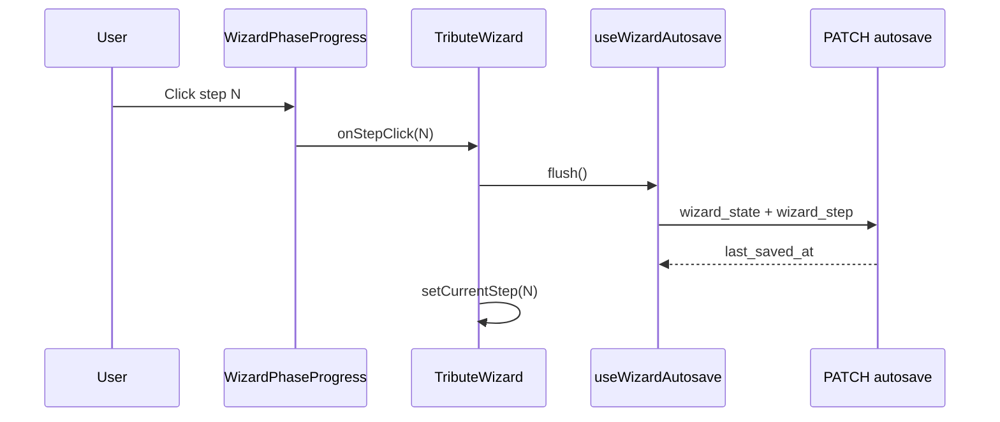
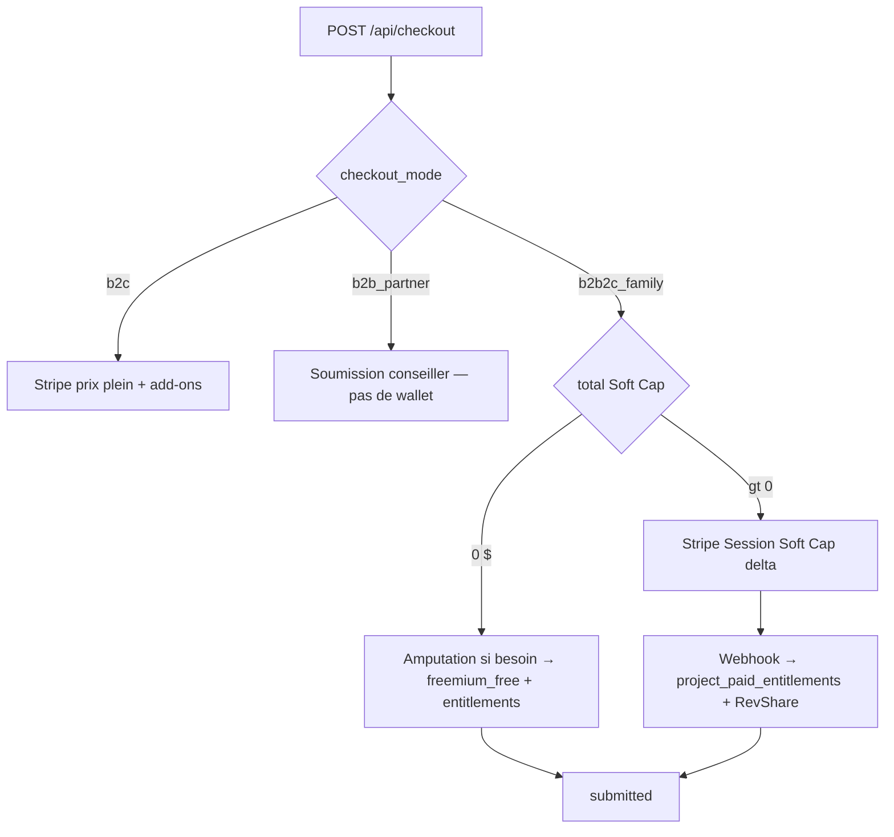

# Tribute Wizard — Architecture

**Last code review: 20 juillet 2026 · Freemium V1 Phases 0–4 ✅ · Soft Cap UX livré**

> **Canon V1 :** [`FREEMIUM_V1_PIVOT.md`](FREEMIUM_V1_PIVOT.md) · Soft Cap [`NARRATIVE_SOFT_CAP.md`](NARRATIVE_SOFT_CAP.md) · Commerce [`B2B2C_COMMERCE.md`](B2B2C_COMMERCE.md).  
> **État :** `grantedPackage` + `intendedPackage` + `extensions.musicLicense` (aliases UI legacy OK).

This document describes the 8-step tribute wizard: navigation, state, autosave, **song-based storyboard**, pricing Freemium V1, and checkout. Parent overview: [`TECHNICAL_ONBOARDING_V1.md`](TECHNICAL_ONBOARDING_V1.md) § Wizard.

---

## Orchestrator

| File | Role |
|------|------|
| `src/components/tribute/TributeWizard.tsx` | Step routing, validation gates, autosave wiring, checkout handoff, global header (package Dossier + phase progress) |
| `src/hooks/useWizardStoryboard.ts` | Domaine storyboard pur — resync chapitres, doublons, validation structurelle, estimation durée ; autosave reste dans `TributeWizard` via `persistStoryboardRef` |
| `src/components/tribute/WizardPhaseProgress.tsx` | Minimalist 3-phase progress indicator (Déposer / Composer / Recevoir) — replaces the old 8-circle `WizardStepper` |
| `src/components/tribute/PackageDossierPanel.tsx` | Global off-canvas package selector (« Le Dossier ») — editorial trigger, exhaustive inclusions from `PACKAGE_MANIFEST`, cross-fade comparison, inline downgrade guard. Visible from Step 1 onward, replaces the per-step `WizardBasePackagePicker` and the short-lived `StoryboardPackageSwitcher` dropdown |
| `src/lib/wizard/packageDossier.ts` | Resolves a package's exhaustive inclusion rows from `PACKAGE_MANIFEST` for the Dossier |
| `src/components/StickyPriceBar.tsx` | Sticky total Soft Cap (`resolveWizardDisplayCart`) |
| `src/hooks/useWizardAutosave.ts` | Debounced + immediate PATCH to `/api/projects/[id]/autosave` |
| `src/components/tribute/AutosaveIndicator.tsx` | “Saving / Saved / Error” UX |
| `src/lib/wizard/wizardDeliverables.ts` | **Deliverables manifest** — `PACKAGE_MANIFEST`, lists by channel, limits, rendering, pacing |
| `src/lib/wizard/wizardDeliverables.utils.ts` | Présentation partenaire (cartes invitation, copy dérivée du manifeste) |
| `src/lib/wizard/pricingConfig.ts` | **Checkout cents** — `WIZARD_PRICING`, extensions, bundle 67 $ (aligné manifeste via `assertManifestPricingAlignedWithLegacyConfig`) |
| `src/lib/wizard/wizardPricing.ts` | Cart math (`computeWizardCart`, integer cents only) |
| `src/lib/wizard/wizardState.ts` | Canonical `storyboard` V2 + coercion/migration from legacy payloads + runtime bridge vers l'UI actuelle |
| `src/components/tribute/StoryboardChaptersStep.tsx` | **Step 4 (live)** — chapitres musicaux dynamiques, panneau musique (`ChapterMusicPanel`, inline), bandeau éducatif, doublons, stats forfait |
| `src/lib/wizard/storyboardPacing.ts` | Moteur de pacing pur — capacité recommandée, marges intro/outro, coût vidéo fixe, estimation durée totale |
| `src/lib/wizard/storyboardHelpers.ts` | Gestion des chapitres (ajout/retrait/cap), validation structurelle, détection de doublons, prévision de perte au downgrade, `findChapterForMedia()` |
| `src/lib/wizard/chapterTheme.ts` | Palette dynamique par chapitre (`getChapterCardTheme`) |
| `src/components/tribute/StoryboardMontageStep.tsx` | **Step 5 (live)** — Livre Ouvert : banque persistante, DnD, Composition Magique — [`STORYBOARD_STEP5_LIVRE_OUVERT.md`](STORYBOARD_STEP5_LIVRE_OUVERT.md) |
| `src/lib/wizard/storyboardMedia.ts` | Assignation / désassignation / réordonnancement médias (Étape 5) |
| `src/lib/wizard/storyboardAutoFill.ts` | `autoFillChapter`, `clearChapterMedia`, `isStoryboardMontageVirgin` |
| `src/lib/wizard/storyboardDnd.ts` | Collision detection et IDs droppables dnd-kit (Étape 5) |
| `src/lib/wizard/storyboardMagicTimeline.ts` | Partition Composition Magique — shuffle, batches, constantes timing |
| `src/lib/wizard/magicTimelinePlayer.ts` | Lecteur async timeline magique (`playMagicTimeline`) |
| `src/components/tribute/storyboard/MagicCinematicOverlay.tsx` | Overlay scrim + capsule (Composition Magique) |
| `src/components/tribute/storyboard/MontageOnboardingGate.tsx` | Gate onboarding magie / manuel |
| `src/components/tribute/montage/MontageDirectorModal.tsx` | Modal directeur plein écran — retypé chapitres |
| `src/components/tribute/montage/MontageMediaCard.tsx` | Carte média drag + entrée CSS magic |
| `src/components/tribute/montage/MontageFocalReticle.tsx` | Sélecteur point focal |
| `src/lib/wizard/softCap.ts` · `SoftCapModal.tsx` | Soft Cap médias / magie / musique dual |
| `src/lib/partner/resolvePartnerAccess.ts` | Partner role detection (`tenant_members`) |
| `app/api/projects/[id]/autosave/route.ts` | GET/PATCH with Zod schemas |
| `app/api/checkout/route.ts` | Checkout (**cible** 3 modes — voir [`B2B2C_COMMERCE.md`](B2B2C_COMMERCE.md)) |
| `app/[lang]/(salon)/salon/` | Console partenaire Salon (header, portefeuille, `InvitationComposer` sur manifeste) — auth via layout |
| `src/components/scanner/ScannerCompanionPanel.tsx` | **Cible P6** — QR Scanner Compagnon (étape médias) — [`SCANNER_COMPANION.md`](SCANNER_COMPANION.md) |

`TOTAL_STEPS = 8` in `TributeWizard.tsx`.

---

## Deliverables manifest

The tribute wizard is driven by [`wizardDeliverables.ts`](../src/lib/wizard/wizardDeliverables.ts) (`PACKAGE_MANIFEST`) and Soft Cap state (`granted` / `intended`).
**Canonical product doc:** [`DELIVERABLES_AND_PACKAGES.md`](DELIVERABLES_AND_PACKAGES.md) — marketing names Souvenir / Héritage / Éternité / Légendaire ↔ technical IDs `essential` / `signature` / `heritage` / `legendary` (P6).

### Pricing Freemium V1 — canaux (Phases 1–4 ✅)

| Canal | Forfaits visibles | Règle |
|-------|-------------------|-------|
| **B2B2C freemium** | **Souvenir** 0 $ + Soft Cap / upsell **Héritage 149 $** · **Éternité 299 $** + add-ons (`musicLicense`, etc.) | Lead-magnet · pas de Légendaire · **pas de jetons** |
| **B2C direct** | **Héritage 149 $** · **Éternité 299 $** · **Légendaire 499 $** | Pas de Souvenir |
| ~~B2B legacy jetons~~ | — | **PURGED P8** |

Voir [`B2B2C_COMMERCE.md`](B2B2C_COMMERCE.md) · [`FREEMIUM_V1_PIVOT.md`](FREEMIUM_V1_PIVOT.md).

### Soft Cap (Phase 4 ✅)

Voir [`NARRATIVE_SOFT_CAP.md`](NARRATIVE_SOFT_CAP.md) · UI `SoftCapModal` dans `TributeWizard`.

| Déclencheur | Effet |
|-------------|--------|
| ≥ 50 médias (filet) | Propose Héritage → `intended = signature` |
| Post Composition Magique | Soft Cap principal (si encore Souvenir) |
| Piste catalogue officiel | Dual Licence 39 $ / Héritage 149 $ — piste non bloquée |

`resolveMusicEntitlement(intended, extensions)` → catalogue officiel si `intended >= signature` **OU** `musicLicense`.

### Dynamic UI (S1–S4 + S6 + S5 partiel + Clean Slate)

| Rule (manifest) | Wizard behaviour |
|---------------|------------------|
| `storyboard.chapters[].song.source === 'stingray'` | **Step 4 (live)** — Stingray par chapitre ✅ |
| `storyboard.chapters[].song.source === 'upload'` | MP3 + ToS — Héritage+ · Phase 5 follow-up [`MUSIC_RIGHTS_ATTESTATION.md`](MUSIC_RIGHTS_ATTESTATION.md) |
| `limits.maxMediaItems` | Soft Cap filet à 50 ✅ · quotas `intended` |
| `resolveTransactionMode()` | Famille : **dollars Soft Cap** ; Salon : commissions |

**Today:** `InvitationComposer` (Salon `/[lang]/salon`) reads the manifest + `packages.names` from dictionaries. `TributeWizard` renders the global package Dossier (`PackageDossierPanel`) with **marketing labels** while persisting technical IDs (`essential` / `signature` / `heritage` / `legendary`); `WizardBasePackagePicker` has been removed. The canonical persisted model is now `storyboard`; Step 4 reads/writes `storyboard.chapters[].song` via `useWizardStoryboard`. **Step 5** is the live **Livre Ouvert** montage UI (`StoryboardMontageStep`) — DnD, actions chapitre, onboarding gate, and **Composition Magique** (see [`STORYBOARD_STEP5_LIVRE_OUVERT.md`](STORYBOARD_STEP5_LIVRE_OUVERT.md)). `SoundSignatureStep` was removed during Clean Slate. Steps 7–8 still use a temporary legacy bridge (`actTracks`) for Preview/Checkout until `S8`/`S9`.

### Design decisions — why (juillet 2026)

| Decision | Why |
|----------|-----|
| **Le Dossier** (off-canvas vs dropdown) | Reduce visual cognitive load (8 circles → 3 phases); avoid cheap e-commerce dropdown; package consultable from any step without polluting step body |
| **DEFAULT_B2C_BASE_PACKAGE = "heritage"** (Éternité, 299 $) | Psychological anchoring on real mid-tier B2C (149/299/499 $) + best savings ratio (67 $ badge); no card picker at Step 1 since `WizardBasePackagePicker` removal |
| **Step 4 ↔ 5 reorder** | Chapter media capacity depends on `durationSec` — music choice must precede media assignment |
| **Clean Slate Step 5** | `SoundSignatureStep` showed functional UI but inputs were silently ignored by `coerceWizardState()` — misleading UX, not mere tech debt |
| **`useWizardStoryboard`** | Isolate chapter domain from `TributeWizard` (~1780 lines) before `dnd-kit`; hook stays pure (no autosave) |
| **montage/* triage** | Purge 3-act logic (`MontageStep`, act columns); keep pure UI (`MontageDirectorModal`, `MontageMediaCard`, `MontageFocalReticle`) retyped for chapters |
| **`actTracks` kept read-only** | Preview/Checkout still depend on legacy bridge — removal would regress Steps 7–8 before `S8`/`S9` |
| **EMFILE / `ulimit -n 65536`** | Next.js Watchpack failed silently → 404 on all routes in dev; restart `npm run dev` with raised fd limit |

### Major architecture change — from 3 acts to song-based storyboard

The previous model coupled montage and music around **3 fixed acts**:

- `spark`
- `epic`
- `legacy`

This created a structural deadlock:

- the product contract allows **2 / 4 / 5 / 7 songs** depending on package
- the UI could only expose **3 music slots**
- pacing validation could never be enforced cleanly for higher tiers

The new canonical model solves this by moving to a **song-based storyboard**:

- `wizard_state.storyboard.chapters[]` becomes the source of truth
- each chapter owns an ordered list of `mediaIds`
- each chapter can own a `song`
- each song carries its real `durationSec`
- pacing can now be evaluated **per chapter**, not against an abstract 3-act shell

**Why this is better**

- natural sync between narration and music
- no hard-coded limit of 3 chapters
- direct path to MP3 uploads and Stingray chapters in the same model
- future pacing logic can use `durationSec / targetSecondsPerMedia`

**Current transition state**

- `storyboard` is now persisted as the canonical V2 shape
- `wizardState.ts` rebuilds temporary `montage` + `musicalAmbiance` legacy views at runtime for Preview/Checkout
- Steps 4–5 use canonical `storyboard` directly (`StoryboardChaptersStep` + `StoryboardMontageStep` Livre Ouvert)
- Steps 7–8 still render through the legacy bridge until `S8`/`S9`

### i18n (marketing names)

| Technical ID | FR | EN | Dictionary keys |
|--------------|----|----|-----------------|
| `essential` | Souvenir | Keepsake | `packages.names.essential`, `tributeWizard.basePackageEssential` |
| `signature` | Héritage | Legacy | `packages.names.signature`, `tributeWizard.basePackageSignature` |
| `heritage` | Éternité | Eternity | `packages.names.heritage`, `tributeWizard.basePackageHeritage` |
| `legendary` | Légendaire | Legendary | `packages.names.legendary` *(P6 — B2C only)* |

See [`DELIVERABLES_AND_PACKAGES.md`](DELIVERABLES_AND_PACKAGES.md) and `src/lib/wizard/packageI18n.ts`.

### Pricing split

| Concern | Source |
|---------|--------|
| Deliverables, jetons, public $, Salon/Social flags | `wizardDeliverables.ts` |
| Cart line items, extension cents, Stripe totals | `pricingConfig.ts` + `wizardPricing.ts` |
| Drift guard | `assertManifestPricingAlignedWithLegacyConfig()` in `wizardDeliverables.ts` |

Do not duplicate package prices in UI strings — use `formatPackagePriceForMode(packageId, mode, locale)` after resolving `manifestPackageFromLegacy(basePackage)`.

---

## Step-by-step flow

Package selection is no longer step-bound: the Dossier trigger (`PackageDossierPanel`) lives in the global sticky header from Step 1 onward.

| Step | Label (i18n key) | Main UI | Server / DB |
|------|------------------|---------|-------------|
| 1 | `stepperEssentials` | Name, dates, avatar | `essentials`, `basePackage`; draft via `POST /api/projects/draft` |
| 2 | `stepperSources` | Social source + URL | `socialSources`, `basePackage` |
| 3 | `stepperVault` | Dropzone + upload queue + **Scanner Compagnon QR** (cible) | `media_assets` rows; reload `GET /api/projects/[id]/media` · voir [`SCANNER_COMPANION.md`](SCANNER_COMPANION.md) |
| 4 | `stepperChapters` | **Chapitres musicaux dynamiques** (`StoryboardChaptersStep`, live — ✅ `S6`) | `storyboard.chapters[].song` (canonique, plus de bridge) |
| 5 | `stepperSound` | **Livre Ouvert** — `StoryboardMontageStep` (DnD, magie, actions chapitre) | `storyboard` (canonique) |
| 6 | `stepperExtensions` | Upsell cards + Heritage Pack; **bundle rules** when `basePackage=heritage` | `extensions` |
| 7 | `stepperPreview` | Copy + `CinematicTeaser` | Reads canonical `storyboard` through the temporary legacy preview bridge |
| 8 | `stepperCheckout` | Cart recap + pay CTA | `POST /api/checkout` |

---

## Navigation and autosave



- **Back** button (top-left, steps 2+): same `flush()` then decrement step.
- Text fields use `queueSave("text")` — 800ms debounce.
- Step changes and explicit actions use `queueSave("immediate")` or `flush()`.

---

## `wizard_state` v2 shape

```typescript
// src/lib/wizard/wizardState.ts — simplified
{
  version: 2,
  isPartner?: true,                    // B2B UI flag (checkout uses tenant role)
  basePackage?: "essential" | "signature" | "heritage" | "legendary",  // legendary = B2C P6
  pricing?: {
    basePackage: "signature",
    baseCents: 14900,                  // integers only
    optionsCents: 4900,
    totalCents: 19800,
    partnerTokenCost?: 2               // B2B only
  },
  essentials?: { firstName, lastName, birthDate, deathDate, avatarPath },
  socialSources?: { selected, url },
  storyboard?: {
    chapters: Array<{
      id: string,
      mediaIds: string[],
      song?: (
        | { source: "stingray", trackId, title, artist, coverUrl?, durationSec? }
        | { source: "upload", storagePath, title, fileName?, mimeType?, artist?, durationSec? }
      )
    }>,
    unassignedIds?: string[],
    excludedIds: string[],
    focalPoints: Record<mediaId, { x, y }>
  },
  extensions?: {
    aiRetouch?, extendedLicense?, collectorUsb?,
    digitalVault?, heritagePack?
  }
}
```

**Runtime bridge during transition:** `coerceWizardState()` still reconstructs temporary `montage` and `musicalAmbiance` views from `storyboard` so the existing UI keeps working while Storyboard UI tickets ship.

**Legacy package id:** `prestige` is coerced to `signature` on read (`pricingConfig.ts`).

**Legacy accepted in read / migration only (do not write on new saves):**
- `musicalAmbiance.mood`, `trackOrder`, `selectedTrack`, `catalogTrackId`
- Old `upsell` / `copyrightOption` → migrated to `extensions` via `wizardExtensions.ts`
- `montage.acts.spark|epic|legacy`
- `musicalAmbiance.tracks.acte1|acte2|acte3`

---

## Storyboard transition bridge

To preserve backward compatibility while the UI still renders 3 legacy slots, the first three storyboard chapters are projected as follows:

| Canonical storyboard chapter | Legacy montage bridge | Legacy music bridge |
|------------------------------|-----------------------|---------------------|
| `chapters[0]` | `spark` | `acte1` |
| `chapters[1]` | `epic` | `acte2` |
| `chapters[2]` | `legacy` | `acte3` |

Additional chapters beyond index 2 are temporarily projected into `unassignedIds` on the runtime montage bridge so the old UI does not silently lose media.

---

## Step 4 — Chapitres musicaux (live)

- **Component:** `StoryboardChaptersStep.tsx` (+ inline `ChapterMusicPanel`), `StoryboardCapacityBadge.tsx`, `StoryboardChapterStats.tsx`
- **Helpers:** `storyboardHelpers.ts`, `storyboardPacing.ts`
- **API:** `GET /api/music/search?q=…` (see [`STINGRAY_MUSIC_INTEGRATION.md`](STINGRAY_MUSIC_INTEGRATION.md))
- **Current UI:** un chapitre par chanson, pré-générés selon `minSongsRequired` (dérivé du volume média de l'Étape 3), extensibles jusqu'à `maxSongs` du forfait. Bandeau éducatif (durée piste recommandée), badge de capacité recommandée par chapitre, détection + acquittement obligatoire des doublons de chanson, tuiles de stats (médias / chansons).
- **Canonical state:** lit et écrit directement `storyboard.chapters[].song` — **aucun bridge legacy** sur cette étape.
- Validation avant de quitter l'étape 4 : structure `[minSongsRequired, maxSongs]` (`validateStoryboardPackageStructure`, bloquant) + acquittement doublons (bloquant, état local).

---

## Step 5 — Montage Livre Ouvert (live — S5 partiel)

**Canon:** [`STORYBOARD_STEP5_LIVRE_OUVERT.md`](STORYBOARD_STEP5_LIVRE_OUVERT.md) · **QA:** [`QA_S5_MONTAGE_STEP.md`](QA_S5_MONTAGE_STEP.md)

- **Component:** `StoryboardMontageStep.tsx` — layout Livre Ouvert, banque persistante, chapitres empilés, `StoryboardFilmMap`, DnD global `dnd-kit`, actions chapitre, onboarding gate, Composition Magique.
- **Why not placeholder anymore:** PR-1/2/3 (juillet 2026) replaced the post–Clean Slate placeholder with the full interactive experience.
- **Magic composition:** `buildMagicTimeline` → `playMagicTimeline` — batch per chapter + CSS cascade; overlay `MagicCinematicOverlay` (scrim Option B + capsule Bouton Noir, **design locked**).
- **Autosave:** suspended during magic via `magicPerformingRef` in `TributeWizard`; `queueSave("immediate")` on `onMagicSequenceComplete`.
- **Delivered (PR-1/2/3):** layout, FilmMap, DnD, multi-select, auto-fill / clear / refine drawer, magic sequence, QA fixes (drop target, ghost selection).
- **Remaining (S5-J/K/L):** chapter audio during montage, organic focus mode, narrative copy polish — see Step 5 doc §10–11.
- **Legacy orphan files:** `MontageTimeline.tsx`, `MontageChapterTabs.tsx` — candidate removal in S10 cleanup.

---

## Step 7 — Cinematic preview

| File | Role |
|------|------|
| `PreviewStep.tsx` | Marketing copy, CTA to checkout, link to edit earlier steps |
| `CinematicTeaser.tsx` | Photo crossfade per slide + audio from selected track |
| `teaserHelpers.ts` | Slide list, duration estimate, temporary bridge grouping |

Audio `src` uses `track.previewUrl` (typically `/api/music/preview?trackId=…`). Until `S8`, preview still consumes the legacy bridge rebuilt from `storyboard`.

---

## Pricing — Soft Cap / cents

**Rule:** integer USD cents only. Soft Cap cart = `computeWizardCartWithGrant` / `resolveWizardDisplayCart`.

**Source of truth:** [`DELIVERABLES_AND_PACKAGES.md`](DELIVERABLES_AND_PACKAGES.md) · [`FREEMIUM_V1_PIVOT.md`](FREEMIUM_V1_PIVOT.md) · `pricingConfig.ts`.

| Technical ID | Marketing | B2C | B2B2C famille |
|--------------|-----------|-----|---------------|
| `essential` | Souvenir | non vendu | **0 $** (granted) |
| `signature` | Héritage | 14 900¢ | 14 900¢ Soft Cap delta |
| `heritage` | Éternité | 29 900¢ | 29 900¢ |
| `legendary` | Légendaire | 49 900¢ | non proposé |

Helpers clés : `packageCents` · `computeWizardCart` · `computeWizardCartWithGrant` · `resolveMusicEntitlement`.  
~~`PARTNER_TOKEN_COST_CENTS` / `packagePartnerTokens` / wholesale~~ — **purgés** (ne plus documenter comme API vivante).

Add-ons V1 : `musicLicense`, `sanctuaryToken`, `storyVoice`, `memoryBook`, `aiRetouch`, `digitalVault` (aliases `extendedLicense` / `collectorUsb` OK en code legacy).

---

## Music catalog tiers

| Access | Quand | API |
|--------|--------|-----|
| **Standard** | Souvenir sans Soft Cap musique | `tier=standard` |
| **Premium (officiel)** | `intended >= signature` **OR** `musicLicense` | `tier=premium` |

`resolveMusicEntitlement` / Soft Cap browse premium on Souvenir — see [`STINGRAY_MUSIC_INTEGRATION.md`](STINGRAY_MUSIC_INTEGRATION.md) · [`NARRATIVE_SOFT_CAP.md`](NARRATIVE_SOFT_CAP.md).

---

## Step 8 — Checkout

- **UI:** `CheckoutStep.tsx` — panier Soft Cap · CTA rester à 0 $ · erreurs amputation
- **API:** `app/api/checkout/route.ts` — Soft Cap grant · `freemium_free` · Stripe
- **Commerce:** [`B2B2C_COMMERCE.md`](B2B2C_COMMERCE.md)

**Livré (Phase 3–4) :** Soft Cap cart, entitlements webhook, Soft Cap UX.  
**Next (Phase 5) :** Creatomate gated on `project_paid_entitlements`.

~~Saga jetons / debit wallet~~ — **PURGED**.

**Spike checkout v1 (jetons-first) : annulé** — remplacé par Freemium Soft Cap (Phases 3–4 ✅).

### Flux checkout Freemium V1



**Waterfall (upsell payant) :** Gross → Platform Fee 10 % → Net Distribuable → Commission 30 %.  
Détail : [`PARTNER_REVSHARE.md`](PARTNER_REVSHARE.md) · [`QA_P6_COMMISSION_WATERFALL.md`](QA_P6_COMMISSION_WATERFALL.md).

### Mode `b2c` (famille directe — Quiet Luxury)

- Pas d’invitation partenaire ; **pas de Souvenir**.
- Forfaits : **Héritage 149 $** · **Éternité 299 $** (recommandé) · **Légendaire 499 $** (Gants Blancs).
- Extensions à la carte · **pas de RevShare**.

### Mode `b2b_partner` (legacy jetons funérarium)

- Inchangé P5.5 · `StickyPriceBar` en jetons · pas de Stripe.

### Mode `b2b2c_family` — freemium (`is_freemium = true`)

- Souvenir offert → **`family_total_cents = 0`** → completed sans Stripe.
- Upsell Héritage / Éternité → **prix plein** + extensions → Stripe → webhook → **Bulletproof waterfall** (10 % platform · 30 % **Net Distribuable**) — [`PARTNER_REVSHARE.md`](PARTNER_REVSHARE.md).
- UX gant blanc : jamais « jeton » ni « commission ».

### Mode `b2b2c_family` — legacy (`is_freemium = false`)

- Débit jetons P5.5 · delta famille · pas de RevShare v2.

### UI pricing

| Component | Location | Role |
|-----------|----------|------|
| `StickyPriceBar` | Sticky under stepper, every step | Live **total** (B2C $) or **tokens** (B2B); reflects `computeWizardCart` including Heritage bundle rules |
| `PackageDossierPanel` | Global header, Step 1+ (`hidePrices` when partner) | Off-canvas — inclusions exhaustives + **Éternité savings badge** (67 $) + comparaison cross-fade |
| `WizardCartSummary` | Steps 5–6 (B2C only) | Line recap |
| `StoryboardMontageStep` | Step 5 | Livre Ouvert — DnD, Composition Magique — [`STORYBOARD_STEP5_LIVRE_OUVERT.md`](STORYBOARD_STEP5_LIVRE_OUVERT.md) |
| `MontageExtensionsStep` | Step 6 | Extensions + « Déjà inclus » when Heritage |

---

## Database

| Migration | Purpose |
|-----------|---------|
| `odyssey_p3_wizard_autosave.sql` | `wizard_state`, `wizard_step`, `last_saved_at` |
| `odyssey_p5_b2b2c_core.sql` | invitations, `tribute_checkouts` |
| `odyssey_p6_freemium_revshare.sql` | `is_freemium`, commission ledger |
| `odyssey_p6_1_bulletproof_waterfall.sql` | Net Distribuable waterfall |
| `odyssey_p7_media_quota_guard.sql` | Soft Cap media quota trigger |
| `odyssey_p8_freemium_v1_token_purge.sql` | **Purge jetons** · Soft Cap · entitlements · NFC |

| Column / table | Purpose |
|----------------|---------|
| `projects.wizard_state` | Snapshot V2 (`storyboard`, granted/intended, pricing) |
| `tenants.is_freemium` | Canal freemium |
| `tribute_checkouts` | Saga Soft Cap / Stripe |
| `partner_commission_*` | **Seul** solde partenaire post-P8 |
| `project_paid_entitlements` | Snapshot post-paiement (Phase 3+) |
| ~~`partner_token_*`~~ | **DROP P8** |

Ordre SQL : [`docs/sql/README.md`](sql/README.md).

---

## i18n

Copy lives in `dictionaries/fr.json` and `dictionaries/en.json` under `tributeWizard.*` (step titles, stepper labels, sound/extensions/preview/checkout strings).

---

## When you change this flow

Update this file, [`DELIVERABLES_AND_PACKAGES.md`](DELIVERABLES_AND_PACKAGES.md), [`STORYBOARD_REFACTOR.md`](STORYBOARD_REFACTOR.md), [`B2B2C_COMMERCE.md`](B2B2C_COMMERCE.md), [`PARTNER_REVSHARE.md`](PARTNER_REVSHARE.md), [`SCANNER_COMPANION.md`](SCANNER_COMPANION.md), and [`TECHNICAL_ONBOARDING_V1.md`](TECHNICAL_ONBOARDING_V1.md) §4.7 + §5 + §10 per team rule §13.
