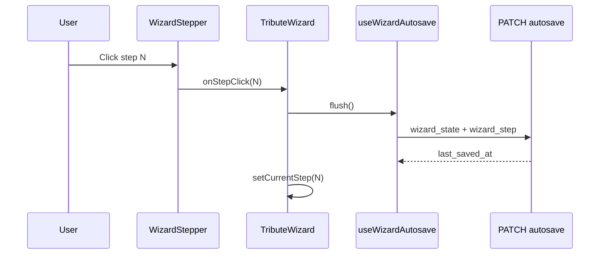

# Tribute Wizard — Architecture

**Last code review: June 2026**

This document describes the 8-step tribute wizard: navigation, state, autosave, and how montage acts map to soundtrack selection. Parent overview: [`TECHNICAL_ONBOARDING_ODYSSEY.md`](TECHNICAL_ONBOARDING_ODYSSEY.md) §4.7.

---

## Orchestrator

| File | Role |
|------|------|
| `src/components/tribute/TributeWizard.tsx` | Step routing, validation gates, autosave wiring, checkout handoff |
| `src/components/tribute/WizardStepper.tsx` | Visual stepper; click → `onStepClick` |
| `src/hooks/useWizardAutosave.ts` | Debounced + immediate PATCH to `/api/projects/[id]/autosave` |
| `src/components/tribute/AutosaveIndicator.tsx` | “Saving / Saved / Error” UX |
| `src/lib/wizard/wizardState.ts` | `WizardStateV1` type + coercion/migration from legacy payloads |
| `app/api/projects/[id]/autosave/route.ts` | GET/PATCH with Zod schemas |

`TOTAL_STEPS = 8` in `TributeWizard.tsx`.

---

## Step-by-step flow

| Step | Label (i18n key) | Main UI | Server / DB |
|------|------------------|---------|-------------|
| 1 | `stepperEssentials` | Name, dates, avatar | `essentials` in `wizard_state`; draft via `POST /api/projects/draft` |
| 2 | `stepperSources` | Social source + URL | `socialSources` |
| 3 | `stepperVault` | Dropzone + upload queue | `media_assets` rows; reload `GET /api/projects/[id]/media` |
| 4 | `stepperMontage` | Three-act timeline, focal points | `montage` |
| 5 | `stepperSound` | Stingray search, listen, choose per act | `musicalAmbiance.tracks` |
| 6 | `stepperExtensions` | Upsell cards + Heritage Pack | `extensions` |
| 7 | `stepperPreview` | Copy + `CinematicTeaser` | Reads montage + tracks (no extra JSON section) |
| 8 | `stepperCheckout` | Cart recap + pay CTA | `POST /api/checkout` |

---

## Navigation and autosave



- **Back** button (top-left, steps 2+): same `flush()` then decrement step.
- Text fields use `queueSave("text")` — 800ms debounce.
- Step changes and explicit actions use `queueSave("immediate")` or `flush()`.

---

## `wizard_state` v1 shape

```typescript
// src/lib/wizard/wizardState.ts — simplified
{
  version: 1,
  essentials?: { firstName, lastName, birthDate, deathDate, avatarPath },
  socialSources?: { selected, url },
  montage?: {
    acts: { spark: string[], epic: string[], legacy: string[] },
    unassignedIds?: string[],
    excludedIds: string[],
    focalPoints: Record<mediaId, { x, y }>
  },
  extensions?: {
    aiRetouch?, extendedLicense?, collectorUsb?,
    digitalVault?, heritagePack?
  },
  musicalAmbiance?: {
    tracks?: {
      acte1?: { title, artist, trackId, coverUrl, previewUrl? },
      acte2?: { ... },
      acte3?: { ... }
    },
    catalogProvider?: "stingray"
  }
}
```

**Legacy (read-only migration, do not write on new saves):**
- `musicalAmbiance.mood`, `trackOrder`, `selectedTrack`, `catalogTrackId`
- Old `upsell` / `copyrightOption` → migrated to `extensions` via `wizardExtensions.ts`

---

## Montage ↔ music act mapping

Narrative montage uses English act IDs; licensed music uses French persist keys aligned with product copy.

| Montage (`montage.acts`) | Music (`musicalAmbiance.tracks`) | Product act |
|--------------------------|----------------------------------|-------------|
| `spark` | `acte1` | Spark |
| `epic` | `acte2` | Epic |
| `legacy` | `acte3` | Legacy |

`CinematicTeaser` and `teaserHelpers.ts` resolve slides per montage act and play the matching `acteN` track.

---

## Step 4 — Montage

- **Component:** `MontageStep.tsx`, `MontageDirectorModal.tsx`, `MontageMediaCard.tsx`
- **Helpers:** `montageHelpers.ts`, `montageDirector.ts`
- User assigns each uploaded `media_assets.id` to spark/epic/legacy, sets focal point (0–1), or excludes media.
- Validation before leaving step 4: at least one included photo in the timeline (see `TributeWizard` montage gate).

---

## Step 5 — Sound signature

- **Component:** `SoundSignatureStep.tsx`
- **API:** `GET /api/music/search?q=…` (see [`STINGRAY_MUSIC_INTEGRATION.md`](STINGRAY_MUSIC_INTEGRATION.md))
- UI: three act tabs (cover or “To choose”), debounced search, Listen / Choose per row.
- **No** mood-based catalog as primary UX (removed).

---

## Step 7 — Cinematic preview

| File | Role |
|------|------|
| `PreviewStep.tsx` | Marketing copy, CTA to checkout, link to edit earlier steps |
| `CinematicTeaser.tsx` | Photo crossfade per slide + audio from selected act track |
| `teaserHelpers.ts` | Slide list, duration estimate, act grouping |

Audio `src` uses `track.previewUrl` (typically `/api/music/preview?trackId=…`).

---

## Step 8 — Checkout

- **Component:** `CheckoutStep.tsx`
- **API:** `app/api/checkout/route.ts`
- Builds cart from `wizard_state.extensions` via `computeWizardCart()` (`wizardPricing.ts`).
- Stripe session `metadata` includes:
  - `extensions` (JSON)
  - `act_tracks` (JSON) — **required for final render licensing**

**Gap:** prices are currently hardcoded in `wizardPricing.ts`; target is `billing_catalog`-backed Price IDs.

---

## Database (P3)

Migration: `docs/sql/odyssey_p3_wizard_autosave.sql`

| Column | Type | Purpose |
|--------|------|---------|
| `wizard_state` | jsonb | UI snapshot |
| `wizard_step` | smallint | 1..10 (CHECK) |
| `last_saved_at` | timestamptz | Server save time |

Index: `(user_id, status, last_saved_at DESC)` for “resume latest draft” on dashboard.

---

## i18n

Copy lives in `dictionaries/fr.json` and `dictionaries/en.json` under `tributeWizard.*` (step titles, stepper labels, sound/extensions/preview/checkout strings).

---

## When you change this flow

Update this file and [`TECHNICAL_ONBOARDING_ODYSSEY.md`](TECHNICAL_ONBOARDING_ODYSSEY.md) §4.7 + §10 per team rule §13.
