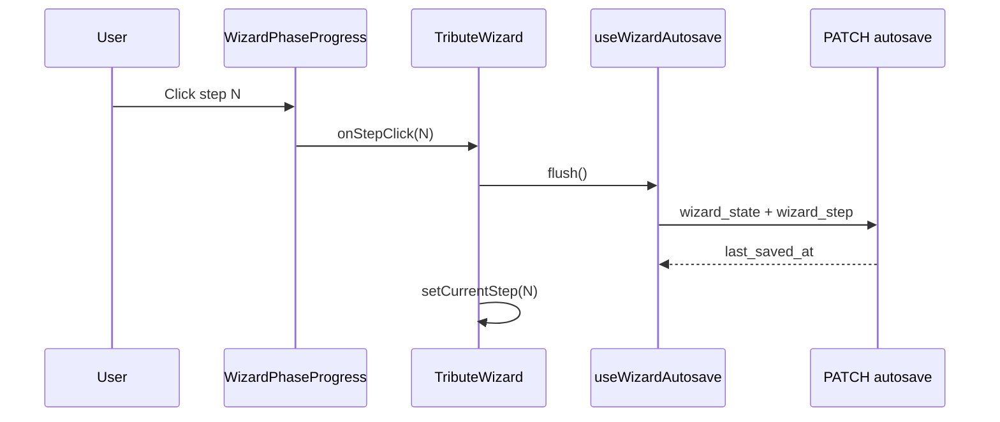
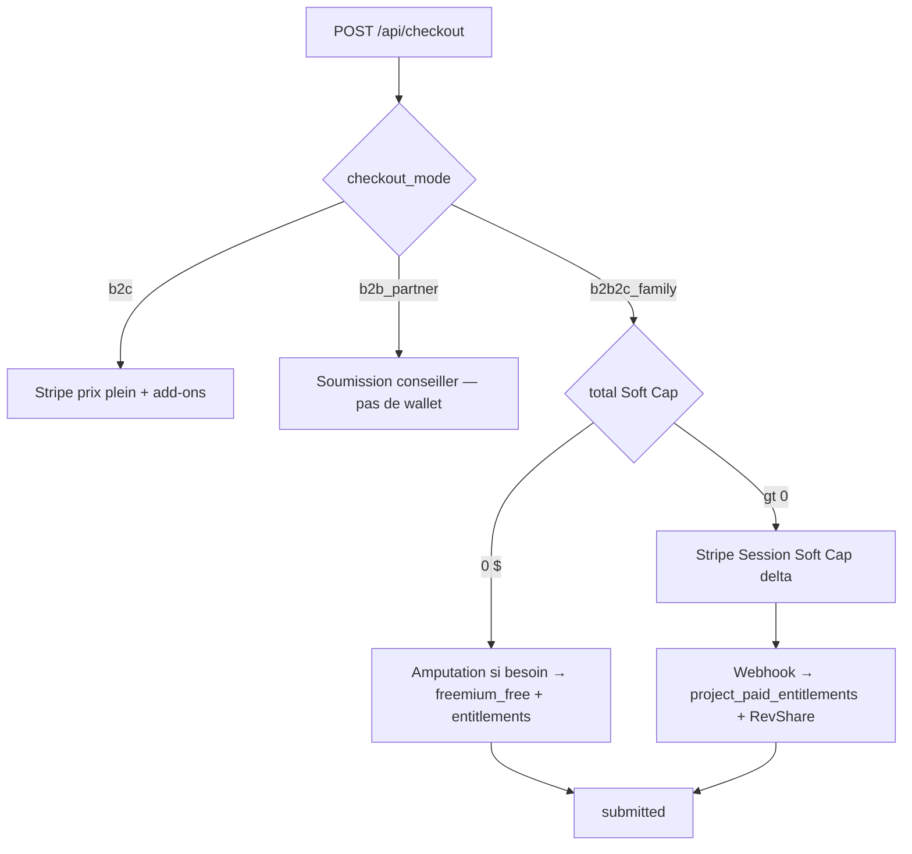

# Tribute Wizard — Architecture

**Type :** canon · **Vérité pour :** wizard **7** étapes (navigation, state, autosave, checkout).  
**Dernière MAJ :** 5 sept 2026 · **Carte :** [`README.md`](README.md)

**Changelog** (max 5)
- 5 sept 2026 — **Barre utilitaire mobile** : `TributeWizard` reçoit un emplacement `mobileUtilityTrailing` (langue + Déconnexion, injectés par `StudioLocaleFrame`) posé à **deux endroits** selon l’état du chrome — rang flottant court en haut à droite pendant le rituel du ciel (Étape 1, `hubChromeHidden`), sinon barre en haut du parcours aux côtés de `Retour` (l’en-tête se cale dessous, `top-12`). Le cluster flottant haut-droite devient desktop-only : plus de bouton de session au-dessus du lockup de marque. ⚠️ `position: sticky` est **inerte** sur `/studio` — `<main>` porte `overflow-x-hidden`, donc `overflow-y` calcule `auto` et devient le scrollport ; l’en-tête « sticky » du wizard ne collait déjà pas.
- 5 sept 2026 — **Polish démo mobile (P1→P5)** : reveal Étape 1 allongé jusqu’à une vraie contemplation avant J3 (`dwell` visible + `WIZARD_LEGACY_LINEAR_MS` étiré) · Étape 3 rehiérarchisée (dépôt principal > Scanner Compagnon > collections en ligne) · Étape 4 allégée au-dessus de la ligne de flottaison (choix d’une chanson avant stats/bandeaux) · Étape 5 épurée (retrait de la redondance `CollabInviteInlineCard`) · Étape 6 renforcée en états faibles (chargement / teaser léger) · CTA secondaires et micro-textes harmonisés pour un ton plus « luxe silencieux ».
- 5 sept 2026 — **Divulgation progressive (3 concepts)** : Étape 1 dit maintenant *« film digne du grand cinéma, pas un simple diaporama »* (+ header *« … minutes de film »`) · Étape 2 abandonne le mot « empreinte » pour *« photos et vidéos »* + *« financement de cet hommage »* explicite · Étape 5 (`MontageOnboardingGate`) gagne un lien discret *« Ou confiez la réalisation à un proche de confiance »* → ouvre le panneau Co-Créateur déjà existant (`onOpenCollab`), sans 3ᵉ carte à égalité avec Magie/Manuel.
- 5 sept 2026 — **Titres d’étapes** : préfixe *« Étape N : »* retiré des `<h2>` de 4 écrans (Inviter, Coffre, Chapitres, Montage) — effet « formulaire administratif » que `WizardPhaseProgress` avait déjà volontairement banni du stepper. Le numéro reste disponible, discret, sous la barre de progression.
- 5 sept 2026 — **Étape 2 (Inviter)** : anti-pattern D2 retiré — `CollabInviteInlineCard` n’apparaît plus sous `SanctuaryInviteStep` (gardée en Étape 5/Studio) · priorité CTA corrigée — **Copier le message** prend le pas sur **Copier le lien** en desktop, `Partager` reste primaire en mobile.
> **Parcours UX (Chemin 1) :** [`product/PARCOURS_UX_CHEMIN_1_TRAVERSEE.md`](product/PARCOURS_UX_CHEMIN_1_TRAVERSEE.md) · beats [`product/PARCOURS_UX_REGISTRY.md`](product/PARCOURS_UX_REGISTRY.md) — **vérité impl** pour surfaces, transitions, stubs craft. Ce doc = wizard métier 7 étapes.

> **Canon V1 :** [`FREEMIUM_V1_PIVOT.md`](FREEMIUM_V1_PIVOT.md) · Soft Cap [`NARRATIVE_SOFT_CAP.md`](NARRATIVE_SOFT_CAP.md) · Commerce [`B2B2C_COMMERCE.md`](B2B2C_COMMERCE.md).  
> **Parcours Sanctuaire (prologue · hub · tiroir) :** [`product/SANCTUARY_USER_JOURNEY.md`](product/SANCTUARY_USER_JOURNEY.md) — le wizard **7 étapes reste** ; couche onboarding séparée. **Étapes 1–3 :** identité complète (prénom + 2 dates) · étape 2 invite seul · étape 3 « Plus tard » obligatoire.  
> **État :** `grantedPackage` + `intendedPackage` + `extensions.musicLicense` (aliases UI legacy OK).

This document describes the **7-step** tribute wizard: navigation, state, autosave, **song-based storyboard**, pricing Freemium V1, and checkout. Parent overview: [`TECHNICAL_ONBOARDING_V1.md`](TECHNICAL_ONBOARDING_V1.md) § Wizard.

---

## Orchestrator

| File | Role |
|------|------|
| `src/components/tribute/TributeWizard.tsx` | Step routing, validation gates, autosave wiring, checkout handoff, global header (package Dossier + phase progress) |
| `src/components/tribute/SanctuaryWizardStep1Sky.tsx` | **Step 1 (J2)** — ciel fullscreen + panneau verre ; `SanctuaryUniverse` background · birth live · reveal contrôlé |
| `src/hooks/useWizardStep1Reveal.ts` | Phase reveal étape 1 (`idle` → `birth` → `reward` → `done`) · orchestration `playReward()` |
| `src/lib/wizard/wizardBirthReveal.ts` | Courbes / beats C0–C2 pour naissance Hero au prénom (pont craft → wizard) |
| `src/components/contribute/SanctuaryUniverse.tsx` | Scène WebGL partagée (lab + wizard) — Hero, constellation, lift séparation Hero↔nom |
| `src/components/contribute/useHeroNameSeparation.ts` | Spring séparation Hero ↔ nom (craft J2) |
| `src/hooks/useWizardStoryboard.ts` | Domaine storyboard pur — resync chapitres, doublons, validation structurelle, estimation durée ; autosave reste dans `TributeWizard` via `persistStoryboardRef` |
| `src/components/tribute/WizardPhaseProgress.tsx` | Minimalist 3-phase progress indicator (Déposer / Composer / Recevoir) — replaces the old 8-circle `WizardStepper` |
| `src/components/tribute/PackageDossierPanel.tsx` | Global off-canvas package selector (« Le Dossier ») — editorial trigger, exhaustive inclusions from `PACKAGE_MANIFEST`, cross-fade comparison, inline downgrade guard. Visible from Step 1 onward, replaces the per-step `WizardBasePackagePicker` and the short-lived `StoryboardPackageSwitcher` dropdown |
| `src/lib/wizard/packageDossier.ts` | Resolves a package's exhaustive inclusion rows from `PACKAGE_MANIFEST` for the Dossier |
| `src/components/StickyPriceBar.tsx` | Sticky total Soft Cap (`resolveWizardDisplayCart`) |
| `src/hooks/useWizardAutosave.ts` | Debounced + immediate PATCH to `/api/projects/[id]/autosave` |
| `src/components/tribute/AutosaveIndicator.tsx` | “Saving / Saved / Error” UX |
| `src/lib/wizard/wizardDeliverables.ts` | **Deliverables manifest** — `PACKAGE_MANIFEST`, lists by channel, limits, rendering, pacing |
| `src/lib/wizard/wizardDeliverables.utils.ts` | Copy manifeste (présentation forfaits) — plus de cartes invitation Salon |
| `src/lib/wizard/pricingConfig.ts` | **Checkout cents** — `WIZARD_PRICING`, extensions, bundle 67 $ (aligné manifeste via `assertManifestPricingAlignedWithLegacyConfig`) |
| `src/lib/wizard/wizardPricing.ts` | Cart math (`computeWizardCart`, integer cents only) |
| `src/lib/wizard/wizardState.ts` | Canonical `storyboard` V2 + coercion/migration from legacy payloads + runtime bridge vers l'UI actuelle |
| `src/components/tribute/StoryboardChaptersStep.tsx` | **Step 4 (live)** — chapitres musicaux dynamiques, panneau musique (`ChapterMusicPanel`, inline), bandeau éducatif, doublons, stats forfait |
| `src/lib/wizard/storyboardPacing.ts` | Moteur de pacing pur — capacité recommandée, marges intro/outro, coût vidéo fixe, estimation durée totale |
| `src/lib/wizard/storyboardHelpers.ts` | Gestion des chapitres (ajout/retrait/cap), validation structurelle, détection de doublons, prévision de perte au downgrade, `findChapterForMedia()` |
| `src/lib/wizard/chapterTheme.ts` | Palette dynamique par chapitre (`getChapterCardTheme`) |
| `src/components/tribute/StoryboardMontageStep.tsx` | **Step 5 (live)** — Livre Ouvert : banque persistante, DnD, Composition Magique — [`STORYBOARD_STEP5_LIVRE_OUVERT.md`](STORYBOARD_STEP5_LIVRE_OUVERT.md) |
| `src/lib/wizard/storyboardMedia.ts` | Assignation / désassignation / réordonnancement médias (Étape 5) |
| `src/lib/wizard/storyboardAutoFill.ts` | `autoFillChapter`, `clearChapterMedia`, `isStoryboardMontageVirgin` |
| `src/lib/wizard/storyboardDnd.ts` | Collision detection et IDs droppables dnd-kit (Étape 5) |
| `src/lib/wizard/storyboardMagicTimeline.ts` | Partition Composition Magique — shuffle, batches, constantes timing |
| `src/lib/wizard/magicTimelinePlayer.ts` | Lecteur async timeline magique (`playMagicTimeline`) |
| `src/components/tribute/storyboard/MagicCinematicOverlay.tsx` | Overlay scrim + capsule (Composition Magique) |
| `src/components/tribute/storyboard/MontageOnboardingGate.tsx` | Gate onboarding magie / manuel |
| `src/components/tribute/montage/MontageDirectorModal.tsx` | Modal directeur plein écran — retypé chapitres |
| `src/components/tribute/montage/MontageMediaCard.tsx` | Carte média drag + entrée CSS magic |
| `src/components/tribute/montage/MontageFocalReticle.tsx` | Sélecteur point focal |
| `src/lib/wizard/softCap.ts` · `SoftCapModal.tsx` | Soft Cap médias / magie / musique dual |
| `src/lib/partner/resolvePartnerAccess.ts` | Partner role detection (`tenant_members`) |
| `app/api/projects/[id]/autosave/route.ts` | GET/PATCH with Zod schemas |
| `app/api/checkout/route.ts` | Checkout (**cible** 3 modes — voir [`B2B2C_COMMERCE.md`](B2B2C_COMMERCE.md)) |
| `app/[lang]/(salon)/salon/` | Console partenaire Salon (intro + `InvitationComposer` Souvenir-only) — auth via layout |
| `src/components/scanner/ScannerCompanionPanel.tsx` | **Phase A+B** — QR + aperçu restauration (`aiRetouch`) — [`SCANNER_COMPANION.md`](SCANNER_COMPANION.md) |

`TOTAL_STEPS = 7` in `TributeWizard.tsx` (Extensions au checkout — pas une 8ᵉ étape wizard).

---

## Deliverables manifest

The tribute wizard is driven by [`wizardDeliverables.ts`](../src/lib/wizard/wizardDeliverables.ts) (`PACKAGE_MANIFEST`) and Soft Cap state (`granted` / `intended`).
**Canonical product doc:** [`DELIVERABLES_AND_PACKAGES.md`](DELIVERABLES_AND_PACKAGES.md) — marketing names Souvenir / Héritage / Éternité / Légendaire ↔ technical IDs `essential` / `signature` / `heritage` / `legendary` (P6).

### Pricing Freemium V1 — canaux (Phases 1–4 ✅)

Prix : [`FREEMIUM_V1_PIVOT.md`](FREEMIUM_V1_PIVOT.md) §2. Ne pas recopier la grille ici.

| Canal | Forfaits visibles | Règle |
|-------|-------------------|-------|
| **B2B2C freemium** | Souvenir (granted) · Soft Cap Héritage / Éternité + add-ons | Lead-magnet · pas de Légendaire · **pas de jetons** |
| **B2C direct** | Héritage · Éternité · Légendaire | Pas de Souvenir |
| ~~B2B legacy jetons~~ | — | **PURGED P8** |

Voir [`B2B2C_COMMERCE.md`](B2B2C_COMMERCE.md) · [`FREEMIUM_V1_PIVOT.md`](FREEMIUM_V1_PIVOT.md).

### Soft Cap (Phase 4 ✅)

Voir [`NARRATIVE_SOFT_CAP.md`](NARRATIVE_SOFT_CAP.md) · UI `SoftCapModal` dans `TributeWizard`.

| Déclencheur | Effet |
|-------------|--------|
| ≥ 50 médias (filet) | Propose Héritage → `intended = signature` |
| Post Composition Magique | Soft Cap principal (si encore Souvenir) |
| Piste catalogue officiel | Dual Licence 39 $ / Héritage 179 $ — piste non bloquée |

`resolveMusicEntitlement(intended, extensions)` → catalogue officiel si `intended >= signature` **OU** `musicLicense`.

### Dynamic UI (S1–S4 + S6 + S5 partiel + Clean Slate)

| Rule (manifest) | Wizard behaviour |
|---------------|------------------|
| `storyboard.chapters[].song.source === 'stingray'` | **Step 4 (live)** — Stingray par chapitre ✅ |
| `storyboard.chapters[].song.source === 'upload'` | MP3 + ToS — Héritage+ · Phase 5 follow-up [`MUSIC_RIGHTS_ATTESTATION.md`](MUSIC_RIGHTS_ATTESTATION.md) |
| `limits.maxMediaItems` | Soft Cap filet à 50 ✅ · quotas `intended` |
| `resolveTransactionMode()` | Famille : **dollars Soft Cap** ; Salon : commissions |

**Today:** `InvitationComposer` (Salon `/[lang]/salon`) offers **Keepsake only** — email + CTA, no package cards. `TributeWizard` renders the global package Dossier (`PackageDossierPanel`) with **marketing labels** while persisting technical IDs (`essential` / `signature` / `heritage` / `legendary`); `WizardBasePackagePicker` has been removed. The canonical persisted model is now `storyboard`; Step 4 reads/writes `storyboard.chapters[].song` via `useWizardStoryboard`. **Step 5** is the live **Livre Ouvert** montage UI (`StoryboardMontageStep`) — DnD, actions chapitre, onboarding gate, and **Composition Magique** (see [`STORYBOARD_STEP5_LIVRE_OUVERT.md`](STORYBOARD_STEP5_LIVRE_OUVERT.md)). `SoundSignatureStep` was removed during Clean Slate. Steps 7–8 still use a temporary legacy bridge (`actTracks`) for Preview/Checkout until `S8`/`S9`.

### Design decisions — why (juillet 2026)

| Decision | Why |
|----------|-----|
| **Le Dossier** (off-canvas vs dropdown) | Reduce visual cognitive load (8 circles → 3 phases); avoid cheap e-commerce dropdown; package consultable from any step without polluting step body |
| **DEFAULT_B2C_BASE_PACKAGE = "heritage"** (fallback) | Ancien ancrage Éternité ; **supplanté Cascade V-Final** : init via `ChannelProfile` (B2B2C → `essential`, B2C → `signature` / Héritage **179 $**) |
| **Step 4 ↔ 5 reorder** | Chapter media capacity depends on `durationSec` — music choice must precede media assignment |
| **Clean Slate Step 5** | `SoundSignatureStep` showed functional UI but inputs were silently ignored by `coerceWizardState()` — misleading UX, not mere tech debt |
| **`useWizardStoryboard`** | Isolate chapter domain from `TributeWizard` (~1780 lines) before `dnd-kit`; hook stays pure (no autosave) |
| **montage/* triage** | Purge 3-act logic (`MontageStep`, act columns); keep pure UI (`MontageDirectorModal`, `MontageMediaCard`, `MontageFocalReticle`) retyped for chapters |
| **`actTracks` kept read-only** | Preview/Checkout still depend on legacy bridge — removal would regress Steps 7–8 before `S8`/`S9` |
| **EMFILE / `ulimit -n 65536`** | Next.js Watchpack failed silently → 404 on all routes in dev; restart `npm run dev` with raised fd limit |

### Major architecture change — from 3 acts to song-based storyboard

The previous model coupled montage and music around **3 fixed acts**:

- `spark`
- `epic`
- `legacy`

This created a structural deadlock:

- the product contract allows **2 / 4 / 5 / 7 songs** depending on package
- the UI could only expose **3 music slots**
- pacing validation could never be enforced cleanly for higher tiers

The new canonical model solves this by moving to a **song-based storyboard**:

- `wizard_state.storyboard.chapters[]` becomes the source of truth
- each chapter owns an ordered list of `mediaIds`
- each chapter can own a `song`
- each song carries its real `durationSec`
- pacing can now be evaluated **per chapter**, not against an abstract 3-act shell

**Why this is better**

- natural sync between narration and music
- no hard-coded limit of 3 chapters
- direct path to MP3 uploads and Stingray chapters in the same model
- future pacing logic can use `durationSec / targetSecondsPerMedia`

**Current transition state**

- `storyboard` is now persisted as the canonical V2 shape
- `wizardState.ts` rebuilds temporary `montage` + `musicalAmbiance` legacy views at runtime for Preview/Checkout
- Steps 4–5 use canonical `storyboard` directly (`StoryboardChaptersStep` + `StoryboardMontageStep` Livre Ouvert)
- Steps 7–8 still render through the legacy bridge until `S8`/`S9`

### i18n (marketing names)

| Technical ID | FR | EN | Dictionary keys |
|--------------|----|----|-----------------|
| `essential` | Souvenir | Keepsake | `packages.names.essential`, `tributeWizard.basePackageEssential` |
| `signature` | Héritage | Legacy | `packages.names.signature`, `tributeWizard.basePackageSignature` |
| `heritage` | Éternité | Eternity | `packages.names.heritage`, `tributeWizard.basePackageHeritage` |
| `legendary` | Légendaire | Legendary | `packages.names.legendary` *(P6 — B2C only)* |

See [`DELIVERABLES_AND_PACKAGES.md`](DELIVERABLES_AND_PACKAGES.md) and `src/lib/wizard/packageI18n.ts`.

### Pricing split

| Concern | Source |
|---------|--------|
| Deliverables, jetons, public $, Salon/Social flags | `wizardDeliverables.ts` |
| Cart line items, extension cents, Stripe totals | `pricingConfig.ts` + `wizardPricing.ts` |
| Drift guard | `assertManifestPricingAlignedWithLegacyConfig()` in `wizardDeliverables.ts` |

Do not duplicate package prices in UI strings — use `formatPackagePriceForMode(packageId, mode, locale)` after resolving `manifestPackageFromLegacy(basePackage)`.

---

## Step-by-step flow

Package selection is no longer step-bound: the Dossier trigger (`PackageDossierPanel`) lives in the global sticky header from Step 1 onward.

| Step | Label (i18n key) | Main UI | Server / DB |
|------|------------------|---------|-------------|
| 1 | `stepperEssentials` | **J2 :** overlay ciel (`SanctuaryWizardStep1Sky`) + panneau verre · prénom, **nom**, dates, avatar · reveal post-validation · **J3 hub** ⏳ | `essentials`, `basePackage`; draft via `POST /api/projects/draft` |
| 2 | `stepperSources` | Social source + URL | `socialSources`, `basePackage` |
| 3 | `stepperVault` | Dropzone + upload queue + **Scanner Compagnon QR** (cible) | `media_assets` rows; reload `GET /api/projects/[id]/media` · voir [`SCANNER_COMPANION.md`](SCANNER_COMPANION.md) |
| 4 | `stepperChapters` | **Chapitres musicaux dynamiques** (`StoryboardChaptersStep`, live — ✅ `S6`) | `storyboard.chapters[].song` (canonique, plus de bridge) |
| 5 | `stepperSound` | **Livre Ouvert** — `StoryboardMontageStep` (DnD, magie, actions chapitre) | `storyboard` (canonique) |
| 6 | `stepperPreview` | Copy + `CinematicTeaser` | Aperçu |
| 7 | `stepperCheckout` | Cart Soft Cap + **Extensions** Quiet Luxury + pay CTA | `POST /api/checkout` |

---

## Navigation and autosave


```mermaid
sequenceDiagram
  participant User
  participant Stepper as WizardPhaseProgress
  participant TW as TributeWizard
  participant AS as useWizardAutosave
  participant API as PATCH autosave

  User->>Stepper: Click step N
  Stepper->>TW: onStepClick(N)
  TW->>AS: flush()
  AS->>API: wizard_state + wizard_step
  API-->>AS: last_saved_at
  TW->>TW: setCurrentStep(N)
```

- **Back** button (top-left, steps 2+): same `flush()` then decrement step.
- Text fields use `queueSave("text")` — 800ms debounce.
- Step changes and explicit actions use `queueSave("immediate")` or `flush()`.

---

## `wizard_state` v2 shape

```typescript
// src/lib/wizard/wizardState.ts — simplified
{
  version: 2,
  isPartner?: true,                    // B2B UI flag (checkout uses tenant role)
  basePackage?: "essential" | "signature" | "heritage" | "legendary",  // legendary = B2C P6
  pricing?: {
    basePackage: "signature",
    baseCents: 17900,                  // integers only
    optionsCents: 4900,
    totalCents: 19800,
    partnerTokenCost?: 2               // B2B only
  },
  essentials?: { firstName, lastName, birthDate, deathDate, avatarPath },
  socialSources?: { selected, url },
  storyboard?: {
    chapters: Array<{
      id: string,
      mediaIds: string[],
      song?: (
        | { source: "stingray", trackId, title, artist, coverUrl?, durationSec? }
        | { source: "upload", storagePath, title, fileName?, mimeType?, artist?, durationSec? }
      )
    }>,
    unassignedIds?: string[],
    excludedIds: string[],
    focalPoints: Record<mediaId, { x, y }>
  },
  extensions?: {
    aiRetouch?, extendedLicense?, collectorUsb?,
    digitalVault?, heritagePack?
  }
}
```

**Runtime bridge during transition:** `coerceWizardState()` still reconstructs temporary `montage` and `musicalAmbiance` views from `storyboard` so the existing UI keeps working while Storyboard UI tickets ship.

**Legacy package id:** `prestige` is coerced to `signature` on read (`pricingConfig.ts`).

**Legacy accepted in read / migration only (do not write on new saves):**
- `musicalAmbiance.mood`, `trackOrder`, `selectedTrack`, `catalogTrackId`
- Old `upsell` / `copyrightOption` → migrated to `extensions` via `wizardExtensions.ts`
- `montage.acts.spark|epic|legacy`
- `musicalAmbiance.tracks.acte1|acte2|acte3`

---

## Storyboard transition bridge

To preserve backward compatibility while the UI still renders 3 legacy slots, the first three storyboard chapters are projected as follows:

| Canonical storyboard chapter | Legacy montage bridge | Legacy music bridge |
|------------------------------|-----------------------|---------------------|
| `chapters[0]` | `spark` | `acte1` |
| `chapters[1]` | `epic` | `acte2` |
| `chapters[2]` | `legacy` | `acte3` |

Additional chapters beyond index 2 are temporarily projected into `unassignedIds` on the runtime montage bridge so the old UI does not silently lose media.

---

## Step 4 — Chapitres musicaux (live)

- **Component:** `StoryboardChaptersStep.tsx` (+ inline `ChapterMusicPanel`), `StoryboardCapacityBadge.tsx`, `StoryboardChapterStats.tsx`
- **Helpers:** `storyboardHelpers.ts`, `storyboardPacing.ts`
- **API:** `GET /api/music/search?q=…` (see [`STINGRAY_MUSIC_INTEGRATION.md`](STINGRAY_MUSIC_INTEGRATION.md))
- **Current UI:** un chapitre par chanson, pré-générés selon `minSongsRequired` (dérivé du volume média de l'Étape 3), extensibles jusqu'à `maxSongs` du forfait. Bandeau éducatif (durée piste recommandée), badge de capacité recommandée par chapitre, détection + acquittement obligatoire des doublons de chanson, tuiles de stats (médias / chansons).
- **Canonical state:** lit et écrit directement `storyboard.chapters[].song` — **aucun bridge legacy** sur cette étape.
- Validation avant de quitter l'étape 4 : structure `[minSongsRequired, maxSongs]` (`validateStoryboardPackageStructure`, bloquant) + acquittement doublons (bloquant, état local).

---

## Step 5 — Montage Livre Ouvert (live — S5 partiel)

**Canon:** [`STORYBOARD_STEP5_LIVRE_OUVERT.md`](STORYBOARD_STEP5_LIVRE_OUVERT.md) · **QA:** [`QA_S5_MONTAGE_STEP.md`](QA_S5_MONTAGE_STEP.md)

- **Component:** `StoryboardMontageStep.tsx` — layout Livre Ouvert, banque persistante, chapitres empilés, `StoryboardFilmMap`, DnD global `dnd-kit`, actions chapitre, onboarding gate, Composition Magique.
- **Why not placeholder anymore:** PR-1/2/3 (juillet 2026) replaced the post–Clean Slate placeholder with the full interactive experience.
- **Magic composition:** `buildMagicTimeline` → `playMagicTimeline` — batch per chapter + CSS cascade; overlay `MagicCinematicOverlay` (scrim Option B + capsule Bouton Noir, **design locked**).
- **Autosave:** suspended during magic via `magicPerformingRef` in `TributeWizard`; `queueSave("immediate")` on `onMagicSequenceComplete`.
- **Delivered (PR-1/2/3):** layout, FilmMap, DnD, multi-select, auto-fill / clear / refine drawer, magic sequence, QA fixes (drop target, ghost selection).
- **Remaining (S5-J/K):** chapter audio during montage, organic focus mode — see Step 5 doc §10–11. **S5-L** copy ✅ (« Le film de sa vie »).
- **Legacy orphan files:** `MontageTimeline.tsx`, `MontageChapterTabs.tsx` — candidate removal in S10 cleanup.

---

## Step 7 — Cinematic preview

| File | Role |
|------|------|
| `PreviewStep.tsx` | Marketing copy, CTA to checkout, link to edit earlier steps |
| `CinematicTeaser.tsx` | Photo crossfade per slide + audio from selected track |
| `teaserHelpers.ts` | Slide list, duration estimate, temporary bridge grouping |

Audio `src` uses `track.previewUrl` (typically `/api/music/preview?trackId=…`). Until `S8`, preview still consumes the legacy bridge rebuilt from `storyboard`.

---

## Pricing — Soft Cap / cents

**Rule:** integer USD cents only. Soft Cap cart = `computeWizardCartWithGrant` / `resolveWizardDisplayCart`.

**Source of truth:** [`FREEMIUM_V1_PIVOT.md`](FREEMIUM_V1_PIVOT.md) §2 · [`DELIVERABLES_AND_PACKAGES.md`](DELIVERABLES_AND_PACKAGES.md) · `pricingConfig.ts`. Ne pas recopier 0 / 179 / 349 / 499 ni les cents ici.

Helpers clés : `packageCents` · `computeWizardCart` · `computeWizardCartWithGrant` · `resolveMusicEntitlement`.  
~~`PARTNER_TOKEN_COST_CENTS` / `packagePartnerTokens` / wholesale~~ — **purgés** (ne plus documenter comme API vivante).

Add-ons V1 : `musicLicense`, `sanctuaryToken`, `storyVoice`, `memoryBook`, `aiRetouch`, `digitalVault` (aliases `extendedLicense` / `collectorUsb` OK en code legacy).

---

## Music catalog tiers

| Access | Quand | API |
|--------|--------|-----|
| **Standard** | Souvenir sans Soft Cap musique | `tier=standard` |
| **Premium (officiel)** | `intended >= signature` **OR** `musicLicense` | `tier=premium` |

`resolveMusicEntitlement` / Soft Cap browse premium on Souvenir — see [`STINGRAY_MUSIC_INTEGRATION.md`](STINGRAY_MUSIC_INTEGRATION.md) · [`NARRATIVE_SOFT_CAP.md`](NARRATIVE_SOFT_CAP.md).

---

## Step 7 — Checkout

- **UI:** `CheckoutStep.tsx` — panier Soft Cap · **Extensions** · CTA rester à 0 $ · Rider Fonds · erreurs amputation
- **API:** `app/api/checkout/route.ts` — Soft Cap grant · `freemium_free` · Stripe
- **Commerce:** [`B2B2C_COMMERCE.md`](B2B2C_COMMERCE.md)

**Livré (Phase 3–4) :** Soft Cap cart, entitlements webhook, Soft Cap UX.  
**Next (Phase 5) :** Creatomate gated on `project_paid_entitlements`.

~~Saga jetons / debit wallet~~ — **PURGED**.

**Spike checkout v1 (jetons-first) : annulé** — remplacé par Freemium Soft Cap (Phases 3–4 ✅).

### Flux checkout Freemium V1


```mermaid
flowchart TD
  A[POST /api/checkout] --> B{checkout_mode}
  B -->|b2c| C[Stripe prix plein + add-ons]
  B -->|b2b_partner| D[Soumission conseiller — pas de wallet]
  B -->|b2b2c_family| E{total Soft Cap}
  E -->|0 $| F[Amputation si besoin → freemium_free + entitlements]
  E -->|gt 0| G[Stripe Session Soft Cap delta]
  G --> H[Webhook → project_paid_entitlements + RevShare]
  F --> I[submitted]
  H --> I
```

**Waterfall (upsell payant) :** Gross → Platform Fee 10 % → Net Distribuable → Commission 30 %.  
Détail : [`PARTNER_REVSHARE.md`](PARTNER_REVSHARE.md) · [`QA_P6_COMMISSION_WATERFALL.md`](QA_P6_COMMISSION_WATERFALL.md).

### Mode `b2c` (famille directe — Quiet Luxury)

- Pas d’invitation partenaire ; **pas de Souvenir**.
- Forfaits : **Héritage 179 $** · **Éternité 349 $** (recommandé) · **Légendaire 499 $** (Gants Blancs).
- Extensions à la carte · **pas de RevShare**.

### Mode `b2b_partner` (legacy jetons funérarium)

- Inchangé P5.5 · `StickyPriceBar` en jetons · pas de Stripe.

### Mode `b2b2c_family` — freemium (`is_freemium = true`)

- Souvenir offert → **`family_total_cents = 0`** → completed sans Stripe.
- Upsell Héritage / Éternité → **prix plein** + extensions → Stripe → webhook → **Bulletproof waterfall** (10 % platform · 30 % **Net Distribuable**) — [`PARTNER_REVSHARE.md`](PARTNER_REVSHARE.md).
- UX gant blanc : jamais « jeton » ni « commission ».

### Mode `b2b2c_family` — legacy (`is_freemium = false`)

- Débit jetons P5.5 · delta famille · pas de RevShare v2.

### UI pricing

| Component | Location | Role |
|-----------|----------|------|
| `StickyPriceBar` | Sticky under stepper, every step | Live **total** (B2C $) or **tokens** (B2B); reflects `computeWizardCart` including Heritage bundle rules |
| `PackageDossierPanel` | Global header, Step 1+ (`hidePrices` when partner) | Off-canvas — inclusions exhaustives + **Éternité savings badge** (67 $) + comparaison cross-fade |
| `WizardCartSummary` | Steps 5–6 (B2C only) | Line recap |
| `StoryboardMontageStep` | Step 5 | Livre Ouvert — DnD, Composition Magique — [`STORYBOARD_STEP5_LIVRE_OUVERT.md`](STORYBOARD_STEP5_LIVRE_OUVERT.md) |
| `MontageExtensionsStep` | Checkout (étape 7) | Extensions + « Déjà inclus » when Heritage |

### Step 1 — overlay Sanctuaire (J2 → Chemin 1)

État détaillé : [`product/PARCOURS_UX_CHEMIN_1_TRAVERSEE.md`](product/PARCOURS_UX_CHEMIN_1_TRAVERSEE.md) §1 · [`product/SANCTUARY_USER_JOURNEY.md`](product/SANCTUARY_USER_JOURNEY.md) §11b. Playbook démo : [`MEETING_PATRICE_VP.md`](MEETING_PATRICE_VP.md).

- **Aujourd'hui (T1b) :** hub **WebGL lite** animé · crossfade gel 2D au clic Hero · reprise hub à la fermeture · chrome masqué au hub.
- **Cible T2 :** `backdropToWebGL` au Continuer · hub J3 post-reveal.
- **Chemins :** A (première traversée · prologue) vs B (retour · draft rempli → panneau direct) — [`PARCOURS_UX_CHEMIN_1_TRAVERSEE.md`](product/PARCOURS_UX_CHEMIN_1_TRAVERSEE.md) §1b.
- **Activation :** `step1Sky = !isEditor && currentStep === 1` dans `TributeWizard.tsx`.
- **Validation :** prénom, **nom**, naissance, décès. CTA **toujours cliquable** — au submit incomplet : message dico + highlight + focus + shake (off si `prefers-reduced-motion`). Dates : année 4 chiffres (`min` 1800 / `max` 9999), calendrier visible.
- **Continuer :** `flush()` → `playReward()` (horloge wizard) → reste `hub.postReveal` (J3 pas encore).
- **Porte :** ligne `parcoursGoToInvites` → étape 2, même validation, zéro rituel.
- **Craft :** reveal A→F · [`ODYSSEY_LUEUR_CRAFT.md`](ODYSSEY_LUEUR_CRAFT.md).

### Formulaires (canon)

Un formulaire Odyssey se comporte comme Apple / Google, pas comme un bouton mort.

- CTA **toujours cliquable**.
- Erreur au **submit**, pas à chaque lettre. Ça part quand le champ est bon.
- Dates : année **4 chiffres**. Calendrier **visible**.
- 390 et desktop, mêmes règles.

Invité, Coffre, Salon : **même loi** quand on y touche. Pas un 2ᵉ standard.

---

## Database

| Migration | Purpose |
|-----------|---------|
| `odyssey_p3_wizard_autosave.sql` | `wizard_state`, `wizard_step`, `last_saved_at` |
| `odyssey_p5_b2b2c_core.sql` | invitations, `tribute_checkouts` |
| `odyssey_p6_freemium_revshare.sql` | `is_freemium`, commission ledger |
| `odyssey_p6_1_bulletproof_waterfall.sql` | Net Distribuable waterfall |
| `odyssey_p7_media_quota_guard.sql` | Soft Cap media quota trigger |
| `odyssey_p8_freemium_v1_token_purge.sql` | **Purge jetons** · Soft Cap · entitlements · NFC |

| Column / table | Purpose |
|----------------|---------|
| `projects.wizard_state` | Snapshot V2 (`storyboard`, granted/intended, pricing) |
| `tenants.is_freemium` | Canal freemium |
| `tribute_checkouts` | Saga Soft Cap / Stripe |
| `partner_commission_*` | **Seul** solde partenaire post-P8 |
| `project_paid_entitlements` | Snapshot post-paiement (Phase 3+) |
| ~~`partner_token_*`~~ | **DROP P8** |

Ordre SQL : [`docs/sql/README.md`](sql/README.md).

---

## i18n

Copy lives in `dictionaries/fr.json` and `dictionaries/en.json` under `tributeWizard.*` (step titles, stepper labels, sound/extensions/preview/checkout strings).

---

## When you change this flow

Update this file, [`DELIVERABLES_AND_PACKAGES.md`](DELIVERABLES_AND_PACKAGES.md), [`STORYBOARD_REFACTOR.md`](STORYBOARD_REFACTOR.md), [`B2B2C_COMMERCE.md`](B2B2C_COMMERCE.md), [`PARTNER_REVSHARE.md`](PARTNER_REVSHARE.md), [`SCANNER_COMPANION.md`](SCANNER_COMPANION.md), and [`TECHNICAL_ONBOARDING_V1.md`](TECHNICAL_ONBOARDING_V1.md) §4.7 + §5 + §10 per team rule §13.
