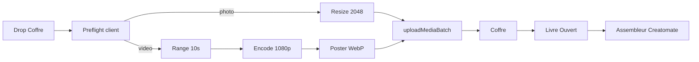

# Coffre · montage · ingest médias

**Type :** living · **Vérité pour :** audit Coffre + Livre Ouvert + décision ingest client (trim 10 s + compress).  
**Dernière MAJ :** 16 sept 2026 · **Carte :** [`../README.md`](../README.md)  
**Démo :** vendredi 18 sept 2026 — voir § Étapes chirurgicales.

**Changelog** (max 5)
- 16 sept 2026 — **S2d** : barre d’insertion dans le gap (Livre + Composer) ; overlay z-index au-dessus de Composer.
- 16 sept 2026 — **S2c** : Étape 5 desktop élargie (`max-w-7xl`) ; directeur / composition au `document.body` ; fade wizard sans `transform` (drag dnd-kit).
- 16 sept 2026 — **S2b** : drag desktop = listeners sur l’aperçu (pas le wrapper) ; overlay seul suit le curseur ; poignée mobile inchangée.
- 16 sept 2026 — **S2** : `useFinePointer` synchrone (`useSyncExternalStore`) — DnD desktop dès le 1er paint.
- 16 sept 2026 — **S1** : preview vidéo = `<video>` (Coffre, banque, cartes, directeur) — plus d’`` sur MP4.

Canon étape 5 : [`../STORYBOARD_STEP5_LIVRE_OUVERT.md`](../STORYBOARD_STEP5_LIVRE_OUVERT.md).  
Export film : [`../craft/CREATOMATE_RECIPE.md`](../craft/CREATOMATE_RECIPE.md).  
Pacing : `VIDEO_TRIM_DURATION_SEC` = 10 s dans [`src/lib/wizard/storyboardPacing.ts`](../../src/lib/wizard/storyboardPacing.ts).

---

## 1. Symptômes (ce que la famille voit)

| # | Symptôme | Cause réelle |
|---|----------|----------------|
| A | Upload vidéo → *The object exceeded the maximum allowed size* | Limite **Supabase Storage** (souvent 50 Mo), pas le plafond app (300 Mo) |
| B | « Je ne vois pas la vidéo » dans le Coffre | Tuile **Film** sans poster ; ou fichier **rejeté** (MIME vide) |
| C | Vidéo absente / cassée à la table de montage | URL **MP4 passée à un ``** (banque, cartes, directeur) |
| D | Composer desktop « plus comme avant » | Shell `max-w-3xl` + fade `transform` (piège `fixed` / casse dnd-kit) |
| E | Export = toujours les 10 premières secondes | `videoTrims` jamais écrit par l’UI |

---

## 2. Audit par surface

### Coffre (étape 3)

Fichiers : [`TributeWizard.tsx`](../../src/components/tribute/TributeWizard.tsx) · [`MediaQueueGrid.tsx`](../../src/components/media/MediaQueueGrid.tsx) · [`MediaDropzoneAdapter.tsx`](../../src/components/media/MediaDropzoneAdapter.tsx) · [`mediaUploadService.ts`](../../src/lib/uploads/mediaUploadService.ts).

- Accept : `video/mp4`, `video/quicktime` seulement. Fallback extension **HEIC seulement** — `.mp4`/`.mov` avec `file.type === ""` → rejet dropzone, **jamais en file**.
- Thumb : [`generateImageThumbnail.ts`](../../src/lib/media/generateImageThumbnail.ts) no-op si pas `image/*` → **aucun poster** vidéo.
- Grille : `isVideoItem` → icône Film, pas de `<video>`. Upload OK ≠ aperçu.
- Soft Cap / `excludedIds` : **ne filtrent pas** la grille Coffre.
- Scanner compagnon : photos seulement.

### Livre Ouvert / table de montage (étape 5)

Composer **actif** : [`StoryboardMontageStep.tsx`](../../src/components/tribute/StoryboardMontageStep.tsx) + `@dnd-kit`.  
Legacy **orphelin** : [`MontageTimeline.tsx`](../../src/components/tribute/storyboard/MontageTimeline.tsx), [`MediaBankPanel.tsx`](../../src/components/tribute/storyboard/MediaBankPanel.tsx).

- Nouveaux médias → `unassignedIds` via [`storyboardMedia.ts`](../../src/lib/wizard/storyboardMedia.ts) (banque). L’ID peut être là, la **vignette** cassée.
- Hydratation : pas de thumb signé pour vidéo → `previewUrl` = fichier MP4 ([`hydrateMediaSignedUrls.server.ts`](../../src/lib/media/hydrateMediaSignedUrls.server.ts)).
- `` : [`BankDraggableMediaTile.tsx`](../../src/components/tribute/storyboard/BankDraggableMediaTile.tsx), [`MontageMediaCard.tsx`](../../src/components/tribute/montage/MontageMediaCard.tsx), [`MontageDirectorModal.tsx`](../../src/components/tribute/montage/MontageDirectorModal.tsx) (~219).
- Fetch étape 5 **sans `force`**, `catch` vide → banque visuellement vide.
- [`useFinePointer.ts`](../../src/hooks/useFinePointer.ts) : `useState(false)` → premier paint desktop = capteur **Touch** + poignées mobile ([`useMontageDnd.ts`](../../src/hooks/useMontageDnd.ts), commit ~`222bde4`).
- `videoTrims` : modèle + autosave + Creatomate OK ; **aucun picker UI**.

### Export

[`resolveMediaAssets.ts`](../../src/lib/creatomate/resolveMediaAssets.ts) : `trimStartSec` défaut 0, durée 10 s. Atome [`media-video.json`](../craft/atoms/media-video.json).

---

## 3. Décision ingest (après la démo)

**Le client trimme et compresse avant upload.** Un seul objet Storage (pas d’original V1).

| Média | Cible |
|--------|--------|
| Vidéo | Fenêtre **10 s** (défaut 0→10, range dans la file Coffre) + re-encode **1080p** H.264/AAC, fichier typiquement **≪ 80 Mo** |
| Photo | Côté long max **2048 px**, JPEG/WebP ~0.82 |
| Hors V1 | Sanctuaire deposit, Scanner, musique MP3 (déjà ~40 Mo), worker ffmpeg serveur |

Creatomate : clip déjà court → `trim_start` = 0. Re-trim directeur = phase plus tard **seulement si** on stocke plus que 10 s (on ne le fait pas en V1).

Ops parallèle : **Dashboard Supabase → Storage → global file size** 100–300 Mo (filet avant le P1 encode).

---

## 4. Étapes chirurgicales — démo vendredi 18 sept

Objectif démo : **déposer une vidéo, la voir dans le Coffre, la glisser dans un chapitre desktop, l’ouvrir dans le directeur**. Pas besoin du re-encode vendredi.

### Jeudi (P0 — bloquant démo)

| # | Commit visé | Fichiers | Done when |
|---|-------------|----------|-----------|
| **S1** | Preview vidéo unifiée | `MediaAssetThumb` / `MediaVideoPreview` | **Fait** — jamais `` sur URL `video/*` |
| **S2** | Desktop DnD | `useFinePointer` via `useSyncExternalStore` | **Fait** — souris dès le 1er paint client |
| **S2b** | Drag tuile | Listeners PointerSensor sur l’aperçu (banque + cartes) | **Fait** — clic ouvre le directeur, glisser dépose ; pas de double fantôme |
| **S2c** | Largeur + modal | Shell Étape 5 `max-w-7xl` ; fade sans `transform` ; directeur/composition portés au body | **Fait** — Livre Ouvert + salle de visionnement plein écran desktop |
| **S3** | Banque à jour + drop | `StoryboardMontageStep` fetch `force` à l’entrée étape 5 ; fallback `.mp4`/`.mov` dropzone | Vidéo Coffre apparaît à gauche au montage ; iPhone/Finder sans MIME acceptés |
| **S4** | Ops (pas de code) | Supabase file size limit | Une vidéo test ~80–150 Mo passe **ou** on démo avec un fichier &lt; limite actuelle |

Copy FR/EN si nouveau texte écran (ex. « Souvenir filmé ») — dictionnaires + catalog.

### Après vendredi (P1 ingest)

| # | Quoi |
|---|------|
| **S5** | Poster frame client à l’upload (canvas), même pipeline que thumb photo |
| **S6** | Resize photos 2048 px preflight |
| **S7** | Trim 10 s + encode 1080p client (file Coffre) + copy « Préparation de la vidéo… » |

S7 = le plus gros ; ne pas commencer avant S1–S3 verts.

### Hors démo

- Worker serveur / conservation original
- Re-trim dans le directeur
- WebM wizard (Sanctuaire seulement aujourd’hui)

---

## 5. Ancres code

| Besoin | Fichier |
|--------|---------|
| Preflight upload | [`mediaUploadService.ts`](../../src/lib/uploads/mediaUploadService.ts) |
| Dropzone | [`MediaDropzoneAdapter.tsx`](../../src/components/media/MediaDropzoneAdapter.tsx) |
| Grille Coffre | [`MediaQueueGrid.tsx`](../../src/components/media/MediaQueueGrid.tsx) |
| Étape 5 | [`StoryboardMontageStep.tsx`](../../src/components/tribute/StoryboardMontageStep.tsx) |
| DnD | [`useMontageDnd.ts`](../../src/hooks/useMontageDnd.ts) · [`useFinePointer.ts`](../../src/hooks/useFinePointer.ts) |
| Directeur | [`MontageDirectorModal.tsx`](../../src/components/tribute/montage/MontageDirectorModal.tsx) |
| Plafond API | [`upload-url/route.ts`](../../app/api/projects/[id]/media/upload-url/route.ts) (zod 300 Mo) |

---

## 6. QA démo (checklist)

1. Photo → Coffre (miniature).
2. Vidéo courte (&lt; limite Storage) → tuile **lisible** (pas icône morte).
3. Étape 5 desktop : vidéo dans la banque, **drag** souris vers un chapitre, aperçu directeur = **image ou lecture**, pas rectangle cassé.
4. Export drain (si temps) : intro 27 s + clip photo + clip vidéo 10 s + outro sans Odyssey.
