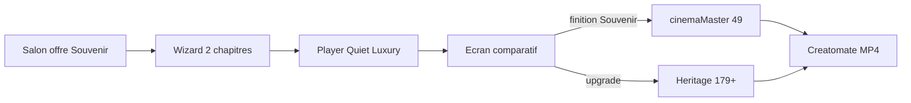

# Souvenir — Stream 0 $ · Master cinéma 49 $

**Type :** canon produit · **Vérité pour :** offre B2B2C Souvenir (cadeau salon = visionnage stream ; finition Creatomate = 49 $) + player Quiet Luxury.  
**Statut :** décision CEO 21 sept 2026 · **impl non commencée** (reprendre par commits C0→C8).  
**Dernière MAJ :** 21 sept 2026 · **Carte :** [`../README.md`](../README.md)

**Changelog** (max 5)
- 21 sept 2026 — Décision : stream 0 $ (photo+vidéo, MP3) + master `cinemaMaster` 49 $ + wow-in-stream (grade, faces, souffle, 2.5D desktop) ; plus de Creatomate gratuit. Commits chirurgicaux C0–C8.

**Liés :** [`../FREEMIUM_V1_PIVOT.md`](../FREEMIUM_V1_PIVOT.md) · [`../B2B2C_COMMERCE.md`](../B2B2C_COMMERCE.md) · [`../craft/CREATOMATE_RECIPE.md`](../craft/CREATOMATE_RECIPE.md) · [`WIZARD_PREVIEW_BA.md`](WIZARD_PREVIEW_BA.md) (supplanté pour le cadeau Souvenir) · [`../NARRATIVE_SOFT_CAP.md`](../NARRATIVE_SOFT_CAP.md)

---

## Ambition mondiale

- Athos / QC = **terrain de preuve**, pas le plafond.
- **Même offre partout** : stream cadeau · master 49 $ · Soft Cap Héritage — pas de SKU « Canada only ».
- **i18n** : FR/EN dès l’impl ; ES/DE/IT = copy plus tard, sans refaire l’usine.
- Refs Memoriam / Eulogize (AU–US) = catégorie mondiale ; Odyssey gagne sur **séance Quiet Luxury + salon B2B2C**.

---

## Décisions figées

| | |
|--|--|
| Cadeau salon | Créer + **visionner** (stream only), ≤50 médias (photos **et** vidéos), 2 chapitres / 2 chansons |
| Vidéo | Trim ~**10 s** (`VIDEO_TRIM_DURATION_SEC`) ; en stream audio clip **muet**, lit MP3 porte |
| Musique cadeau | **MP3 perso** (ToS) ; Stingray = preview only + Soft Cap Licence / Héritage |
| Master | SKU **`cinemaMaster` = 49 $** (≠ `aiRetouch` aussi à 49 $) |
| Héritage+ | Master Creatomate **inclus** (pas de +49 $) |
| Free Creatomate | **Interdit** — plus de `freemium_free` → render |
| Anti-arnaque | Écran comparatif Aperçu vs Master **avant** paiement 49 $ |
| 2.5D | Séance complète = **ordinateur** ; mobile = sans parallax + copy honnête |

---

## Wow dans le stream (pas Sanctuaire)

**Séance cinéma**, pas éditeur slideshow.

**Core :** ouverture souffle (portrait N&B) · 2 actes + pont chapitre · photo+vidéo · grain/vignette · UI fantôme · carte nom/années · fade black ≥1 s · stream only.

**Wiz-kid (tous inclus) :**

| Couche | Détail |
|--------|--------|
| Grade Odyssey | LUT unique photo+vidéo (ambre, noirs) — puis reporter Creatomate |
| Ken Burns face-aware | Landmarks navigateur ; fallback centre |
| Souffle MP3 | Web Audio : fondus un peu plus longs sur silences |
| 2.5D parallax | Depth map ; **desktop only** ; mobile plat + disclaimer |
| Letterbox 2.39 | Cadre anamorphique séance |

Hors scope ici : pont Sanctuaire, watch party, NFC, ffmpeg gift, polish intro Creatomate DA complète.

---

## Ordre stratégique

1. Creatomate **gate technique** (pas toute la DA) — master 49 $ honnête.  
2. Offre 49 $ + gate export.  
3. Stream core → wiz-kid.  
4. Polish intro Creatomate **plus tard**.

---

## Commits chirurgicaux (1 PR / 1 approbation chacun)

Chaque commit = **un critère de done** testable. Ne pas fusionner C3+C4 dans le même commit. Titres git : `type(scope):` + phrase humaine (rituel titre).

### C0 — Creatomate gate technique

**Titre suggéré :** `fix(creatomate): clamp bed + fade fin film + fade black outro`

- Clamp durée bed ≤ durée film ; `audio_fade_out` fin ~1,5–2 s.  
- Outro : fade to black ≥1 s (atome ou plaque).  
- Smoke MP4 : niveaux audio tombent ; dernière seconde noire.  
- Docs : note courte [`../craft/CREATOMATE_RECIPE.md`](../craft/CREATOMATE_RECIPE.md) changelog.  
- **Pas** : intro DA, SKU 49 $, player.

**Done :** smoke URL + frames/audio OK.

---

### C1 — Canon docs + SKU `cinemaMaster` 49 $

**Titre suggéré :** `feat(pricing): add-on cinemaMaster 49$ — Souvenir stream cadeau`

- `pricingConfig.ts` : `CINEMA_MASTER` ; panier / Stripe / skip si `intended >= signature`.  
- Docs **même commit** : FREEMIUM §2 · B2B2C · Soft Cap · DELIVERABLES · PROJECT_STATUS · ce fichier statut.  
- Tests pricing.  
- **Pas** : encore couper `freemium_free` si ça force un gros checkout — sinon C1+C2 fusionnables si petit.

**Done :** panier affiche 49 $ ; Héritage n’ajoute pas la ligne.

---

### C2 — Gate export : plus de Creatomate gratuit

**Titre suggéré :** `fix(export): require cinemaMaster or Heritage+ for Creatomate`

- `assertExportAllowed` + entitlements `cinema_master`.  
- Redéfinir / supprimer chemin `freemium_free` → render.  
- Tests gate.  

**Done :** Souvenir sans 49 $ → export refusé ; avec entitlement → OK.

---

### C3 — Copy + écran comparatif

**Titre suggéré :** `feat(wizard): écran comparatif aperçu vs master 49$`

- `dictionaries/fr.json` + `en.json` + `export-copy-catalog.mjs`.  
- UI split Aperçu | Master + CTA 49 $ + disclaimer ordinateur (2.5D).  
- Voix famille.  

**Done :** FR/EN à l’écran ; CTA mène checkout add-on (même si player encore teaser).

---

### C4 — Player Quiet Luxury **core**

**Titre suggéré :** `feat(wizard): Quiet Luxury stream — 2 actes photo+vidéo`

- Remplacer / étendre `CinematicTeaser` + `teaserHelpers` : tous médias, 2 MP3, souffle, grain, carte, fade black, stream only.  
- **Pas** encore : grade, faces, Web Audio, 2.5D.  

**Done :** parcours 2 chapitres + 1 vidéo visionnable bout-en-bout.

---

### C5 — Grade Odyssey + face-aware + souffle MP3

**Titre suggéré :** `feat(wizard): stream grade LUT + face Ken Burns + audio-aware fades`

- LUT unifiée ; MediaPipe (ou équiv.) ; Web Audio crossfades.  

**Done :** look homogène visible ; zoom vers visage sur photo test ; fondus réagissent au lit.

---

### C6 — 2.5D parallax desktop + letterbox

**Titre suggéré :** `feat(wizard): stream 2.5D parallax desktop-only + letterbox`

- Depth map photos ; gate desktop ; mobile fallback + copy déjà en C3.  
- Letterbox 2.39.  

**Done :** desktop relief ; mobile plat sans crash + message.

---

### C7 — QA parcours + RevShare smoke

**Titre suggéré :** `test(export): Souvenir stream to cinemaMaster Creatomate path`

- Tests + manuel : invitation → stream → 49 $ → drain → MP4.  
- RevShare amount_total 49 $ OK.  

**Done :** checklist cochée dans ce doc § QA.

---

### C8 — (Plus tard) Creatomate DA intro

**Titre suggéré :** `feat(creatomate): polish intro atom DA`

- Hors chemin critique Souvenir stream.  
- Après C7 stable.

---

## QA checklist (C7)

- [ ] Souvenir : stream 2 actes, photo + vidéo, MP3  
- [ ] Mobile : pas de parallax, copy ordinateur  
- [ ] Desktop : parallax on  
- [ ] Sans 49 $ : pas d’export Creatomate  
- [ ] Avec 49 $ : MP4, audio fade, noir fin  
- [ ] Héritage : pas de ligne 49 $, export OK  
- [ ] Soft Cap musique / médias inchangés  

---

## Fichiers clés

| Zone | Chemins |
|------|---------|
| Pricing | `src/lib/wizard/pricingConfig.ts`, `wizardPricing.ts` |
| Export | `exportGate.ts`, `paidEntitlements.ts`, `processExportJob.ts` |
| Player | `CinematicTeaser.tsx`, `teaserHelpers.ts`, `PreviewStep.tsx` |
| Craft | `docs/craft/atoms/outro.json`, `payloadBuilder.ts`, `timeline.ts` |
| Copy | `dictionaries/fr.json`, `en.json` |
