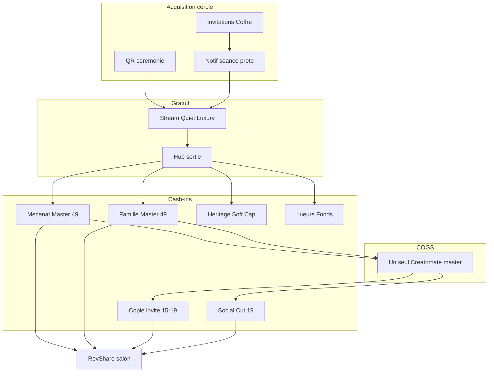

# Souvenir — Stream 0 $ · Master cinéma 49 $ · Moteur cercle

**Type :** canon produit · **Vérité pour :** offre B2B2C Souvenir + player Quiet Luxury + **monétisation / viralité du cercle** (50–200 proches).  
**Statut :** décision CEO 21 sept 2026 · amendé partenaire + encore mieux + **couche croissance** + **multi-acheteurs Master** · **C0–C3 livrés** · suite **C4→C14**.  
**Dernière MAJ :** 21 sept 2026 · **Carte :** [`../README.md`](../README.md)

**Changelog** (max 5)
- 21 sept 2026 — **C3** comparatif Séance vs Archive + CTA Master 49 $ (prestige ordi).
- 21 sept 2026 — **C2** gate export : `cinemaMaster` ou Héritage+ · free Creatomate refusé.
- 21 sept 2026 — **Multi-acheteurs Master** : CTA jamais grisé ; N×49 $ = N downloads + crédit Fonds ; copy Quiet Luxury universelle.
- 21 sept 2026 — **C1** livré : SKU `cinemaMaster` 49 $ · panier · strip Héritage+.
- 21 sept 2026 — **C0** livré : clamp bed + fade audio fin + fade black outro (`payloadBuilder` · `outro.json`).

**Liés :** [`../FREEMIUM_V1_PIVOT.md`](../FREEMIUM_V1_PIVOT.md) · [`../B2B2C_COMMERCE.md`](../B2B2C_COMMERCE.md) · [`../PARTNER_REVSHARE.md`](../PARTNER_REVSHARE.md) · [`../craft/CREATOMATE_RECIPE.md`](../craft/CREATOMATE_RECIPE.md) · [`../SANCTUARY_SKY.md`](../SANCTUARY_SKY.md) · [`../NARRATIVE_SOFT_CAP.md`](../NARRATIVE_SOFT_CAP.md)

---

## Ambition

- **Mondiale** : même offre partout ; Athos = preuve.
- **Quiet Luxury** à l’écran famille — zéro pop-up mid-film opportuniste.
- **Moteur de revenu** : le stream gratuit est le **diffuseur** ; l’argent entre via Master / mécénat / copies / Social Cut / Soft Cap / Héritage / lueurs — **RevShare salon** sur les cash-ins B2B2C.
- Une famille ≠ 1 user : **cercle 50–200**. Le stream qui se ferme sans hub de sortie = valeur perdue.

---

## Décisions figées (produit + cash)

| | |
|--|--|
| Cadeau salon | Stream only ≤50 médias, 2 chapitres, MP3 perso |
| Pastille | *« Séance offerte par [Salon] »* (stream only) |
| Player | MP3 **master clock** · dual `<video>` muted · ML **précalcul upload** · 2.5D **héros** desktop |
| Master famille / cercle | SKU **`cinemaMaster` = 49 $** ; Héritage+ inclus · **CTA jamais désactivé** |
| Free Creatomate | **Interdit** |
| Comparatif | **Séance live** vs **Archive patrimoniale** |
| **Master multi-acheteurs** | N personnes × 49 $ **acceptés** · #1 unlock + render · #2…n = **même** signed URL + **crédit Fonds** (pas refund, pas blocage UI) |
| **Mécénat** | Variante gift `cinemaMasterGift` (metadata donateur) · même règle multi-acheteurs · RevShare |
| **Copie invité** | **`guestMasterCopy` 15–19 $** — downsell **optionnel** si unlocked ; même signed URL ; **0** re-render |
| **Social Cut** | **`socialCut` 19 $** — 9:16 ~30–45 s ; **après** Master ; Quiet Luxury |
| **COGS** | **Un seul** compile Creatomate / projet ; CDN signed URL pour tous ensuite · marge brute #2…n ≈ 100 % |
| **Merci mécène** | Visible sur **hub + page stream** — **pas** re-render MP4 (carton master intemporel) |
| Sortie hub | Revoir · Lueur · **Conserver Archive Master 49 $** (toujours) · Héritage · pay-it-forward · (option) copie / Social Cut |
| Viralité | QR → `/stream/[projectToken]` lecture seule · notif contributeurs · Mode Célébration · sync C10 |

---

## Couche croissance — monétisation (ordre business)

### 1. Prioritaire — Archive Master 49 $ (universel, jamais grisé)
- **Règle commerciale :** on ne bloque **jamais** une carte. 1, 2 ou 10 proches qui veulent 49 $ → **tous les paiements acceptés** avec le sourire.
- CTA Quiet Luxury sous lecteur / hub / lander (copy figée) :
  - Bouton : *« Conserver mon Archive Master 1080p · 49 $ »*
  - Mention discrète : *« Téléchargez le film haute fidélité pour vos archives personnelles. Votre contribution soutient également le Fonds commémoratif de la famille pour leurs souvenirs tangibles. »*
- SKU runtime : `cinemaMaster` (famille) · `cinemaMasterGift` (invité, metadata donateur) — **même** logique cash / COGS.
- Effets paiement #1 : `cinema_master_unlocked = true` · **1×** Creatomate · email famille si gift · RevShare.
- Effets paiement #2…n : **0** re-render · signed URL CDN pour l’acheteur · **crédit Fonds** famille (Livre 149 $ / Jeton 79 $ / add-ons) · RevShare.
- Psychologie : chacun reçoit **son** MP4 ; la famille voit la cagnotte monter (« au pire, ça débloque plus d’argent »).

### 2. Ensuite — Copie personnelle invité (15–19 $, optionnel)
- Downsell digne **si** unlocked et si l’invité ne veut pas le geste 49 $.
- Download **même** asset via signed URL CDN — marge ~99 % · **0** 2ᵉ render.
- **Ne remplace pas** le CTA 49 $ (le 49 $ reste toujours visible / actif).

### 3. Ensuite — Social Cut 9:16 (19 $)
- Pastille 30–45 s ; Quiet Luxury ; après Master.
- Render court ou dérivé ; panneau organique Stories.

### Option digne
Le 49 $ Master **inclut** déjà la copie perso pour l’acheteur (pas besoin d’un 2ᵉ SKU pour le même payeur).

---

## Blindage exécution (verrouillé)

### 1. Multi-acheteurs Master (généralise « double mécène »)
- **Interdit UI :** griser / désactiver / masquer le CTA 49 $ parce que « déjà payé ».
- Flag atomique `cinema_master_unlocked` dès paiement réussi #1 (déclenche render si pas encore).
- Paiements #2…n : **ni rejet ni refund Stripe** → absorbed en **crédit Fonds** famille + download immédiat pour le payeur.
- Message post-paiement (si déjà unlocked) :  
  *« Votre Archive Master est prête à télécharger. Le Master avait déjà été débloqué pour la famille — votre geste a été crédité au Fonds commémoratif pour leurs souvenirs tangibles (Livre, Jeton…). »*
- Variante gift : peut encore citer le premier donateur sur le hub (*« offert avec amour par [Prénom] »*) — **sans** bloquer les suivants.
- Support zéro ; panier moyen ↑ ; marge #2…n ≈ pure ; éthique intacte (chaque payeur a son fichier).

### 2. « Merci [Prénom] » sans 2ᵉ Creatomate
- **Oui** sur hub de sortie + page stream : *« Cette séance et son archive ont été offertes avec respect par [Prénom]. »* (premier mécène / premier payeur digne).
- **Non** dans le MP4 déjà compilé (éviter invalidation cache / 2ᵉ COGS).
- Carton fin Creatomate **intemporel** : *« Préservé pour les générations futures par le cercle des proches. »* (ou équivalent dictionnaire).

### 3. QR → lander lecture seule
- URL publique `/stream/[projectToken]` (ou équivalent token-safe).
- **Pas** d’inscription, **pas** Wizard Studio.
- Plein écran séance → carton / fade → hub sobré : Revoir · Déposer une pensée / Lueur · **Conserver Archive Master 49 $** (toujours actif) · (option) copie 15–19 $ si unlocked.

---

## Couche croissance — viralité (rituel, pas spam)

### 1. QR physique cérémonie
- Verso signet / programme : *« Pour revivre la séance et partager vos souvenirs »*.
- Scan → **`/stream/[projectToken]`** lecture seule (voir § Blindage 3).
- Branche Mode Célébration / première sync.

### 2. Notif contributeurs
- Email contributeurs Coffre/Sanctuaire à l’enregistrement : « On vous prévient quand la séance est prête ».
- Envoi sobre quand montage prêt : « L’hommage à [Prénom] prend vie ».
- (Taux d’ouverture « 85 % » = ambition, pas KPI contractuel.)

### 3. Pay-it-forward (hub sortie)
- Une ligne : *« Créé avec respect par Odyssey. Célébrer une vie ou un moment pour vos proches. »*
- Lien B2C soft — **100 % Odyssey** si hors invitation salon.

### Interdits viralité
- Pop-ups mid-séance, countdown, « 3 autres ont acheté », stickers, voix IA gratuites.

---

## Feedback technique partenaire (rappel)

1. ML à l’**upload**, pas au play.  
2. MP3 master clock + dual video Safari.  
3. Copy desktop = **prestige**, pas pénalité mobile.

---

## Wow stream (rappel)

Core + grade + faces métadonnées + souffle MP3 + 2.5D héros + letterbox + pastille salon.  
Détail commits C4–C7 ci-dessous.

---

## Ordre stratégique

1. **C0–C2** — Master digne + cash path 49 $ (plus de free Creatomate).  
2. **C3–C8** — Séance + hub sortie (conversion + lueur + Célébration).  
3. **C9** — QA.  
4. **C10** — Première sync.  
5. **C11–C14** — **Machine cercle** (mécénat → copie → social → QR/notif).  
6. Polish DA Creatomate intro — plus tard.

---

## Commits chirurgicaux

### C0 — Creatomate gate
`fix(creatomate): clamp bed + fade fin film + fade black outro`  
**Done :** ✅ smoke audio + noir fin (21 sept 2026).

### C1 — SKU cinemaMaster 49 $
`feat(pricing): add-on cinemaMaster 49$` + docs grille.  
**Done :** ✅ panier ; skip Héritage+ (21 sept 2026).

### C2 — Gate export
`fix(export): require cinemaMaster or Heritage+`  
**Done :** ✅ free Creatomate refusé (21 sept 2026).

### C3 — Comparatif Séance vs Archive
`feat(wizard): Séance live vs Archive patrimoniale`  
+ prestige ordi + amorce CTA Master (copy).  
**Done :** ✅ FR/EN ; CTA 49 $ (21 sept 2026).

### C4 — Player core
`feat(wizard): stream core — MP3 clock + dual video + pastille salon`  
**Done :** 2 actes + vidéo ; Safari-smoke audio.

### C5 — Ingest ML
`feat(media): precompute focal and depth on upload`  
**Done :** focale sur asset test.

### C6 — Grade + Ken Burns + souffle
`feat(wizard): grade LUT + metadata Ken Burns + audio fades`  
**Done :** look unifié.

### C7 — 2.5D héros
`feat(wizard): hero 2.5D desktop-only + letterbox`  
**Done :** desktop héros ; mobile plat.

### C8 — Hub sortie + Mode Célébration + pay-it-forward
`feat(wizard): exit hub + Mode Célébration + pay-it-forward`  
- Revoir · Lueur · Garder Master · **Offrir Master** · Héritage · ligne Odyssey B2C.  
- Célébration HDMI.  
**Done :** tunnel + HDMI smoke.

### C9 — QA core path
`test(export): Souvenir stream to cinemaMaster`  
**Done :** checklist § QA core.

### C10 — Première sync
`feat(wizard): shared premiere playhead`  
(+ QR rejoindre lecture seule — stretch).  
**Done :** host + 1 follower sync.

### C11 — Master multi-acheteurs + gift (priorité cash cercle)
`feat(checkout): cinemaMaster always-on + N-buyer Fonds credit`  
- CTA universel Quiet Luxury · **jamais** grisé.  
- Stripe · #1 unlock+render · #2…n download + crédit Fonds · RevShare.  
- Gift metadata donateur + email optionnel.  
- Merci premier payeur sur hub/stream only.  
**Done :** 3 checkouts parallèles → 1 unlock + 2 crédits Fonds + 3 downloads.

### C12 — Copie perso invité
`feat(export): guestMasterCopy license same asset 15-19$`  
- Gate : `cinema_master_unlocked` ; signed URL ; **pas** de 2ᵉ Creatomate.  
**Done :** refus avant unlock ; OK après ; 1 render log.

### C13 — Social Cut 9:16
`feat(export): socialCut 19$ vertical 30-45s`  
**Done :** MP4 9:16 + checkout post-master.

### C14 — QR lander + notif contributeurs
`feat(growth): /stream/[token] read-only lander + session-ready email`  
**Done :** lander sans wizard ; email contributeur test.

### Plus tard — Creatomate DA intro
Hors chemin critique.

---

## QA checklist

### Core (C9)
- [ ] Stream 2 actes, MP3 clock, pastille salon  
- [ ] Mobile prestige / desktop héros 2.5D  
- [ ] Pas de free Creatomate ; 49 $ → MP4 fade OK  
- [ ] Hub : lueur + Master + Héritage + pay-it-forward  
- [ ] Mode Célébration  

### Cercle (C11–C14)
- [ ] CTA Master **toujours actif** (jamais grisé post-unlock)  
- [ ] N×49 $ → N downloads + Fonds sur #2…n · **1** Creatomate  
- [ ] Gift / premier payeur → email + RevShare  
- [ ] Merci mécène sur hub, **pas** de 2ᵉ render MP4  
- [ ] Copie 15–19 $ optionnelle post-unlock ; **1** render log  
- [ ] Social Cut 19 $ post-master  
- [ ] `/stream/[token]` sans wizard  
- [ ] Notif « séance prête »  
- [ ] Aucun CTA cash mid-séance  
- [ ] Copy : *Conserver mon Archive Master 1080p · 49 $* + mention Fonds

---

## SKUs (grille à brancher C1 / C11–C13)

| ID | Prix | Qui | Creatomate |
|----|------|-----|------------|
| `cinemaMaster` | 49 $ | Famille / cercle | 1× render (#1) ; #2…n = licence CDN + Fonds |
| `cinemaMasterGift` | 49 $ | Invité (metadata gift) | idem multi-acheteurs |
| `guestMasterCopy` | 15–19 $ | Invité (downsell) | 0 (licence) |
| `socialCut` | 19 $ | Famille / invité post-master | render court ou dérivé |

Mettre à jour [`../FREEMIUM_V1_PIVOT.md`](../FREEMIUM_V1_PIVOT.md) § add-ons **au commit C1** (cinemaMaster) puis C11–C13.

---

## Fichiers clés

| Zone | Chemins |
|------|---------|
| Pricing / Stripe | `pricingConfig.ts`, `wizardPricing.ts`, checkout guest |
| Export | `exportGate.ts`, `processExportJob.ts`, entitlements |
| Player / hub | `CinematicTeaser`, `PreviewStep`, exit hub |
| Croissance | lander QR, emails contributeurs, gift checkout |
| Copy | `dictionaries/fr.json`, `en.json` |
| RevShare | webhook amount_total > 0 |
