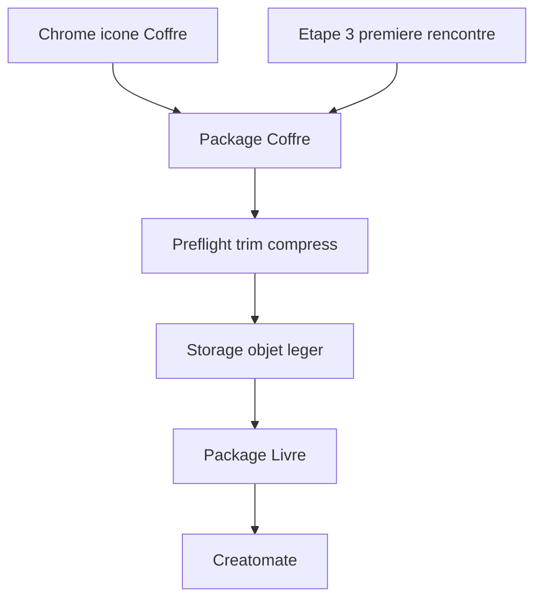

# Wizard — packages Coffre / Livre + ingest

**Type :** living · **Vérité pour :** chantier post-deck — découpage Coffre/Livre en packages, tiroir global, ingest trim/compress.  
**Dernière MAJ :** 8 oct 2026 · **Carte :** [`../README.md`](../README.md)

**Changelog** (max 5)
- 8 oct 2026 — Plan figé (CEO) : packages (pas 2ᵉ app) · Coffre tiroir d’abord · ingest S5–S7 · Livre polish après cadrage.

Canon liés : [`COFFRE_MONTAGE_MEDIA_INGEST.md`](COFFRE_MONTAGE_MEDIA_INGEST.md) · [`../WIZARD_ARCHITECTURE.md`](../WIZARD_ARCHITECTURE.md) · [`../STORYBOARD_STEP5_LIVRE_OUVERT.md`](../STORYBOARD_STEP5_LIVRE_OUVERT.md) · tiroir J5 [`SANCTUARY_USER_JOURNEY.md`](SANCTUARY_USER_JOURNEY.md).  
Audit docs cluster : [`DOCS_AUDIT_WIZARD_CLUSTER_2026-10-08.md`](DOCS_AUDIT_WIZARD_CLUSTER_2026-10-08.md).

---

## Décisions

| Décision | Choix |
|----------|--------|
| Forme | **Packages / surfaces** dans ce repo — pas un 2ᵉ Next app déployable V1 |
| UX B | Dette code **+** irritants (Coffre accessible en tiroir / toujours, + polish) |
| Ordre | **Coffre** (package + tiroir + ingest) → **Livre** (package + polish après cadrage Erik) |
| Ingest V1 | Client trimme / compresse **avant** upload · **un seul** objet Storage · copy « versions allégées seulement » |
| Soft Cap | Silence dans le Coffre (canon Soft Cap) |

---

## État code (8 oct 2026)

| Surface | Réalité | Cible chantier |
|---------|---------|----------------|
| Orchestrateur | [`TributeWizard.tsx`](../../src/components/tribute/TributeWizard.tsx) **~3462 L** | Orchestrateur (nav, gates, chrome, wiring) |
| Coffre | Étape 3 inline + `MediaDropzoneAdapter` / grille | `src/surfaces/coffre/` (ou `components/coffre/`) + **tiroir chrome** = même banque |
| Livre | [`StoryboardMontageStep.tsx`](../../src/components/tribute/StoryboardMontageStep.tsx) + `montage/*` | `src/surfaces/livre/` après Coffre |
| Vidéo | Export = 10 premières s · `videoTrims` non écrit par l’UI · originaux lourds | S7 : picker 10 s + encode 1080p client |
| Photo | Thumb WebP ~400px + original gardé | S6 : resize ≤2048 px · V1 sans original |

---

## Phase 1 — Package Coffre + tiroir

1. Extraire le corps étape 3 (dropzone, grille, Scanner, états upload) vers surface Coffre avec API host :
   - `projectId` / user / tenant
   - `media[]` + callbacks upload / delete / refresh
   - mode `onboarding` (étape 3 + « Plus tard ») vs `drawer` (toujours)
2. Icône Coffre dans le chrome wizard (puis ciel / studio — J5) : drawer = **même banque** que l’étape 3.
3. Étape 3 = première rencontre du tiroir, pas un 2ᵉ Coffre.
4. Doc architecture + copy FR/EN si nouveau libellé → dictionnaires + catalog.

**Hors scope P1 :** redesign Livre · worker ffmpeg serveur · conservation d’originaux.

---

## Phase 2 — Ingest coût (canon S5–S7)

Détail technique : [`COFFRE_MONTAGE_MEDIA_INGEST.md`](COFFRE_MONTAGE_MEDIA_INGEST.md) §3–4.

| Slice | Quoi | Done when |
|-------|------|-----------|
| **S5** | Poster frame vidéo client à l’upload | Tuile Coffre / banque = image |
| **S6** | Resize photo ≤2048 px preflight | Plus d’upload « plein capteur » V1 |
| **S7** | Trim 10 s + encode 1080p H.264/AAC + UX préparation | Fichier léger · Creatomate `trim_start` = 0 |
| **Copy** | Famille informée : on ne garde que la version préparée / allégée | Clés FR/EN + catalog |

Ancrage : [`mediaUploadService.ts`](../../src/lib/uploads/mediaUploadService.ts). Ops : plafond Supabase Storage 100–300 Mo.

---

## Phase 3 — Package Livre + polish

1. Extraire montage + libs storyboard/DnD/magie vers `src/surfaces/livre/`.
2. **Cadrage Erik** (liste prioritaire des changements Livre) **avant** commits UX.
3. Contrat host assez propre pour un futur consommateur hors Odyssey — sans 2ᵉ deploy maintenant.

---

## En parallèle — alléger TributeWizard

Sortir helpers locaux ; garder nav / gates / checkout. Cible mentale : orchestrateur bien sous ~1000 L — pas de big-bang.

---

## Risques

- Drawer ≠ 2ᵉ source de vérité (un seul cache médias).
- Encode client (S7) : perf mobile · copy préparation · fallback échec.
- Promesse « allégé seulement » : copy + Storage doivent matcher.
- Livre : pas de dual-write storyboard pendant l’extraction.

---

## Ordre de ship

1. Package Coffre + tiroir chrome wizard  
2. S5 → S6 → S7 + copy rétention allégée  
3. Cadrage Livre → package + polish  
4. Unifier tiroir ciel / studio si pas déjà fait en P1  
